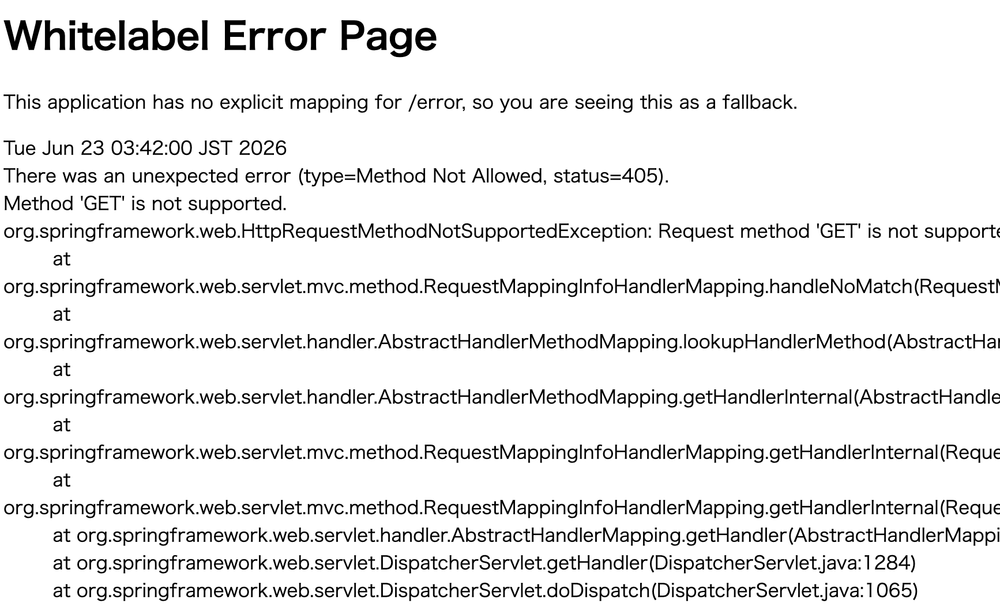
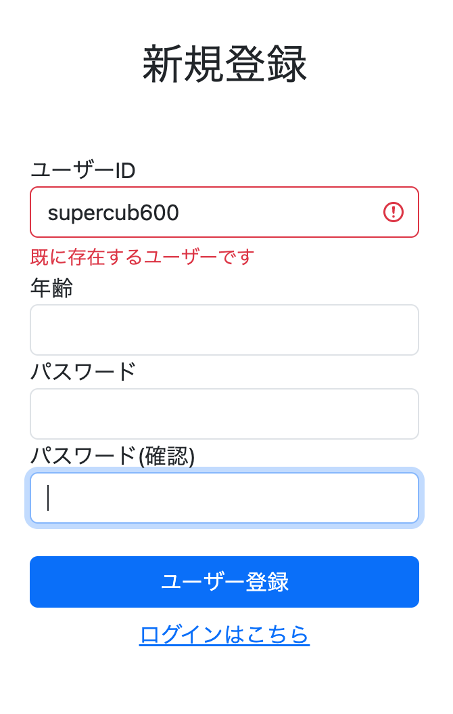

# ユーザー登録機能（Spring Data JPA）の実装

## 概要

新規登録フォームで入力したユーザー情報を PostgreSQL の `users` テーブルへ登録し、登録完了後に登録完了画面へリダイレクトする機能を実装した。

また、既に登録済みのユーザーIDが入力された場合は登録処理を中断し、エラーメッセージを登録画面へ表示するようにした。

---

## 実装内容

### 1. ModelMapper の導入

フォームクラスと Entity クラスの変換を簡単に行うため、`pom.xml` に ModelMapper を追加した。

```xml
<dependency>
    <groupId>org.modelmapper</groupId>
    <artifactId>modelmapper</artifactId>
    <version>3.2.4</version>
</dependency>

<dependency>
    <groupId>org.modelmapper.extensions</groupId>
    <artifactId>modelmapper-spring</artifactId>
    <version>3.2.0</version>
</dependency>
```

これにより、

```java
Users users = modelMapper.map(form, Users.class);
```

のように Form クラスから Entity クラスへ簡単に変換できるようになった。

---

### 2. Users Entity の作成

`users` テーブルと対応する Entity クラスを作成した。

```java
@Entity
@Table(name = "users")
public class Users {

    @Id
    private String userId;

    private String password;
}
```

JPA では Entity がテーブル構造と対応する。

---

### 3. UserRepository の作成

JPA を利用するため、`JpaRepository` を継承した Repository を作成した。

```java
public interface UserRepository
        extends JpaRepository<Users, String> {
}
```

これにより以下のメソッドを利用できるようになった。

- `save()`
- `findById()`
- `existsById()`

---

### 4. ユーザー登録処理の実装

Service クラスにユーザー登録処理を実装した。

```java
public class UserServiceImpl {

    private final UserRepository repository;

    public void signup(Users users) {

        boolean isExists =
                repository.existsById(users.getUserId());

        if (isExists) {
            throw new DuplicateKeyException(
                    "既に存在するユーザーです");
        }

        Users savedUser = repository.save(users);

        log.info(
                "ユーザー登録完了 userId={}",
                savedUser.getUserId());
    }
}
```

#### 工夫した点

登録済みのユーザーIDが入力された場合、

```java
repository.existsById(...)
```

を利用して重複チェックを行うようにした。

重複している場合は

```java
throw new DuplicateKeyException(...)
```

によって例外を発生させ、登録処理を中断する。

---

## Controller の修正

当初は Service で例外を発生させるだけだったため、

```
Whitelabel Error Page
```

へ遷移してしまう問題があった。



そのため Controller 側で例外を受け取り、エラーメッセージを画面へ表示するよう修正した。

```java
@PostMapping("/signup")
public String postSignup(
        Model model,
        @ModelAttribute @Validated SignupForm form,
        BindingResult bindingResult) {

    // 通常のバリデーションエラー確認
    if (bindingResult.hasErrors()) {
        return getSignup(model, form);
    }

    try {

        log.info(form.toString());

        Users users =
                modelMapper.map(form, Users.class);

        userServiceImpl.signup(users);

    } catch (DuplicateKeyException e) {

        bindingResult.rejectValue(
                "userId",
                "duplicate",
                e.getMessage());

        return getSignup(model, form);
    }

    return "redirect:/signup/complete";
}
```

---

## try-catch 構造について

今回最も苦労した部分は、

**「Service で発生した例外をどこで処理するべきか」**

という点だった。

当初は Service で

```java
throw new DuplicateKeyException(...)
```

を実行すると、そのまま Whitelabel Error Page が表示されてしまった。

これは例外が発生した後、それを受け取る処理が存在しなかったためである。

そこで Controller 側で

```java
try {
    userServiceImpl.signup(users);
}
catch (DuplicateKeyException e) {
    ...
}
```

とすることで、

Service が発生させた例外を Controller が受け取れるようになった。

さらに、

```java
bindingResult.rejectValue(...)
```

を利用することで、

```
既に存在するユーザーです
```

というエラーメッセージを通常のバリデーションエラーと同様に画面へ表示できるようになった。



今回の実装を通じて、

- Service は業務処理を担当する
- Controller は画面制御を担当する
- 発生した例外は Controller 側でユーザー向けのメッセージへ変換する

という役割分担を理解できた。

---

## 所感

今回の実装で、通常のバリデーションエラーと DB 関連のエラーでは処理方法が大きく異なることが分かった。

通常のバリデーションエラーは、

```java
@NotBlank
@Size
```

などのアノテーションによって自動的に `BindingResult` に登録される。

一方、ユーザーID重複のような DB を参照しなければ分からないエラーは、例外処理と

```java
bindingResult.rejectValue(...)
```

を組み合わせて手動で `BindingResult` に追加する必要がある。

理解するのは難しかったが、Java Silver の学習で例外処理について学習していたため、例外がどのように伝播し、どこで処理されるのかを理解しながら実装することができた。

---

## 次回やること

- ログイン機能を実装する