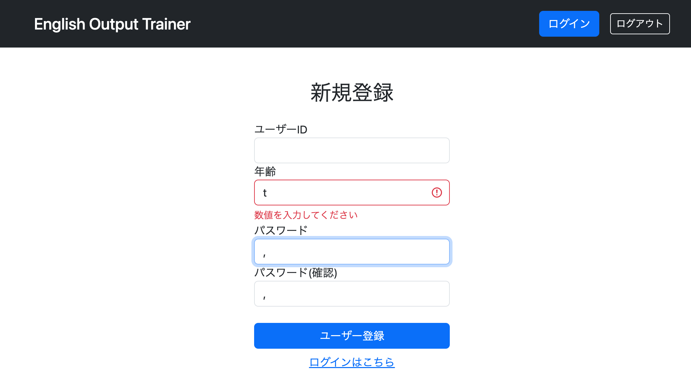

# バリデーションの土台づくりとエラーハンドリングの実装

## 実装内容

今回はバリデーション機能そのものを実装するのではなく、今後のバリデーション実装を見据えた土台づくりを行った。

主な目的は、入力値に問題があった場合でもユーザーにとって不親切なエラーページを表示させず、入力画面へ戻した上でエラーメッセージを表示できるようにすることである。

そのため、今回は入力された値のデータ型が一致しない場合にメッセージを表示する程度のシンプルな実装とした。

検証用として、新規登録フォームに年齢欄を追加した。

```java
private Integer age;
```

年齢は数値のみ受け付けるため、文字列を入力した際に型変換エラーが発生する。

なお、この年齢欄は今回のバリデーション動作確認のために追加したものであり、現時点では実務的な要件を想定したものではない。

---

### validation.propertiesの導入

バリデーション用のメッセージは既存の `messages.properties` とは別管理とした。

そのため、新たに

```text
validation.properties
```

を作成し、

```yaml
spring:
  messages:
    basename: messages,validation
```

のように `application.yml` へ設定を追加した。

これにより、画面表示用メッセージとバリデーション用メッセージを分離して管理できるようになった。

---

### バリデーションメッセージの定義

`validation.properties` に型変換エラー発生時のメッセージを定義した。

例：

```properties
typeMismatch.signupForm.age=数値を入力してください
```

このファイルは今後のバリデーション実装でも継続して利用する予定である。

---

### Controllerでのエラー制御

Controllerの `PostMapping` に

```java
BindingResult bindingResult
```

を追加した。

さらに、

```java
if (bindingResult.hasErrors()) {
    return getSignup(model, form);
}
```

を実装した。

これにより、入力値に問題があった場合でもWhitelabel Error Pageや例外画面へ遷移せず、入力画面へ差し戻せるようになった。

---

### Thymeleafによるエラー表示

signup.htmlではBootstrapのバリデーション表示機能を利用した。

```html
th:errorclass="is-invalid"
```

```html
th:errors="*{age}"
```

```html
class="invalid-feedback"
```

```html
class="is-invalid"
```

を組み合わせることで、エラーが発生した入力欄のみ赤枠表示となり、対応するエラーメッセージが表示されるようになった。

これにより、ユーザーはどの入力欄に問題があるのかを画面上で確認できるようになった。

---

## 学習したこと・考察

### パスワード欄に「,」が表示された原因

実装中に興味深い不具合が発生した。

当初、パスワード入力欄と確認用パスワード入力欄の両方に対して、

```html
th:field="*{password}"
```

を設定していた。

つまり、1つのFormフィールドに対して2つの入力欄が紐付いている状態だった。

その状態でバリデーションエラーが発生し入力画面へ差し戻されると、パスワード入力欄と確認用パスワード入力欄に

```text
,
```

が表示される現象が発生した。



これはSpringが同じ名前のパラメータを複数受け取った際、それらを複数値として扱おうとしたことが原因である。

本来は、

```java
private String password;
private String passwordConfirm;
```

のように別々のフィールドを用意し、

```html
th:field="*{password}"
```

```html
th:field="*{passwordConfirm}"
```

のように1対1で対応させる必要がある。

確認用パスワードのフィールド名を

```java
passwordConfirm
```

へ変更したところ、この問題は解消された。

今回の経験を通して、Thymeleafの `th:field` はFormクラスのフィールドと1対1で対応させる必要があることを学んだ。

---

## 所感

今回は今後実装予定の標準バリデーションおよびカスタムバリデーションのための土台作りが主な目的だった。

実際に今後使用するか分からない入力項目をエラーチェック対象としたが、そのおかげで実装内容を最小限に抑えながらバリデーションの基本的な流れを理解することができた。

また、

- BindingResultによるエラー判定
- エラー発生時の画面差し戻し
- validation.propertiesによるメッセージ管理
- BootstrapとThymeleafを組み合わせたエラー表示

など、今後のバリデーション実装で必要となる基礎部分を一通り確認できた。

比較的小規模な実装ではあったが、今後の標準バリデーションやカスタムバリデーション実装へ向けた重要な基礎固めになったと感じている。

---

## 次回やること

- 標準バリデーションアノテーションの導入
  - @NotBlank
  - @Length
  - @Pattern
  - @Min
  - @Max
- カスタムバリデーションの実装
  - パスワード確認チェック
- バリデーションメッセージの拡充