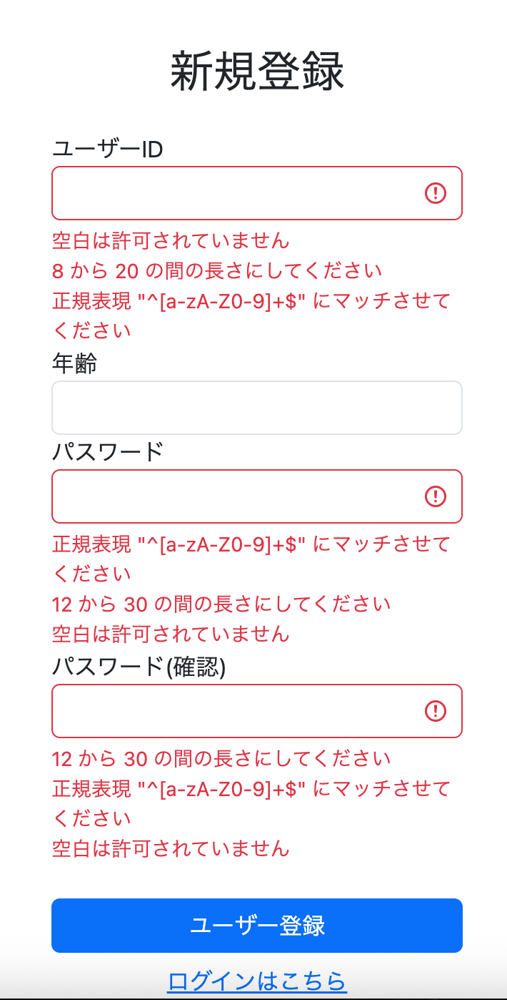
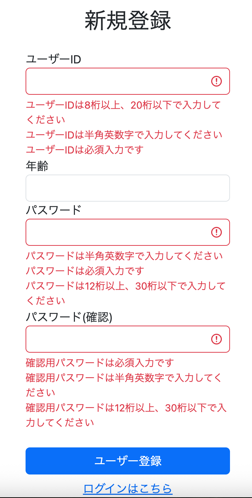

# 標準バリデーションの実装

## 実装内容

前回はバリデーションの土台作りとして、BindingResultやvalidation.propertiesの導入、エラー発生時の画面差し戻し機能を実装した。

今回はその土台の上に、Spring Bootが標準で提供しているバリデーション機能を導入した。

---

### バリデーションライブラリの導入

まずはpom.xmlにバリデーション機能を利用するためのライブラリを追加した。

```xml
<!-- validator -->
<dependency>
    <groupId>org.springframework.boot</groupId>
    <artifactId>spring-boot-starter-validation</artifactId>
</dependency>
```

これにより、Formクラスにバリデーションアノテーションを付与できるようになった。

---

### Formクラスへのバリデーション追加

SignupFormを以下のように修正した。

```java
@Data
public class SignupForm {

    @NotBlank
    @Length(min = 8, max = 20)
    @Pattern(regexp = "^[a-zA-Z0-9]+$")
    private String userId;

    @Min(0)
    @Max(120)
    private Integer age;

    @NotBlank
    @Length(min = 12, max = 30)
    @Pattern(regexp = "^[a-zA-Z0-9]+$")
    private String password;

    @NotBlank
    @Length(min = 12, max = 30)
    @Pattern(regexp = "^[a-zA-Z0-9]+$")
    private String passwordConfirm;
}
```

各アノテーションの役割は以下の通りである。

| アノテーション | 役割 |
|--------------|------|
| @NotBlank | 未入力・空白のみを禁止 |
| @Length | 最小文字数・最大文字数を制限 |
| @Pattern | 入力形式を制限 |
| @Min | 最小値を制限 |
| @Max | 最大値を制限 |

なお、確認用パスワードである `passwordConfirm` は本来、

```java
password.equals(passwordConfirm)
```

をチェックする必要がある。

しかし、このような複数フィールドを比較する処理はカスタムバリデーションに分類されるため、今回は実装せず、ひとまず `password` と同じバリデーションルールを適用するだけに留めた。

---

### Controllerへの@Validated追加

標準バリデーションを実行するため、ControllerのPostMappingに `@Validated` を追加した。

```java
@PostMapping("/signup")
public String postSignup(
        Model model,
        @Validated @ModelAttribute SignupForm form,
        BindingResult bindingResult) {

    if (bindingResult.hasErrors()) {
        return getSignup(model, form);
    }

    return "redirect:/login";
}
```

これにより、フォーム送信時にFormクラスへ設定したバリデーションが実行されるようになった。

---

### バリデーションエラーの確認

Spring Bootを再起動し、入力欄を空欄のまま送信すると、バリデーションエラーが表示されることを確認した。



しかし、この状態ではSpringが生成するデフォルトメッセージがそのまま表示されるため、ユーザーにとってはやや分かりづらい。

---

### validationMessages.propertiesの導入

そこで、バリデーションメッセージをカスタマイズするため、

```text
validationMessages.properties
```

に以下の内容を追加した。

```properties
# ======================
# バリデーションエラーメッセージ
# ======================

NotBlank={0}は必須入力です
Length={0}は{2}桁以上、{1}桁以下で入力してください
Pattern={0}は半角英数字で入力してください
NotNull={0}は必須入力です
Min={0}は{1}以上を入力してください
Max={0}は{1}以下を入力してください
```

これにより、利用者にとって分かりやすいメッセージを表示できるようになった。

---

### メッセージの日本語化

messages.propertiesには既に各フィールド名に対応する表示名を定義していた。

例：

```properties
userId=ユーザーID
password=パスワード
passwordConfirm=確認用パスワード
age=年齢
```

そのため、

```properties
NotBlank={0}は必須入力です
```

の `{0}` にはフィールド名ではなく、

```text
ユーザーID
パスワード
確認用パスワード
年齢
```

が自動的に表示される。

結果として、ユーザーにとって分かりやすいエラーメッセージとなった。



---

## 学習したこと・考察

今回の実装で最も印象に残ったのは、標準バリデーションが想像以上にシンプルな機能であることだった。

例えば、

- 未入力チェック
- 文字数チェック
- 数値範囲チェック
- 入力形式チェック

といった単一フィールドに対する検証は非常に簡単に実装できる。

一方で、

```java
password.equals(passwordConfirm)
```

のような実務で頻繁に利用する複数フィールド間の整合性チェックは標準バリデーションだけでは実現できない。

このような処理はカスタムバリデーションとして別途実装する必要があることが分かった。

---

### Integerに@NotBlankを付けてしまった

実装中のミスとして、

```java
@NotBlank
private Integer age;
```

としてしまいエラーを発生させた。

`@NotBlank` はString専用のバリデーションであり、Integerには使用できない。

幸いエラーメッセージに原因が明確に表示されていたため、すぐに修正することができた。

今回の経験を通して、バリデーションアノテーションには適用可能な型が決まっていることを学んだ。

---

## 所感

前述の通り、パスワードと確認用パスワードの一致チェックのような実務で利用される重要なバリデーションは、標準バリデーションでは実現できないことが分かった。

そのため、今回実装した標準バリデーションは「最低限の入力チェック機能」であり、本格的な業務アプリケーションを構築するためにはカスタムバリデーションが不可欠であると感じた。

一方で、標準バリデーションを導入したことで、

- Formクラスへのルール定義
- @Validatedによる実行
- BindingResultによるエラー判定
- エラーメッセージのカスタマイズ

という一連の流れを理解することができた。

次回はカスタムバリデーションを実装し、より実務的な入力チェックへ発展させていきたい。

---

## 次回やること

- カスタムバリデーションの実装
- パスワードと確認用パスワードの一致チェック
- 独自アノテーションの作成
- ValidationMessages.propertiesへのメッセージ追加
- クラスレベルバリデーションの理解