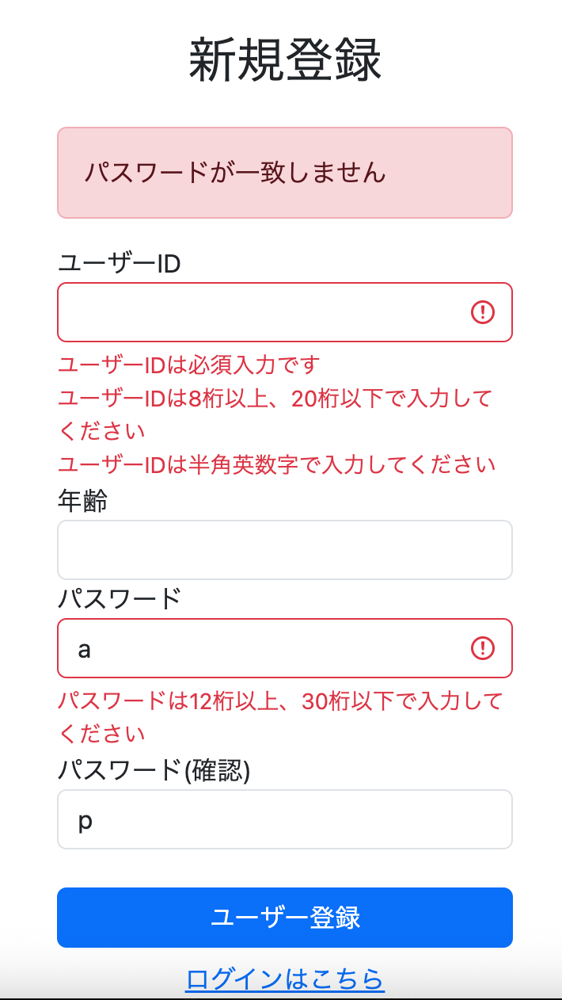

# カスタムバリデーション（パスワード一致確認）の実装

## 概要

・ユーザーが新規登録画面で入力したパスワードと確認用パスワードが完全一致しているかどうかを確認するバリデーションを導入した。  
・いままでのバリデーションと違い、カスタムバリデーションはそのバリデーションのためのアノテーションを使えるようにするためにアノテーションを宣言するクラスと、そのバリデーションで実際にチェックする内容を実装したクラスであるバリデーターを用意する必要がある。  
・今回はカスタムバリデーションかつバリデーション対象フィールドが複数(パスワードと確認用パスワード)なので実装が多少複雑である。

---

## 独自アノテーションの定義

独自アノテーションの定義は以下のようになる。

```java
@Documented
@Constraint(validatedBy = { PasswordMatchValidator.class })
@Target(ElementType.TYPE)
@Retention(RetentionPolicy.RUNTIME)
public @interface PasswordMatch {
	String message() default "{password.match.message}"; 
	
	/** グループ */
    Class<?>[] groups() default {};

    /** ペイロード */
    Class<? extends Payload>[] payload() default {};
    
    String passwordFieldName() default "";
    String passwordConfirmFieldName() default "";
}
```

### 重要なポイント

・今後Formクラスで `@PasswordMatch` というアノテーションを宣言するとクラス内でカスタムバリデーションを実行できる(ただしバリデーターでさらなる実行内容が明記されていることと、`@PasswordMatch` アノテーション使用時にどのfieldsを対象にするか明記されていることが必要)

・`@Constraint` によって「このアノテーションが付いたら PasswordMatchValidator を使って検証してください」と宣言している

・`@Target(ElementType.TYPE)` によってどこにつけられるアノテーションなのか指定している。今回は対象が複数のフィールドなので、アノテーションをつけるのはクラスになる。クラスの場合は ElementType は TYPE であり、単独のフィールドの場合は FIELD である。

・`@Documented` と `@Retention(RetentionPolicy.RUNTIME)` も必須項目だが、カスタムバリデーションではほぼ固定内容なので「おまじない」もしくは枕詞程度に認識しておけばいい。

・新しいアノテーションをつくっているのでクラスではなく、`public @interface PasswordMatch` とインタフェースにしている。

・フィールドとしてエラー時に表示するメッセージを持つ。ここで default である理由は、本来メッセージというのはバリデーション対象クラスまたはフィールドがアノテーション宣言時に引数として付与するのだが、それを毎回書くのは面倒なのでここで default 値として定義しているのである。また default 値すら messages.properties ファイルに紐づけている。

・`Class<?>[] groups() default {};` は簡単に言うと「どの場面でこのバリデーションを実行するか」を指定するもので、登録時は必須だが更新時は不要みたいな制御ができる。

・`Class<? extends Payload>[] payload() default {};` は「このバリデーションに追加情報を持たせるための拡張ポイント」であり、状況に応じて「このエラーは重大です」という情報をエラーに持たせられる。

・現時点でこれらの設定は不要であるものの、カスタム制約アノテーションを作るなら基本的に書かなければならない項目である。その意味では、`@Documented` や `@Retention(RetentionPolicy.RUNTIME)` と同じく「おまじない」もしくは枕詞程度に認識しておけばいい。

・`String passwordConfirmFieldName() default "";` と `String passwordFieldName() default "";` は Validator に「どのフィールド同士を比較するのか」を教えるためである。

例えば、Formクラスで

```java
@PasswordMatch(
    passwordFieldName = "password",
    passwordConfirmFieldName = "passwordConfirm"
)
public class SignupForm {
    ...
}
```

と書くと、Formクラス内の指定された各フィールドの値がアノテーションに保存される。

```text
passwordFieldName → "password"
passwordConfirmFieldName → "passwordConfirm"
```

という情報がアノテーションに保存される。

これは後述するバリデータークラスで Form クラス内の指定された各フィールドの値を使用するためで、その下準備である。

・`String passwordFieldName() default ""` と default 値が未定になっているのは、Formクラスで入力を促しているからである。もし

```java
String passwordFieldName() default "password"
```

ならば、Formクラスでアノテーション宣言時に

```java
passwordFieldName = "password"
```

という引数を送らなくても default 値の password と Form クラスのフィールドの password が紐づいて passwordFieldName にはフィールド password の値が入る。

逆に、

```java
String passwordFieldName();
```

だけで何も default 値を設定していない場合、Formクラスでアノテーション宣言時に

```java
passwordFieldName = "xxxx"
```

と引数を何かしら送らないとコンパイルエラーになる。

---

## バリデーターの作成

次にバリデーターを作成した。

```java
public class PasswordMatchValidator
		implements ConstraintValidator<PasswordMatch, Object> {
	
	private String passwordFieldName;
	private String passwordConfirmFieldName;
	private String message; 
	
	@Override
	public void initialize(PasswordMatch passwordMatch) {
		this.passwordFieldName = passwordMatch.passwordFieldName();
		this.passwordConfirmFieldName = passwordMatch.passwordConfirmFieldName();
		this.message = passwordMatch.message();
	}
	
	@Override
	public boolean isValid(Object value,
            ConstraintValidatorContext context) {
		BeanWrapper beanWrapper = new BeanWrapperImpl(value);
		String password = (String) beanWrapper
                .getPropertyValue(this.passwordFieldName);
		
		String passwordConfirm = (String) beanWrapper
                .getPropertyValue(this.passwordConfirmFieldName);
		
        if (password == null || passwordConfirm == null) {
            return true;
        }
        
        if (!passwordConfirm.equals(password)) {
        	return false;
        }
        
        return true;
	}
}
```

### バリデーターの役割

・これはパスワードと確認用パスワードが一致しているかを実際に判定するクラスである。

・

```java
public class PasswordMatchValidator
        implements ConstraintValidator<PasswordMatch, Object>
```

で ConstraintValidator を実装しているのは、

- initialize() … アノテーションの設定値を受け取って初期化するメソッド
- isValid() … 実際にバリデーションを行うメソッド

を使えるようになるためだ。

・`<PasswordMatch, Object>` は本来 `<A, T>` で、

- A はアノテーション
- T は検査対象の型

を指定する。

今回はアノテーションは PasswordMatch で検査対象は SignupForm クラス(複数のフィールドはクラス扱い)なので SignupForm と記述したいところだが、Object としている。

これは、今後 SignupForm クラス以外のクラスにも同じカスタムバリデーションを実装したい場合を見据えた仕様にしているからだ【工夫した点】。

もし検査対象が1つの field のみなら String など、そのフィールドの型を書く。

---

## SignupForm専用で実装した場合

さて、ここでもしこのクラスの検査対象を SignupForm のみに絞った場合のケースを想定してみる(つまり `implements ConstraintValidator<PasswordMatch, SignupForm>` )。

このときのコードは以下のようになる。

```java
public class PasswordMatchValidator
        implements ConstraintValidator<PasswordMatch, SignupForm> {

    @Override
    public boolean isValid(SignupForm form,
                           ConstraintValidatorContext context) {

        if (form.getPassword() == null
                || form.getPasswordConfirm() == null) {
            return true;
        }

        return form.getPassword()
                   .equals(form.getPasswordConfirm());
    }
}
```

このコードは比較的簡単である。パスワードか確認用パスワードが null、もしくは両方が一致していればこのバリデーションは true を返す。

ただしこの実装は SignupForm 専用であり、他のフォームクラスには利用できない。例えばパスワード変更画面の PasswordChangeForm やメールアドレス変更画面の MailChangeForm が将来つくられて、それらにも同じバリデーションを適用したい場合、この実装ではクラスごとに専用のバリデータを作成しなければならない。

そこで今回は、検査対象を SignupForm ではなく Object とすることで、アノテーションを付与した任意のクラスに対して利用できる汎用的なバリデータとして実装している。

ただし、検査対象が Object になると、バリデータは「どのクラスのインスタンスが渡されるのか」を事前に知ることができない。

```java
form.getPassword();
form.getPasswordConfirm();
```

のようにフィールドへ直接アクセスすることはできなくなる。

そこでまず initialize() メソッドで、アノテーションに設定された検査対象のフィールド名を取得し、バリデータ内部に保持する。

```java
private String passwordFieldName;
private String passwordConfirmFieldName;
```

SignupForm に以下のようなアノテーションが付与されている。

```java
@PasswordMatch(
    passwordFieldName = "password",
    passwordConfirmFieldName = "passwordConfirm"
)
public class SignupForm {
    ...
}
```

この場合、initialize() の実行後には以下の状態になる。

```java
this.passwordFieldName = "password";
this.passwordConfirmFieldName = "passwordConfirm";
```

ここで保存されるのはフィールドの値ではなく、あくまでもフィールド名を表す文字列である。

もし検査対象が SignupForm に限定されていれば、

```java
form.getPassword();
form.getPasswordConfirm();
```

のように直接値を取得できる。

しかし今回は検査対象が Object であるため、バリデータは実行時まで実際のクラスを知らない。

そのため、どのフィールドを比較すればよいかをアノテーションから受け取り、後続の isValid() メソッドで利用する必要がある。

---

## BeanWrapperを利用した値の取得

続いて isValid() メソッドでは、initialize() で取得したフィールド名を利用して実際の値を取得する。

```java
BeanWrapper beanWrapper = new BeanWrapperImpl(value);

String password = (String) beanWrapper
        .getPropertyValue(this.passwordFieldName);

String passwordConfirm = (String) beanWrapper
        .getPropertyValue(this.passwordConfirmFieldName);
```

ここで value には、@PasswordMatch が付与されたオブジェクトが渡される。今回の例では SignupForm のインスタンスである。

しかし、バリデータの検査対象は Object であるため、コンパイラは value を SignupForm として認識していない。

そのため、

```java
value.getPassword();
value.getPasswordConfirm();
```

のようにフィールドへ直接アクセスすることはできない。

そこで BeanWrapper を利用する。

BeanWrapper は、オブジェクトのフィールド名を文字列で指定して値を取得できる仕組みである。

今回のコードでは、initialize() で取得したフィールド名を利用して、検査対象オブジェクトから実際の値を取得している。

```java
this.passwordFieldName = "password";
this.passwordConfirmFieldName = "passwordConfirm";
```

このとき、

```java
beanWrapper.getPropertyValue(this.passwordFieldName);
```

は実質的に

```java
signupForm.getPassword();
```

と同等の処理を行う。

このように、汎用バリデータではアノテーションから取得したフィールド名と BeanWrapper を組み合わせることで、検査対象クラスに依存せずにフィールドの値を取得できるようになっている。

長くなったが、簡単に言うと、検査対象を複数のクラスにして絞らない場合、検査対象が Object となる。

このとき問題になるのは、

① Object クラスには「任意のフィールドを取得する getter」がない  
② バリデータは検査対象クラスの検査対象フィールド名がわからない

である。

①の解決法は、「任意のフィールドを取得する getter」のような機能を持つ BeanWrapper の使用であり、

②の解決法は、アノテーション定義クラス → バリデータクラスへ ◯◯◯◯FieldName という形でフィールド名を伝言ゲームのように受け渡すことである。

この①と②を組み合わせれば検査対象クラスを特定しないカスタムバリデーションとアノテーションが実装できる。

実装は少々大変だが、こうすることによって、「バリデーションの内容は同じなのに、検査対象だけが違うカスタムバリデーションクラス」の重複を防止できる。

---

## バリデーション結果の判定

最後に取得した2つの値を比較し、バリデーション結果を判定する。

```java
if (password == null || passwordConfirm == null) {
    return true;
}

if (!passwordConfirm.equals(password)) {
    return false;
}

return true;
```

まず、パスワードまたは確認用パスワードのどちらかが null の場合は true を返している。

```java
if (password == null || passwordConfirm == null) {
    return true;
}
```

一見すると null の場合はエラーにすべきようにも思えるが、このバリデーションの役割は「2つの値が一致しているかどうか」を判定することである。

そのため、未入力チェックは @NotBlank など他のバリデーションに委ね、このバリデータでは一致判定のみを担当している。

続いて、両方の値が存在する場合は内容を比較する。

```java
if (!passwordConfirm.equals(password)) {
    return false;
}
```

ここで値が一致しなければ false を返し、バリデーションエラーとなる。

逆に、この条件に該当しなければ2つの値は一致しているため、

```java
return true;
```

が実行される。

以上の流れにより、このバリデータは「比較対象のフィールド名をアノテーションから取得し、そのフィールドの値を動的に取得したうえで、両者が一致しているかどうかを判定する」という処理を実現している。

---

## HTMLへの反映

HTMLページに反映させるにあたって今回考慮することは、バリデーション対象が2個所なので、エラーメッセージをどう表示させるか、になる。

例えば、確認用パスワードの入力が本来のパスワードと不一致なのだから確認用パスワードの部分にエラーメッセージを表示させることもできるし、複数の検査対象を基にエラーメッセージを出すのだから、入力フォームの先頭にグローバルエラーとして表示させる方法がある。

実際のところどちらでも間違いではないので今回はグローバルエラーとして表示するようにした。

なぜなら、フィールド単位のエラーではないため、「どの入力欄の下に表示するか」を Spring に判断させる必要がなく、その代わりに、画面側（HTML）でまとめて表示する制御を行なうがそれも容易だからである。

```html
<!-- グローバルエラー -->
<div th:if="${#fields.hasGlobalErrors()}"
     class="alert alert-danger">

    <p th:each="error : ${#fields.globalErrors()}"
       th:text="${error}"
       class="mb-0">
    </p>

</div>
```

もしエラーメッセージを特定のフィールドに紐づける場合(エラーをグローバルエラーではなく、フィールドエラーとする場合)はバリデータに以下のコードも書かなければならない。

```java
context.disableDefaultConstraintViolation();

context.buildConstraintViolationWithTemplate(this.message)
        .addPropertyNode(this.passwordConfirmFieldName)
        .addConstraintViolation();
```

---

## 動作確認

SpringBootを再起動してパスワードと確認用パスワードに不一致の内容を入力して送信した結果、画像のようなグローバルエラーが表示された。



---

## 所感

実装そのものは教科書を見れば難しくないのだが、検査対象がクラス(複数フィールド)になった場合や、検査対象に汎用性をもたせた場合の実装内容において「なぜ◯◯◯◯FieldNameを渡し続けるのか」「なぜBeanWrapperをつかうのか」などが明確でないと自身が何を何のために書いているのかがわからなくなると感じた。

ここでは実装よりも時間をかけて「なぜこう書くのか」を何度も確認したことで理解ができた。

---

## 次回やること

JPAを使い新規登録時のデータを管理する