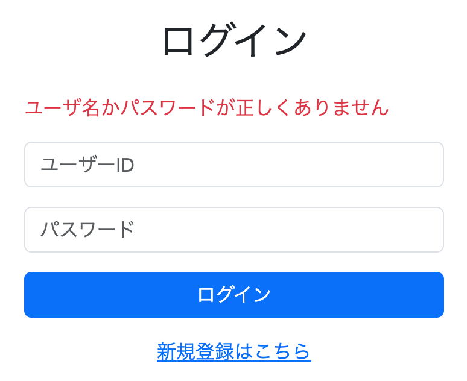

# ログイン機能の実装①

ログイン機能を完成させるためには、認証、認可、ユーザー情報の取得など多くの仕組みを実装する必要がある。そのため、一度にすべてを実装するのではなく、理解しやすいよう段階的に実装を進めることにした。

今回は、

- Spring Securityの導入
- 認証要否の設定
- ログイン画面の作成
- ログイン失敗時のエラーメッセージ表示

までを実装した。

---

# 認証要否の設定

まずはどの画面にログインなしでアクセスできるか、どの画面に制限をかけるかを設定する。

現時点ではまだログイン機能が完成していないため、実際にはすべての画面へ自由にアクセスできる状態にしている。

一見すると認証要否の設定は不要に思えるが、Spring Securityを導入すると、設定を行わない場合はデフォルトで全画面に認証が必要となる。そのため、後続のログイン機能を実装する前に認証要否の設定を行っておく必要がある。

また将来的に、

- お気に入り登録機能
- マイページ
- 管理者ページ

などを実装した際には認証が必要になるため、その前段階として導入する意味もある。

---

## Spring Securityの導入

まずはSpring Security本体とThymeleaf連携用ライブラリを追加した。

```xml
<!-- Security -->
<dependency>
    <groupId>org.springframework.boot</groupId>
    <artifactId>spring-boot-starter-security</artifactId>
</dependency>

<!-- Thymeleaf拡張ライブラリ（セキュリティ） -->
<dependency>
    <groupId>org.thymeleaf.extras</groupId>
    <artifactId>thymeleaf-extras-springsecurity6</artifactId>
</dependency>
```

---

### Thymeleaf拡張ライブラリの役割

このライブラリを導入すると、ThymeleafからSpring Securityの認証情報を参照できるようになる。

通常のThymeleafは単純なHTML表示しか行えない。

```html
<p>こんにちは</p>
```

しかし拡張ライブラリを導入すると、

- ログイン中かどうか
- ログインユーザー名
- 権限（ROLE_ADMINなど）

を参照できるようになる。

例えば、

```html
<div sec:authorize="isAuthenticated()">
    ログイン中です
</div>
```

と書くと、

- ログイン済み → 表示
- 未ログイン → 非表示

となる。

また権限による表示制御も可能である。

```html
<div sec:authorize="hasRole('ADMIN')">
    管理者メニュー
</div>
```

この場合、ROLE_ADMINを持つユーザーだけが表示できる。

---

# SecurityConfig.javaの作成

```java
@Configuration
@EnableWebSecurity
public class SecurityConfig {

    @Bean
    SecurityFilterChain securityFilterChain(HttpSecurity http)
            throws Exception {

        http.authorizeHttpRequests(authorize -> authorize
                .anyRequest().permitAll()
        );

        http.csrf(csrf -> csrf.disable());

        return http.build();
    }
}
```

---

## セキュリティ設定クラス

Spring Securityの設定を行うためにSecurityConfigクラスを作成した。

### @Configuration

```java
@Configuration
```

このクラスがSpringの設定クラスであることを示す。

---

### @EnableWebSecurity

```java
@EnableWebSecurity
```

Spring Securityを有効化する。

---

### @Bean SecurityFilterChain

```java
@Bean
SecurityFilterChain securityFilterChain(...)
```

セキュリティ用フィルターチェーンをSpringへ登録する。

リクエストはControllerへ到達する前に必ずこのフィルターチェーンを通過する。

@Beanを付けない場合、

```text
SecurityFilterChain生成
↓
Springが認識しない
↓
セキュリティ設定として利用されない
```

可能性がある。

---

# フィルターチェーンとは

Spring Securityでは複数のフィルターによって認証や認可を行う。

リクエストはControllerへ到達する前にフィルター群によってチェックされる。

```text
ブラウザ
↓
SecurityFilterChain
↓
Controller
```

---

## SecurityFilterChainとHttpSecurityの違い

### SecurityFilterChain

実際にリクエストが通過するフィルターチェーン。

---

### HttpSecurity

SecurityFilterChainを組み立てるための設定オブジェクト。

```java
.authorizeHttpRequests()
.csrf()
.formLogin()
```

などのメソッドを持っており、それぞれのフィルターに対する設定を登録する。

最後に

```java
http.build();
```

を実行すると、

```text
HttpSecurity
↓
build()
↓
SecurityFilterChain
```

が生成される。

---

# 認証要否の制御

認証要否を設定するにはHttpSecurityクラスの

```java
authorizeHttpRequests()
```

を使用する。

例えば、

```java
http.authorizeHttpRequests(authorize -> authorize
    .requestMatchers("/login").permitAll()
);
```

と書くと、

```text
/login
↓
認証不要
```

となる。

---

一般的には以下のような設定がよく利用される。

```java
http.authorizeHttpRequests(authorize -> authorize

    .requestMatchers(
        PathRequest.toStaticResources().atCommonLocations()
    ).permitAll()

    .requestMatchers("/login").permitAll()
    .requestMatchers("/user/signup").permitAll()
    .requestMatchers("/error").permitAll()
    .requestMatchers("/h2-console/**").permitAll()

    .anyRequest().authenticated()
);
```

この設定では、

- requestMatchers() → 特定パスを許可
- anyRequest().authenticated() → その他は認証必須

となる。

---

今回は一時的に全ページを認証不要とするため、

```java
http.authorizeHttpRequests(authorize -> authorize
    .anyRequest().permitAll()
);
```

としている。

---

# CSRFの無効化

```java
http.csrf(csrf -> csrf.disable());
```

を追加した。

---

## CSRFとは

CSRF（Cross Site Request Forgery）とは、

**ログイン済みのユーザーを利用して不正なリクエストを送信させる攻撃**

である。

例えば、

```text
被害者
↓
銀行へログイン
↓
セッションID保持
```

した状態で、

```text
evil.com
```

のような悪意あるサイトへアクセスしたとする。

そのサイトには、

```html
<form action="https://bank.com/transfer"
      method="POST">

    <input name="amount" value="100000">
    <input name="to" value="attacker">

</form>

<script>
document.forms[0].submit();
</script>
```

が埋め込まれている。

すると、

```text
ページ表示
↓
JavaScript実行
↓
submit()
↓
銀行へPOST
```

が発生する。

ブラウザは銀行向け通信と判断し、

```text
JSESSIONID
```

も自動的に送信する。

銀行から見ると、

```text
ログイン済みユーザーからの正規操作
```

に見えるため、不正送金が成立してしまう。

---

## CSRFトークン

Spring SecurityはCSRFトークンを利用して、

```text
本当に自サイトのフォームから送信されたか
```

を確認している。

攻撃者はこのトークンを知らないため、

```text
ログイン状態は本物
フォームは偽物
↓
403 Forbidden
```

となり攻撃を防げる。

---

# ラムダ式の正体

HttpSecurityには、

```java
.authorizeHttpRequests()
.csrf()
.formLogin()
```

などのメソッドが存在する。

これらはフィルターを実装するためのメソッドではなく、

各フィルターに対する設定を登録するためのメソッドである。

---

例えば、

```java
http.authorizeHttpRequests(authorize ->
    authorize.anyRequest().permitAll()
);
```

では、

認可フィルターに対して

```text
すべてのURLを許可する
```

という設定を登録している。

---

同様に、

```java
http.csrf(csrf -> csrf.disable());
```

では、

CSRFフィルターに対して

```text
CSRFチェックを無効化する
```

という設定を登録している。

---

ラムダ式の中ではフィルターを実装しているのではなく、

```text
そのフィルターをどのようなルールで動かすか
```

を設定している。

最終的にHttpSecurityがそれらの設定を蓄積し、

```java
http.build();
```

によってSecurityFilterChainを生成する。

---

# 実行

今回は認証要否の設定のみであり、画面上の見た目に変化はないため確認は省略した。

---

# ログイン失敗時にエラーメッセージを表示する

まずはログインボタンを押した際に、ログイン失敗時のエラーメッセージが表示されるようにした。



---

## SecurityConfig.javaへ追加

```java
.formLogin(login -> login
    .loginPage("/login")
    .usernameParameter("userId")
    .passwordParameter("password")
    .defaultSuccessUrl("/")
    .failureUrl("/login?error")
    .permitAll()
);
```

---

## formLogin()

ログイン機能を追加するには、

```java
formLogin()
```

を使用する。

このメソッドの引数でログイン画面や認証情報の取得方法などを設定する。

---

### 主な設定項目

| メソッド | 説明 |
|----------|------|
| `loginPage()` | ログイン画面URL |
| `usernameParameter()` | ユーザーID入力欄のname属性 |
| `passwordParameter()` | パスワード入力欄のname属性 |
| `defaultSuccessUrl()` | ログイン成功時の遷移先 |
| `failureUrl()` | ログイン失敗時の遷移先 |
| `permitAll()` | ログイン画面を未認証でも利用可能にする |

---

今回の設定内容は以下の通りである。

```text
ログイン画面 → /login

ユーザーID → userId

パスワード → password

ログイン成功 → /

ログイン失敗 → /login?error

ログイン画面は誰でもアクセス可能
```

なお、ログイン成功後の専用画面がまだ存在しないため、遷移先はホーム画面とした。

---

## usernameParameter()が必要な理由

Spring SecurityはHTMLを見て判断しているわけではない。

デフォルトでは、

```html
<input name="username">
<input name="password">
```

を探す。

しかし今回のアプリは、

```html
<input name="userId">
```

を使用している。

そのため、

```java
.usernameParameter("userId")
```

を指定し、

```text
ユーザー名入力欄はuserIdです
```

とSpring Securityへ教えている。

なお、

```java
.passwordParameter("password")
```

はデフォルト値と同じであるため、説明目的で明示的に記述している。

---

# ログイン画面の修正

ログイン失敗時のエラーメッセージを表示するように修正した。

【login.htmlコードを貼り付け】

---

## エラーメッセージの表示

ログイン失敗時、

```text
SPRING_SECURITY_LAST_EXCEPTION
```

という例外オブジェクトがセッションへ自動登録される。

Thymeleafではセッションの値を、

```html
${session.属性名}
```

で取得できる。

---

そのため、

```html
${session.SPRING_SECURITY_LAST_EXCEPTION}
```

で例外オブジェクトを取得できる。

さらに、

```html
${session.SPRING_SECURITY_LAST_EXCEPTION.message}
```

とすることで、

```java
exception.getMessage()
```

を呼び出したのと同じ意味になる。

---

## エラーメッセージを登録していないのになぜ表示されるのか

ログイン失敗時、Spring Security内部では、

```java
new BadCredentialsException(
    "ユーザー名またはパスワードが正しくありません"
)
```

のような例外が生成される。

その後、

```java
session.setAttribute(
    "SPRING_SECURITY_LAST_EXCEPTION",
    exception
);
```

が実行される。

イメージとしては、

```text
Session
├─ SPRING_SECURITY_LAST_EXCEPTION
│   └─ BadCredentialsException
└─ その他
```

である。

そのため、

```html
${session.SPRING_SECURITY_LAST_EXCEPTION.message}
```

によって、

```text
ユーザー名またはパスワードが正しくありません
```

というメッセージを取得できる。

---

# 実行

Spring Bootを再起動し、わざとログインに失敗させる。


ログイン失敗時にエラーメッセージが表示されることを確認できた。

---

# 疑問

## LoginControllerに@PostMapping("/login")を書いていないのになぜ動くのか

通常であれば、

```java
@PostMapping("/login")
```

が必要に見える。

しかし、

```java
.formLogin(...)
```

を設定すると、Spring Securityが内部でログイン用フィルターをフィルターチェーンへ追加する。

そのため、

```text
GET /login
↓
LoginController

POST /login
↓
Spring Securityの
UsernamePasswordAuthenticationFilter
```

という流れになる。

つまり、

ログイン画面の表示はControllerが担当するが、

ログイン処理そのものはSpring Securityが担当している。

そのため、`@PostMapping("/login")`を書かなくてもログイン処理が動作する。