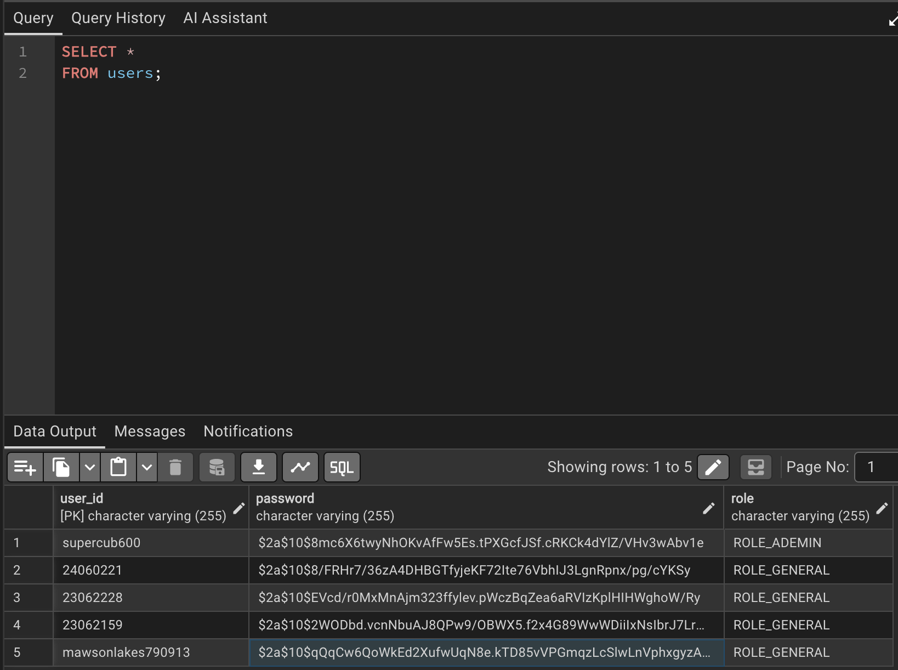

# Spring Securityによるユーザーデータ認証の実装

## 概要

前回までに実装した内容は以下の通り。

- Spring Security の設定
- 認証要否の設定
- ログイン画面の表示
- ログイン失敗時のエラーメッセージ表示

しかし、この時点では**入力されたユーザーID・パスワードとDBのユーザー情報を照合する仕組み**が存在しなかった。

そのため、データベースに登録されている正しいユーザーID・パスワードを入力しても認証は成功せず、ログインできない状態だった。

今回は、Spring Securityとデータベースを連携させるための**ユーザーデータ認証サービス**を実装した。

---

# 準備編① ユーザー取得機能の追加

ログイン認証では、入力されたユーザーIDからDBのユーザー情報を取得する必要がある。

しかし、このアプリケーションにはまだその機能が存在しなかったため、`UserServiceImpl` にユーザー取得メソッドを追加した。

```java
// ユーザー取得
public Users getUserOne(String userId) {
    Optional<Users> option = repository.findById(userId);
    Users user = option.orElse(null);
    return user;
}
```

## findById()

`findById()` は `JpaRepository`（正確にはその親インターフェースである `CrudRepository`）が最初から持っているメソッドである。

```java
Optional<Users> findById(ID id);
```

### Optionalを返す理由

データベース検索では、

- データが見つかる
- データが見つからない

の両方の可能性がある。

Java8以前は検索結果が存在しない場合 `null` が返されていた。

しかし、そのまま

```java
user.getUserName();
```

のように使用すると `NullPointerException` が発生しやすかった。

そのためJava8以降では、

> 「値が存在するかもしれないし、存在しないかもしれない」

という状態を型で表現するために `Optional` が導入された。

### orElse(null)

```java
Users user = option.orElse(null);
```

`orElse()` は

> Optionalの中身が存在すればその値を返し、存在しなければ指定した値を返す

メソッドである。

今回は検索結果が存在しない場合は `null` を返している。

---

# 準備編② Roleの導入

ユーザー認証では、管理者と一般ユーザーを区別する必要がある。

そのため、Roleを追加した。

Roleを分けることで、

- 管理者
- 一般ユーザー

それぞれアクセスできるページを制御できるようになる。

## schema.sql

```sql
CREATE TABLE users (
    user_id VARCHAR(20) PRIMARY KEY,
    password VARCHAR(255) NOT NULL,
    role VARCHAR(20) NOT NULL
);
```

## Entityの修正

```java
@Data
@Entity
@Table(name = "users")
public class Users {

    @Id
    private String userId;

    private String password;

    private String role;
}
```

## 既存データへRoleを追加

すでに登録済みのユーザーにはRoleが存在しないため、pgAdmin4で更新した。

```sql
UPDATE users
SET role = 'ROLE_ADMIN'
WHERE user_id = 'xxxxx';
```

```sql
UPDATE users
SET role = 'ROLE_GENERAL'
WHERE role IS NULL;
```

今回はデータ数が少なかったため、pgAdmin4から直接更新した。

## 新規登録ユーザーへRoleを自動設定

今後登録されるユーザーは、自動的に一般ユーザーとなるよう修正した。

```java
user.setRole("ROLE_GENERAL");
```

これにより、ブラウザからRoleを指定できない安全な設計となった。

---

# 実装編① PasswordEncoderのBean登録

Spring Securityではパスワードはハッシュ化して保存することが前提となる。

そのため、`PasswordEncoder` をBeanとして登録した。

```java
@Bean
PasswordEncoder passwordEncoder() {
    return new BCryptPasswordEncoder();
}
```

## PasswordEncoderとは

`PasswordEncoder` はパスワードをハッシュ化するためのインターフェースである。

実装クラスはいくつか存在するが、

```java
BCryptPasswordEncoder
```

が最も一般的に利用される。

理由は、

- bcryptアルゴリズムを使用している
- 復号が極めて困難
- Spring Securityでも推奨されている

ためである。

## なぜnewしているのか

`PasswordEncoder` はインターフェースなので、

```java
new PasswordEncoder();
```

とは書けない。

そのため実装クラスである

```java
new BCryptPasswordEncoder();
```

を生成して返している。

## なぜ戻り値がPasswordEncoderなのか

実は

```java
@Bean
BCryptPasswordEncoder passwordEncoder() {
    return new BCryptPasswordEncoder();
}
```

でも動作する。

しかし通常は

```java
@Bean
PasswordEncoder passwordEncoder() {
    return new BCryptPasswordEncoder();
}
```

と書く。

これは

> 実装ではなくインターフェースに依存する

という設計思想によるものである。

将来別のハッシュアルゴリズムへ変更しても、利用側を変更する必要がない。

---

# 実装編② ユーザー登録時のパスワードハッシュ化

ユーザー登録時に、生パスワードをハッシュ化して保存するよう修正した。

```java
String rawPassword = users.getPassword();
users.setPassword(encoder.encode(rawPassword));
```

`encode()` を利用することで、安全なハッシュ値へ変換できる。

---

# 実装編③ ユーザーデータ認証サービスの作成

Spring Securityが認証できるよう、`UserDetailsService` を実装したサービスを作成した。

```java
@Service
@RequiredArgsConstructor
public class UserDetailsServiceImpl
        implements UserDetailsService {
```

## loadUserByUsername()

```java
@Override
public UserDetails loadUserByUsername(String userId)
```

をオーバーライドする。

メソッド名は `loadUserByUsername()` だが、これはSpring Security側で定義されている唯一の認証用メソッドである。

今回はログインIDとして `userId` を使用しているため、引数も `userId` としている。

## ユーザー取得

```java
Users loginUser = service.getUserOne(userId);
```

入力されたユーザーIDからデータベース検索を行う。

## ユーザーが存在しない場合

```java
throw new UsernameNotFoundException("user not found");
```

を投げる。

この例外をSpring Securityが受け取り、認証失敗として処理する。

## RoleをGrantedAuthorityへ変換

Spring Securityでは権限を

```java
GrantedAuthority
```

として扱う。

今回は最もシンプルな実装である

```java
SimpleGrantedAuthority
```

を利用した。

また、Spring Securityでは1人のユーザーが複数の権限を持てる設計になっているため、

```java
List<GrantedAuthority>
```

として管理する。

## UserDetailsの生成

最後に

```java
UserDetails userDetails =
    new User(
        loginUser.getUserId(),
        loginUser.getPassword(),
        authorities
    );
```

を実行する。

ここで生成している `User` は、自作した `Users` エンティティではなく、Spring Securityが用意している `User` クラスである。

このコンストラクタは

```java
new User(username, password, authorities)
```

という形になっており、

- ユーザーID
- ハッシュ化済みパスワード
- 権限情報

を持ったSpring Security用ユーザーオブジェクトを生成している。

なお、

- アカウント有効
- アカウント期限切れ
- ロック状態

などを管理する7引数版コンストラクタも存在するが、今回は使用していない。

## なぜ戻り値がUserDetailsなのか

Spring Securityは、自作した `Users` エンティティを認識できない。

認識できるのは

```text
UserDetails
```

のみである。

つまり、

```text
Users
    ↓
UserDetails
    ↓
Spring Security
```

という変換が必要になる。

このサービス全体の役割は、

> DBから取得したUsersエンティティを、Spring Securityが利用できるUserDetailsへ変換すること

である。

---

# 実装編④ 既存ユーザーのパスワードをハッシュ化

既存データは平文パスワードで保存されていたため、そのままではログインできない。

一時的にエントリーポイントへ以下を追加した。

```java
PasswordEncoder encoder = new BCryptPasswordEncoder();
System.out.println(encoder.encode("admin123"));
```

Spring Bootは

```java
public static void main(String[] args)
```

から起動するため、

ここで生成したハッシュ値をPostgreSQLへ反映した。

---

# 動作確認

ログインを実行すると、正しいユーザーID・パスワードで認証に成功し、Home画面へ遷移できた。

また、新しく登録したユーザーをPostgreSQLで確認すると、パスワードがBCrypt形式で保存されていることも確認できた。



さらに、前回実装したAOPによるログも認証処理に対して出力されていた。

```text
メソッド開始：UserDetailsServiceImpl.loadUserByUsername(String)

メソッド開始：UserServiceImpl.getUserOne(String)

getUserOne : 187ms

メソッド終了：UserServiceImpl.getUserOne(String)

loadUserByUsername : 190ms

メソッド終了：UserDetailsServiceImpl.loadUserByUsername(String)
```

再起動せず再度ログインすると

```text
getUserOne : 30ms

loadUserByUsername : 32ms
```

となった。

初回のみSpring SecurityやJPAなどの初期化が行われていた影響と思われる。

---

# 所感

今回はコードそのものよりも、ログイン機能を成立させるための準備が非常に多かった。

Spring Security・JPA・PasswordEncoder・Role・UserDetailsなど、多くの仕組みが連携して初めてログイン機能が実現できることを理解できた。

普段利用しているWebサービスでも、ログイン処理の裏側では様々なコンポーネントが協調して動作していることを実感した。

---

# 反省点

ログイン機能を実装するためには、ブラウザ上では使用しない機能であっても、

- `findById()` によるユーザー取得
- `role` の管理

など、内部処理として必要な機能は事前に設計しておくべきだった。

また、今回はログイン成功後にトップページへ戻すだけだったため、ログイン成功が分かりにくかった。

今後はログイン後専用画面も作成したい。

さらに、ユーザー情報は

- 内部で使用する一意のID
- ユーザーが入力するログインID（username）

を分離した設計の方が、将来的な拡張性・保守性が高いと感じた。

---

# 次回やること

- ログアウト処理の実装