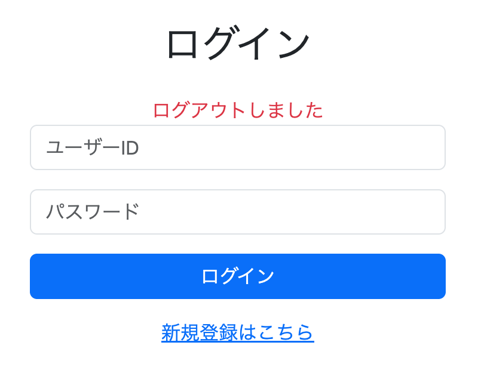

# ログアウト機能の実装

## 概要

ログイン機能の実装が完了したので、次はログアウト機能を実装する。

実は、Spring Securityではログアウト処理を自前で実装する必要はない。デフォルトでログアウト機能が用意されているため、開発者は必要に応じてその挙動を設定するだけでよい。

---

# ログアウト設定の追加

ログアウト時の動作をカスタマイズするため、`SecurityConfig.java` の `SecurityFilterChain` を修正した。

```java
.logout(logout -> logout
        .logoutUrl("/logout")
        .logoutSuccessUrl("/login?logout")
)
```

`logout()` メソッドでは、ログアウト処理に関する設定を行う。

よく使用される設定は以下のとおりである。

| メソッド | 説明 |
| --- | --- |
| `logoutUrl(String logoutUrl)` | ログアウト処理を受け付けるURLを指定する。HTML側の `th:action="@{/logout}"` と一致させる必要がある。なお、ログアウトはPOSTメソッドで送信される。 |
| `logoutSuccessUrl(String logoutSuccessUrl)` | ログアウト成功後にリダイレクトするURLを指定する。 |
| `invalidateHttpSession(boolean)` | ログアウト時にセッションを無効化するかどうかを指定する。（デフォルトは `true`） |
| `deleteCookies(String... names)` | ログアウト時に削除するCookieを指定する。 |

---

## 【疑問】`/login?logout` とは何か？

`/login?logout` は、新しいURLではない。

これは

```text
/login
```

というパスに

```text
?logout
```

というクエリパラメータが付いただけである。

Spring MVCの

```java
@GetMapping("/login")
```

が判定しているのはURLの**パス部分**だけである。

例えば

```text
http://localhost:8080/login
```

は

```text
パス：/login
```

となる。

一方、

```text
http://localhost:8080/login?logout
```

は

```text
パス：/login
クエリパラメータ：logout
```

に分かれている。

つまり、どちらもSpring MVCから見るとパスは `/login` なので、

```java
@GetMapping("/login")
```

が実行される。

イメージすると、

```text
http://localhost:8080/login
                     └────┘
                      パス
```

```text
http://localhost:8080/login?logout
                     └────┘ └─────┘
                      パス    クエリパラメータ
```

となる。

---

## では、なぜ `?logout` を付けるのか？

Spring Securityでは、

```java
.logoutSuccessUrl("/login?logout")
```

と設定すると、ログアウト成功後に

```text
/login?logout
```

へリダイレクトされる。

これにより、

- 通常のログイン画面
- ログアウト直後のログイン画面

を区別できるようになる。

### Thymeleafで判定する

Thymeleafでは

```html
<div th:if="${param.logout}">
    ログアウトしました
</div>
```

と書くことで、

URLに

```text
?logout
```

が付いている場合のみメッセージを表示できる。

つまり、

```text
/login
```

では表示されず、

```text
/login?logout
```

では

```text
ログアウトしました
```

というメッセージが表示される。

### ログイン失敗時も同じ仕組み

ログイン処理では

```java
.failureUrl("/login?error")
```

としている。

これも同様に、

```text
/login?error
```

という新しいページが存在するわけではなく、

ログイン画面に

```text
error
```

というクエリパラメータを付けているだけである。

---

# ログアウトボタンの実装

共通ヘッダーへログアウトボタンを追加した。

```html
<form method="post"
      th:action="@{/logout}"
      class="m-0">
    <button type="submit"
            class="btn btn-outline-light btn-sm">
        ログアウト
    </button>
</form>
```

フォームの送信先は、`SecurityConfig` で設定した

```java
.logoutUrl("/logout")
```

と一致させる必要がある。

---

## 【疑問】ログアウトはなぜPOSTメソッドなのか？

ログアウトは、サーバー側の状態（セッションや認証情報）を変更する処理である。

HTTPでは一般的に、

- **GET**：データの取得（サーバーの状態を変更しない）
- **POST**：データの登録・更新・削除など、サーバーの状態を変更する処理

という役割分担になっている。

ログアウトでは、ログイン状態を保持しているセッションが破棄されるため、サーバーの状態が変化する。

そのため、Spring SecurityではログアウトをPOSTリクエストで送信する仕様になっている。

また、もしログアウトがGETで実行できてしまうと、

```html

```

のようなHTMLを悪意のあるサイトへ埋め込まれただけで、ユーザーの意思とは関係なくログアウトさせられる可能性がある。

このような攻撃を防ぐためにも、Spring SecurityではCSRF対策を兼ねてPOSTによるログアウトを採用している。

---

# ログアウト後のメッセージ表示

ログアウト後にログイン画面でメッセージを表示するよう修正した。

```html
<div th:if="${param.logout}"
     class="text-danger text-center">
    ログアウトしました
</div>
```

`param.logout` を利用することで、

```text
/login?logout
```

へ遷移した場合のみメッセージを表示できる。

---

# 動作確認

Spring Bootを再起動し、

1. ログイン
2. ログアウトボタンを押す

という流れで動作確認を行った。

ログアウト後は

```text
http://localhost:8080/login?logout
```

へリダイレクトされ、

「ログアウトしました」というメッセージが表示されることを確認した。



---

# 所感

今回はSpring Securityが標準でログアウト機能を提供しているため、想像していたよりも少ないコードで実装できた。

また、`?logout` や `?error` を利用したクエリパラメータの仕組みについて理解できたことも大きな収穫だった。

Spring Securityは認証・認可だけでなく、ログアウト機能まで含めて多くの処理を提供してくれるため、開発効率の高さを改めて実感した。

---

# 次回やること

- CSRF対策