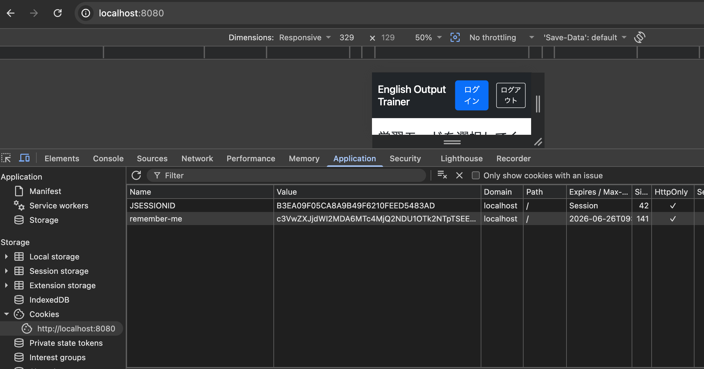

# Remember-Me認証

## 概要

Remember-Me認証とは、ユーザーがログイン時に「ログインしたままにする」を選択した場合、ブラウザを閉じたりセッションタイムアウトが発生した後でも、自動的にログイン状態を復元する機能である。

---

# 通常のログインの仕組み

ログインに成功すると、サーバーはログインユーザーのセッションIDを生成・保持する。同時に、ブラウザのCookieにも同じセッションID（`JSESSIONID`）が保存される。

以後、ブラウザがアプリケーションへリクエストを送るたびに、このCookieも一緒に送信される。

サーバーは受け取ったセッションIDを照合し、

- 一致する → ログイン中
- 一致しない → 未ログイン

と判断する。

ただし、セッションIDは次のタイミングで削除される。

- ログアウトしたとき
- セッションタイムアウト（一定時間無操作）が発生したとき

これは、サーバーのメモリ使用量を抑え、古いセッションIDが悪用されることを防ぐためである。

---

# Remember-Me認証の仕組み

Remember-Meを有効にしてログインすると、通常のセッションIDに加えて、Remember-Me用のCookieもブラウザへ保存される。

このCookieには

- ユーザーを識別する情報
- 有効期限
- 改ざんを防ぐための署名情報

などが保存される。

その後、セッションタイムアウトが発生すると、サーバー上のセッションは削除される。

この状態で再度アクセスすると、

1. 通常のセッション認証
2. Remember-Me Cookieによる認証

の順に確認が行われる。

Remember-Me Cookieが

- 有効期限内
- 改ざんされていない

場合は、自動的に再ログイン処理が実行され、新しいセッションが作成される。

そのため、ユーザーは再度ログイン画面を表示されることなく、利用を継続できる。

---

# Remember-Me Cookieとセキュリティ

Remember-Me Cookieには、ログイン状態を復元するための情報が保存される。

ただし、パスワードそのものが保存されるわけではない。

Spring Securityでは、ユーザー名や有効期限などに署名を付与したトークン形式でCookieを生成している。

なお、このトークンはBase64で表現されているが、Base64は暗号化ではない。

そのため、Cookieが第三者に盗まれると、不正ログインに悪用される可能性がある。

特にXSS（クロスサイトスクリプティング）攻撃ではCookieが盗まれる可能性があるため、Remember-Me認証は利便性が高い反面、セキュリティリスクも伴う。

つまり、Remember-Me認証は

- 利便性
- セキュリティ

のトレードオフであり、用途に応じて慎重に利用する必要がある。

---

# 実装で確認すること

Remember-Me認証を実装したあと、

- セッションタイムアウト後でもログイン状態が維持されること
- 自動的に新しいセッションが発行されること

を確認する。

---

# セッションタイムアウト時間の変更

動作確認しやすいように、一時的にセッションタイムアウトを1分へ変更した。

```yaml
server:
  servlet:
    session:
      timeout: 1m
```

この設定は検証時のみ使用し、確認後はデフォルト値へ戻す。

---

# Remember-Me認証の実装

## login.html

まず、ログイン画面へRemember-Me用のチェックボックスを追加する。

```html
<!-- Remember-Me -->
<div class="form-group mt-3">
    <input class="form-check-input"
           type="checkbox"
           id="remember-me"
           name="remember-me">

    <label class="form-check-label"
           for="remember-me">
        Remember-Me
    </label>
</div>
```

重要なのは

```html
name="remember-me"
```

である。

この名前を使って、ブラウザから「Remember-Meにチェックが入っているか」をSpring Securityへ送信する。

---

## SecurityConfig.java

続いて、Remember-Me認証を有効化する。

```java
.rememberMe(remember -> remember
        .rememberMeParameter("remember-me")
        .tokenValiditySeconds(3600)
);
```

### 各メソッド

| メソッド | 説明 |
|----------|------|
| `rememberMeParameter(String rememberMeParameter)` | ログイン画面から送信されるRemember-Meチェックボックスのパラメータ名を指定する。 |
| `tokenValiditySeconds(int tokenValiditySeconds)` | Remember-Me Cookieの有効期限を秒単位で指定する。 |

---

# Remember-Me認証の内部動作

HTMLでは

```html
name="remember-me"
```

となっている。

ユーザーがチェックを付けてログインすると、

```http
POST /login

userId=taro
password=1234
remember-me=on
```

というリクエストが送信される。

一方、Spring Securityでは

```java
.rememberMe(remember -> remember
    .rememberMeParameter("remember-me")
    .tokenValiditySeconds(3600)
);
```

と設定している。

Spring SecurityはPOSTデータの中から

```text
remember-me
```

という名前のパラメータを探す。

一致した場合、

> このユーザーはログイン状態を保持したい

と判断し、

Remember-Me Cookieをブラウザへ返す。

例えば

```text
remember-me=xxxxxxxxxxxxxxxx
```

のようなCookieである。

また、

```java
.tokenValiditySeconds(3600)
```

を設定しているため、

Cookieの有効期限は

```text
3600秒（1時間）
```

となる。

もし

HTML

```html
name="remember"
```

Spring Security

```java
.rememberMeParameter("remember-me")
```

のように名前が一致しなければ、

Remember-Meは無効と判断され、Cookieは発行されない。

---

# 動作確認

Spring Bootを起動し、

Remember-Meへチェックを入れてログインする。

ブラウザの開発者ツールを開き、

```
Application
    ↓
Cookies
```

を確認すると、

通常の

```text
JSESSIONID
```

に加えて、

```text
remember-me
```

というCookieが新しく作成されていることを確認できる。

これは、自動ログインに使用されるCookieである。



また、

ログイン時刻は17時02分だったが、

Cookieの有効期限は

```text
2026-06-26T09:02:39.986Z
```

となっていた。

この時刻はUTC（協定世界時）なので、

日本時間（UTC+9）へ変換すると

```text
2026-06-26 18:02:39
```

となる。

ログイン時刻から約1時間後になっているため、

```java
.tokenValiditySeconds(3600)
```

が正しく反映されていることを確認できた。

さらに、セッションタイムアウト後にページを更新すると、

```text
55367C47D06A22682AF91A198EBA1D45
        ↓
28BD4E373199260CF9E68D1A97A5CA22
```

のように`JSESSIONID`が変更されていた。

つまり、

- セッションは一度破棄されている
- Remember-Me Cookieによって自動ログインされ、新しいセッションが生成されている

ことを確認できた。

---

# セッションタイムアウト時間を元に戻す

動作確認後は、

検証用に設定していた

```yaml
server:
  servlet:
    session:
      timeout: 1m
```

を削除し、デフォルトの30分へ戻した。

---

# 所感

Remember-Me認証は単にCookieを保存するだけではなく、セッションタイムアウト後にRemember-Me Cookieを利用して自動的に認証を復元し、新しいセッションを生成していることが理解できた。

また、通常のセッション認証とRemember-Me認証が連携して動作していることや、Remember-Me Cookieにはパスワードではなく署名付きの認証情報が保存されていることを学んだ。

さらに、利便性が向上する一方で、Cookieが盗まれた場合は第三者による不正利用のリスクがあるため、Remember-Me認証はセキュリティとのバランスを考慮して利用する必要があることを理解できた。

---

# 次回やること

- ログインユーザーIDの取得・表示