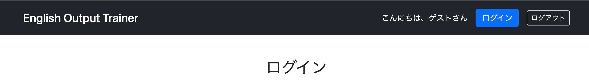
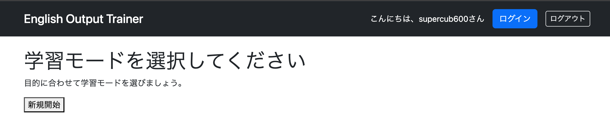

# ログインユーザーIDの取得・表示

ここでは、ログとログイン後の画面のヘッダー部それぞれにユーザーIDを表示する。

## ログ出力と画面出力

ログにユーザー名を出力させるにはAOP（LogAspect）で実装し、画面にユーザー名を出力させるにはControllerで実装する。

また、プログラムの場所（AOPクラスかControllerか）によって、ユーザーIDを取得する方法が異なる。

Controllerで実装する場合も、

- 各Controllerに記述する方法
- `@ControllerAdvice` を利用して全Controller共通の処理として実装する方法

の2通りがある。本章では両方を解説する。

---

# AOPでログにユーザーIDを出力する

まずは、ログへログインユーザーIDを出力する。

`LogAspect` の `startLog()` と `endLog()` に認証情報取得処理を追加する。

```java
@Aspect
@Component
@Slf4j
public class LogAspect {

    /** 対象：[Service]をクラス名に含んでいること */
    @Pointcut("execution(* com.example.demo.service.*.*(..))")
    public void serviceMethods(){}

    /** サービスの実行前にログ出力する */
    @Before("serviceMethods()")
    public void startLog(JoinPoint jp) {

        // 認証情報取得
        Authentication authentication =
                SecurityContextHolder.getContext().getAuthentication();

        // 認証情報からユーザーID取得（未ログイン対策あり）
        String userId = "anonymous";

        if (authentication != null) {
            userId = authentication.getName();
        }

        log.info(
            "ユーザーID={}, メソッド開始(Service): {}",
            userId,
            jp.getSignature());
    }

    /** サービスの実行後にログ出力する */
    @After("serviceMethods()")
    public void endLog(JoinPoint jp) {

        // 認証情報取得
        Authentication authentication =
                SecurityContextHolder.getContext().getAuthentication();

        // 認証情報からユーザーID取得（未ログイン対策あり）
        String userId = "anonymous";

        if (authentication != null) {
            userId = authentication.getName();
        }

        log.info(
            "ユーザーID={}, メソッド終了(Service): {}",
            userId,
            jp.getSignature());
    }
}
```

---

## SecurityContextHolderとは

`SecurityContextHolder` は、Spring Securityが現在の認証情報を管理するためのクラスである。

```java
SecurityContextHolder.getContext()
```

で `SecurityContext` を取得できる。

さらに、

```java
getAuthentication()
```

を呼び出すことで、現在の認証情報を表す `Authentication` オブジェクトを取得できる。

つまり、

```java
Authentication authentication =
    SecurityContextHolder
        .getContext()
        .getAuthentication();
```

は、

1. `SecurityContextHolder`
2. `SecurityContext`
3. `Authentication`

という順番で認証情報へアクセスしているだけである。

---

## ログインすると何が起こるのか

例えば、

```
userId : tanaka
password : 1234
```

でログインしたとする。

認証に成功すると、Spring Securityはまず

```
UserDetails
-----------------
userId = tanaka
password = ******
ROLE_USER
```

という `UserDetails` オブジェクトを生成する。

しかし、このオブジェクトだけでは、

> 「現在ログインしているユーザー」

なのか、

単なるユーザー情報なのか区別できない。

そこでSpring Securityはさらに

```
Authentication
```

を生成する。

---

## Authenticationとは

Authenticationとは、

**現在ログインしているユーザーの認証結果を保持するオブジェクト**

である。

イメージすると、

```
Authentication
├── principal      → UserDetails
├── authorities    → ROLE_USER
└── authenticated  → true
```

となる。

つまり、`UserDetails` は Authentication の一部として保持されている。

---

## SecurityContextとは

Authentication を保存する箱が `SecurityContext` である。

```
SecurityContext
        │
        ▼
Authentication
        │
        ├── UserDetails
        ├── 権限
        └── 認証済みか
```

---

## SecurityContextHolderとは

では、その `SecurityContext` はどこに保存されているのか。

それが `SecurityContextHolder` である。

```
SecurityContextHolder
        │
        ▼
SecurityContext
        │
        ▼
Authentication
        │
        ▼
UserDetails
```

つまり、

```java
SecurityContextHolder
        .getContext()
        .getAuthentication();
```

だけで、

**現在ログインしているユーザー**

を取得できる。

---

## getName()は何をしているのか

```java
String userId = authentication.getName();
```

を実行すると、

内部では概ね

```
Authentication
        │
        ▼
UserDetails
        │
        ▼
getUsername()
```

という流れで処理される。

つまり、

```java
authentication.getName();
```

は実質的に

```java
UserDetails user = ...;

String userId = user.getUsername();
```

とほぼ同じ意味である。

---

## なぜAuthenticationを使うのか

`UserDetails` は、

単なる

**ユーザー情報**

を表すだけである。

例えば、

```java
UserDetails tanaka =
    userDetailsService.loadUserByUsername("tanaka");
```

と書けば、

ログインしていなくても

```
tanaka
```

の `UserDetails` は取得できる。

つまり、

```
UserDetails = ログイン中
```

ではない。

Spring Securityが知りたいのは、

- 本人確認できたか
- 権限は何か
- 現在ログイン中か

である。

そのため、

```
Authentication
```

が必要になる。

### UserDetailsはデータでしかない

例えばデータベースに次のようなユーザーが登録されているとする。

| ユーザーID | 権限 |
|------------|------|
| tanaka | ROLE_USER |
| sato | ROLE_ADMIN |

ログインしていなくても、

```java
UserDetails tanaka =
    userDetailsService.loadUserByUsername("tanaka");
```

と書けば、`UserDetails(tanaka)` は取得できる。

しかし、これは

> **「tanakaが現在ログインしている」**

という意味ではない。

単に「tanakaというユーザー情報を取得した」だけである。

---

### 認証済みかどうかも管理する必要がある

Spring Securityが本当に管理したいのは、

- 本人確認できたか
- 権限は何か
- 現在ログイン中か

である。

そのため Authentication が生成される。

```
Authentication
│
├── principal
│      ↓
│  UserDetails(tanaka)
│
├── authenticated = true
│
└── authorities
       ↓
   ROLE_USER
```

つまり、

> **UserDetails + 認証状態**

をまとめたものが Authentication である。

---

### Authenticationはログイン前にも存在する

Authenticationはログイン後だけではなく、ログイン処理の途中でも利用される。

ログイン画面で

```
ID : tanaka
PW : 1234
```

を送信すると、まず

```
Authentication

principal = tanaka
credentials = 1234
authenticated = false
```

という Authentication が生成される。

認証成功後は、

```
Authentication

principal = UserDetails(tanaka)
authenticated = true
ROLE_USER
```

へ置き換えられる。

つまり Authentication は認証処理の最初から最後まで使われるオブジェクトなのである。

---

### なぜSecurityContextHolderまであるのか

Authentication を作っただけでは、

```java
Authentication authentication = ???;
```

となり、現在の認証情報を取得できない。

そこで Spring Security は

```
SecurityContext
```

へ Authentication を保存し、

さらに

```
SecurityContextHolder
```

が現在のリクエスト専用に管理している。

そのため、

```java
SecurityContextHolder
        .getContext()
        .getAuthentication();
```

だけで、

**現在ログインしているユーザー**

を取得できる。

なお、未ログイン（匿名ユーザー）の場合は取得結果が異なる場合があるため注意する。

---

## 未ログイン対策

```java
String userId = "anonymous";

if (authentication != null) {
    userId = authentication.getName();
}
```

未ログイン状態ではログインユーザー情報を取得できない。

そのため、

- ログイン済み → ユーザーID
- 未ログイン → `"anonymous"`

となるようにしている。

---

## ログ出力

```java
log.info(
    "ユーザーID={}, メソッド開始(Service): {}",
    userId,
    jp.getSignature());
```

このようにすることで、

- 誰が
- どのServiceを
- 実行したのか

がログから確認できるようになった。

---

## なぜstartとendの両方でユーザーIDを取得するのか

`@Before` と `@After` は別々のメソッドである。

そのため、

```java
@Before
```

で取得した `userId` は、

```java
@After
```

から利用できない。

したがって現在の構成では、

```java
Authentication authentication =
        SecurityContextHolder.getContext().getAuthentication();

String userId = authentication.getName();
```

をそれぞれのメソッドで取得する必要がある。

ただし、実際には開始時に取得したユーザーIDだけでも機能的には十分である。

それでも開始・終了の両方で取得している理由は、

> **ログの形式を統一した方が見やすく、検索もしやすいため**

である。

---

# ControllerAdviceで画面へユーザー名を表示する

次は、ログインユーザー名を画面へ表示する。

例えば、

- ログイン中ならユーザー名
- 未ログインなら「ゲスト」

を共通ヘッダーへ表示したいとする。

このような場合は、Controllerでユーザー情報を取得し、HTMLへ渡して表示する。

Spring Securityでは、

```java
@AuthenticationPrincipal
```

を付けることで、現在ログイン中の `UserDetails` を取得できる。

例えば、

```java
@GetMapping("/list")
public String getUserList(
        Model model,
        @AuthenticationPrincipal UserDetails loginUser) {

    log.info("ユーザーID={}", loginUser.getUsername());

    return "user/list";
}
```

のように書くことができる。

しかし、この方法には欠点がある。

このControllerで取得したユーザー名は、

```
user/list.html
```

でしか利用できない。

もし他の画面でもヘッダーにユーザー名を表示したいなら、

各Controllerで同じ処理を何度も書かなければならない。

これはコードの重複につながる。

---

## ControllerAdviceとは

そこで利用するのが

```java
@ControllerAdvice
```

である。

`@ControllerAdvice` を付与したクラスに共通処理を書くことで、

**すべてのControllerに対して共通処理を自動実行**

できる。

さらに、

```java
@ModelAttribute
```

を利用すると、

Controllerが実行される前に共通のModel属性を登録できる。

例えば、

- ログイン中ならユーザー名
- 未ログインなら「ゲスト」

をModelへ登録しておけば、

どのHTMLからでも同じ属性名で参照できる。

その結果、

共通ヘッダーや共通メニューへ表示する情報を一か所で管理でき、

コードの重複を防げる。

## GlobalControllerAdviceを実装

共通ヘッダーでログインユーザー名を表示するために、`GlobalControllerAdvice` を実装する。

```java
package com.example.demo.advice;

import org.springframework.security.core.annotation.AuthenticationPrincipal;
import org.springframework.security.core.userdetails.UserDetails;
import org.springframework.ui.Model;
import org.springframework.web.bind.annotation.ControllerAdvice;
import org.springframework.web.bind.annotation.ModelAttribute;

@ControllerAdvice
public class GlobalControllerAdvice {

    @ModelAttribute
    public void addLoginUser(
            Model model,
            @AuthenticationPrincipal UserDetails loginUser) {

        model.addAttribute(
                "loginUser",
                loginUser != null
                        ? loginUser.getUsername()
                        : "ゲスト");
    }
}
```

### `@ControllerAdvice`

```java
@ControllerAdvice
```

このクラスが**すべてのControllerに共通する処理を担当するクラス**であることをSpringへ知らせるアノテーションである。

通常、画面へデータを渡す処理は各Controllerへ記述する。しかし、ログインユーザー名やアプリケーション名など、**どの画面でも共通して必要になる情報**は、各Controllerで毎回 `model.addAttribute()` を書くとコードが重複してしまう。

そこで `@ControllerAdvice` を利用すると、そのクラスへ記述した共通処理を**すべてのControllerへ自動的に適用**できる。

今回は、共通ヘッダーへ表示するログインユーザー名を登録するために利用している。

---

### クラス宣言

```java
public class GlobalControllerAdvice {
```

共通処理をまとめるためのクラスである。

クラス名は自由だが、

- `GlobalControllerAdvice`
- `CommonControllerAdvice`

など、役割が分かる名前を付けることが多い。

---

### `@ModelAttribute`

```java
@ModelAttribute
```

このアノテーションが付いたメソッドは、**各Controllerの処理が実行される前**に自動実行される。

処理の流れは次のようになる。

```
ブラウザからリクエスト
        ↓
GlobalControllerAdvice（@ModelAttribute）
        ↓
Controller
        ↓
HTML表示
```

つまり、Controllerが画面へデータを渡す前に、共通で必要なModel属性を登録できる。

---

### `addLoginUser()`

```java
public void addLoginUser(...)
```

共通処理を行うメソッドである。

メソッド名は自由であり、

```java
addLoginUser()
```

である必要はない。

例えば、

```java
addCommonAttributes()
```

や

```java
setLoginUser()
```

などでも問題なく動作する。

---

### `Model model`

```java
Model model
```

Controllerでも利用していた `Model` オブジェクトである。

ここへ

```java
model.addAttribute()
```

することで、Thymeleafへデータを渡せる。

例えば、

```java
model.addAttribute("name", "山田");
```

と書けば、

```html
<span th:text="${name}"></span>
```

で `"山田"` を表示できる。

---

### `@AuthenticationPrincipal`

```java
@AuthenticationPrincipal
UserDetails loginUser
```

現在ログインしているユーザー情報を、Spring Securityが自動的に取得して渡してくれる。

ログインしている場合は、

```java
loginUser
```

へ `UserDetails` オブジェクトが格納される。

例えば、

```java
loginUser.getUsername();
```

と書けば、ログインユーザーIDを取得できる。

一方、未ログイン時は

```java
loginUser == null
```

となる。

---

### `model.addAttribute()`

```java
model.addAttribute(
        "loginUser",
        loginUser != null
                ? loginUser.getUsername()
                : "ゲスト");
```

ここでは、

- 属性名：`loginUser`
- 値：ログインユーザー名、または `"ゲスト"`

をModelへ登録している。

ここで利用している

```java
条件 ? trueの場合 : falseの場合
```

は**三項演算子**である。

今回は、

```java
loginUser != null
```

を判定し、

- ログイン中ならユーザー名
- 未ログインなら「ゲスト」

を登録している。

if文で書くと、

```java
if (loginUser != null) {
    model.addAttribute(
            "loginUser",
            loginUser.getUsername());
} else {
    model.addAttribute(
            "loginUser",
            "ゲスト");
}
```

と同じ意味になる。

---

### HTMLから利用

Modelへ登録されたので、Thymeleafでは

```html
<span th:text="${loginUser}"></span>
```

と書くだけで、

ログイン中なら

```
田中
```

未ログインなら

```
ゲスト
```

と表示できる。

Controller側で文字列へ変換して渡しているため、HTML側ではログイン状態を判定する必要がなく、実装をシンプルにできる。

---

### このクラス全体の流れ

```
ブラウザからリクエスト
        ↓
GlobalControllerAdviceが実行
        ↓
ログインユーザー情報取得
        ↓
ログイン中？
      ├─ YES → ユーザー名取得
      └─ NO  → 「ゲスト」
        ↓
ModelへloginUserとして登録
        ↓
Controller実行
        ↓
HTML表示
        ↓
共通ヘッダーで${loginUser}を表示
```

このように、`GlobalControllerAdvice` を利用することで、**すべてのControllerで共通利用するデータを一か所で管理**できるため、コードの重複を防ぎ、保守性の高い実装となる。

---

# ヘッダーを修正

`GlobalControllerAdvice` で取得したユーザー名を表示できるように `header.html` を修正する。

```html
<header layout:fragment="header-contents"
        class="bg-dark text-white py-3 mb-3">

    <div class="container d-flex justify-content-between align-items-center">

        <h1 class="h4 m-0">
            English Output Trainer
        </h1>

        <div class="ms-auto d-flex gap-3 align-items-center">

            <span th:text="'こんにちは、' + ${loginUser} + 'さん'">
                ゲスト
            </span>

            <a class="btn btn-primary" href="/login">
                ログイン
            </a>

            <form method="post"
                  th:action="@{/logout}"
                  class="m-0">

                <button type="submit"
                        class="btn btn-outline-light btn-sm">
                    ログアウト
                </button>

            </form>

        </div>

    </div>

</header>
```

これにより、

- ログイン中：`こんにちは、田中さん`
- 未ログイン：`こんにちは、ゲストさん`

と表示されるようになる。

---

# 実行

Spring Bootを再起動し、未ログイン状態とログイン状態で表示を確認する。

- 未ログイン：**こんにちは、ゲストさん**
- ログイン中：**こんにちは、（ユーザー名）さん**

また、画面を遷移してもヘッダーの表示は変わらず、共通ヘッダーとして正しくユーザー名が表示されることを確認した。




---

# 所感

今回はSpring Securityの認証情報の流れを理解することが重要だった。

最初は `SecurityContextHolder`、`SecurityContext`、`Authentication`、`UserDetails` の関係が分かりづらかったが、それぞれが役割ごとに認証情報を管理していることを理解できた。

また、AOPではログ出力のために認証情報を取得し、Controllerでは画面表示のために認証情報を取得するなど、同じユーザー情報でも取得方法が異なることを学んだ。

さらに、`@ControllerAdvice` と `@ModelAttribute` を利用することで、共通ヘッダーへ表示するログインユーザー名を一か所で管理できるようになり、コードの重複を防げることも理解できた。

---

# 次やること

- 認可の実装
- URLごとの認可設定
- 管理者（Admin）専用画面の作成
- 権限ごとの画面表示制御