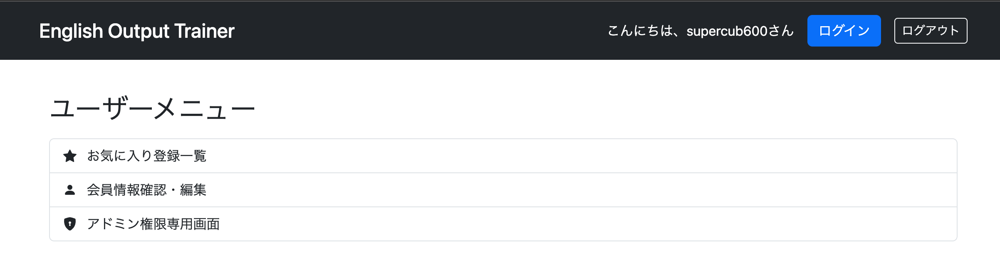
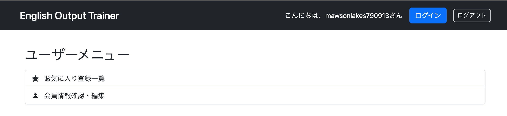

# 認可の実装 Step 2 画面表示の認可
URLの認可を設定しただけでは、すべてのユーザーのメニューに「アドミン専用」のリンクが表示されたままになる。この状態では、権限を持たない一般ユーザーがリンクをクリックするたびにエラー画面が表示されてしまい、ユーザーにとって非常に不親切な設計（ユーザー体験の低下）と言える。

今回は、ログインしているユーザーのロール（権限）を判定し、権限がない場合には画面項目そのものを表示しないように、修正する。

# 画面表示項目の認可
画面表示項目の認可は、Thymeleafの画面で設定する。ログイン後に表示されるページ(userMenu.html)で、アドミン権限専用画面へのリンクに認可を設定する。

<html xmlns:th="http://www.thymeleaf.org"
	  xmlns:layout="http://www.ultraq.net.nz/thymeleaf/layout"
      layout:decorate="~{layout/layout}"
      xmlns:sec="http://www.thymeleaf.org/extras/spring-security"> ←これを追加する
<head>
...(中略)...
<a th:href="@{/admin}" 
	class="list-group-item list-group-item-action"
	sec:authorize="hasRole('ROLE_ADMIN')">　←これを追加
	<i class="bi bi-shield-lock-fill me-2"></i>
	アドミン権限専用画面
</a>

## sec:authorize属性

権限によって画面に項目を表示するかどうかは、sec:authorize属性を使用。この属性内でhasRole()メソッドなどを呼び出し、引数にロール名を指定する。
ログインユーザーがそのロールを持っていれば、項目が表示される。

また、#authorizationオブジェクトを使い、以下のように記述しても、項目の表示／非表示を切り替えられる。

#authorizationを使った場合の例
th:if="${#authorization.expression('hasRole(''ROLE_ADMIN'')')}">`

# 実行
Spring Bootを実行して、ログイン後表示されるメニュー画面を参照する。どのユーザーでログインするかで、実行結果が異なる。

- 管理者権限（ROLE_ADMIN）でログインした場合：「アドミン専用」リンクが表示される
- 一般権限（ROLE_GENERAL）でログインした場合：「アドミン専用」リンクがHTMLソースごと削除され、表示されなくなる

## 所感
この実装そのものは容易であった。ここに至るまでのセキュリティ実装が大変だったがその分セキュリティの地盤が固まっているのであとは枝としてのthymeleaf文法を付け足しするだけで再現ができた。URLの認可が「アクセスできるかどうか」を制御するのに対し、画面表示の認可は「そもそも見せるかどうか」を制御する点が特徴だということも目に見えてわかった。

## 次やること
メソッドの認可