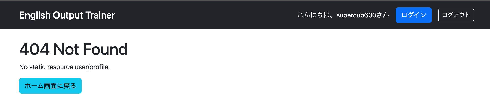

# 共通エラー画面

## 概要

これまで作成してきたアプリケーションでは、バリデーションなどでエラーメッセージを表示して元の画面へ戻す仕組みを実装しているケースを除き、例外が発生するとSpring Boot標準の**Whitelabel Error Page**が表示される。

Whitelabel Error Pageをそのまま利用することには、次のような問題がある。

- 詳細なエラー情報が表示されることがあり、セキュリティ上のリスクとなる
- ユーザーが次に何をすればよいか分からない
- アプリケーション全体のデザインと統一感がない

そこで、アプリケーション共通で利用する**共通エラー画面**を作成する。エラー発生時でもホーム画面へ戻れるようにし、ユーザーが操作を継続できるようにする。

---

# 共通エラー画面の作成

## error.html

`src/main/resources/templates` 配下に **error.html** を作成する。

Spring Bootでは、この場所に`error.html`を配置するだけで、アプリケーション共通のエラー画面として自動的に認識される。

```html
<body>
    <div layout:fragment="content">
        <h1 th:text="${status} + ' ' + ${error}"></h1>
        <p th:text="${message}"></p>

        <a th:href="@{/}"
           class="btn btn-info">
            ホーム画面に戻る
        </a>
    </div>
</body>
```

> **ポイント**
>
> レイアウト機能（Layout Dialect）を利用している場合は、コンテンツを`layout:fragment="content"`で囲む必要がある。
> 囲まないと、レイアウトは表示されてもエラー内容が表示されない。

---

# エラー情報の取得

エラー発生時には、Spring Bootがエラー情報を自動的にModelへ格納する。

そのため、コントローラー側でエラー情報を追加する必要はなく、Thymeleafから直接取得できる。

| 変数 | 内容 |
|------|------|
| `${status}` | HTTPステータスコード |
| `${error}` | HTTPエラー概要 |
| `${message}` | エラーメッセージ |

### 表示例

```html
<h1 th:text="${status} + ' ' + ${error}"></h1>
<p th:text="${message}"></p>
```

例

```text
404 Not Found
No static resource user/profile.
```

---

# 動作確認

Spring Bootを起動し、ログイン後にユーザーメニューから未実装の画面へアクセスする。

```
http://localhost:8080/user/login
```

↓

```
http://localhost:8080/user/profile
```

現時点では`/user/profile`に対応するControllerやHTMLを作成していないため404エラーとなる。

作成した共通エラー画面が表示され、エラー内容とホーム画面へ戻るボタンが表示されれば成功である。



---

# 所感

Spring Bootでは、`templates/error.html`を配置するだけで共通エラー画面として利用されるため、非常に少ない実装でユーザー向けのエラーページを用意できることが分かった。

また、`status`や`message`などのエラー情報はSpring Bootが自動で提供してくれるため、コントローラー側で個別にエラー情報を設定する必要がない点も便利である。

さらに、Layout Dialectを利用している場合は、`layout:fragment="content"`を記述しなければエラー内容が表示されず、ヘッダーだけが表示される現象が発生することも確認できた。この点は今後レイアウトを利用する画面を作成する際にも注意したい。

---

# 次にやること

- HTTPエラーごとのエラー画面の実装