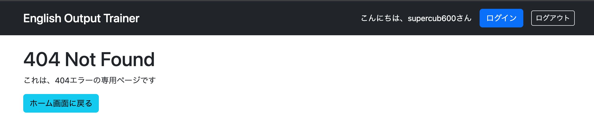

# HTTPエラーごとのエラー画面

## 概要

Spring Bootでは、アプリケーション共通のエラー画面だけでなく、**HTTPステータスコードごとの専用エラー画面**も簡単に作成できる。

今回は、存在しないURLへアクセスした際に発生する**404（Not Found）エラー**専用の画面を作成する。

404エラーは、次のような場合に発生する。

- 定義されていないURLへアクセスした場合
- 存在しないデータ（ユーザーなど）を表示しようとした場合

共通エラー画面とは別に専用画面を用意することで、エラー内容に応じた分かりやすい案内を表示できるようになる。

---

# HTTPレスポンスとステータスコード

ブラウザからHTTPリクエストを送信すると、サーバーはHTTPレスポンスを返す。

HTTPレスポンスには、リクエストの結果を表す**HTTPステータスコード**が含まれている。

## よく利用されるHTTPステータスコード

| HTTPステータスコード | 説明 |
|----------------------|------|
| 200 | リクエスト正常終了 |
| 403 | アクセス禁止（権限不足など） |
| 404 | リクエスト先のURLが存在しない |
| 500 | サーバー内部でエラーが発生 |

### ポイント

- **200番台**：正常終了
- **400番台**：クライアント（ブラウザ）側のエラー
- **500番台**：サーバー（プログラム）側のエラー

---

# HTTPエラーごとの画面作成

HTTPステータスコードごとの専用画面は、

```
src/main/resources/templates/error
```

配下にHTMLファイルを配置するだけで利用できる。

このとき、**ファイル名をHTTPステータスコードと同じ名前にする**ことがルールである。

例

```
templates
└── error
    ├── 403.html
    ├── 404.html
    └── 500.html
```

今回は404エラー用として

```
404.html
```

を作成した。

---

# 404エラー画面の作成

```html
<body>
    <div layout:fragment="content">

        <h1 th:text="${status} + ' ' + ${error}"></h1>

        <p>
            これは、404エラーの専用ページです
        </p>

        <a th:href="@{/user/list}"
           class="btn btn-info">
            ホーム画面に戻る
        </a>

    </div>
</body>
```

### ポイント

- `templates/error/404.html`に配置するだけで404エラー専用画面として認識される。
- 共通レイアウトを利用している場合は、`layout:fragment="content"`で囲む必要がある。
- 共通エラー画面（`error.html`）よりも404専用画面が優先して表示される。

---

# 動作確認

Spring Bootを起動し、存在しないURLへアクセスする。

```
http://localhost:8080/hoge
```

URLが存在しないため404エラーが発生する。

作成した404専用エラー画面が表示されれば成功である。



---

# 所感

Spring Bootでは、`templates/error`配下にHTTPステータスコード名のHTMLファイルを配置するだけで、HTTPエラーごとの専用画面を作成できることが分かった。

また、共通エラー画面とHTTPエラー専用画面は役割が異なり、404エラーのようによく発生するエラーには専用画面を用意することで、ユーザーにより分かりやすいメッセージを提供できる。

この仕組みは実装が非常に簡単でありながら、ユーザー体験の向上やエラー原因の把握に役立つため、実際のWebアプリケーションでも積極的に活用したい。

---

# 次にやること

- 403・500など、404以外のHTTPエラー画面の作成（時間があれば）
- ユーザーメニュー内の未実装ページの実装
  - 会員情報確認・編集
  - お気に入り登録一覧