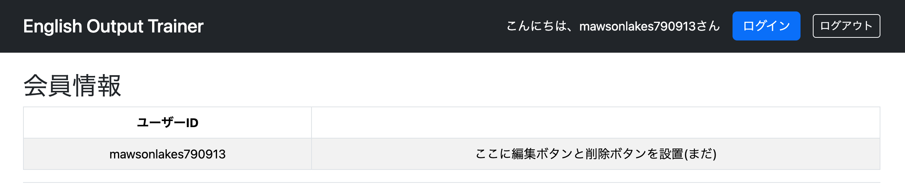

# 029 会員情報確認ページの実装①

## 概要

ログイン後のユーザーメニューには「会員情報確認・編集」が存在するが、現時点では未実装である。

まずは、このメニューをクリックすると、**現在ログイン中のアカウントのユーザーID**を表示するページを実装する。

---

# UserMenuController.javaを修正

プロフィール画面では、ログイン中のユーザーの情報を表示する必要がある。そのため、Spring Securityからログインユーザーを取得し、そのユーザーIDを利用してデータベースから最新のユーザー情報を取得する。

```java
@GetMapping("/user/profile")
public String getUserProfile(
        @AuthenticationPrincipal UserDetails loginUser,
        Model model) {

    Users user = userServiceImpl.getUserOne(loginUser.getUsername());

    model.addAttribute("user", user);

    return "user/profile";
}
```

## `@AuthenticationPrincipal`とは

`@AuthenticationPrincipal`を付与すると、Spring Securityが現在ログイン中のユーザー情報を引数へ自動的に渡してくれる。

ここで引数の型は`UserDetails`となっているが、実際に格納されているオブジェクトはSpring Security標準の`User`クラスである。

これは、`UserDetailsServiceImpl`でログイン成功時に次のような`User`オブジェクトを生成して返しているためである。

```java
UserDetails userDetails = new User(
        loginUser.getUserId(),
        loginUser.getPassword(),
        authorities);

return userDetails;
```

`User`クラスは`UserDetails`インターフェースを実装しているため、

```java
@AuthenticationPrincipal UserDetails loginUser
```

として受け取ることができる。

`User`クラスの`getUsername()`はログイン時のユーザーIDを返すため、

```java
loginUser.getUsername()
```

によって現在ログイン中のユーザーIDを取得できる。

取得したユーザーIDを引数として

```java
Users user = userServiceImpl.getUserOne(loginUser.getUsername());
```

を実行し、データベースから最新のユーザー情報を取得する。

取得した`Users`エンティティを

```java
model.addAttribute("user", user);
```

でModelへ格納することで、ビューでは

```html
${user.userId}
${user.role}
```

のようにユーザー情報を表示できる。

プロフィール画面では、セッション内の情報をそのまま利用するのではなく、ログインユーザーのユーザーIDを利用してデータベースから最新の情報を取得する設計とした。

---

## Spring Securityの認証情報が保持される流れ

### ① ログイン画面

ユーザーがユーザーIDとパスワードを入力する。

```text
userId = tanaka
password = 1234
```

↓

### ② Spring Securityが`loadUserByUsername()`を呼び出す

```java
@Override
public UserDetails loadUserByUsername(String userId)
```

ここで渡されるのは**ユーザーIDのみ**である。

↓

### ③ データベースからユーザー情報を取得する

```java
Users loginUser = service.getUserOne(userId);
```

これは実質的に

```sql
SELECT *
FROM users
WHERE user_id = 'tanaka';
```

を実行しているイメージである。

取得されるのは`Users`エンティティであり、

- userId
- password
- role
- userName
- ...

など、そのユーザーに関するすべての情報を保持している。

※この時点ではまだ認証は完了していない。

↓

### ④ Spring Security標準の`User`オブジェクトを生成する

```java
UserDetails userDetails = new User(
        loginUser.getUserId(),
        loginUser.getPassword(),
        authorities);

return userDetails;
```

ここでSpring Security標準の`User`オブジェクトが生成される。

↓

### ⑤ Spring Securityが`User`をログインユーザーとして保持する

返却された`User`オブジェクトをSpring Securityが保持し、以降のリクエストでは

```java
@AuthenticationPrincipal UserDetails loginUser
```

として取得できるようになる。

---

# `UserDetails`を実装した独自クラスを使うケース

今回はSpring Security標準の`User`クラスを使用した。

このクラスが保持できる情報は以下の3つである。

- ユーザーID
- パスワード
- ロール（権限）

そのため、ログインユーザーのユーザーIDを取得するだけであれば、標準の`User`クラスで十分である。

一方、ログインユーザーに関するより多くの情報をセッション上で保持したい場合は、`UserDetails`を実装した独自クラスを作成する方法もある。

例えば、`UserDetailsForm`を作成し、

- ユーザー名
- メールアドレス
- 年齢
- アイコン画像
- 登録日時

などを保持できるようにする。

```java
public class UserDetailsForm implements UserDetails {

    private Users users;

    public UserDetailsForm(Users users) {
        this.users = users;
    }
}
```

`UserDetailsServiceImpl`では、

```java
return new UserDetailsForm(loginUser);
```

を返すように変更する。

するとControllerでは

```java
@AuthenticationPrincipal UserDetailsForm loginUser
```

として受け取ることができ、

```java
loginUser.getUserName();
loginUser.getEmail();
loginUser.getAge();
```

のように、自分で追加した情報を利用できる。

### `new UserDetailsForm(loginUser)`だけで情報を保持できる理由

```java
public UserDetailsForm(Users users) {
    this.users = users;
}
```

コンストラクタ内の

```java
this.users = users;
```

は、`Users`オブジェクトへの**参照**を代入しているだけである。

そのため、

```java
this.users.getUserId();
```

と

```java
loginUser.getUserId();
```

は同じ値を返す。

つまり、`Users`エンティティが保持している

- userId
- password
- role
- userName
- age
- email
- ...

などの情報をすべて`this.users`経由で利用できる。

ただし、セッション内の情報はログイン時点の内容であるため、ログイン後にユーザー情報が更新されても自動では反映されない。

そのため、プロフィール画面のように常に最新の情報を表示したい画面では、今回のようにユーザーIDを取得してデータベースから最新の情報を取得する方法が一般的である。

---

# user/profile.htmlを実装

Controllerで取得した`Users`エンティティを利用し、ログイン中のユーザーIDを表示する画面を作成する。

プロフィール画面ではユーザーは1件のみ表示するため、一覧表示のような`th:each`は使用せず、

```html
${user.userId}
```

でユーザーIDを表示する。

---

# 実行

ログイン後、「ユーザーメニュー」→「会員情報確認・編集」をクリックすると、現在ログインしているユーザーのユーザーIDが表示されるようになった。



---

# 所感

今回の実装では、Spring Securityがログインユーザーをどのように保持し、Controllerで取得できるようになるのかを理解できた。また、プロフィール画面ではセッション内の情報を直接利用するのではなく、ログインユーザーのユーザーIDをもとにデータベースから最新の情報を取得する設計の理由についても理解が深まった。

さらに、Spring Security標準の`User`クラスと、`UserDetails`を実装した独自クラスの違い、および独自クラスでは`Users`エンティティを参照として保持することで、ログインユーザーの詳細情報を柔軟に扱えることも理解できた。

---

# 次やること

- ユーザーID編集機能の実装
- パスワード変更機能の実装
- アカウント削除機能の実装
```