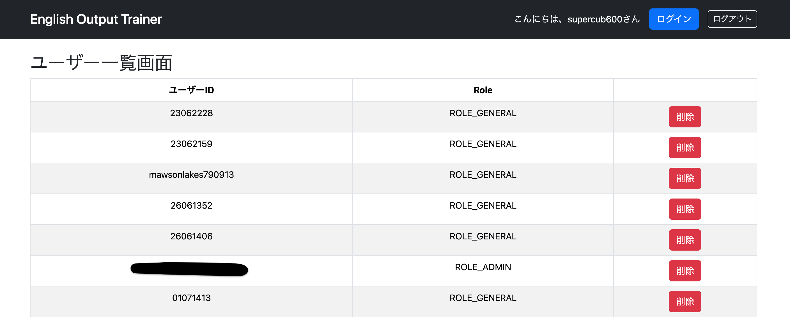
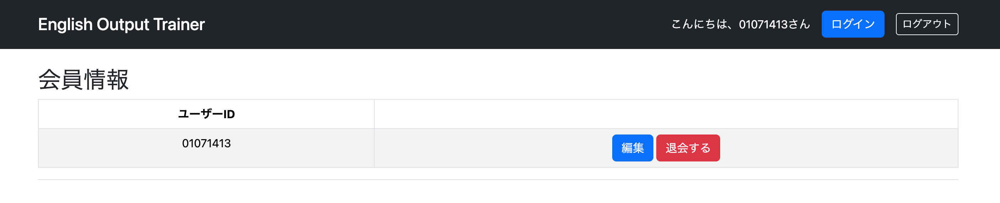
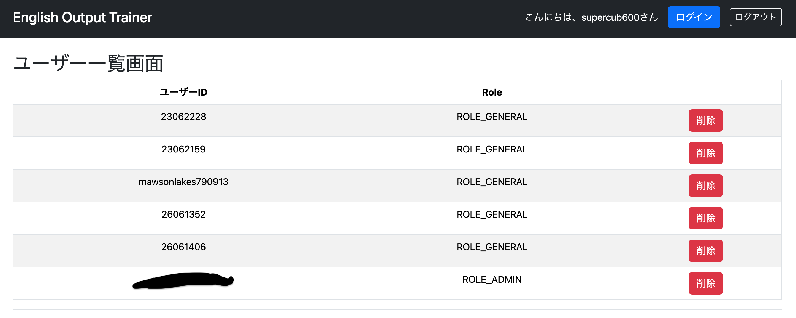
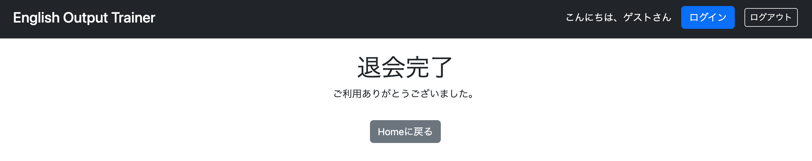

# 030 退会機能の追加

## 概要

現在はアドミン画面から指定したアカウントを削除できるようになっているが、ユーザー自身も自分のアカウントを削除（退会）できるようにする。

具体的には、ログイン後の会員情報確認・編集ページに「退会する」ボタンを追加し、自身のアカウントを削除できるようにする。

今回は「本当に削除しますか？」のような確認ダイアログは実装しない。

---

# user/profile.htmlの修正

## 退会ボタンを追加

```html
<table class="table table-striped table-bordered table-hover">
    <thead>
        <tr>
            <th>ユーザーID</th>
            <th></th>
        </tr>
    </thead>
    <tbody>
        <tr>
            <td th:text="${user.userId}"></td>
            <td>
                <a th:href="@{/user/detail}" class="btn btn-primary me-2">
                    編集
                </a>

                <form th:action="@{/user/delete}"
                      method="post"
                      class="d-inline">
                    <button type="submit"
                            class="btn btn-danger">
                        退会する
                    </button>
                </form>
            </td>
        </tr>
    </tbody>
</table>
```

### なぜ退会ボタンは`<form>`なのか

退会はデータを削除する処理であり、サーバーの状態を変更する。

そのため、GETではなくPOSTでリクエストを送信する必要がある。

`<a>`タグは画面遷移（GET）のためのタグであり、削除や更新などの処理には適さない。

---

# UserMenuController.javaの修正

## 退会処理を追加

```java
@PostMapping("/user/delete")
public String cancelMembership(
        @AuthenticationPrincipal UserDetails loginUser,
        HttpServletRequest request)
        throws ServletException {

    userServiceImpl.cancelMembership(loginUser.getUsername());

    request.logout();

    return "redirect:/login";
}
```

### `request.logout()`

現在のログイン状態を終了（ログアウト）するメソッド。

`logout()`は`HttpServletRequest`のメソッドであるため、Controllerの引数で`HttpServletRequest`を受け取る必要がある。

---

# UserServiceImpl.javaの修正

```java
// 指定したユーザー削除（会員用）
@Transactional
public void cancelMembership(String userId) {
    repository.deleteById(userId);
    log.info("削除対象={}", userId);
}
```

### deleteUserOne()を使わない理由

既に管理者用の

```java
deleteUserOne()
```

が存在するが、

こちらには

```java
@PreAuthorize("hasRole('ROLE_ADMIN')")
```

が付与されているため、一般ユーザーは利用できない。

そのため、会員自身が退会するための専用メソッドを用意した。

---

# 実行

1. ユーザーID「01071413」を新規登録する。
2. 管理者画面から登録されていることを確認する。




3. 「01071413」でログインし、退会ボタンを押す。



4. ログイン画面へ戻ることを確認する。
5. 管理者画面からアカウントが削除されていることを確認する。




---

# 退会完了ページの追加

退会後に直接ログイン画面へ戻るだけでは、本当に退会できたのか利用者には分かりにくい。

そこで、

「退会しました。ご利用ありがとうございました。」

というメッセージを表示する画面を追加する。

---

# user/canceled.htmlを追加

```html
<body>
    <div class="text-center"
         layout:fragment="content">

        <h1>退会完了</h1>

        <p>ご利用ありがとうございました。</p>

        <a th:href="@{/}"
           class="btn btn-secondary mt-3">
            Homeに戻る
        </a>

    </div>
</body>
```

---

# UserMenuController.javaの修正

## 退会完了画面

```java
@GetMapping("/user/canceled")
public String getCanceled() {
    return "user/canceled";
}
```

## 退会処理

```java
@PostMapping("/user/delete")
public String cancelMembership(
        @AuthenticationPrincipal UserDetails loginUser,
        HttpServletRequest request)
        throws ServletException {

    userServiceImpl.cancelMembership(loginUser.getUsername());

    request.logout();

    return "redirect:/user/canceled";
}
```

---

# 実行

再度アカウントを登録し、退会を試す。

しかし、退会完了画面ではなく、再びログイン画面へ戻ってしまった。

---

# なぜログイン画面へ戻ってしまったのか

当初は、

```java
request.logout();
```

を実行したことにより、Spring Securityのログアウト処理が優先され、ログイン画面へリダイレクトされているのではないかと考えた。

しかし、実際に確認すると、遷移先は

```
/login?logout
```

ではなく

```
/login
```

であった。

このことから、ログアウト成功時の遷移設定が原因ではないことが分かった。

処理の流れを整理すると、

```text
退会ボタン押下
        ↓
アカウント削除
        ↓
ログアウト
        ↓
user/canceledへリダイレクト
```

となっている。

ここで重要なのは、

**ログアウトした時点で利用者は未認証状態になる**

という点である。

そのため、

`user/canceled`

へのアクセスにも認証が必要な設定になっている場合、その画面を表示することができない。

Spring Securityでは、未認証ユーザーが認証必須ページへアクセスすると、自動的にログイン画面へリダイレクトされる。

つまり、ログイン画面へ戻ってしまった原因は、

**退会完了画面そのものではなく、未認証状態では退会完了画面へアクセスできなかったこと**

にあった。

---

# 修正

## SecurityConfig.java

```java
.requestMatchers("/user/canceled").permitAll()
```

を追加する。

```java
http.authorizeHttpRequests(authorize -> authorize
        .requestMatchers(
                PathRequest.toStaticResources().atCommonLocations()
        ).permitAll()
        .requestMatchers("/").permitAll()
        .requestMatchers("/login").permitAll()
        .requestMatchers("/study", "/study/**").permitAll()
        .requestMatchers("/signup", "/signup/**").permitAll()
        .requestMatchers("/complete").permitAll()
        .requestMatchers("/user/canceled").permitAll()
        .requestMatchers("/admin").hasAuthority("ROLE_ADMIN")
        .anyRequest().authenticated()
);
```

---

# 実行

再度新規登録したアカウントで退会を行う。

今度は退会完了画面へ正常に遷移することを確認できた。



---

# 所感

今回の不具合の原因は、Spring Securityの認証設定の見落としであった。

プログラムの規模が大きくなるにつれて、自分自身が実装した設定であっても把握しきれなくなる場面が増えてくることを実感した。

今回のように、

- 実際の遷移先URLを確認する
- 処理の流れを整理する
- 一つずつ原因を切り分ける

というデバッグの進め方は非常に重要であると感じた。

また、今回は会員情報変更ではなく退会機能を先に実装した。

その理由は、現在のDB設計ではユーザーIDを主キーとしており、ユーザーIDを変更すると主キーまで変更することになってしまうためである。

主キーには内部で管理する一意の番号を使用する設計へ変更してから会員情報変更を実装した方が安全であると判断した。

一方、退会機能は現在のDB設計でも問題なく実装できるため、先に実装を行った。

---

# 次にやること

- DB設計の見直し
    - 主キーをユーザーIDから内部管理用の連番（ID）へ変更する
- 会員情報変更機能の実装