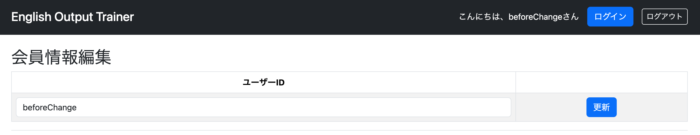
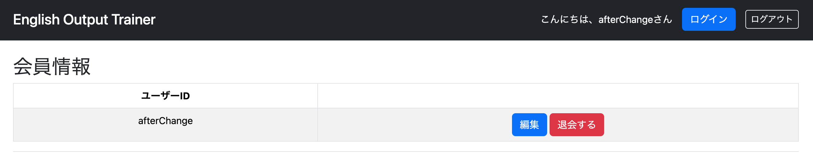

# 会員情報変更の実装

ここでは、ログイン中のユーザーが自身のユーザーIDを変更できる機能を実装する。

しかし、前節でも触れたように、現状のDB設計のままこの機能を実装するのは適切ではない。

その理由は、現在のユーザー情報テーブルではユーザーIDを主キーとして使用しているためである。主キーはレコードを一意に識別するための値であり、基本的には変更されないことを前提として設計される。そのため、ユーザーIDを自由に変更できるようにすると、データの整合性や保守性の面で問題が生じる可能性がある。

そこで、会員情報変更機能を実装する前に、まずDB設計を見直す。

具体的には、主キーをユーザーIDから、アプリケーション内部でのみ管理する連番のID（利用者が直接変更・操作することのない値）へ変更する。また、この変更に合わせてエンティティクラスも修正する。

DBとエンティティクラスの修正が完了したら、その新しい設計を前提として、会員情報変更機能の実装を進めていく。
##　準備編 \### usersテーブル再設計 CREATE TABLE users ( id BIGSERIAL
PRIMARY KEY, user_id VARCHAR(50) NOT NULL UNIQUE, password VARCHAR(255)
NOT NULL, role VARCHAR(20) NOT NULL );

#### BIGSERIAL

PostgreSQLで「自動採番される64ビット整数」を表すデータ型。
一番簡単に言うと、レコードを追加するたびに、自動で1, 2,
3...と番号を振ってくれる型

usersテーブルの一部を外部キーにしていた下記2つのテーブルも修正 \###
favoritesテーブル 修正前 CREATE TABLE favorites ( user_id VARCHAR(20)
NOT NULL, question_id BIGINT NOT NULL,

    PRIMARY KEY (user_id, question_id),

    CONSTRAINT fk_favorites_user
        FOREIGN KEY (user_id)
        REFERENCES users(user_id),

    CONSTRAINT fk_favorites_question
        FOREIGN KEY (question_id)
        REFERENCES question(question_id)

);

修正後 CREATE TABLE favorites ( user_id BIGINT NOT NULL, question_id
BIGINT NOT NULL,

    PRIMARY KEY (user_id, question_id),

    CONSTRAINT fk_favorites_user
        FOREIGN KEY (user_id)
        REFERENCES users(id),

    CONSTRAINT fk_favorites_question
        FOREIGN KEY (question_id)
        REFERENCES question(question_id)

);

### study_historyテーブル

修正前 CREATE TABLE study_history ( user_id VARCHAR(20) NOT NULL,
question_id BIGINT NOT NULL, evaluation VARCHAR(10) NOT NULL,
last_studied_at TIMESTAMP NOT NULL,

    PRIMARY KEY (user_id, question_id),

    CONSTRAINT fk_study_history_user
        FOREIGN KEY (user_id)
        REFERENCES users(user_id),

    CONSTRAINT fk_study_history_question
        FOREIGN KEY (question_id)
        REFERENCES question(question_id)

);

修正後 CREATE TABLE study_history ( user_id BIGINT NOT NULL, question_id
BIGINT NOT NULL, evaluation VARCHAR(10) NOT NULL, last_studied_at
TIMESTAMP NOT NULL,

    PRIMARY KEY (user_id, question_id),

    CONSTRAINT fk_study_history_user
        FOREIGN KEY (user_id)
        REFERENCES users(id),

    CONSTRAINT fk_study_history_question
        FOREIGN KEY (question_id)
        REFERENCES question(question_id)

);

### 管理者ユーザーを再登録

INSERT INTO users (user_id, password, role) VALUES (
'mawsonlakes790913', 'xxxx', 'ROLE_ADMIN' );

#### ハッシュ化したパスワードを取得

現アプリケーションはハッシュ化したパスワードしか使えないので、新たにデータをinsertする際もパスワードをハッシュ化して入力する必要がある。

どこでもいいので以下のコードを書いて取得しておく PasswordEncoder encoder
= new BCryptPasswordEncoder();

System.out.println(encoder.encode("xxxx"));

### Java側の修正

#### エンティティクラスUsers

@Data @Entity @Table(name = "users") public class Users {

    @Id
    @GeneratedValue(strategy = GenerationType.IDENTITY)
    private Long id;

    private String userId;

    private String password;

    private String role;

}

##### @GeneratedValue(strategy = GenerationType.IDENTITY)

@GeneratedValueは「主キーの値は自動で生成してください」という意味である。
しかし、@GeneratedValueだけでは足りず、「自動生成するのは分かった。でも、どうやって？」となる。
そこでstrategy = ...で生成方法を指定する。
今回使っているGenerationType.IDENTITYは「DBの自動採番機能を使ってください」という意味である。

畢竟するに
GenerationType.IDENTITY「主キーの値はIDENTITY方式で生成してください。」
strategy =
GenerationType.IDENTITY「主キーの生成方法はIDENTITY方式にしてください。」
@GeneratedValue(strategy =
GenerationType.IDENTITY)「主キーの値はIDENTITY方式で自動生成してください。」
という意味

##### @Columnアノテーションの有無

    @Column(name = "user_id", nullable = false, unique = true)
    private String userId;

    @Column(nullable = false)
    private String password;

    @Column(nullable = false)
    private String role;

のように@Columnアノテーションをつけてもいい。 これは、、、
今回はつけていないのは、、、、

#### UserRepository.javaを修正

修正前 public interface UserRepository extends JpaRepository\<Users,
String\> { }

修正後 public interface UserRepository extends JpaRepository\<Users,
Long\> { Optional`<Users>`{=html} findByUserId(String userId);

    boolean existsByUserId(String userId);

    void deleteByUserId(String userId);

}

##### JpaRepositoryのジェネリクス

主キーの型がBIGINTに変わっている。これはJavaのLongに相当するので変更する。

##### findByUserIdメソッドの追加

今まで使っていたfindById、existsById,
deleteByIdメソッドは、JpaRepositoryにあらかじめ定義されているため、UserRepositoryに記述しなくても利用できた。
一方、今回使用するfind(exists,
delete)ByUserIdメソッドはJpaRepositoryには定義されていない。そのため、UserRepositoryにメソッドを宣言する必要がある。
ただし、これは宣言だけでよい。Spring Data
JPAはメソッド名を解析し、「userId列を条件に検索するメソッド」であると判断して、自動的に実装を生成してくれる。
そのため、SQLを書いたり、メソッド本体を実装したりする必要はない。

#### findByIdを呼んでいたServiceクラスを修正

findById→ findByUserId existsById→ existsByUserId deleteById→
deleteByUserId

## 実装編

### EditFormを作る

新規登録とは違い今回入力する対象はユーザーIDだけなので、「編集用のForm」を作ったほうがいい

EditForm.java

@Data public class EditForm { @NotBlank @Length(min = 8, max = 20)
@Pattern( regexp = "[^1]+\$") private String userId; }

### ServiceにupdateUserIdメソッドを作る

UserServiceImpl.java

    @Transactional
    public void updateUserId(String currentUserId, String newUserId) {

        // 新しいユーザーIDが既に使われているか確認
        boolean isExists = repository.existsByUserId(newUserId);
        if (isExists) {
            throw new DuplicateKeyException("既に存在するユーザーです");
        }
        // 現在のユーザーを取得
        Users user = getUserOne(currentUserId);
        if (user == null) {
            throw new IllegalArgumentException("ユーザーが存在しません");
        }

        // userIdだけ変更
        user.setUserId(newUserId);

        // 更新
        repository.save(user);

    }

#### ユーザーIDの更新処理

``` java
user.setUserId(newUserId);
```

取得した`Users`オブジェクトの`userId`プロパティを書き換えている。

この時点では、**Javaオブジェクトの値が変更されただけ**であり、まだデータベースの内容は更新されていない。

例えば、

    更新前：beforeChange

だったユーザーに対して

``` java
user.setUserId("new01072310");
```

を実行すると、`Users`オブジェクトの`userId`は

    更新後：afterChange

となる。その後、

``` java
repository.save(user);
```

で、変更した`Users`オブジェクトをデータベースへ保存する。

これにより、先ほど`setUserId()`で変更した内容がデータベースへ反映される。

今回変更しているのは`userId`だけなので、更新されるのはユーザーIDのみであり、それ以外の項目（ユーザー名・パスワード・年齢など）はそのまま保持される。

なお、`save()`は新規登録（INSERT）だけでなく、既に存在するデータの更新（UPDATE）にも使用されるメソッドである。

### GETで現在の値をフォームへ入れる

    @GetMapping("/user/edit")
    public String getUserEdit(
            @AuthenticationPrincipal UserDetails loginUser,
            Model model,
            @ModelAttribute EditForm form) {

        if (form.getUserId() == null) {
            Users user = userServiceImpl.getUserOne(loginUser.getUsername());
            form.setUserId(user.getUserId());
        }

        return "user/edit";
    }

#### 初回アクセス時

初めて`/user/edit`へアクセスしたときは、`@ModelAttribute`によって新しい`EditForm`オブジェクトが生成される。

この時点では`userId`には何もセットされていないため、

``` java
form.getUserId() == null
```

となり、`if`文は必ず実行される。

そのため、ログイン中のユーザー情報をデータベースから取得し、

``` java
Users user = userServiceImpl.getUserOne(loginUser.getUsername());
form.setUserId(user.getUserId());
```

によって、現在のユーザーIDがフォームへセットされる。

これにより、編集画面を開いたときに現在のユーザーIDが最初から表示される。

------------------------------------------------------------------------

#### 入力エラーで画面を再表示する場合

入力チェックエラーなどで再びこのGETメソッドが呼ばれる場合は、POSTで使用していた`EditForm`がそのまま渡される。

このときは既に`userId`へユーザーが入力した値が入っているため、

``` java
form.getUserId() == null
```

は`false`となる。

そのためデータベースから現在のユーザーIDを取得し直すことはなく、ユーザーが入力した値をそのまま画面へ表示できる。

この`if`文は、

-   初回表示では現在のユーザーIDをフォームへセットする
-   入力エラー時はユーザーが入力した値を保持する

という2つの役割を持っている。

ポイントはUsersをそのまま画面へ渡すのではなく、EditFormへコピーすることである。

#### 一旦Usersを介する理由

userServiceImpl.getUserOneの戻り値がUsersだから

### user/edit.html

```{=html}
<body>
```
```{=html}
<div layout:fragment="content">
```
        <div class="header border-bottom">
            <h1 class="h2">会員情報編集</h1>
            <!-- 一覧表示 -->
            <div>
                <form th:action="@{/user/edit}"
                      th:object="${editForm}"
                      method="post">
                
                    <table class="table table-striped table-bordered table-hover text-center align-items-center">
                
                        <thead>
                            <tr>
                                <th>ユーザーID</th>
                                <th></th>
                            </tr>
                        </thead>
                
                        <tbody>
                            <tr>
                                <td>
                                    <input type="text"
                                           th:field="*{userId}"
                                           th:errorclass="is-invalid"
                                           class="form-control">
                
                                    <div class="invalid-feedback"
                                         th:errors="*{userId}">
                                    </div>
                                </td>
                
                                <td class="text-center">
                                    <button type="submit"
                                            class="btn btn-primary">
                                        更新
                                    </button>
                                </td>
                            </tr>
                        </tbody>
                
                    </table>
                
                </form>
            </div>
        </div>
    </div>

```{=html}
</body>
```
それぞれの役割 th:field="*{userId}" EditForm.userIdとバインドする。
th:errorclass="is-invalid"
バリデーションエラーがある場合だけis-invalidクラスを付与する(Bootstrapでは赤枠表示になる)。
th:errors="*{userId}" userIdに対するエラーメッセージを表示する。

#### `<form>`を最も外側に配置する理由

今回の画面では、ユーザーIDの入力欄と「更新」ボタンをまとめて送信したい。

そのため、入力項目と送信ボタンをすべて`<form>`タグで囲んでいる。

``` html
<form th:action="@{/user/edit}"
      th:object="${editForm}"
      method="post">

    <!-- 入力欄 -->
    <input type="text" th:field="*{userId}">

    <!-- 更新ボタン -->
    <button type="submit">更新</button>

</form>
```

------------------------------------------------------------------------

##### なぜ外側に書くのか

`<form>`タグの中にある入力項目だけが、送信ボタンを押したときにサーバーへ送信される。

そのため、

-   ユーザーIDの入力欄
-   エラーメッセージの表示
-   更新ボタン

など、送信に関係する要素をすべて`<form>`の内側へ配置する必要がある。

------------------------------------------------------------------------

### テーブル全体を囲む理由

今回の入力フォームはテーブル形式で作成している。

``` html
<form>
    <table>
        ...
    </table>
</form>
```

としておけば、テーブル内の入力欄やボタンがすべて同じフォームに属する。

もし`<form>`をテーブルの内側に配置してしまうと、HTMLの構造が複雑になったり、入力項目やボタンがフォームの外に出てしまう可能性がある。

そのため、**フォーム全体（テーブル全体）を`<form>`で囲む**のが一般的な書き方である。

### UserMenuController

ここは、新規登録のpostSignup()とほぼ同じ構成になる。

    @PostMapping("/user/edit")
    public String postUserEdit(
            @AuthenticationPrincipal UserDetails loginUser,
            HttpSession session,
            Model model,
            @Validated @ModelAttribute EditForm form,
            BindingResult bindingResult) {

        if (bindingResult.hasErrors()) {
            return getUserEdit(loginUser, model, form);
        }

        try {
            userServiceImpl.updateUserId(
                    loginUser.getUsername(),
                    form.getUserId());

        } catch (DuplicateKeyException e) {

            bindingResult.rejectValue(
                    "userId",
                    "duplicate",
                    e.getMessage());

            return getUserEdit(loginUser, model, form);
        }

        // ★ここでログアウト状態にする
        SecurityContextHolder.clearContext();
        session.invalidate();

        return "redirect:/login";
    }

#### `bindingResult.rejectValue()`とは

``` java
bindingResult.rejectValue(
        "userId",
        "duplicate",
        e.getMessage());
```

`BindingResult`へ**特定の項目（フィールド）のエラー情報を追加するメソッド**である。

今回は`DuplicateKeyException`が発生した場合、「入力したユーザーIDは既に使用されています」というエラーを`userId`項目に紐付けて登録している。

------------------------------------------------------------------------

##### 第1引数 `"userId"`

``` java
"userId"
```

エラーを付与するフォームの項目名を指定する。

今回は`EditForm`の

``` java
private String userId;
```

に対してエラーを登録している。

------------------------------------------------------------------------

##### 第2引数 `"duplicate"`

``` java
"duplicate"
```

エラーコードを指定する。

Springでは、このエラーコードを利用してメッセージファイル（`messages.properties`など）からエラーメッセージを取得することもできる。

今回は第3引数でメッセージを直接渡しているため、このコードは識別用として使用されている。

------------------------------------------------------------------------

### 第3引数 `e.getMessage()`

``` java
e.getMessage()
```

実際に画面へ表示するエラーメッセージである。

`updateUserId()`では、

``` java
throw new DuplicateKeyException("既に存在するユーザーです");
```

として例外を送出しているため、

``` java
e.getMessage()
```

には

    既に存在するユーザーです

が格納される。

その結果、このメッセージが`userId`項目のエラーとして登録される。

------------------------------------------------------------------------

##### 画面への表示

HTMLでは

``` html
<input th:field="*{userId}"
       th:errorclass="is-invalid"
       class="form-control">

<div class="invalid-feedback"
     th:errors="*{userId}">
</div>
```

となっている。

`rejectValue()`で登録したエラーは

``` html
th:errors="*{userId}"
```

によって表示される。

そのため、重複したユーザーIDを入力すると、

    既に存在するユーザーです

というエラーメッセージが入力欄の下へ表示される。

#### ログアウト状態にする理由

会員情報編集機能では、ユーザーIDの変更自体は正常に成功しており、データベース上でも新しいユーザーIDへ更新されていた。

しかし、更新完了後に

``` java
return "redirect:/user/profile";
```

で会員情報画面へ遷移すると、500 Internal Server Errorが発生していた。

原因を調査するため、

``` java
System.out.println(loginUser.getUsername());
System.out.println(user);
```

を出力したところ、

``` text
loginUser.getUsername() = 01072310new
user = null
```

となっていた。

一方、データベースには既に

``` text
userId = new01072310
```

として保存されていた。

つまり、

-   データベースには**新しいユーザーID**が保存されている
-   Spring Securityは**古いユーザーID**を保持したままになっている

という状態になっていた。

Spring
Securityでは、ログイン時に認証情報（Authentication）がセッション内へ保存される。

そのため、データベースのユーザーIDを書き換えても、ログイン中の認証情報までは自動で更新されない。

その結果、

``` java
Users user =
    userServiceImpl.getUserOne(loginUser.getUsername());
```

では、

``` java
getUserOne("01072310new");
```

が実行される。

しかし、このユーザーIDは既にデータベース上には存在しないため、

``` java
Optional.empty
```

が返される。

`Optional.empty`とは、「検索結果が存在しなかったこと」を表す`Optional`オブジェクトである。

その後、

``` java
Users user = option.orElse(null);
```

が実行されるため、

``` java
user == null
```

となる。

その状態で

``` html
th:text="${user.userId}"
```

を実行すると、存在しないオブジェクト（`null`）の`userId`を取得しようとするため、Thymeleafが500
Internal Server Errorを発生させていた。

このことから、問題はユーザーID更新処理ではなく、**Spring
Securityが保持している認証情報が古いままであること**だと判断した。

そこで、ユーザーID変更後に

``` java
SecurityContextHolder.clearContext();
session.invalidate();
```

を追加した。

``` java
SecurityContextHolder.clearContext();
```

は、Spring Securityが保持している認証情報（SecurityContext）を破棄する。

また、

``` java
session.invalidate();
```

は、現在のHTTPセッションを破棄する。

これにより、古いユーザーIDを保持したままログイン状態を維持することができなくなり、ユーザーは再度ログインする必要がある。

再ログイン時には、新しいユーザーIDで認証が行われるため、

-   Spring Securityが保持するユーザーID
-   データベースに保存されているユーザーID

が一致し、正常に会員情報を取得・表示できるようになった。

今回は、**ユーザーID変更後は再ログインを要求する仕様**とすることで、認証情報とデータベースの整合性を保つことができ、500
Internal Server Errorも解消された。

## 実行(失敗)

なぜか新規登録がうまくいかない ↓の修正をすることによって解決したが、
「なぜそこを修正すると解決するのがわかったのか」
「それはどのようにログ出力して見出したのか」などの記述が欲しい

## 原因

新規登録処理では、入力フォーム(`SignupForm`)を`Users`エンティティへ変換するため、`ModelMapper`を使用していた。

``` java
Users users = modelMapper.map(form, Users.class);
```

しかし、新規登録を実行すると、新規登録完了画面へ遷移せずログイン画面へ戻り、DBにもデータが登録されなかった。

最初は`repository.save()`やJPAの処理を疑ったが、原因を切り分けるために、`repository.save()`を実行する直前で以下のログを出力し、`Users`オブジェクトの状態を確認した。

``` java
System.out.println(users);
```

その結果、`save()`を実行する前の時点で

``` text
Users(id=2070338, userId=02070338, password=0207033802070338, role=null)
```

となっており、本来`null`であるはずの`id`へ値がセットされていることが判明した。

さらに、

``` java
System.out.println("id=" + user.getId());
```

も出力したところ、

``` text
id=2070338
```

となっていた。

その後のログでは

``` text
ObjectOptimisticLockingFailureException
```

が発生しており、JPAが`id=2070338`の既存データを更新(UPDATE)しようとしたことが分かった。

JPAでは、

-   `id == null` ... INSERT（新規登録）
-   `id != null` ... UPDATE（更新）

と判断するため、新規登録にもかかわらず`UPDATE`として処理され、存在しないIDのレコードを更新しようとして例外が発生していた。

ここまでの調査により、

-   `signup()`や`repository.save()`に原因があるのではない
-   `ModelMapper.map()`で生成された`Users`オブジェクトに既に問題がある

ということをログから切り分けることができた。

その後、解決策を2通り確認した。

#### 解決策①

`ModelMapper`を使用せず、`Users`オブジェクトを手動で生成し、必要な項目だけを設定する。

``` java
Users users = new Users();

users.setUserId(form.getUserId());
users.setPassword(form.getPassword());
```

この方法では`id`へ一切値を設定しないため、`id`は`null`となり、JPAが正常にINSERTとして処理する。

#### 解決策②

`SignupForm`へ

``` java
private Long id;
```

を追加する。

一見するとフォームでは使用しないフィールドであるため不要に思えるが、これを追加すると`ModelMapper`は`SignupForm.id`と`Users.id`を正しく対応付けるようになる。

フォームには`id`の入力項目が存在しないため、`SignupForm.id`には`null`が格納され、その結果`Users.id`にも`null`がマッピングされる。

これにより、`userId`が誤って`id`へマッピングされることがなくなり、新規登録が正常に行われることを確認した。

今回は、フォームで使用しないフィールドを追加するよりも、必要な項目だけを明示的に設定する方が設計として分かりやすく、安全で保守性も高いと判断したため、**解決策①を採用した**。

なお、**なぜこれまで同じコードで正常に動作していたにもかかわらず、このタイミングで問題が表面化したのかという根本原因については、現時点では特定できていない。**

`ModelMapper`が`userId`を`id`へマッピングしてしまう挙動はログから確認できたが、この挙動がなぜ今回になって発生したのか（ライブラリの仕様によるものなのか、環境や設定の変化によるものなのか）は不明である。

タイミングとしては、**`EditForm`やユーザーID変更機能（会員情報編集機能）の実装前後でこの現象が発生しており、それらの実装のいずれかが何らかのきっかけ（トリガー）となった可能性は否定できない。**しかし、今回の調査では直接的な因果関係までは特定できなかった。

一方で、ログを出力しながら処理を一つずつ切り分けた結果、`ModelMapper`で生成された`Users`オブジェクトの`id`に値が設定されていることを突き止めることができた。また、解決策①・②のどちらでも正常に新規登録できることを確認したため、今回は設計上より適切で保守性の高い解決策①を採用した。

## 修正案①

    @PostMapping("/signup")
    public String postSignup(Model model,
                             @ModelAttribute @Validated SignupForm form,
                             BindingResult bindingResult) {
        // ① 通常のバリデーションエラー確認
        if (bindingResult.hasErrors()) {
            return getSignup(model, form);
        }

        try {
            log.info(form.toString());
            
        //修正前
        // Users users = modelMapper.map(form, Users.class);


        //修正後
            Users users = new Users();

            users.setUserId(form.getUserId());
            users.setPassword(form.getPassword());
            
            // ② Serviceの業務処理
            userServiceImpl.signup(users);

        } catch (DuplicateKeyException e) {

            // ③ Serviceで発生した重複エラーをBindingResultへ追加
            bindingResult.rejectValue(
                    "userId",
                    "duplicate",
                    e.getMessage());

            return getSignup(model, form);
        }

        return "redirect:/signup/complete";
    }

## 修正案②

@Data public class SignupForm {

    private Long id;　←を追加

    ...(中略)...

    }

---

## 実行（成功）

Spring Bootを再起動し、新規登録および会員情報変更機能の動作確認を行った。




- 新規登録機能が正常に動作し、データベースへユーザー情報が登録されることを確認した。
- 会員情報変更画面からユーザーIDを変更し、変更内容がデータベースへ正しく反映されることを確認した。
- ユーザーID変更後はログアウトし、新しいユーザーIDで再ログインすることで、会員情報画面も正常に表示されることを確認した。

以上により、本章で実装した会員情報変更機能および関連する修正が正常に動作することを確認した。

---

## 所感

今回は会員情報変更機能を実装するだけでなく、データベース設計の見直し、エンティティ・Repository・Service・Controller・HTML・Spring Securityまで、非常に多くの修正が必要となった。

特に苦労したのは、新規登録機能が突然動作しなくなった問題と、ユーザーID変更後に500 Internal Server Errorが発生する問題である。

どちらも原因がすぐには分からず、ログ出力や`System.out.println()`を利用してオブジェクトの状態を一つずつ確認しながら原因を切り分けていった。

その結果、

- `ModelMapper`によって意図しない値が`id`へ設定されていたこと
- Spring Securityがログイン時の認証情報を保持し続けるため、ユーザーID変更後にデータベースとの整合性が取れなくなること

など、単にコードを書くだけでは学べないSpring BootやSpring Securityの内部的な動作について理解を深めることができた。

今回の実装は想定以上に時間を要したが、問題を一つずつ調査・切り分け・検証しながら解決できたことは非常に良い経験となった。

---

## 次にやること

- お気に入り登録機能の実装
