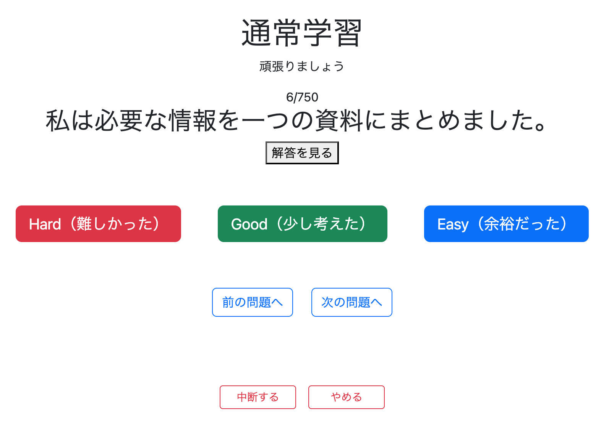
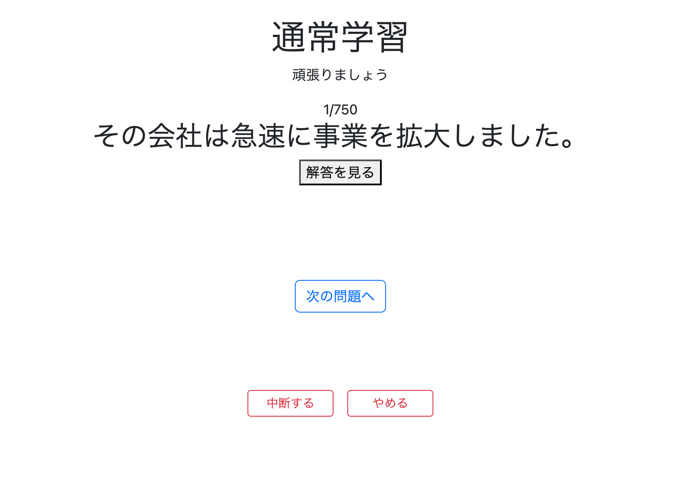
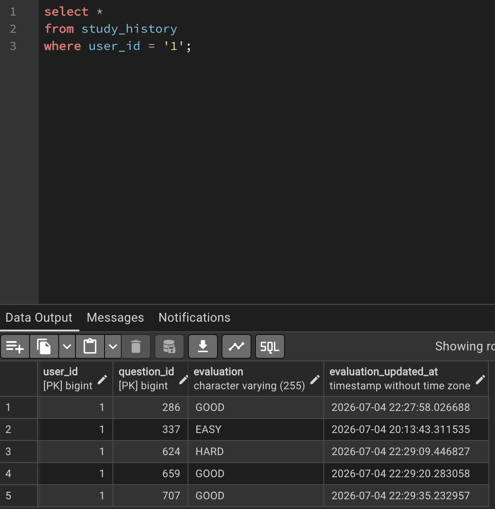

# 復習機能の実装① Evaluation機能の追加

これからは復習機能を実装する。

この機能では、ユーザーが各問題に対して **Hard / Good / Easy** のEvaluationを付け、その評価に応じて重点的に復習できるシステムを目指す。

復習機能は実装する内容が多いため、まずは各ユーザーが各問題に対してEvaluationを付けられるところまで実装する。

その第一段階として、`study_history`テーブルに対応したEntityクラスを作成し、Spring Bootから扱えるように準備する。

---

# テーブル追加

まずは学習履歴を保存する`study_history`テーブルと、お気に入り機能用の`favorites`テーブルを追加する。

```sql
CREATE TABLE study_history (
    user_id BIGINT NOT NULL,
    question_id BIGINT NOT NULL,

    evaluation VARCHAR(10) NOT NULL,
    evaluation_updated_at TIMESTAMP NOT NULL,

    PRIMARY KEY (user_id, question_id),

    FOREIGN KEY (user_id)
        REFERENCES users(id),

    FOREIGN KEY (question_id)
        REFERENCES question(question_id)
);

CREATE TABLE favorites (
    user_id BIGINT NOT NULL,
    question_id BIGINT NOT NULL,

    created_at TIMESTAMP NOT NULL,

    PRIMARY KEY (user_id, question_id),

    CONSTRAINT fk_favorites_user
        FOREIGN KEY (user_id)
        REFERENCES users(id),

    CONSTRAINT fk_favorites_question
        FOREIGN KEY (question_id)
        REFERENCES question(question_id)
);
```

今回実際に使用するのは`study_history`テーブルである。

1人のユーザーが1つの問題に対して保持するEvaluationは1つだけでよいため、

- user_id
- question_id

を複合主キーとしている。

---

# Entityクラス追加

複合主キーを扱うため、まずはキー専用クラスを作成する。

```java
@Embeddable
@Data
class StudyHistoryKey implements Serializable {

    private Long userId;
    private Long questionId;

}
```

続いてEntityクラスを作成する。

```java
@Data
@Entity
@Table(name = "study_history")
class StudyHistory {

    @EmbeddedId
    private StudyHistoryKey studyHistoryKey;

    private String evaluation;

    private LocalDateTime evaluationUpdatedAt;

}
```

`@EmbeddedId`を使用することで、複合主キーを1つのオブジェクトとして扱えるようになる。

---

## 実務ではここまで書くことが多い

今回は最低限の実装だけで十分だが、実務では外部キーとの関連も定義することが多い。

```java
@ManyToOne
@MapsId("userId")
@JoinColumn(name = "user_id")
private Users user;

@ManyToOne
@MapsId("questionId")
@JoinColumn(name = "question_id")
private Question question;
```

このように関連を定義しておくことで、Entity同士をオブジェクトとして自然に扱えるようになる。

---

# StudyHistoryRepositoryを作成

```java
public interface StudyHistoryRepository
        extends JpaRepository<StudyHistory, StudyHistoryKey> {

    Optional<StudyHistory> findByStudyHistoryKey(
            StudyHistoryKey studyHistoryKey);

}
```

`StudyHistory`の主キーは複合キーであるため、`JpaRepository`の第2引数は`StudyHistoryKey`となる。

`findByStudyHistoryKey()`は複合キーを受け取り、

```sql
SELECT *
FROM study_history
WHERE user_id = 'xxxx'
AND question_id = 'yyyy';
```

のような検索を行う。

結果は`Optional<StudyHistory>`として返される。

---

# EvaluationService.javaを作成

```java
@Service
@RequiredArgsConstructor
public class EvaluationService {

    private final StudyHistoryRepository studyHistoryRepository;
    private final UserServiceImpl userServiceImpl;

    public void updateEvaluation(
            String loginUser,
            Long questionId,
            String evaluation) {

        // ユーザー情報を取得
        Users user = userServiceImpl.getUserOne(loginUser);

        // 複合キーに情報を入れる
        StudyHistoryKey key = new StudyHistoryKey();
        key.setUserId(user.getId());
        key.setQuestionId(questionId);

        // 存在確認
        Optional<StudyHistory> optionalStudyHistory =
                studyHistoryRepository.findByStudyHistoryKey(key);

        if (optionalStudyHistory.isPresent()) {

            // UPDATE
            StudyHistory studyHistory = optionalStudyHistory.get();
            studyHistory.setEvaluation(evaluation);
            studyHistory.setEvaluationUpdatedAt(LocalDateTime.now());

            studyHistoryRepository.save(studyHistory);

        } else {

            // INSERT
            StudyHistory studyHistory = new StudyHistory();
            studyHistory.setStudyHistoryKey(key);
            studyHistory.setEvaluation(evaluation);
            studyHistory.setEvaluationUpdatedAt(LocalDateTime.now());

            studyHistoryRepository.save(studyHistory);
        }
    }

}
```

---

## 引数

### String loginUser

ログイン中のユーザーID。

ここで渡されるのは内部管理用の`id`ではなく、ユーザー自身が設定したユーザーIDである。

Controller側で

```java
loginUser.getUsername()
```

によって取得した値が渡される。

---

### Long questionId

現在表示している問題のID。

---

### String evaluation

ユーザーが押した

- HARD
- GOOD
- EASY

のいずれかが渡される。

---

## ユーザー情報を取得

```java
Users user = userServiceImpl.getUserOne(loginUser);
```

まずはログインユーザーの情報を取得する。

この後、複合キーに

- ユーザーID
- QuestionID

を入れ、そのレコードが存在するかどうかを判定する。

存在すればEvaluationと登録日時だけUPDATEし、存在しなければ新規INSERTする。

その第一段階としてユーザー情報を取得する必要がある。

理由は、複合キーへ情報を設定する際に

```java
user.getId()
```

を利用するためである。

今回`study_history`テーブルでは、ユーザーが設定したユーザーIDではなく、`users`テーブルの主キーである`id`を外部キーとして利用している。

---

## 複合キーに情報を入れる

```java
StudyHistoryKey key = new StudyHistoryKey();

key.setUserId(user.getId());
key.setQuestionId(questionId);
```

ここでは通常のJavaオブジェクトを生成し、

- userId
- questionId

をSetterで設定しているだけである。

---

## 存在確認

```java
Optional<StudyHistory> optionalStudyHistory =
        studyHistoryRepository.findByStudyHistoryKey(key);
```

先ほど作成した複合キーを利用し、

```sql
SELECT *
FROM study_history
WHERE user_id = 'xxxx'
AND question_id = 'yyyy';
```

を実行している。

取得結果は`Optional<StudyHistory>`として返される。

---

## UPDATEかINSERTかを判定

```java
if (optionalStudyHistory.isPresent())
```

`isPresent()`が`true`ということは、

```sql
SELECT *
FROM study_history
WHERE user_id = 'xxxx'
AND question_id = 'yyyy';
```

でレコードが見つかったことを意味する。

つまり、

**そのユーザーはその問題に対して過去にEvaluationを付けたことがある**

ということである。

その場合はUPDATE処理へ進む。

一方、レコードが存在しなければ、その問題にまだEvaluationを付けたことがないためINSERT処理へ進む。

---

## UPDATE

```java
StudyHistory studyHistory = optionalStudyHistory.get();

studyHistory.setEvaluation(evaluation);
studyHistory.setEvaluationUpdatedAt(LocalDateTime.now());

studyHistoryRepository.save(studyHistory);
```

取得済みのEntityのうち、

- evaluation
- evaluationUpdatedAt

だけを書き換えて保存している。

---

## INSERT

```java
StudyHistory studyHistory = new StudyHistory();

studyHistory.setStudyHistoryKey(key);
studyHistory.setEvaluation(evaluation);
studyHistory.setEvaluationUpdatedAt(LocalDateTime.now());

studyHistoryRepository.save(studyHistory);
```

こちらは新しいEntityを生成し、複合キーも含めてすべてINSERTしている。

# JPAならもっと短く書ける

実は今回のような処理では、JPAは主キーを見てINSERTかUPDATEかを自動判定してくれる。

そのため、実際には次のようなコードだけでも同じ処理を実現できる。

```java
// JPAはこれでいい
public void updateEvaluation(
        String loginUser,
        Long questionId,
        String evaluation) {

    // ユーザー情報を取得
    Users user = userServiceImpl.getUserOne(loginUser);

    // 複合キーを作成
    StudyHistoryKey key = new StudyHistoryKey();
    key.setUserId(user.getId());
    key.setQuestionId(questionId);

    // エンティティを作成
    StudyHistory studyHistory = new StudyHistory();
    studyHistory.setStudyHistoryKey(key);
    studyHistory.setEvaluation(evaluation);
    studyHistory.setEvaluationUpdatedAt(LocalDateTime.now());

    // INSERTまたはUPDATE（JPAが自動判定）
    studyHistoryRepository.save(studyHistory);
}
```

`save()`メソッドは、主キーに対応するレコードがすでに存在していればUPDATE、存在しなければINSERTを自動的に選択してくれる。

そのため、今回実装したように

- SELECTで存在確認
- UPDATE
- INSERT

を分岐する必要はない。

今回は学習目的として、

- レコードの存在確認
- UPDATE
- INSERT

という一連の流れを理解しやすくするため、あえて明示的に処理を書いた。

---

# StudyControllerにpostEvaluationを追加

```java
@PostMapping("/study/evaluation")
public String postEvaluation(
        @AuthenticationPrincipal UserDetails loginUser,
        @RequestParam Long questionId,
        @RequestParam String evaluation,
        @RequestParam Integer page) {

    evaluationService.updateEvaluation(
            loginUser.getUsername(),
            questionId,
            evaluation);

    return "redirect:/study?page=" + (page + 1);
}
```

---

## 引数

### @AuthenticationPrincipal UserDetails loginUser

`@AuthenticationPrincipal`を付与すると、Spring Securityが現在ログインしているユーザー情報を自動的に引数へ渡してくれる。

今回は

```java
loginUser.getUsername()
```

を利用し、ログイン中のユーザーIDを取得してServiceへ渡している。

---

### @RequestParam Long questionId

現在表示している問題ID。

hiddenパラメータから送られてくる。

---

### @RequestParam String evaluation

ユーザーが押した評価ボタンの値。

今回は

- HARD
- GOOD
- EASY

のいずれかが送られてくる。

---

### @RequestParam Integer page

現在表示している問題番号。

Evaluationを保存したあと、自動で次の問題へ遷移するために利用する。

---

## Serviceクラスを呼び出す

```java
evaluationService.updateEvaluation(
        loginUser.getUsername(),
        questionId,
        evaluation);
```

ここで前節で作成したUPDATE／INSERT処理が実行される。

最後に

```java
return "redirect:/study?page=" + (page + 1);
```

を実行することで、「次の問題」ボタンを押さなくても、自動で次の問題へ進めるようになっている。

---

# study.htmlを修正

```html
<!-- 評価 -->
<div id="evaluationArea"
     sec:authorize="isAuthenticated()"
     class="mt-1 mb-10 d-flex justify-content-center gap-5"
     style="display:none;">

    <form th:action="@{/study/evaluation}" method="post">

        <input type="hidden"
               name="questionId"
               th:value="${question.questionId}">

        <input type="hidden"
               name="evaluation"
               value="HARD">

        <input type="hidden"
               name="page"
               th:value="${currentPage - 1}">

        <button type="submit" class="btn btn-danger btn-lg">
            Hard（難しかった）
        </button>

    </form>

    <form th:action="@{/study/evaluation}" method="post">

        <input type="hidden"
               name="questionId"
               th:value="${question.questionId}">

        <input type="hidden"
               name="evaluation"
               value="GOOD">

        <input type="hidden"
               name="page"
               th:value="${currentPage - 1}">

        <button type="submit" class="btn btn-success btn-lg">
            Good（少し考えた）
        </button>

    </form>

    <form th:action="@{/study/evaluation}" method="post">

        <input type="hidden"
               name="questionId"
               th:value="${question.questionId}">

        <input type="hidden"
               name="evaluation"
               value="EASY">

        <input type="hidden"
               name="page"
               th:value="${currentPage - 1}">

        <button type="submit" class="btn btn-primary btn-lg">
            Easy（余裕だった）
        </button>

    </form>

</div>
```

各Evaluationボタンはそれぞれ独立した`form`になっている。

そのため、押されたボタンによって

- HARD
- GOOD
- EASY

のいずれかがPOSTされる。

また、

- questionId
- page

もhiddenパラメータとして一緒に送信されるため、

Controller側では

- どの問題に対する評価なのか
- 現在何問目なのか

を取得できる。

さらに、

```html
sec:authorize="isAuthenticated()"
```

を付与しているため、Evaluationボタンはログインしているユーザーだけに表示される。

非ログイン状態ではHTML自体が出力されないため、ログインしていないユーザーはEvaluationを登録できないようになっている。

# 実行

ログインした状態で学習ページへ遷移すると、各種Evaluationボタンが正しく表示された。



また、非ログイン状態ではEvaluationボタンが表示されないことも確認できた。



さらに、問題の下に表示されるEvaluationボタンを押すと、Evaluationが保存されると同時に自動で次の問題へ遷移することも確認できた。

最後にpgAdmin4で`study_history`テーブルを確認すると、ユーザーが各問題に対して付けたEvaluationが正しく保存されていることを確認できた。



---

# 所感

今回の実装では、Evaluation機能そのものだけでなく、アプリケーション全体の設計について考えさせられる場面があった。

開発当初は、「通常学習で5問だけ固定表示できればよい」という前提で設計を進めていたため、画面遷移も

```text
Top画面
    ↓
study.html
```

という非常にシンプルな構成だった。

しかし、開発を進めるにつれて、

- 通常学習
- 復習
- 難易度別出題
- Evaluation別出題
- お気に入り出題
- 出題順・ランダム出題の切り替え

など、多くの機能を追加することになった。

その結果、画面構成も

```text
Top画面
├─ 通常学習
│   └─ study/menu.html
│       └─ study.html
│
└─ 復習
    └─ review/menu.html
        └─ review.html
```

というように、ワンクッション置いた構成へ変更する必要が出てきた。

これに伴い、当初作成した画面遷移やURL、Controller名、HTMLファイル名などが徐々に汎用的ではなくなり、リファクタリングが必要になってきた。

最初は目の前の機能だけを考えて設計していたが、アプリケーション全体の方向性が固まるにつれて、「今後も機能を追加しやすい設計」に変更していく必要性を強く感じた。

これは実務でも仕様変更や機能追加によって設計の見直しが必要になる場面が多いと言われており、その一端を今回の開発で体験できたように思う。

また、今回追加したEvaluation機能は、今後実装する復習機能の土台となる重要な仕組みでもある。

この段階ではまだ単純に評価を保存しているだけだが、次回以降はこのデータを利用して「Hardだけ出題」「Goodだけ出題」「お気に入りだけ出題」といった、本格的な復習機能へ発展させていく予定である。

---

# 次やること

復習機能の実装