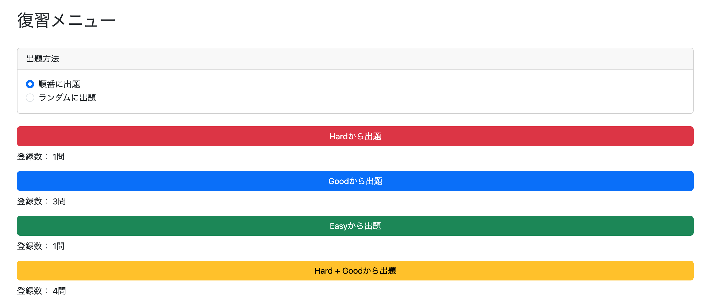
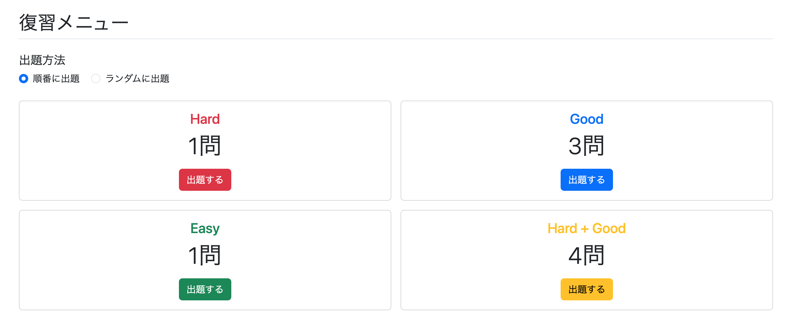

# 復習機能の実装② 復習メニューの実装

Evaluation機能の実装ができたので、これで復習メニューを作ることができるようになる。

このメニューでは以下の内容を実装したい。

## 1. 出題条件をカスタマイズ

Evaluationの **HARD**、**GOOD**、**EASY** をそれぞれ選択できるようにし、ユーザーが思い通りの復習方法を設定できるようにする。

Evaluationは複数選択可能とする。

### 例

- HARDだけ選択
  - HARD評価した問題だけ出題
  - わからなかった問題を重点的に見直せる

- GOODとEASYを選択
  - GOOD評価・EASY評価した問題だけ出題
  - 無意識に話せるレベルまで定着させる学習ができる

- 何も選択しない
  - すべて選択したものとして扱う

また、それぞれのボタンに「順番に出題する」「ランダムに出題する」ボタンを設置すると、ボタンが多くなりUIが分かりづらくなる。

そのため、出題順設定はページ上部にラジオボタンを配置し、その設定でページ全体の出題順を制御する方式とする。

---

## 2. ユーザーが設定した条件による出題数の表示

ユーザーが設定した条件で、何問出題対象になるかを表示する。

例えば

- HARDのみ出題

ならば、そのユーザーがHARD評価した問題数を表示する。

---

# 使用するファイル

## 新規作成

- `review/menu.html`
- `ReviewController.java`
- `ReviewService.java`
- `Evaluation.java`

## 修正

- `StudyHistoryRepository.java`

---

# このページで実装する仕組み

このページを作るだけであれば、そこまで高度なバックエンド処理は必要ない。

本格的な処理は、今後実装する

`review/question.html`

で実際に問題を取得・出題する部分になる。

ただし、

「ユーザーが設定した条件による出題数の表示」

については、DBからデータを取得するため、今まで使ってこなかったJPAの知識が必要になる。

---

# Evaluationごとの件数取得

やりたいことは、

- ログインユーザー
- Evaluation

を指定して件数を取得することである。

SQLで書くと次のようになる。

```sql
SELECT COUNT(*)
FROM study_history
WHERE user_id = 'xxxxx'
  AND evaluation = 'HARD';

## Evaluation.java

```java
public enum Evaluation {
    HARD,
    GOOD,
    EASY
}
```

---

## StudyHistory.java

```java
@Data
@Entity
@Table(name = "study_history")
public class StudyHistory {

    @EmbeddedId
    private StudyHistoryKey studyHistoryKey;

    @Enumerated(EnumType.STRING)
    private Evaluation evaluation;

    private LocalDateTime evaluationUpdatedAt;
}
```

### @Enumerated(EnumType.STRING)

Enum型をデータベースにどのような形式で保存するかを指定するアノテーションである。

デフォルトでは `EnumType.ORDINAL` が使用されるため、

```text
HARD
GOOD
EASY
```

が

```text
0
1
2
```

として保存されてしまう。

今回は文字列のまま扱いたいため、`EnumType.STRING` を指定する。

---

## StudyHistoryRepository.java を修正

```java
long countByStudyHistoryKeyUserIdAndEvaluation(
        Long userId,
        String evaluation);
```

↓

```java
long countByStudyHistoryKeyUserIdAndEvaluation(
        Long userId,
        Evaluation evaluation);
```

EvaluationはEnum型なので、Stringではなくそのまま `Evaluation` 型で受け取ればよい。

---

# ReviewService.java（修正版）

```java
@Service
@RequiredArgsConstructor
public class ReviewService {

    private final StudyHistoryRepository studyHistoryRepository;

    public long countEvaluation(
            Long userId,
            Evaluation evaluation) {

        return studyHistoryRepository
                .countByStudyHistoryKeyUserIdAndEvaluation(
                        userId,
                        evaluation);
    }
}
```

Evaluationごとにメソッドを分ける必要がなくなり、1つのメソッドだけで対応できるようになった。

---

# ReviewController.java

```java
@Controller
@RequiredArgsConstructor
public class ReviewController {

    private final UserServiceImpl userServiceImpl;
    private final ReviewService reviewService;

    @GetMapping("/review/menu")
    public String getReviewMenu(
            @AuthenticationPrincipal UserDetails loginUser,
            Model model) {

        // user_id(文字列)からUsersを取得
        Users user =
                userServiceImpl.getUserOne(
                        loginUser.getUsername());

        Long userId = user.getId();

        long evaluatedHard =
                reviewService.countEvaluation(
                        userId,
                        Evaluation.HARD);

        long evaluatedGood =
                reviewService.countEvaluation(
                        userId,
                        Evaluation.GOOD);

        long evaluatedEasy =
                reviewService.countEvaluation(
                        userId,
                        Evaluation.EASY);

        model.addAttribute(
                "evaluatedHard",
                evaluatedHard);

        model.addAttribute(
                "evaluatedGood",
                evaluatedGood);

        model.addAttribute(
                "evaluatedEasy",
                evaluatedEasy);

        return "/review/menu";
    }
}
```

---

# review/menu.html

```html
<!DOCTYPE html>
<html xmlns:th="http://www.thymeleaf.org"
      xmlns:layout="http://www.ultraq.net.nz/thymeleaf/layout"
      layout:decorate="~{layout/layout}">

<head>
    <meta charset="UTF-8">
    <title>English Output Trainer</title>

    <link rel="stylesheet"
          th:href="@{/css/study.css}">

    <link rel="stylesheet"
          th:href="@{/webjars/bootstrap/css/bootstrap.min.css}">

    <script th:src="@{/js/study.js}" defer></script>
</head>

<body>

<div layout:fragment="content">

    <div class="header border-bottom mb-4">
        <h1 class="h2">復習メニュー</h1>
    </div>

    <!-- 出題方法 -->
    <div class="card mb-4">

        <div class="card-header">
            出題方法
        </div>

        <div class="card-body">

            <div class="form-check">
                <input class="form-check-input"
                       type="radio"
                       name="order"
                       id="sequential"
                       value="sequential"
                       checked>

                <label class="form-check-label"
                       for="sequential">
                    順番に出題
                </label>
            </div>

            <div class="form-check">
                <input class="form-check-input"
                       type="radio"
                       name="order"
                       id="random"
                       value="random">

                <label class="form-check-label"
                       for="random">
                    ランダムに出題
                </label>
            </div>

        </div>

    </div>

    <!-- Hard -->
    <div class="mb-3">

        <button class="btn btn-danger w-100">
            Hardから出題
        </button>

        <div class="mt-2">
            登録数：
            <span th:text="${evaluatedHard}"></span>問
        </div>

    </div>

    <!-- Good -->
    <div class="mb-3">

        <button class="btn btn-primary w-100">
            Goodから出題
        </button>

        <div class="mt-2">
            登録数：
            <span th:text="${evaluatedGood}"></span>問
        </div>

    </div>

    <!-- Easy -->
    <div class="mb-3">

        <button class="btn btn-success w-100">
            Easyから出題
        </button>

        <div class="mt-2">
            登録数：
            <span th:text="${evaluatedEasy}"></span>問
        </div>

    </div>

    <!-- Hard + Good -->
    <div class="mb-3">

        <button class="btn btn-warning w-100">
            Hard + Goodから出題
        </button>

        <div class="mt-2">
            登録数：
            <span th:text="${evaluatedHard + evaluatedGood}"></span>問
        </div>

    </div>

</div>

</body>
</html>
```

---

# 実行

いくつか問題を評価した状態でログインし、

```text
/review/menu
```

へアクセスすると、各Evaluationごとの問題数が表示されるようになった。



---

# UIの改善

ボタンを縦に並べるだけでは見た目が単調だったため、Bootstrapのグリッドレイアウトを導入した。

## review/menu.html を修正

```html
<!-- 出題方法 -->
<div class="mb-4">

    <h5>出題方法</h5>

    <div class="form-check form-check-inline">

        <input class="form-check-input"
               type="radio"
               name="order"
               id="sequential"
               value="sequential"
               checked>

        <label class="form-check-label"
               for="sequential">
            順番に出題
        </label>

    </div>

    <div class="form-check form-check-inline">

        <input class="form-check-input"
               type="radio"
               name="order"
               id="random"
               value="random">

        <label class="form-check-label"
               for="random">
            ランダムに出題
        </label>

    </div>

</div>

<div class="row g-3">

    <!-- Hard -->
    <div class="col-md-6">
        ...
    </div>

    <!-- Good -->
    <div class="col-md-6">
        ...
    </div>

    <!-- Easy -->
    <div class="col-md-6">
        ...
    </div>

    <!-- Hard + Good -->
    <div class="col-md-6">
        ...
    </div>

</div>
```

Bootstrapのグリッドレイアウトを利用することで、

- PCでは2列表示
- スマートフォンでは1列表示

となり、視認性・操作性ともに向上した。




---

# 所感

今回の実装では、`@EmbeddedId` を利用した複合主キーであっても、Spring Data JPAの命名規則に従うことで複合キー内部のフィールドを検索条件として利用できることを学んだ。

また、EvaluationをEnum化したことで、文字列を直接扱う必要がなくなり、型安全で保守しやすいコードになった。

さらに、Bootstrapのグリッドレイアウトを利用することで、復習メニューの視認性・操作性を改善することができた。

---

# 次やること

検索条件を

- HARD
- GOOD
- EASY

だけでなく、

- 初級
- 中級
- 上級

まで拡張し、より柔軟な復習条件を指定できるようにする。