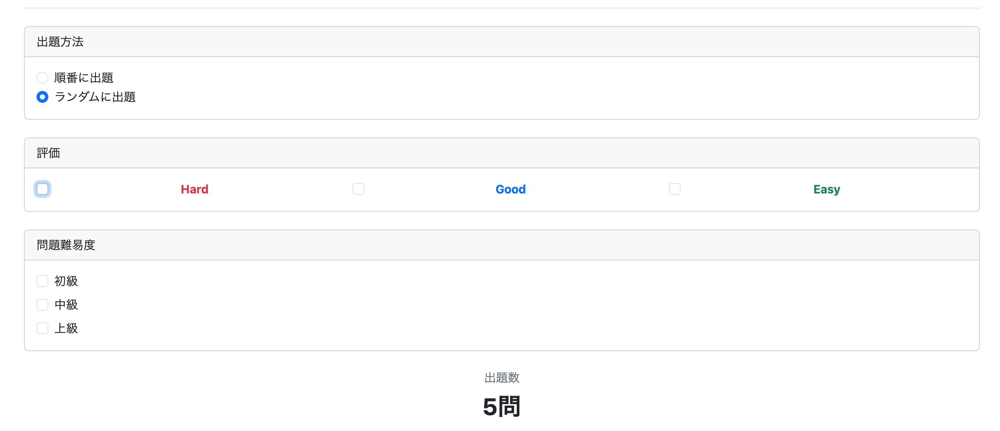
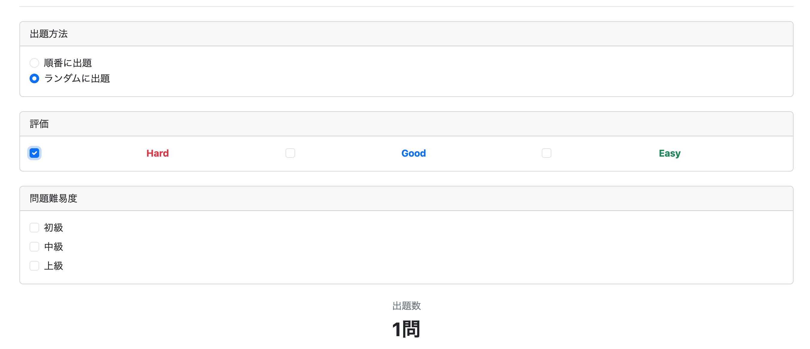
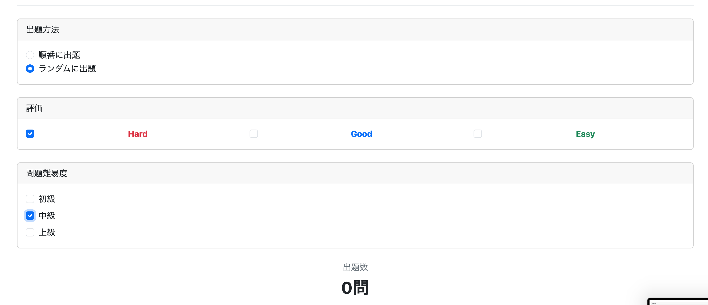

# 復習機能の実装③　復習条件の拡大

前章では、ユーザーが各問題に付けた評価（HARD・GOOD・EASY）を基準として復習できる機能を実装した。

しかし、それだけでは

- 「中級問題だけ復習したい」
- 「上級問題のうちHard評価だけ復習したい」

などの細かな条件指定ができない。

そこで今回は、

- 評価（Evaluation）
- 問題難易度（Difficulty）

の両方を検索条件として指定できるようにする。

---

# 実現方法

今回実現したいSQLは次のようになる。

```sql
SELECT COUNT(*)
FROM study_history AS sh
JOIN question AS q
  ON sh.question_id = q.question_id
WHERE sh.user_id = 'xxxx'
  AND sh.evaluation IN ('HARD', 'GOOD', 'EASY')
  AND q.difficulty IN ('BEGINNER', 'INTERMEDIATE', 'ADVANCED');
```

ポイントは

- `study_history`
- `question`

をJOINすることである。

---

# JOINを実現する方法

JPAでJOINを実現する方法は2つある。

## 方法① RepositoryでJOINを書く

StudyHistoryとQuestionは独立したEntityのままとし、

RepositoryのSQL（またはJPQL）だけでJOINする方法である。

イメージは

```
StudyHistory
        │
        │ RepositoryのSQL
        ▼
JOIN
        ▲
        │
Question
```

---

## 方法② Entity同士を関連付ける

StudyHistoryに

```java
@ManyToOne
private Question question;
```

のような関連付けを行い、

JPQLでは

```java
JOIN sh.question q
```

のようにEntity同士の関連をたどってJOINする。

---

## 今回①を採用した理由

今回はStudyHistoryが

```java
@EmbeddedId
```

による複合キーを採用している。

そのため、

Entity同士を関連付ける場合、

- @ManyToOne
- @JoinColumn
- @MapsId

などの設定が必要になり、記述量が増えてしまう。

今回は単純に件数を取得したいだけなので、

**RepositoryへSQLを書く方法（方法①）**

を採用した。

---

# StudyHistoryRepository.java

```java
@Query(value = """
SELECT COUNT(*)
FROM study_history sh
JOIN question q
  ON sh.question_id = q.question_id
WHERE sh.user_id = :userId
  AND sh.evaluation IN (:evaluations)
  AND q.difficulty IN (:difficulties)
""", nativeQuery = true)
long countQuestions(
        @Param("userId") Long userId,
        @Param("evaluations") List<Evaluation> evaluations,
        @Param("difficulties") List<Difficulty> difficulties
);
```

---

## @Queryとは

通常Spring Data JPAでは

```java
countByStudyHistoryKeyUserIdAndEvaluation(...)
```

のように、

メソッド名からSQLを自動生成できる。

しかし今回は

- JOIN
- IN句

など比較的複雑なSQLになるため、

Spring Data JPAだけではSQLを生成できない。

そこで

```java
@Query(...)
```

を利用して、自分でSQLを記述する。

---

## :○○ の正体

SQL中に書かれている

```sql
:userId
:evaluations
:difficulties
```

は、

データベースに保存されている値ではない。

これらは

**JavaからRepositoryへ渡される引数**

を表している。

例えば

```sql
WHERE sh.user_id = :userId
```

であれば、

`:userId`には現在ログイン中ユーザーのIDが入る。

また、

```sql
AND sh.evaluation IN (:evaluations)
```

では、

画面でユーザーが選択した

```
HARD
GOOD
```

などが入る。

例えば

```
評価
☑ Hard
☑ Good
☐ Easy

難易度
☑ Beginner
☑ Intermediate
☐ Advanced
```

を選択した場合、

概念的には

```sql
SELECT COUNT(*)
FROM study_history sh
JOIN question q
  ON sh.question_id = q.question_id
WHERE sh.user_id = 1
AND sh.evaluation IN ('HARD','GOOD')
AND q.difficulty IN ('BEGINNER','INTERMEDIATE');
```

というSQLが実行される。

なお

```
sh.evaluation
```

は

study_historyテーブルのevaluation列である。

一方

```
:evaluations
```

は

Javaから渡される検索条件である。

名前は似ているが意味は全く異なる。

---

## nativeQuery = true

`@Query`には

- JPQLを書く
- SQLを書く

という2種類がある。

その指定を行うのが

```java
nativeQuery = true
```

である。

```java
@Query(value = """
SELECT COUNT(*)
FROM study_history
WHERE evaluation='HARD'
""", nativeQuery = true)
```

とすると、

これはPostgreSQLへ送るSQLそのものになる。

つまり

```
study_history
```

や

```
question
```

は

データベース上のテーブル名として解釈される。

一方、

```java
@Query("""
SELECT COUNT(sh)
FROM StudyHistory sh
WHERE sh.evaluation='HARD'
""")
```

のように

`nativeQuery=true`

を付けない場合は

JPQLとして扱われる。

JPQLでは

```
StudyHistory
```

はEntity名、

```
evaluation
```

はEntityのフィールド名となる。

つまり

| 設定 | 意味 |
|------|------|
| nativeQuery=true | SQLを書く |
| nativeQuery=false（省略可） | JPQLを書く |

という違いになる。

今回はSQLをそのまま利用したいため、

`nativeQuery=true`

を指定した。

---

## Repositoryメソッド

```java
long countQuestions(
        @Param("userId") Long userId,
        @Param("evaluations") List<Evaluation> evaluations,
        @Param("difficulties") List<Difficulty> difficulties
);
```

### Repositoryメソッドの役割

これはRepositoryのメソッド宣言である。

今まで実装してきた

```java
long countByStudyHistoryKeyUserIdAndEvaluation(
        Long userId,
        Evaluation evaluation);
```

と同じ役割を持つ。

違いは、

今回はSpring Data JPAがメソッド名からSQLを自動生成できないため、

```java
@Query(...)
```

を利用してSQLを自分で記述していることである。

---

### 引数には何を書くのか

Repositoryメソッドの引数には、

SQL内で使用した

```
:userId
:evaluations
:difficulties
```

に対応する引数を書く。

つまり、

```sql
WHERE sh.user_id = :userId
```

なら

```java
Long userId
```

になる。

また、

```sql
:evaluations
```

には

```java
List<Evaluation>
```

、

```sql
:difficulties
```

には

```java
List<Difficulty>
```

を書くのが自然である。

Javaでは

```java
@Enumerated(EnumType.STRING)
private Evaluation evaluation;
```

や

```java
@Enumerated(EnumType.STRING)
private Difficulty difficulty;
```

としているため、

Javaの世界では文字列ではなくEnum型として扱われるからである。

---

### @Param("xxx")とは

```java
@Param("userId")
```

は、

SQL中の

```sql
:userId
```

とJavaの引数

```java
Long userId
```

を対応付けるためのアノテーションである。

例えば

```java
@Param("evaluations")
List<Evaluation> evaluations
```

なら、

SQL中の

```sql
:evaluations
```

へ

```java
evaluations
```

の内容が渡される。

つまり、

```
SQL側
```

と

```
Java側
```

を結び付ける役割を持つ。

---

# ReviewService.java

```java
public long countReviewQuestions(
        Long userId,
        List<Evaluation> evaluations,
        List<Difficulty> difficulties) {

    if (evaluations.isEmpty()) {
        evaluations = List.of(
                Evaluation.HARD,
                Evaluation.GOOD,
                Evaluation.EASY);
    }

    if (difficulties.isEmpty()) {
        difficulties = List.of(
                Difficulty.BEGINNER,
                Difficulty.INTERMEDIATE,
                Difficulty.ADVANCED);
    }

    return studyHistoryRepository.countQuestions(
            userId,
            evaluations,
            difficulties);
}
```

---

## if文の意味

今回の仕様では、

評価や難易度を何もチェックしなかった場合、

「すべて選択した」

ものとして扱う。

つまり、

```
評価

☐ Hard
☐ Good
☐ Easy
```

であれば、

内部的には

```
Hard
Good
Easy
```

すべて選択したものとしてRepositoryへ渡す。

難易度についても同様である。

そのため、

```java
if (evaluations.isEmpty())
```

や

```java
if (difficulties.isEmpty())
```

で判定し、

空の場合は全種類のEnumをListへ格納してRepositoryへ渡している。

---

# ReviewController（最初の実装）

```java
@GetMapping("/review/menu")
@ResponseBody
public String getReviewMenu(
        @AuthenticationPrincipal UserDetails loginUser,

        @RequestParam(name = "evaluations", required = false)
        List<Evaluation> evaluations,

        @RequestParam(name = "difficulties", required = false)
        List<Difficulty> difficulties,

        Model model) {

    Users user =
            userServiceImpl.getUserOne(loginUser.getUsername());

    Long userId = user.getId();

    Long countReviewQuestions =
            reviewService.countReviewQuestions(
                    userId,
                    evaluations,
                    difficulties);

    model.addAttribute(
            "countReviewQuestions",
            countReviewQuestions);

    return "review/menu";
}
```

---

## @RequestParam(name = "...") List<...> の正体

Controllerでは

```java
@RequestParam(name = "evaluations", required = false)
List<Evaluation> evaluations
```

のような引数を書いている。

これは、

HTMLのチェックボックスで選択された値を受け取るための引数である。

例えば

```html
<input
    type="checkbox"
    name="evaluations"
    value="HARD">

<input
    type="checkbox"
    name="evaluations"
    value="GOOD">

<input
    type="checkbox"
    name="evaluations"
    value="EASY">
```

というHTMLがあるとする。

ユーザーが

```
☑ Hard
☑ Good
☐ Easy
```

を選択すると、

ブラウザは

```
evaluations=HARD
evaluations=GOOD
```

というデータをControllerへ送信する。

Spring MVCはこれを自動的に

```java
List<Evaluation>
```

へ変換する。

その結果、

```java
[
    Evaluation.HARD,
    Evaluation.GOOD
]
```

というListになる。

難易度も同様である。

---

### name = "evaluations" の意味

```java
@RequestParam(name = "evaluations")
```

の

```
name
```

は、

HTMLの

```html
name="evaluations"
```

と対応付けるための指定である。

つまり、

HTMLから

```
evaluations
```

という名前で送られてきたデータを、

Javaの

```java
List<Evaluation> evaluations
```

へ代入する。

なお、

```java
@RequestParam(required = false)
```

のようにnameを省略した場合は、

Javaの変数名が自動的に利用される。

学習中は

```java
@RequestParam(name = "evaluations")
```

のように省略しない方が対応関係を理解しやすい。

---

### required = false の意味

チェックボックスは、

何もチェックしない場合、

その項目自体が送信されない。

そのため、

```java
required = false
```

を指定しなければ、

Springは

「値が送られてきていません」

としてエラーを発生させる。

そこで、

```java
required = false
```

を指定することで、

送信されなくてもエラーにならないようにしている。

その場合、

Controllerへ渡される値は

```java
null
```

となる。

Serviceでは

```java
if (evaluations == null || evaluations.isEmpty())
```

と判定し、

全件検索へ切り替えている。

---

# ReviewControllerの問題点

最初の実装では、

```java
@GetMapping("/review/menu")
```

の時点で出題数を取得していた。

しかし、

Top画面から

```
復習
```

ボタンを押した直後は、

まだ

- Evaluation
- Difficulty

のどちらも選択していない。

そのため、

Controllerへ渡される値は

```
null
```

となり、

Service側では

```
「何も選択していない＝全て選択」
```

として扱われる。

つまり、

```sql
SELECT COUNT(*)
FROM study_history sh
JOIN question q
  ON sh.question_id = q.question_id
WHERE sh.user_id = 'xxxx'
AND sh.evaluation IN ('HARD','GOOD','EASY')
AND q.difficulty IN ('BEGINNER','INTERMEDIATE','ADVANCED')
```

が毎回実行され、

常に最大件数が表示されることになる。

---

## 他の方法も考えた

例えば、

### 方法①

Top画面でEvaluation・Difficultyを選択させ、

その後

```
/review/menu
```

へ遷移する。

しかし、

出題数を表示するためだけに

review/menu

というページを1枚使うことになる。

---

### 方法②

Top画面で条件を指定し、

そのまま

```
/review/question
```

へ遷移する。

しかし、

それなら最初から

```
/review/question
```

側で件数表示を実装すればよい。

---

### 方法③

Top画面へ

Evaluation

Difficulty

を追加する。

しかし、

Top画面の役割は

「通常学習」

「復習」

などのメニュー表示である。

復習条件まで持たせるのは責務が大きくなってしまう。

---

## 採用した方法

review/menuを最初に開いたときは、

件数は表示しない（または"-"を表示する）。

その後、

ユーザーが

```
Evaluation

Difficulty
```

のチェックを変更した瞬間だけ、

JavaScriptが

```
/review/count
```

を呼び出すようにした。

つまり、

ページ遷移を行わず、

件数だけ更新する設計に変更した。

---

# ReviewController（修正版）

```java
@GetMapping("/review/menu")
public String getReviewMenu() {

    return "review/menu";
}
```

menuは

画面表示だけ

を担当する。

---

一方、

件数取得専用のControllerを追加した。

```java
@GetMapping("/review/count")
@ResponseBody
public long getReviewCount(

        @AuthenticationPrincipal UserDetails loginUser,

        @RequestParam(name = "evaluations", required = false)
        List<Evaluation> evaluations,

        @RequestParam(name = "difficulties", required = false)
        List<Difficulty> difficulties) {

    Users user =
            userServiceImpl.getUserOne(
                    loginUser.getUsername());

    Long userId = user.getId();

    return reviewService.countReviewQuestions(
            userId,
            evaluations,
            difficulties);
}
```

---

# @ResponseBodyとは

通常のControllerでは、

```java
return "review/menu";
```

は

```
review/menu.html
```

という

Thymeleafテンプレート

として解釈される。

つまり、

```
Controller
      ↓
Modelへ格納
      ↓
Thymeleaf
      ↓
HTML生成
      ↓
ブラウザ表示
```

という流れになる。

---

しかし、

```java
@ResponseBody
```

を付与すると、

戻り値は

テンプレート名

ではなく、

データそのもの

としてブラウザへ返される。

例えば

```java
@ResponseBody
public long count() {

    return 25;
}
```

なら、

ブラウザへ

```
25
```

という数値だけが返る。

---

## Modelが不要になる理由

今までのControllerでは

```java
model.addAttribute(...);

return "review/menu";
```

として、

Modelへデータを格納し、

Thymeleafへ渡していた。

つまり、

```
Controller
    ↓
Model
    ↓
Thymeleaf
    ↓
HTML
```

という流れだった。

---

一方、

今回のControllerは

```
JavaScript(fetch)
      ↓
Controller
      ↓
27（件数）
```

という流れになる。

HTMLを**新規に取得して表示するわけではない**ため、

```
Model

model.addAttribute()

return "review/count"
```

は不要となる。

---

## JavaScriptはどうやって値を受け取るのか

例えば、

```javascript
fetch("/review/count")
    .then(response => response.text())
    .then(count => {

        console.log(count);

    });
```

と書く。

Controllerが

```
27
```

を返した場合、

```
count
```

には

```
27
```

が格納される。

その後、

```javascript
document.getElementById("countReviewQuestions")
        .textContent = count;
```

とすることで、

既に表示されているHTMLの出題数だけを書き換える。

つまり、

```
Controller
    ↓
27
    ↓
JavaScript
    ↓
HTMLを書き換える
```

という流れになる。

---

# review.js

```javascript
document.addEventListener("DOMContentLoaded", () => {

    // 評価・難易度のチェックボックス取得
    const checkboxes = document.querySelectorAll(
        "input[name='evaluations'], input[name='difficulties']"
    );

    // 出題数表示
    const countArea =
        document.getElementById("countReviewQuestions");

    async function updateCount() {

        const params = new URLSearchParams();

        // 評価
        document
            .querySelectorAll(
                "input[name='evaluations']:checked")
            .forEach(cb => {

                params.append(
                    "evaluations",
                    cb.value);
            });

        // 難易度
        document
            .querySelectorAll(
                "input[name='difficulties']:checked")
            .forEach(cb => {

                params.append(
                    "difficulties",
                    cb.value);
            });

        const response =
            await fetch(
                "/review/count?" + params);

        const count =
            await response.text();

        countArea.textContent =
            count + "問";
    }

    checkboxes.forEach(cb => {

        cb.addEventListener(
            "change",
            updateCount);

    });

});
```

---

## review.jsの役割

review.jsは、

評価または難易度のチェック状態が変更されたことを検知し、

Controllerへ現在の検索条件を送信する役割を持つ。

Controllerから返ってきた件数を受け取り、

画面を再読み込みすることなく、

出題数だけを書き換える。

これにより、

ユーザーは条件を変更するたびに、

リアルタイムで現在の出題数を確認できるようになった。

---

# review/menu.html

最終的なレイアウトは次のようにした。

- 出題方法（順番・ランダム）
- Evaluation（複数選択）
- Difficulty（複数選択）
- 出題数
- 出題開始ボタン

という流れで画面を構成した。

```html
<form>

    <!-- 出題方法 -->
    <div class="card mb-4">

        <div class="card-header">
            出題方法
        </div>

        <div class="card-body">

            <div class="form-check">
                <input class="form-check-input"
                       type="radio"
                       name="order"
                       value="SEQUENTIAL"
                       checked>

                <label class="form-check-label">
                    順番に出題
                </label>
            </div>

            <div class="form-check">
                <input class="form-check-input"
                       type="radio"
                       name="order"
                       value="RANDOM">

                <label class="form-check-label">
                    ランダムに出題
                </label>
            </div>

        </div>

    </div>

    <!-- Evaluation -->
    <div class="card mb-4">

        <div class="card-header">
            評価
        </div>

        <div class="card-body">

            （Hard・Good・Easy のチェックボックス）

        </div>

    </div>

    <!-- Difficulty -->
    <div class="card mb-4">

        <div class="card-header">
            問題難易度
        </div>

        <div class="card-body">

            （Beginner・Intermediate・Advanced のチェックボックス）

        </div>

    </div>

    <!-- 出題数 -->
    <div class="text-center mb-4">

        <div class="text-secondary">
            出題数
        </div>

        <h2 id="countReviewQuestions">
            -
        </h2>

    </div>

    <!-- 出題開始 -->
    <button
        class="btn btn-primary btn-lg w-100">

        出題開始

    </button>

</form>
```

---

## レイアウトについて

従来は

```
Hardから出題

Goodから出題

Easyから出題
```

というボタンを配置していた。

しかし、

今回から

Evaluation

Difficulty

の両方を自由に組み合わせられるようになったため、

それぞれをチェックボックスとして独立させた。

例えば

```
☑ Hard

☑ Good

☐ Easy
```

かつ

```
☑ Beginner

☐ Intermediate

☑ Advanced
```

というような検索条件も指定できる。

また、

検索条件を変更すると、

review.jsがControllerへリクエストを送り、

ページ遷移を行わずに

```
出題数
27問
```

だけを書き換えるようにした。

---

# 実行（失敗）

最初に実装した際、

出題数が表示されず、

スタックトレースが表示された。

---

## エラーメッセージ

最も重要なのは次の部分である。

```
ERROR:
operator does not exist:
character varying = smallint
```

---

## 原因

Repositoryでは

```java
List<Evaluation>

List<Difficulty>
```

をそのまま

ネイティブSQLへ渡していた。

しかし、

Hibernateは

Enumを

```
"HARD"
```

ではなく、

```
0

1

2
```

のような内部値（ordinal）としてSQLへ渡してしまった。

つまり、

概念的には

```sql
WHERE evaluation = 0
```

のようなSQLになっていた。

一方、

study_history.evaluation列は

```
VARCHAR
```

型である。

そのため、

PostgreSQLは

```
VARCHAR = SMALLINT
```

という比較ができず、

```
operator does not exist:
character varying = smallint
```

というエラーを返した。

---

# 修正①

Repositoryの引数を

```java
List<String>
```

へ変更した。

```java
long countQuestions(

    @Param("userId")
    Long userId,

    @Param("evaluations")
    List<String> evaluations,

    @Param("difficulties")
    List<String> difficulties
);
```

---

# 修正②

Serviceで

```java
List<Evaluation>
```

および

```java
List<Difficulty>
```

を

```java
List<String>
```

へ変換するようにした。

---

## .name()メソッド

```java
Evaluation.HARD.name()
```

のように書くと、

Enum定数の名前を

```
String
```

として取得できる。

例えば

```java
Evaluation.HARD.name();
```

なら

```
"HARD"
```

を返す。

Difficultyでも同様である。

---

## for文でStringへ変換

```java
evaluationList = new ArrayList<>();

for (Evaluation evaluation : evaluations) {

    evaluationList.add(
            evaluation.name());

}
```

この処理によって、

```
Evaluation.HARD

Evaluation.GOOD
```

というEnumのListが、

```
"HARD"

"GOOD"
```

というStringのListへ変換される。

Difficultyも同様に変換し、

Repositoryへ渡すようにした。

---

## なぜこれで解決したのか

Repositoryへ渡される値が

```
"HARD"

"GOOD"

"BEGINNER"

"INTERMEDIATE"
```

という文字列になったため、

SQLでは

```sql
evaluation IN ('HARD','GOOD')
```

という本来意図した検索が行われるようになった。

---

## 今回学んだこと

Entityでは

```java
@Enumerated(EnumType.STRING)
```

を指定していても、

ネイティブSQLへ

```
List<Enum>
```

をそのまま渡した場合まで、

文字列へ変換されるとは限らない。

ネイティブSQLを利用する場合は、

Serviceで

```java
enum.name()
```

を利用し、

```
List<String>
```

へ変換してRepositoryへ渡す方が安全である。

---

# 実行

ログイン後、

```
/review/menu
```

へアクセスし、

EvaluationおよびDifficultyの検索条件を変更すると、

その条件に一致する出題数が

リアルタイムで表示されるようになった。





---

# 所感

今回は

- RepositoryへのJOIN SQLの記述
- @Query
- @Param
- nativeQuery
- @RequestParam
- @ResponseBody
- JavaScript(fetch)
- ネイティブSQLとEnumの扱い
- List<Evaluation>からList<String>への変換

など、

バックエンドだけでも非常に多くの内容を実装することになった。

また、

今回のように

「ページ遷移せずに画面の一部だけ更新する」

機能を実装するためには、

JavaScriptが必要不可欠であることも実感した。

現時点ではJavaScriptの知識はまだ十分ではなく、

AIの助けを借りながら実装した部分も多い。

しかし、

最低限

- fetch
- DOM操作
- イベント処理

については、

今後Spring BootでWebアプリケーションを開発する上でも必要になると感じた。

---

# 次やること

復習画面の実装

```
review/question
```

を作成し、

指定した検索条件に一致する問題だけを取得・出題できるようにする。