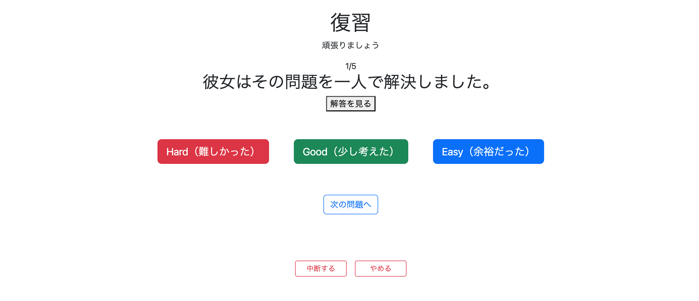
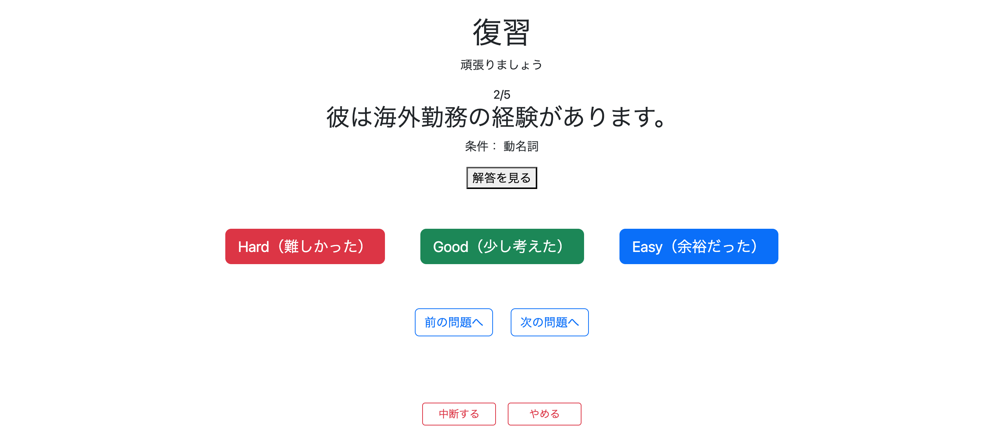
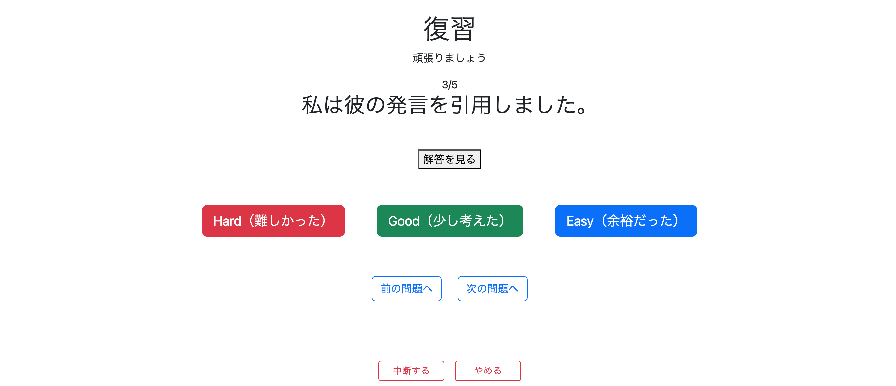
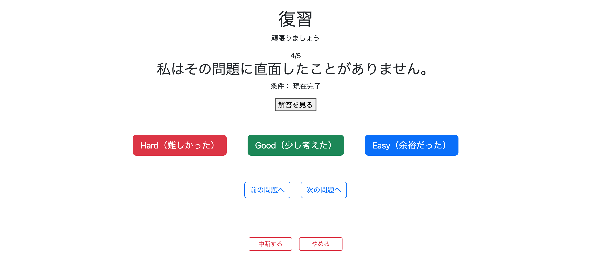

# 復習機能の実装④ 出題

ここでは、前回実装した通常学習（StudyController / StudyService）の仕組みをベースに、復習機能の問題出題画面を実装する。

通常学習と基本的な流れはほぼ同じだが、復習では

- 評価（Evaluation）
- 問題難易度（Difficulty）

で問題を絞り込んでから出題する点が異なる。

---

# SQL（StudyHistoryRepository）

## 問題取得SQL

復習では、

- ログイン中のユーザー
- 評価
- 問題難易度

で問題を絞り込む必要がある。

そのため、Repositoryには次のSQLを作成する。

```java
@Query(value = """
        SELECT q.*
        FROM study_history sh
        JOIN question q
          ON sh.question_id = q.question_id
        WHERE sh.user_id = :userId
          AND sh.evaluation IN (:evaluations)
          AND q.difficulty IN (:difficulties)
        ORDER BY sh.evaluation_updated_at ASC
        """, nativeQuery = true)
List<Question> getQuestions(
        @Param("userId") Long userId,
        @Param("evaluations") List<String> evaluations,
        @Param("difficulties") List<String> difficulties
);
```

### ORDER BYについて

```sql
ORDER BY sh.evaluation_updated_at ASC
```

としている理由は、

順番に出題する場合は最後に学習した日時が最も古い問題から出題した方が、効率よく復習できるためである。

### List<String>を使用する理由

Repositoryでは

```java
List<Evaluation>
```

や

```java
List<Difficulty>
```

ではなく、

```java
List<String>
```

を使用している。

これは以前実装した出題数取得SQLと同様で、EnumのListをそのまま渡すとエラーになるためである。

---

# ReviewService

## 問題取得

Repositoryへ渡す前に、

- Evaluation
- Difficulty

を文字列へ変換し、その後Repositoryを呼び出す。

最初は以下のようなメソッドを作成した。

```java
public List<Question> getQuestion(
        Long userId,
        List<Evaluation> evaluations,
        List<Difficulty> difficulties,
        boolean random) {

    // EvaluationをList<String>へ変換

    ...

    // DifficultyをList<String>へ変換

    ...

    List<Question> extractedQuestions =
            studyHistoryRepository.getQuestions(
                    userId,
                    evaluationList,
                    difficultyList);

    if (random) {
        Collections.shuffle(extractedQuestions);
    }

    return extractedQuestions;
}
```

## 問題点

同様の

- Evaluation変換
- Difficulty変換

の処理は、

以前作成した

```java
countReviewQuestions()
```

にも存在していた。

このままでは同じコードを2回書くことになり保守性が悪くなる。

---

# リファクタリング

変換処理をそれぞれ独立したメソッドへ切り出した。

```java
convertEvaluation()

convertDifficulty()
```

その結果、

```java
countReviewQuestions()
```

は

```java
return studyHistoryRepository.countQuestions(
        userId,
        convertEvaluation(evaluations),
        convertDifficulty(difficulties));
```

だけで済むようになった。

また、

```java
getQuestion()
```

も

```java
List<Question> extractedQuestions =
        studyHistoryRepository.getQuestions(
                userId,
                convertEvaluation(evaluations),
                convertDifficulty(difficulties));
```

となり、

Evaluation・Difficultyの変換処理を共通化できた。

これにより

- 重複コード削減
- 再利用性向上
- 保守性向上

を実現できた。

また、

```java
Collections.shuffle()
```

は引き続き

```java
random == true
```

の場合のみ実行する。

# ReviewController

ReviewControllerでは、通常学習と同様に問題の開始・表示・再開・中断・終了などを管理する。

具体的には以下のメソッドを作成した。

- getReviewStart
- getReviewQuestion
- setReviewQuestionModel
- getReviewResume
- suspendReview
- quitReview
- completeReview
- postEvaluation

---

# getReviewStart

```java
@GetMapping("/review/start")
```

このメソッドでは、

- 既存の復習状態を破棄
- ログインユーザーの取得
- 条件に一致する問題一覧の取得
- Sessionへの保存
- review/questionへリダイレクト

を行う。

```java
@GetMapping("/review/start")
public String getReviewStart(
        Model model,
        HttpSession session,
        @AuthenticationPrincipal UserDetails loginUser,
        @RequestParam(name = "evaluations", required = false)
                List<Evaluation> evaluations,
        @RequestParam(name = "difficulties", required = false)
                List<Difficulty> difficulties,
        @RequestParam(name = "random", required = false)
                boolean random) {

    session.removeAttribute("reviewQuestions");
    session.removeAttribute("reviewCurrentPage");

    Users user =
            userServiceImpl.getUserOne(loginUser.getUsername());

    Long userId = user.getId();

    List<Question> questions =
            reviewService.getQuestion(
                    userId,
                    evaluations,
                    difficulties,
                    random);

    session.setAttribute("reviewQuestions", questions);
    session.setAttribute("reviewCurrentPage", 0);

    return "redirect:/review/question";
}
```

## StudyControllerとの違い

基本的な流れは

```java
studyStart()
```

とほぼ同じである。

異なる点は、

- ログインユーザー情報を取得する必要がある
- 検索条件（Evaluation・Difficulty・ランダム）を受け取る
- userIdを取得してServiceへ渡す

という部分である。

---

## Session名を変更

通常学習と同じSession名を利用すると、

通常学習中のSessionが復習機能によって上書きされる可能性がある。

そのため、

```text
reviewQuestions

reviewCurrentPage
```

というように、

Session名へ

```text
review
```

を付けて区別した。

なお、

通常学習側も将来的には同様の命名へ変更する予定である。

---

# getReviewQuestion

```java
@GetMapping("/review/question")
```

このメソッドでは、

Sessionから問題一覧を取得し、

表示すべき問題をModelへ渡す。

```java
@GetMapping("/review/question")
public String getReviewQuestion(
        Model model,
        HttpSession session,
        @RequestParam(defaultValue = "0") int page) {

    List<Question> questions =
            (List<Question>) session.getAttribute("reviewQuestions");

    if (questions == null) {
        return "redirect:/";
    }

    setReviewQuestionModel(
            model,
            questions,
            page);

    return "review/question";
}
```

---

## review/questionへの直接アクセス禁止

Sessionに問題一覧が存在しない場合は

```java
return "redirect:/";
```

とすることで、

URLを直接入力しても画面へ入れないようにした。

---

# setReviewQuestionModel

Modelへ必要な情報をまとめて格納するメソッドである。

```java
private void setReviewQuestionModel(
        Model model,
        List<Question> questions,
        int page) {

    Question question = questions.get(page);

    model.addAttribute("question", question);
    model.addAttribute("nextPageIndex", page + 1);
    model.addAttribute("totalPages", questions.size());
    model.addAttribute("hasPrevious", page > 0);
    model.addAttribute(
            "hasNext",
            page < questions.size() - 1);
}
```

通常学習で作成した

```java
setStudyModel()
```

とほぼ同じ内容であり、

前回実装した通常学習の仕組みをそのまま流用できた。

---

# getReviewResume

途中で中断した復習を再開する。

```java
@GetMapping("/review/resume")
public String getReviewResume(
        Model model,
        HttpSession session) {

    if (session.getAttribute("reviewQuestions") == null) {
        return "redirect:review/menu";
    }

    Integer page =
            (Integer) session.getAttribute("reviewCurrentPage");

    return "redirect:/review/question?page=" + page;
}
```

中断していない場合は

```text
review/menu
```

へ戻すようにした。

---

# suspendReview

```java
@GetMapping("/review/suspend")
```

現在のページ番号だけをSessionへ保存し、

トップ画面へ戻る。

```java
session.setAttribute(
        "reviewCurrentPage",
        page);
```

これにより、

次回

```java
getReviewResume()
```

から途中のページを再開できる。

# completeReview

復習を最後まで完了した際に呼ばれるメソッドである。

```java
@GetMapping("/review/complete")
public String completeReview(HttpSession session) {

    session.removeAttribute("reviewQuestions");
    session.removeAttribute("reviewCurrentPage");

    return "redirect:/complete";
}
```

復習が終了した時点で、

- 問題一覧
- 現在のページ

の両方をSessionから削除する。

これにより、完了後に「再開」が表示されることを防ぐことができる。

---

# quitReview

```java
@GetMapping("/review/quit")
```

途中で復習自体を終了するメソッドである。

```java
@GetMapping("/review/quit")
public String quitReview(HttpSession session) {

    session.removeAttribute("reviewQuestions");
    session.removeAttribute("reviewCurrentPage");

    return "redirect:/";
}
```

こちらも

- 問題一覧
- 現在ページ

を削除してトップ画面へ戻る。

---

# postEvaluation

復習画面では、

解答確認後に

- Hard
- Good
- Easy

のいずれかを押すことで評価を更新し、そのまま次の問題へ進めるようにした。

```java
@PostMapping("/review/evaluation")
public String postEvaluation(
        @AuthenticationPrincipal UserDetails loginUser,
        @RequestParam Long questionId,
        @RequestParam Evaluation evaluation,
        @RequestParam Integer page,
        HttpSession session) {

    evaluationService.updateEvaluation(
            loginUser.getUsername(),
            questionId,
            evaluation);

    List<Question> questions =
            (List<Question>) session.getAttribute("reviewQuestions");

    if (page + 1 >= questions.size()) {
        return "redirect:/review/complete";
    }

    return "redirect:/review/question?page=" + (page + 1);
}
```

---

## 最後の問題への対応

最初は

```java
return "redirect:/review/question?page=" + (page + 1);
```

だけにしていた。

しかし、

最後の問題でも次ページへ遷移しようとしてしまい、

存在しないページへアクセスしてエラーになってしまった。

そのため、

```java
if (page + 1 >= questions.size())
```

で最後の問題かどうかを判定し、

最後なら

```java
redirect:/review/complete
```

へ遷移するよう修正した。

---

# review/question.html

通常学習画面（study/question.html）をベースとして、

復習専用画面を作成した。

表示内容は以下の通りである。

- 現在の問題番号
- 日本語問題
- 条件（存在する場合のみ）
- 解答表示
- Evaluationボタン
- 前へ
- 次へ
- Complete
- 中断
- やめる

Evaluationボタンでは

```html
<form th:action="@{/review/evaluation}" method="post">
```

を利用し、

- questionId
- evaluation
- page

をhiddenで送信するようにした。

これにより、

評価更新と次ページへの遷移を同時に実現できた。

---

# 実行

ログイン後、

```
http://localhost:8080/review/menu
```

へアクセスし、

適当な条件を選択して出題を開始した。



確認した内容は以下の通りである。

- 条件に一致した問題のみ出題される
- ランダム出題
- 順番出題
- 中断
- 再開
- 終了
- Complete

すべて正常に動作することを確認した。

---

# UI改善

## 問題

条件付き問題では

```
条件：
○○○○
```

が表示されるが、

条件の無い問題ではこの部分が存在しない。

その結果、

- Evaluationボタン
- 前へ・次へ
- 中断
- やめる

の位置が問題ごとに上下へズレてしまっていた。




トレーニングでは何十問も連続で解くことになるため、

ボタン位置が毎回変わるUIは操作しづらい。

---

## 修正

条件表示部分を

```html
<div style="min-height:40px;">

    <p th:if="${question.condition != null}">
        条件：
        <span th:text="${question.condition}">
            条件
        </span>
    </p>

</div>
```

へ変更した。

高さを固定することで、

条件が存在しない問題でも

40px分のスペースを確保するようにした。

---

## 確認

修正後は、

条件の有無に関係なく

- Evaluationボタン
- 前へ・次へ
- 中断
- やめる

すべてが同じ高さに表示されるようになった。





トレーニング中に視線やマウスカーソルを大きく動かす必要がなくなり、

操作性が向上した。

---

# 所感

前半で通常学習（StudyController・StudyService）という比較的大規模な仕組みを実装していたため、

復習機能はその設計をベースに流用できる部分が多く、以前よりスムーズに実装を進めることができた。

一方で、

StudyControllerとReviewController、

StudyServiceとReviewServiceには似た処理が多く存在しており、

同じようなコードを複数箇所へ書いている部分も少なくない。

また、

Session名やURL構造などもまだ統一できていない部分があるため、

保守性の観点からも改善の余地が残っていると感じた。

今後は、

「通常学習」と「復習」の共通処理を整理し、

責務を見直しながらリファクタリングを進めていきたい。

---

# 次やること

- Controller間で重複している処理を整理する
- Service間で重複している処理を整理する
- 共通処理を切り出して保守性を向上させる
- 通常学習にも学習条件を導入する