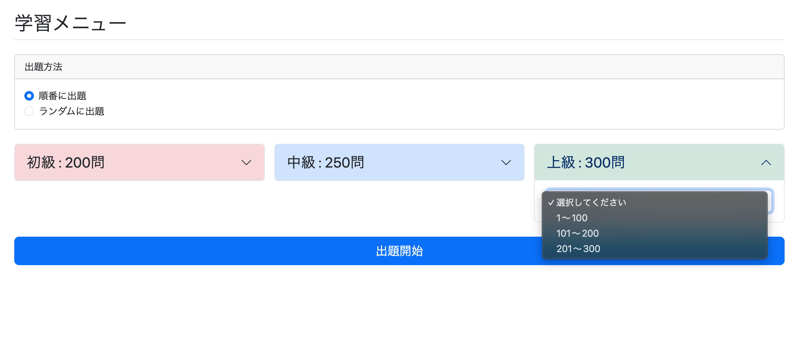

# 通常学習再設計① 通常学習メニューの作成

## 概要

これまで通常学習はTop画面から

- 順番に出題
- ランダムに出題

の2つのボタンだけで、すぐに学習が開始される仕様だった。

しかし、これはDBに登録されている問題数が5問程度だったため成立していた実装である。

実際には問題数が数百問規模になるため、この仕様では以下の問題が発生する。

- 50問、100問学習しても区切りがなく、ユーザーが終了するタイミングを作りにくい
- ユーザーのレベルに合わない問題が頻繁に出題され、学習効率が落ちる

そこで通常学習にも復習機能と同様に「出題条件」を設けることにした。

ただし通常学習では復習とは異なり、

- 難易度
- その難易度内での出題範囲

を条件として問題を取得する。

例えば初級を選択した場合、

- 1～100
- 101～200
- 201～300
- 301～400

などからさらに範囲を選択する。

---

# 今回やること

今回実装する内容は

- 各難易度の問題数を取得する
- 問題数を100問ごとの出題範囲へ分割する
- study/menu画面へ表示する

ことである。

なお、

初級問題数が575問だった場合は

- 1～100
- 101～200
- 201～300
- 301～400
- 401～500
- 501～575

となるよう最後だけ特別な処理が必要になる。

今回はメニュー画面まで実装し、

指定した範囲の問題を取得する処理(study/question)は次章で実装する。

---

# 出題範囲を表示する方法の考え方

今回は初めての実装だったため、紙に図を書いたりAIからヒントをもらいながら設計を進めた。

まずは難易度という概念を忘れ、

```
1～100
101～200
201～300
```

という範囲だけを考える。

まず問題総数(total)が必要であることはすぐ分かる。

次に

```
1～100
101～200
201～300
```

という各範囲は独立した要素なので、

Listとして管理できそうだと考えた。

さらに

```
1～100
```

という文字列ではなく

開始位置(start)

終了位置(end)

として考えると

```
start = 1
end = 100
```

という2つの数値だけで表現できる。

そこで

```java
public class Range {

    private long start;
    private long end;

}
```

というRangeクラスを作成し、

```java
public String getDisplayText() {
    return start + "～" + end;
}
```

を実装すれば

```
1～100
```

という表示も実現できる。

そして

```java
List<Range> ranges
```

を用意すれば

```
1～100
101～200
201～300
```

という一覧も表現できると考えた。

---

# 問題総数(total)の取得

問題総数はSQLで取得できる。

```sql
SELECT COUNT(*)
FROM question
WHERE difficulty = 'xxxx';
```

JPAでは

```java
long countByDifficulty(Difficulty difficulty);
```

をQuestionRepositoryへ追加すればよい。

---

# start・endの求め方

まずRangeクラスやListのことは忘れ、

startとendだけをどう求めるか考えた。

問題総数が375問とすると、

for文を利用すれば

```java
for (long i = 1; i <= total; i += 100)

    start = i;
    end = i + 99;
```

となり

```
1～100
101～200
201～300
301～400
```

まで求められる。

しかし最後は375までしか存在しない。

そこで

```java
for (long i = 1; i <= total; i += 100) {

    if (i + 99 <= total) {

        start = i;
        end = i + 99;

    } else {

        start = i;
        end = total;

    }

}
```

とすることで

```
1～100
101～200
201～300
301～375
```

という正しい範囲を求められる。

---

# List<Range>の作成

start・endが求められるようになったので、

Rangeクラスと組み合わせる。

```java
private List<Range> createRanges(long count) {

    List<Range> ranges = new ArrayList<>();

    for (long start = 1; start <= count; start += 100) {

        if (start + 99 <= count) {
            ranges.add(new Range(start, start + 99));
        } else {
            ranges.add(new Range(start, count));
        }

    }

    return ranges;
}
```

このメソッドにより、

```
1～100
101～200
201～300
301～375
```

という出題範囲一覧(List<Range>)が生成できる。

# List<Range>とtotalを持つクラス StudyMenuDto

ここまでで、

- 問題総数(total)
- 出題範囲(List<Range>)

があれば、画面に表示する情報を表現できることが分かった。

つまり

```
1～100
101～200
201～300
301～375
```

という出題範囲は

- total
- List<Range>

の2つで表現できる。

これらをまとめるクラスが

```java
StudyMenuDto
```

である。

構造としては

```
StudyMenuDto
│
├── Count = 350
│
└── Ranges
    │
    ├── Range(start=1, end=100)
    ├── Range(start=101, end=200)
    └── Range(start=201, end=350)
```

という形になる。

---

# DTO(Data Transfer Object)

DTOとは

> クラス同士でデータを受け渡すためだけの箱

である。

DTO自身は

- SQLを書かない
- Repositoryを呼ばない
- HTMLを表示しない

ただデータを保持して受け渡すだけの役割を持つ。

---

## Rangeクラス

Rangeは

```
1～100
```

という1つの出題範囲を表すDTOである。

例えば

```
start = 1
end = 100
```

というデータだけを持っている。

Range自身は

- DBアクセス
- 問題取得
- 画面表示

などは一切行わない。

---

## StudyMenuDto

StudyMenuDtoもDTOである。

例えば

```
問題総数：350

出題範囲

1～100
101～200
201～350
```

という情報をまとめて保持しているだけであり、

SQLを書いたりRepositoryを呼ぶことはない。

---

## Serviceとの関係

StudyServiceは

```
問題総数350

Range

1～100
101～200
201～350
```

というデータを作成する。

それを

```
StudyMenuDto
```

へ格納し、

StudyControllerへ渡しているだけである。

流れは

```
StudyService

↓

StudyMenuDto

↓

StudyController
```

となる。

---

## Entityとの違い

QuestionはEntityであり、

```
questionテーブル
```

の1レコードと対応している。

一方

```
StudyMenuDto
```

はDBには存在しない。

study_menuというテーブルも存在しない。

つまりStudyMenuDtoは

画面表示のためにServiceが組み立てたデータ

なのである。

---

## Formとの違い

Formは

```
StudyStartForm
```

のように、

画面から送られてきた入力値を受け取るためのクラスである。

```
画面

↓

Form

↓

Controller
```

という流れになる。

一方DTOは

```
Service

↓

DTO

↓

Controller

↓

画面
```

という流れになる。

---

# StudyMenuDtoを難易度別に拡張する

実際の画面では

- 初級
- 中級
- 上級

に分かれるため、

StudyMenuDtoは次のような構造になる。

```
StudyMenuDto
│
├── beginnerCount = 350
├── beginnerRanges
│      │
│      ├── Range(start=1, end=100)
│      ├── Range(start=101, end=200)
│      └── Range(start=201, end=350)
│
├── intermediateCount = ...
├── intermediateRanges
│      ├── Range(...)
│      └── ...
│
├── advancedCount = ...
└── advancedRanges
       ├── Range(...)
       └── ...
```

つまり

StudyMenuDtoは

```
Rangeを保持(has-a)
```

しているクラスである。

---

# ここから実装すること

Serviceでは

```
StudyMenuDto
```

を1つ作成し、

Controllerへ返すメソッド

```
countStudyQuestions()
```

を実装する。

Serviceでは

- countStudyQuestions()
- createRanges()

の2つのメソッドが必要になる。

---

## countStudyQuestions()

処理の流れ

1.

```java
StudyMenuDto count = new StudyMenuDto();
```

を作成する。

2.

QuestionRepositoryから

初級問題数を取得する。

3.

取得した問題数を

```
createRanges()
```

へ渡す。

4.

返ってきた

```
List<Range>
```

を

StudyMenuDtoへ保存する。

5.

同じ処理を

- 中級
- 上級

についても繰り返す。

6.

StudyMenuDtoを返す。

---

## createRanges()

```java
private List<Range> createRanges(long count) {

    List<Range> ranges = new ArrayList<>();

    for (long start = 1; start <= count; start += 100) {

        if (start + 99 <= count) {

            ranges.add(new Range(start, start + 99));

        } else {

            ranges.add(new Range(start, count));

        }

    }

    return ranges;

}
```

このメソッドが

問題数から

```
1～100
101～200
201～350
```

というList<Range>を生成する。

# StudyService.javaの実装

```java
public StudyMenuDto countStudyQuestions() {

    StudyMenuDto count = new StudyMenuDto();

    long beginnerCount =
            questionRepository.countByDifficulty(Difficulty.BEGINNER);

    // 総問題数表示用
    count.setBeginnerCount(beginnerCount);

    List<Range> beginnerRanges =
            createRanges(beginnerCount);

    count.setBeginnerRanges(beginnerRanges);

    long intermediateCount =
            questionRepository.countByDifficulty(Difficulty.INTERMEDIATE);

    count.setIntermediateCount(intermediateCount);

    List<Range> intermediateRanges =
            createRanges(intermediateCount);

    count.setIntermediateRanges(intermediateRanges);

    long advancedCount =
            questionRepository.countByDifficulty(Difficulty.ADVANCED);

    count.setAdvancedCount(advancedCount);

    List<Range> advancedRanges =
            createRanges(advancedCount);

    count.setAdvancedRanges(advancedRanges);

    return count;
}
```

### 処理内容

まずStudyMenuDtoの空オブジェクトを生成する。

その後、

- Beginner
- Intermediate
- Advanced

についてそれぞれ

1. 問題数をRepositoryから取得
2. createRanges()で出題範囲を生成
3. StudyMenuDtoへ保存

という処理を繰り返す。

最後に完成したStudyMenuDtoをControllerへ返す。

---

## createRanges()

```java
private List<Range> createRanges(long count) {

    List<Range> ranges = new ArrayList<>();

    for (long start = 1; start <= count; start += 100) {

        if (start + 99 <= count) {

            ranges.add(new Range(start, start + 99));

        } else {

            ranges.add(new Range(start, count));

        }

    }

    return ranges;

}
```

このメソッドは

```
問題数

↓

List<Range>
```

へ変換する役割を持つ。

例えば

```
count = 350
```

なら

```
Range(1,100)

Range(101,200)

Range(201,300)

Range(301,350)
```

というListを生成する。

---

# StudyController.java

```java
@GetMapping("/study/menu")
public String getStudyMenu(Model model) {

    StudyMenuDto menu =
            studyService.countStudyQuestions();

    model.addAttribute("studyMenu", menu);

    return "study/menu";

}
```

Controllerでは

StudyServiceからStudyMenuDtoを受け取り、

そのままModelへ格納してThymeleafへ渡すだけである。

Controller自身では

問題数取得やRange生成などの処理は一切行わない。

---

# study/menu.html

通常学習メニュー画面を新たに作成した。

---

## 出題方法

最初に

- 順番に出題
- ランダムに出題

のラジオボタンを配置する。

---

## 問題難易度

Bootstrapの

- Grid System
- Accordion

を利用して

初級

中級

上級

を横一列に配置した。

各難易度は

- 初級：薄い赤
- 中級：薄い青
- 上級：薄い緑

のアコーディオンボタンとした。

ボタンには

```
初級 : xxx問
```

というように、

現在登録されている問題数を表示する。

---

## 出題範囲

アコーディオンを展開すると

```html
<select>
```

が表示され、

```html
<option
    th:each="range : ${studyMenu.beginnerRanges}"
    th:value="${range.start}"
    th:text="${range.displayText}">
</option>
```

によって

```
1～100
101～200
201～350
```

などの選択肢が自動生成される。

表示内容は

Rangeクラスの

```java
getDisplayText()
```

によって生成している。

---

## 出題開始

最後に

```
出題開始
```

ボタンを配置する。

---

# オフセットによる問題取得

今回実装したRangeでは

```
start
end
```

を保持しているが、

実際に問題を取得する際は

```
OFFSET
```

を利用する予定である。

例えば

```
start = 501
```

なら

```
OFFSET = 500
LIMIT = 100
```

として取得する。

SQLは

```sql
SELECT *
FROM question
WHERE difficulty = :difficulty
ORDER BY question_id
OFFSET :offset
LIMIT 100;
```

となる。

最後の範囲が

```
501～575
```

だった場合でも、

DBには75件しか存在しないため、

LIMIT 100としても

残っている75件だけ取得される。

そのため最後だけLIMITを変更する必要はない。

---

# 実行

http://localhost:8080/study/menu

へアクセスすると、

DBへ登録されている問題数に応じて

各難易度ごとの

- 問題数
- 出題範囲

が動的に表示されるようになった。




---

# 所感

今回の実装ではDTOの便利さを強く実感した。

最初は

RangeクラスやStudyMenuDtoという設計を思いつくことができず苦戦したが、

画面から逆算して必要なデータを考えることで

自然に

- Range
- List<Range>
- StudyMenuDto

という構造へたどり着くことができた。

また、

createRanges()のアルゴリズムを考える際には、

Java Silverの学習で身につけた

- for文
- 条件分岐
- List
- オブジェクト生成

などの知識が非常に役立った。

Javaはオブジェクト指向言語であり、

クラスを適切に設計することで

データの受け渡しや責務の分離が非常に分かりやすくなることを実感できた。

---

# 次やること

通常学習の出題処理(study/question)を実装する。

具体的には

- 選択された難易度
- 選択された出題範囲
- 順番・ランダム

を受け取り、

Repositoryから該当問題を取得して

通常学習画面へ表示する機能を実装する。