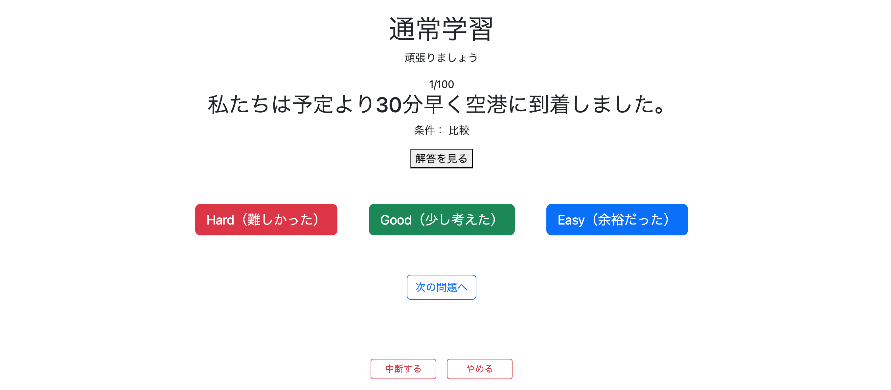

# 通常学習再設計② 通常学習出題機能の実装

前回作成した通常学習メニューで選択した出題条件を基に、実際に問題を出題できるようにする。

以前作成した`StudyController`と`StudyService`を流用し、Review機能の構成も参考にしながら通常学習を再設計する。:contentReference[oaicite:0]{index=0}

---

# 特徴

- `study/menu`ではユーザーは**1つだけ条件を選択**する。
- 1回の問題セットで出題する最大問題数は100問。
- 問題セットが終了すると`complete`画面へ遷移する。
- Controllerや画面遷移などの構成はReview機能とできるだけ統一する。

---

# 問題取得方法の設計

## SQLの考え方

ユーザーが指定した

- 難易度
- 出題範囲

から問題セットを取得する。

例えば

> 初級101～200

を取得する場合は次のSQLとなる。

```sql
SELECT *
FROM question
WHERE difficulty = 'BEGINNER'
ORDER BY question_id
LIMIT 100 OFFSET start - 1;
```

## OFFSET

開始位置は

```text
OFFSET = start - 1
```

で求められる。

例

|開始位置|OFFSET|
|---:|---:|
|1|0|
|101|100|
|201|200|

## LIMIT

`LIMIT 100`は

> 最大100件取得する

という意味である。

そのため、例えば初級問題が275問しか存在しない場合でも

```
201～275
```

まで取得して正常終了する。

そのため取得件数を自分で計算する必要はない。

当初は

```java
int offset = start - 1;
int limit;

if (start + 99 > totalCount) {
    limit = totalCount - offset;
} else {
    limit = 100;
}
```

としてLIMITを自分で計算するアルゴリズムを考えていたが、`LIMIT`の仕様により不要であることが分かった。

---

# QuestionRepositoryを修正

SQLをRepositoryへ実装する。

```java
@Query(value = """
        SELECT *
        FROM question
        WHERE difficulty = 'BEGINNER'
        ORDER BY question_id
        LIMIT 100 OFFSET :offset
        """, nativeQuery = true)
List<Question> getQuestions(
        @Param("difficulty") Difficulty difficulty,
        @Param("offset") int offset
);
```

---

# StudyServiceを修正

旧StudyServiceを流用し、条件付き出題へ対応する。

## 修正前

```java
public List<Question> getQuestion() {

    List<Question> extractedQuestions =
            questionRepository.findAll();

    return extractedQuestions;
}
```

## 修正後

```java
public List<Question> getQuestions(
        Difficulty difficulty,
        int start,
        boolean random) {

    int offset = start - 1;

    List<Question> extractedQuestions =
            questionRepository.getQuestions(
                    difficulty,
                    offset);

    // ランダム出題
    if (random) {
        Collections.shuffle(extractedQuestions);
    }

    return extractedQuestions;
}
```

## 変更点

- 開始位置からOFFSETを計算するように変更。
- Repositoryへ難易度・OFFSETを渡して問題を取得するよう変更。
- 以前Controllerが担当していたシャッフル処理をServiceへ移動した。

### Controllerからシャッフル処理を移動した理由

Controllerの役割は

- リクエストを受け取る
- Serviceへ処理を依頼する
- SessionやModelを管理する

ことである。

一方、

```java
Collections.shuffle(...)
```

は問題一覧を加工する業務であり、ControllerではなくServiceが担当する方が責務として自然である。

そのため、通常学習でもReview機能と同様に

- Controller
- Service

の責務を明確に分離した。

# StudyControllerを修正

旧StudyControllerを流用し、通常学習の新しい出題条件に対応できるよう修正する。:contentReference[oaicite:0]{index=0}

---

# getStudyStartメソッド

## 修正前

```java
@GetMapping("/study/start")
public String startStudy(
        Model model,
        HttpSession session,
        @RequestParam String mode) {

    session.removeAttribute("questions");
    session.removeAttribute("currentPage");

    List<Question> questions;

    if ("sequential".equals(mode)) {
        questions = studyService.getQuestion();
    } else {
        questions = studyService.getRandomQuestion();
    }

    session.setAttribute("questions", questions);
    session.setAttribute("currentPage", 0);

    return "redirect:/study";
}
```

---

## 修正後

```java
@GetMapping("/study/start")
public String getStudyStart(
        HttpSession session,
        @RequestParam(name = "difficulty") Difficulty difficulty,
        @RequestParam(name = "start") int start,
        @RequestParam(name = "random") boolean random) {

    session.removeAttribute("questions");
    session.removeAttribute("currentPage");

    List<Question> questions =
            studyService.getQuestions(
                    difficulty,
                    start,
                    random);

    session.setAttribute("questions", questions);
    session.setAttribute("currentPage", 0);

    return "redirect:/study";
}
```

## 変更点

- 不要だった`Model model`を削除。
- シャッフル処理をControllerからServiceへ移動。
- `mode`ではなく

    - difficulty
    - start
    - random

    を受け取るよう変更。

Controllerは

- リクエストパラメータを受け取る
- Serviceへ処理を依頼する
- Sessionへ保存する

という役割だけになり、責務がより明確になった。

---

# getStudyQuestionメソッド

通常学習もReview機能と同様に

```
study/question
```

というURLへ変更した。

## 修正前

```java
@GetMapping("/study")
public String getStudy(
        Model model,
        HttpSession session,
        @RequestParam(defaultValue = "0") int page) {

    List<Question> questions =
            (List<Question>) session.getAttribute("questions");

    if (questions == null) {
        return "redirect:/";
    }

    setStudyModel(model, questions, page);

    return "study";
}

private void setStudyModel(
        Model model,
        List<Question> questions,
        int page) {

    Question question = questions.get(page);

    model.addAttribute("question", question);
    model.addAttribute("currentPage", page + 1);
    model.addAttribute("totalPages", questions.size());
    model.addAttribute("hasPrevious", page > 0);
    model.addAttribute(
            "hasNext",
            page < questions.size() - 1);
}
```

---

## 修正後

```java
@GetMapping("/study/question")
public String getStudyQuestion(
        Model model,
        HttpSession session,
        @RequestParam(defaultValue = "0") int page) {

    List<Question> questions =
            (List<Question>) session.getAttribute("studyQuestions");

    if (questions == null) {
        return "redirect:/study/menu";
    }

    questionModelUtil.setQuestionModel(
            model,
            questions,
            page);

    return "study/question";
}
```

## QuestionModelUtilクラスを新設

通常学習とReviewで

```
Modelへ問題情報を格納する処理
```

が完全に重複していたため、共通クラスへ切り出した。

```java
@Component
public class QuestionModelUtil {

    public void setQuestionModel(
            Model model,
            List<Question> questions,
            int page) {

        Question question = questions.get(page);

        model.addAttribute("question", question);
        model.addAttribute("currentPage", page + 1);
        model.addAttribute("totalPages", questions.size());
        model.addAttribute("hasPrevious", page > 0);
        model.addAttribute("hasNext",
                page < questions.size() - 1);
    }
}
```

ReviewControllerも

```java
questionModelUtil.setQuestionModel(...);
```

を呼び出すだけとなり、

```
setReviewQuestionModel()
```

は不要になった。

## 共通化した理由

以前は

- StudyController
- ReviewController

がそれぞれ

```
setStudyModel()
setReviewQuestionModel()
```

を持っていた。

しかし処理内容はほぼ同じであり、

- Question取得
- nextPageIndex
- totalPages
- hasPrevious
- hasNext

をModelへ格納しているだけだった。

そのため

```
QuestionModelUtil
```

へ切り出すことで、

- 重複コードを削減
- 保守性向上
- Study・Review双方で同じ処理を利用

できるようになった。

# getResumeStudyメソッド

Session名とURL構成を新しい通常学習の設計へ合わせる。

---

## 修正前

```java
@GetMapping("/study/resume")
public String resumeStudy(
        Model model,
        HttpSession session) {

    if (session.getAttribute("questions") == null) {
        return "redirect:/";
    }

    Integer page =
            (Integer) session.getAttribute("currentPage");

    return "redirect:/study?page=" + page;
}
```

---

## 修正後

```java
@GetMapping("/study/resume")
public String getResumeStudy(
        Model model,
        HttpSession session) {

    if (session.getAttribute("studyQuestions") == null) {
        return "redirect:/study/menu";
    }

    Integer page =
            (Integer) session.getAttribute("studyCurrentPage");

    return "redirect:/study/question?page=" + page;
}
```

## 変更点

- Session名を
    - `questions`
    - `currentPage`

    から

    - `studyQuestions`
    - `studyCurrentPage`

    へ変更。

- URLを

```
/study
```

から

```
/study/question
```

へ変更。

- メソッド名を

```
resumeStudy()
```

から

```
getResumeStudy()
```

へ変更し、Controller全体の命名規則を統一した。

---

# complete・suspend・quitメソッド

通常学習専用Session名へ変更した。

---

## 修正前

```java
@GetMapping("/study/complete")
public String completeStudy(HttpSession session) {

    session.removeAttribute("questions");
    session.removeAttribute("currentPage");

    return "redirect:/complete";
}

@GetMapping("/study/suspend")
public String suspendStudy(
        @RequestParam int page,
        HttpSession session) {

    session.setAttribute("currentPage", page);

    return "redirect:/";
}

@GetMapping("/study/quit")
public String quitStudy(HttpSession session) {

    session.removeAttribute("questions");
    session.removeAttribute("currentPage");

    return "redirect:/";
}
```

---

## 修正後

```java
@GetMapping("/study/complete")
public String getStudyComplete(HttpSession session) {

    session.removeAttribute("studyQuestions");
    session.removeAttribute("studyCurrentPage");

    return "redirect:/complete";
}

@GetMapping("/study/suspend")
public String getStudySuspend(
        @RequestParam int page,
        HttpSession session) {

    session.setAttribute("studyCurrentPage", page);

    return "redirect:/";
}

@GetMapping("/study/quit")
public String getStudyQuit(HttpSession session) {

    session.removeAttribute("studyQuestions");
    session.removeAttribute("studyCurrentPage");

    return "redirect:/";
}
```

## 変更点

- Session名を通常学習専用へ変更。
- メソッド名を

    - `getStudyComplete`
    - `getStudySuspend`
    - `getStudyQuit`

    に統一した。

Review機能でも同様の構成となっているため、通常学習・復習のController構成がほぼ同じになった。

---

# postEvaluationメソッド

評価後の画面遷移を修正した。

---

## 修正前

```java
@PostMapping("/study/evaluation")
public String postEvaluation(...) {

    evaluationService.updateEvaluation(...);

    List<Question> questions =
            (List<Question>) session.getAttribute("questions");

    if (page + 1 >= questions.size()) {
        return "redirect:/review/complete";
    }

    return "redirect:/study?page=" + (page + 1);
}
```

---

## 修正後

```java
@PostMapping("/study/evaluation")
public String postEvaluation(...) {

    evaluationService.updateEvaluation(...);

    List<Question> questions =
            (List<Question>) session.getAttribute("studyQuestions");

    if (page + 1 >= questions.size()) {
        return "redirect:/study/complete";
    }

    return "redirect:/study/question?page=" + (page + 1);
}
```

## 変更点

- Session名を通常学習専用へ変更。
- 誤って

```
/review/complete
```

へ遷移していたため

```
/study/complete
```

へ修正。

- 次の問題への遷移先も

```
/study
```

から

```
/study/question
```

へ変更した。

---

# study/question.htmlを新規作成

通常学習専用の問題画面を新規作成した。

基本的な構成はReview機能の`review/question.html`を流用し、URLやタイトルのみ通常学習用へ変更した。

## 主な機能

- 現在の問題番号表示
- 日本語問題表示
- 条件表示
- 「解答を見る」ボタン
- Hard・Good・Easy評価
- 前へ・次へボタン
- Completeボタン
- 学習中断
- 学習終了

Review機能とほぼ同じ画面構成にすることで、

- 操作性の統一
- 保守性向上
- デザイン変更時の修正箇所削減

を実現した。

---

# 問題発生

`/study/menu`から

- 難易度
- 出題範囲

を選択して出題開始すると、

```
Required parameter 'difficulty' is not present
```

などのエラーが発生した。

## 原因

Controllerでは

```java
@RequestParam Difficulty difficulty
@RequestParam int start
@RequestParam boolean random
```

を受け取ろうとしていた。

しかしHTML側では

```
beginnerRange
intermediateRange
advancedRange
random
```

という名前で送信しており、

ControllerとHTMLでパラメータ名が一致していなかった。

そのためSpringがパラメータを取得できず例外が発生していた。

# 修正

ControllerとHTMLのパラメータ名を一致させるよう修正した。

---

## getStudyStartメソッド

### 修正前

```java
@GetMapping("/study/start")
public String getStudyStart(
        HttpSession session,
        @RequestParam(name = "difficulty") Difficulty difficulty,
        @RequestParam(name = "start") int start,
        @RequestParam(name = "random") boolean random) {

    session.removeAttribute("questions");
    session.removeAttribute("currentPage");

    List<Question> questions =
            studyService.getQuestions(
                    difficulty,
                    start,
                    random);

    session.setAttribute("questions", questions);
    session.setAttribute("currentPage", 0);

    return "redirect:/study/question";
}
```

### 問題点

`study/menu.html`では

- `beginnerRange`
- `intermediateRange`
- `advancedRange`

のいずれか一つしか送信されない。

しかしControllerでは

```java
@RequestParam Difficulty difficulty
@RequestParam int start
```

を受け取ろうとしていたため、

```
Required parameter 'difficulty' is not present
```

という例外が発生した。

---

### 修正後

```java
@GetMapping("/study/start")
public String getStudyStart(
        HttpSession session,
        @RequestParam(required = false) Integer beginnerRange,
        @RequestParam(required = false) Integer intermediateRange,
        @RequestParam(required = false) Integer advancedRange,
        @RequestParam(name = "random") boolean random) {

    Difficulty difficulty;
    int start;

    if (beginnerRange != null) {
        difficulty = Difficulty.BEGINNER;
        start = beginnerRange;

    } else if (intermediateRange != null) {
        difficulty = Difficulty.INTERMEDIATE;
        start = intermediateRange;

    } else if (advancedRange != null) {
        difficulty = Difficulty.ADVANCED;
        start = advancedRange;

    } else {
        return "redirect:/study/menu";
    }

    session.removeAttribute("studyQuestions");
    session.removeAttribute("studyCurrentPage");

    List<Question> questions =
            studyService.getQuestions(
                    difficulty,
                    start,
                    random);

    session.setAttribute("studyQuestions", questions);
    session.setAttribute("studyCurrentPage", 0);

    return "redirect:/study/question";
}
```

## 変更点

### ① HTMLから送信されるパラメータに合わせた

Controllerが直接

```java
Difficulty difficulty
```

を受け取るのではなく、

まず

- beginnerRange
- intermediateRange
- advancedRange

を受け取り、

どの難易度が選択されたか判定するよう変更した。

その後、

```java
Difficulty difficulty
```

と

```java
int start
```

を決定し、Serviceへ渡す構成とした。

---

### ② 出題方法のパラメータ名をReview機能と統一

以前は

```html
name="order"
```

としていた。

しかしReview機能では

```html
name="random"
```

として実装していたため、通常学習も同じ構成へ統一した。

---

## study/menu.html

### 修正前

```html
<input
    class="form-check-input"
    type="radio"
    name="order"
    value="SEQUENTIAL"
    checked>

<input
    class="form-check-input"
    type="radio"
    name="order"
    value="RANDOM">
```

---

### 修正後

```html
<input
    class="form-check-input"
    type="radio"
    name="random"
    value="false"
    checked>

<input
    class="form-check-input"
    type="radio"
    name="random"
    value="true">
```

## 修正理由

Review機能では

```java
@RequestParam(name = "random") boolean random
```

として実装していた。

通常学習も同じ構成にすることで、

- StudyController
- ReviewController

のシグネチャを統一できた。

また、

```java
@RequestParam(name = "random") boolean random
```

のまま利用できるため、

Controller側で

```
order → random
```

へ変換する処理も不要となった。

---

# 実行

`/study/menu`から

- 出題方法
- 難易度
- 出題範囲

を選択して出題開始すると、

正常に問題が表示されることを確認した。

さらに

- 前へ・次へ
- Hard / Good / Easy評価
- 中断
- やめる

についても正常に動作することを確認した。



---

# 【追記】study/menuで難易度に応じた問題が取得されない不具合を修正

## 発生した問題

`study/menu` で中級・上級を選択しても、正しい問題が取得されない不具合が発生した。

### 症状

- 中級の「1-100」を選択しても初級の「1-100」が出題される
- 上級の「1-100」を選択しても初級の「1-100」が出題される
- 初級の問題数を超える範囲（例：中級「201-250」）を選択するとエラーになる

つまり、難易度に関係なく常に初級問題を取得していた。

---

## 原因

### ① SQLで難易度が固定されていた

`QuestionRepository#getQuestions()` のSQLを確認したところ、

```java
@Query(value = """
        SELECT *
        FROM question
        WHERE difficulty = 'BEGINNER'
        ORDER BY question_id
        LIMIT 100 OFFSET :offset
        """, nativeQuery = true)
List<Question> getQuestions(
        @Param("difficulty") Difficulty difficulty,
        @Param("offset") int offset
);
```

となっており、

```sql
WHERE difficulty = 'BEGINNER'
```

と難易度が固定されていた。

そのため、

- 初級を選択 → 正常
- 中級を選択 → 初級を取得
- 上級を選択 → 初級を取得

という動作になっていた。

---

### ② nativeQueryではEnum型の扱いに注意

SQLを

```sql
WHERE difficulty = :difficulty
```

へ変更したところ、

```
ERROR: operator does not exist: character varying = smallint
```

というエラーが発生した。

これは、

- DBの `difficulty` 列は `VARCHAR`
- `nativeQuery` では `Difficulty` 型が文字列ではなく数値（Ordinal値）として扱われる場合がある

ためである。

そのため、Repositoryでは `String` を受け取り、

Service側で

```java
difficulty.name()
```

を渡すように修正した。

`difficulty.name()` は

- `BEGINNER`
- `INTERMEDIATE`
- `ADVANCED`

というEnum名の文字列を返すため、DBのVARCHAR列と一致する。

---

## 修正

### commit

```bash
git commit -m "fix: use difficulty parameter in question queries"
```

---

### QuestionRepository.java

#### 修正前

```java
@Query(value = """
        SELECT *
        FROM question
        WHERE difficulty = 'BEGINNER'
        ORDER BY question_id
        LIMIT 100 OFFSET :offset
        """, nativeQuery = true)
List<Question> getQuestions(
        @Param("difficulty") Difficulty difficulty,
        @Param("offset") int offset
);
```

#### 修正後

```java
@Query(value = """
        SELECT *
        FROM question
        WHERE difficulty = :difficulty
        ORDER BY question_id
        LIMIT 100 OFFSET :offset
        """, nativeQuery = true)
List<Question> getQuestions(
        @Param("difficulty") String difficulty,
        @Param("offset") int offset
);
```

---

### StudyService#getQuestions()

#### 修正前

```java
List<Question> extractedQuestions = questionRepository.getQuestions(
        difficulty,
        offset
);
```

#### 修正後

```java
List<Question> extractedQuestions = questionRepository.getQuestions(
        difficulty.name(),
        offset
);
```

---

## 学んだこと

- SQLの条件を固定値のまま残してしまうと、ControllerやServiceで正しい値を渡していても期待通りの検索結果にならない。
- `nativeQuery` を使用する場合は、Enum型が期待通りに文字列へ変換されないケースがあるため注意が必要。
- `EnumType.STRING` を使用していても、ネイティブSQLでは `difficulty.name()` を渡す方が安全である。
- SQLだけでなく、Controller・Service・Repositoryまで含めてデータの受け渡しを確認することが重要である。

---

# 所感

今回の実装では、以前作成した通常学習機能をそのまま流用するのではなく、Review機能の設計を参考にしながら大幅に整理した。

特に、

- ControllerとServiceの責務の整理
- 重複していたModel生成処理の共通化
- Study・ReviewのURL構成やSession名の統一

などを行ったことで、コード全体の見通しがかなり良くなった。

また、実装途中で発生したパラメータ名の不一致も、

- HTMLから実際に何が送信されているか
- Controllerが何を受け取ろうとしているか

を確認することで原因を特定できた。

Spring Bootでは、画面とControllerのパラメータ名を一致させることが非常に重要であることを改めて学んだ。

以前であればControllerごとに似たようなメソッドを持たせていたが、今回は共通処理を`QuestionModelUtil`へ切り出すことで、徐々に重複コードを削減できるようになってきたと感じる。

今後も「まず動くコードを書く」だけでなく、

- 責務を分離する
- 重複コードを減らす
- Review機能との統一性を意識する

という視点を持ちながら設計していきたい。

---

# 次にやること

- お気に入り登録機能の実装