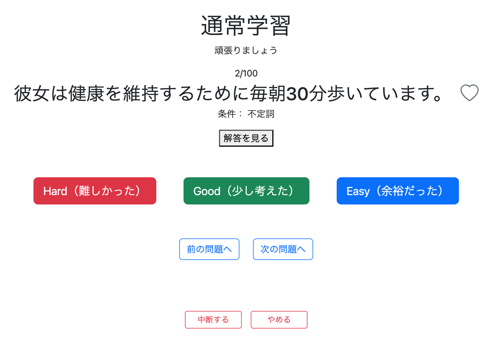
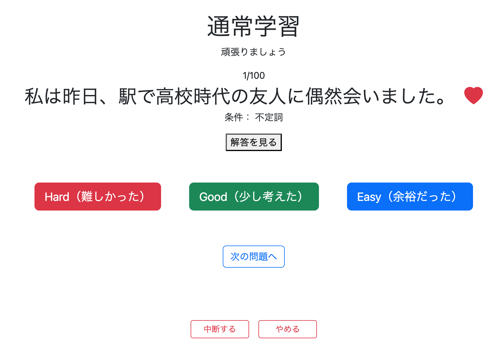
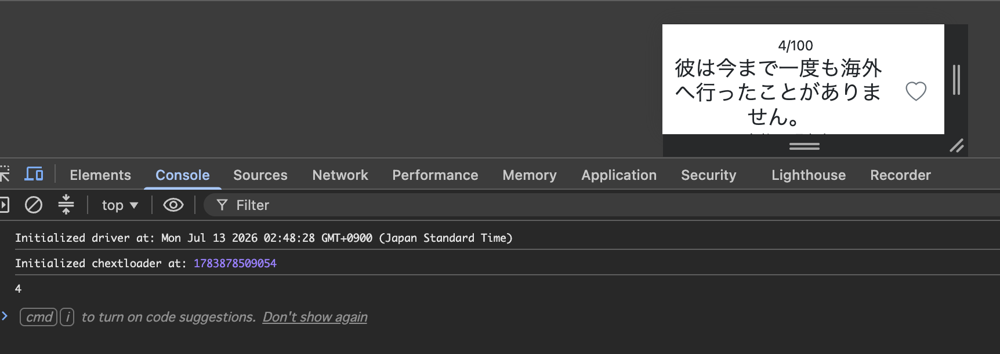
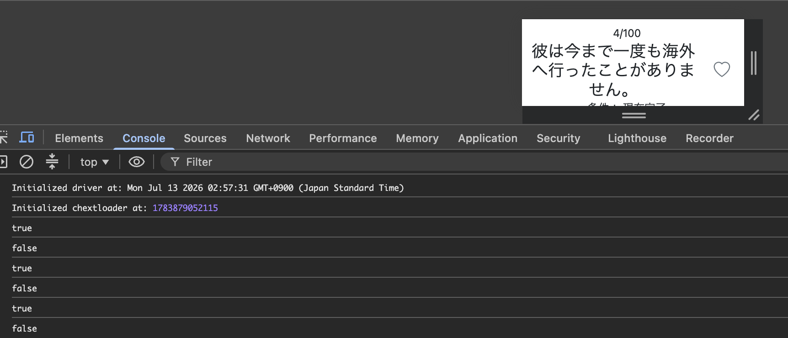

# お気に入り登録機能① 問題をお気に入り登録する

## 概要

通常学習・復習画面から問題をお気に入り登録できる機能を実装する。

仕様

- ハートアイコンを押すとお気に入り登録
- もう一度押すと解除
- 登録状態に応じてハートの色を変更
- ページを再表示してもお気に入り状態を保持する

---

# 1. favoritesテーブルを作成する

まずはお気に入り情報を保存するためのテーブルを作成する。

```sql
CREATE TABLE favorites (
    user_id BIGINT NOT NULL,
    question_id BIGINT NOT NULL,
    created_at TIMESTAMP NOT NULL,

    PRIMARY KEY (user_id, question_id),

    CONSTRAINT fk_favorites_user
        FOREIGN KEY (user_id)
        REFERENCES users(id),

    CONSTRAINT fk_favorites_question
        FOREIGN KEY (question_id)
        REFERENCES question(question_id)
);
```

### ポイント

- 1人のユーザーが同じ問題を複数回お気に入り登録できないように複合主キーにする
- 登録日時を保持するため `created_at` を追加する

---

# 2. FavoritesKey.java を作成する

**Commit**

```text
feat: add composite primary key for favorites
```

```java
@Embeddable
@Data
public class FavoritesKey implements Serializable {

    private Long userId;

    private Long questionId;

}
```

## なぜFavoritesKeyが必要なのか

favoritesテーブルは

```
user_id
question_id
```

の2列で主キーを構成している。

そのためJava側でも

```
(userId, questionId)
```

という1つのオブジェクトとして扱う必要がある。

その役割を持つクラスが `FavoritesKey` である。

---

# 3. Favorites.java を作成する

**Commit**

```text
feat: add Favorites entity
```

```java
@Data
@Entity
@Table(name = "favorites")
public class Favorites {

    @EmbeddedId
    private FavoritesKey favoritesKey;

    private LocalDateTime createdAt;

}
```

## 各アノテーションの役割

### @Entity

JPA管理対象であることを示す。

### @Table(name = "favorites")

このクラスがfavoritesテーブルに対応することを示す。

### @EmbeddedId

複合主キーを表す。

今回は

```
FavoritesKey
```

そのものが主キーになる。

---

# 4. FavoritesRepository を作成する

```java
public interface FavoritesRepository
        extends JpaRepository<Favorites, FavoritesKey> {

}
```

## RepositoryにSQLを書かない理由

JPAでは

```java
favoritesRepository.save(favorite);
```

と書くだけで

```sql
INSERT INTO favorites ...
```

を自動生成してくれる。

逆に

```java
favoritesRepository.deleteById(key);
```

と書くと

```sql
DELETE
FROM favorites
WHERE user_id = ?
AND question_id = ?
```

も自動生成してくれる。

つまりRepositoryにSQLを書く必要がない。

---

## なぜ複合キーなのに deleteById() なのか

Repositoryは

```java
JpaRepository<Favorites, FavoritesKey>
```

となっている。

ここでいう

```
ID
```

とは

```
主キー型
```

という意味である。

単一主キーなら

```java
JpaRepository<User, Long>
```

となるため

```java
userRepository.deleteById(1L);
```

となる。

今回は複合主キーなので

```java
JpaRepository<Favorites, FavoritesKey>
```

となっている。

つまり

```java
FavoritesKey key = new FavoritesKey();
key.setUserId(...);
key.setQuestionId(...);

favoritesRepository.deleteById(key);
```

と書くと、Hibernateが

```sql
DELETE
FROM favorites
WHERE user_id = ?
AND question_id = ?
```

というSQLを自動生成してくれる。

したがって、複合キーであっても `deleteById()` を利用できる。

---

# 5. FavoritesService を作成する

**Commit**

```text
feat: add favorite registration and removal logic
```

```java
@Transactional
@Service
@RequiredArgsConstructor
public class FavoritesService {

    private final UserServiceImpl userServiceImpl;
    private final FavoritesRepository favoritesRepository;

    public boolean toggleFavorite(String loginUser,
                                  long questionId) {

        Users user =
                userServiceImpl.getUserOne(loginUser);

        FavoritesKey key = new FavoritesKey();
        key.setUserId(user.getId());
        key.setQuestionId(questionId);

        Optional<Favorites> optionalFavorites =
                favoritesRepository.findByFavoritesKey(key);

        if (optionalFavorites.isEmpty()) {

            Favorites favorite = new Favorites();
            favorite.setFavoritesKey(key);
            favorite.setCreatedAt(LocalDateTime.now());

            favoritesRepository.save(favorite);

            return true;

        } else {

            favoritesRepository.deleteById(key);

            return false;

        }

    }

}
```

## なぜ戻り値がbooleanなのか

JavaScriptへ

```
true
```

または

```
false
```

を返すためである。

```
true
```

なら

```
♡ → ❤️
```

```
false
```

なら

```
❤️ → ♡
```

と切り替える。

---

## toggleFavoriteという名前にした理由

お気に入り機能は

- 登録
- 削除

しか存在しない。

そのため

```
存在しなければ登録
存在していれば削除
```

という1つのメソッドで両方実現できる。

その動作を表す名前が

```
toggleFavorite()
```

である。

---

# 6. FavoritesRepositoryに検索メソッドを追加する

**Commit**

```text
feat: add findByFavoritesKey to FavoritesRepository
```

```java
public interface FavoritesRepository
        extends JpaRepository<Favorites, FavoritesKey> {

    Optional<Favorites> findByFavoritesKey(
            FavoritesKey favoritesKey);

}
```

## このメソッドの役割

現在の

```
(userId, questionId)
```

の組み合わせが

Favoritesテーブルに存在するかどうか確認する。

この結果によって

- INSERT
- DELETE

のどちらを実行するか決定する。

# 7. FavoritesControllerを作成する

**Commit**

```text
feat: add favorite toggle endpoint
```

まずは通常のPOSTによる実装を考える。

```java
@Controller
@RequiredArgsConstructor
public class FavoritesController {

    private final FavoritesService favoritesService;

    @PostMapping("/favorite")
    public String postFavorite(
            @AuthenticationPrincipal UserDetails loginUser,
            @RequestParam Long questionId,
            @RequestParam Integer page) {

        favoritesService.toggleFavorite(
                loginUser.getUsername(),
                questionId);

        return "redirect:/review/question?page=" + page;

    }

}
```

## この実装でも最低限は動作する

流れは

```
クリック
↓

POST

↓

DB更新

↓

redirect

↓

画面を再表示
```

となる。

しかし今回は

```
クリックした瞬間に

♡

↓

❤️
```

と切り替えたい。

つまり画面全体を再表示するのではなく、

JavaScriptでアイコンだけ変更する設計にしたい。

そのためControllerも少し書き方が変わる。

---

## Ajaxを利用したController

```java
@PostMapping("/favorite/toggle")
@ResponseBody
public boolean toggleFavorite(
        @RequestParam Long questionId,
        @AuthenticationPrincipal UserDetails loginUser) {

    return favoritesService.toggleFavorite(
            loginUser.getUsername(),
            questionId);

}
```

## なぜ@ResponseBodyなのか

今回は画面遷移ではなく

```
true

または

false
```

だけJavaScriptへ返したい。

@ResponseBodyを付けることで

```
true
```

または

```
false
```

がそのままHTTPレスポンスになる。

---

## なぜpageが不要なのか

通常のPOSTでは

```
POST

↓

redirect

↓

同じページへ戻る
```

となるため

```
page
```

が必要だった。

しかし今回は

```
ハートをクリック

↓

POST /favorite/toggle

↓

true または false

↓

JavaScriptがハートだけ変更
```

という流れになる。

ページ遷移そのものが存在しないため

- redirect
- page
- HttpSession

は不要になる。

---

# 8. study/question.htmlを修正する

**Commit**

```text
feat: add favorite icon to study question page
```

まずはハートを表示するだけ実装する。

---

## Bootstrap Iconsを導入する

```html
<link rel="stylesheet"
      href="https://cdn.jsdelivr.net/npm/bootstrap-icons@1.11.3/font/bootstrap-icons.min.css">
```

を追加する。

Bootstrap Iconsを利用すると

```
♡

❤️
```

の切り替えをclassだけで実現できる。

---

## ハートアイコンを追加する

変更前

```html
<h2 th:text="${question.japaneseText}">
    日本語問題
</h2>
```

変更後

```html
<div class="d-flex justify-content-center align-items-center gap-3">

    <h2 class="mb-0"
        th:text="${question.japaneseText}">
        日本語問題
    </h2>

    <button id="favoriteButton"
            type="button"
            class="btn p-0 border-0 bg-transparent">

        <i id="favoriteIcon"
           class="bi bi-heart fs-2 text-secondary"></i>

    </button>

</div>
```

この段階では

- ハートが表示される
- Bootstrap Iconsが利用できる

ことだけ確認する。

クリックしてもまだ何も起こらない。

---

# 9. review/question.htmlも同様に修正する

**Commit**

```text
feat: add favorite icon to review question page
```

study/question.htmlと同様に

- Bootstrap Icons
- ハートアイコン

を配置する。

---

# 確認

- Bootstrap Iconsが表示される
- レイアウトが崩れていない



---

# 一旦ここでストップ

現在のControllerは

```java
@PostMapping("/favorite/toggle")
@ResponseBody
public boolean toggleFavorite(...) {

    return favoritesService.toggleFavorite(...);

}
```

となっている。

しかしこれは

```
クリックされた後
```

の処理しか担当していない。

つまり

```
押された

↓

DB更新

↓

true または falseを返す
```

だけである。

---

## 問題点

例えば

```
QuestionID = 5
```

がお気に入り登録済みだった場合、

ページを開いた瞬間から

```
❤️
```

と表示されてほしい。

しかし今のままでは

```
♡

↓

クリック

↓

❤️
```

しかできない。

初期表示の判定処理が存在しないからである。

---

# 初期表示の仕組みを追加する

ページを表示した瞬間に

```
Favoritesテーブル

↓

この問題は登録済み？

↓

true / false
```

を取得し、

HTMLへ渡す必要がある。

---

## どこを修正するか

一番自然なのは

```
StudyController

GET /study/question
```

である。

画面表示時に

```
FavoritesService

↓

FavoritesRepository

↓

DB
```

へ問い合わせを行い、

```
true

または

false
```

をModelへ格納する。

HTMLはその値を利用して

```
♡

または

❤️
```

を表示する。

---

## FavoritesControllerのtrue/falseとの違い

### StudyController

```
true

↓

最初から❤️を表示する
```

初期表示を決定するためのbooleanである。

---

### FavoritesController

```
true

↓

登録成功

↓

JavaScriptが❤️へ変更
```

クリック後の表示を変更するためのbooleanである。

同じbooleanでも

役割はまったく異なる。

# 10. StudyControllerを修正する

**Commit**

```text
feat: add favorite status to study question page
```

ページ表示時に

```
現在表示している問題
```

がお気に入り登録済みかどうか取得する。

```java
@GetMapping("/study/question")
public String getStudyQuestion(
        Model model,
        HttpSession session,
        @RequestParam(defaultValue = "0") int page,
        @AuthenticationPrincipal UserDetails loginUser) {

    // Sessionからquestions取得
    List<Question> questions =
            (List<Question>) session.getAttribute("studyQuestions");

    // /questionへの直接アクセスを禁止
    if (questions == null) {
        return "redirect:/study/menu";
    }

    // 現在表示する問題を取得
    Question question = questions.get(page);

    // HTMLへ必要な情報を渡す
    questionModelUtil.setQuestionModel(
            model,
            questions,
            page);

    // お気に入り判定
    if (loginUser != null) {

        boolean isFavorite =
                favoritesService.isFavorite(
                        loginUser.getUsername(),
                        question.getQuestionId());

        model.addAttribute(
                "isFavorite",
                isFavorite);

    }

    return "study/question";

}
```

---

## なぜQuestionを取得するのか

```java
Question question = questions.get(page);
```

が追加された理由は

```
question.getQuestionId()
```

を取得するためである。

Favoritesテーブルを検索するには

```
userId

questionId
```

が必要になる。

そのため現在表示している問題を取得して

```
questionId
```

を取り出している。

---

# 11. FavoritesServiceへisFavorite()を追加する

**Commit**

```text
feat: add favorite status check to FavoritesService
```

```java
public boolean isFavorite(
        String loginUser,
        long questionId) {

    FavoritesKey key =
            createFavoritesKey(
                    loginUser,
                    questionId);

    return favoritesRepository.existsById(key);

}
```

---

## existsById()とは

JpaRepositoryが最初から持っているメソッドである。

```
存在する

↓

true

存在しない

↓

false
```

を返してくれる。

---

## なぜ複合キーなのにexistsById()なのか

Repositoryは

```java
JpaRepository<Favorites, FavoritesKey>
```

となっている。

つまり

```
ID

=

FavoritesKey
```

という意味になる。

したがって

```java
favoritesRepository.existsById(key);
```

と書くだけで

Hibernateが

```sql
SELECT ...

WHERE user_id = ?

AND question_id = ?
```

というSQLを自動生成してくれる。

つまり

```
Id

=

単一主キー
```

ではなく

```
Id

=

主キー全体
```

という意味なのである。

---

# 12. 重複コードを共通メソッドへ切り出す

isFavorite()

toggleFavorite()

両方で

```java
Users user = userServiceImpl.getUserOne(loginUser);

FavoritesKey key = new FavoritesKey();

key.setUserId(user.getId());

key.setQuestionId(questionId);
```

というコードを書いていた。

これは重複コードなので

共通メソッドへ切り出す。

```java
private FavoritesKey createFavoritesKey(
        String loginUser,
        long questionId) {

    Users user =
            userServiceImpl.getUserOne(loginUser);

    FavoritesKey key =
            new FavoritesKey();

    key.setUserId(user.getId());

    key.setQuestionId(questionId);

    return key;

}
```

---

## isFavorite()も修正

```java
public boolean isFavorite(
        String loginUser,
        long questionId) {

    FavoritesKey key =
            createFavoritesKey(
                    loginUser,
                    questionId);

    return favoritesRepository.existsById(key);

}
```

toggleFavorite()も同様に

```
createFavoritesKey()
```

を利用するよう修正する。

---

# 13. study/question.htmlを修正する

**Commit**

```text
feat: display favorite status on study question page
```

固定表示だった

```html
<i id="favoriteIcon"
   class="bi bi-heart fs-2 text-secondary">
</i>
```

を

```html
<i id="favoriteIcon"
   th:class="${isFavorite}
        ? 'bi bi-heart-fill fs-2 text-danger'
        : 'bi bi-heart fs-2 text-secondary'">
</i>
```

へ変更する。

---

## 何をしているのか

Controllerから渡された

```
isFavorite
```

を利用して

```
true

↓

❤️
```

```
false

↓

♡
```

を初期表示する。

まだクリックはできない。

---

# 14. 初期表示を確認する

まだJavaScriptを実装していないため

ハートからお気に入り登録することはできない。

そこで

pgAdmin4から直接Favoritesテーブルへデータを登録する。

```sql
INSERT INTO favorites (
    user_id,
    question_id,
    created_at
)
VALUES (
    1,
    1,
    '2026-07-12 10:30:00'
);
```

その後

```
QuestionID = 1
```

の問題を表示すると

最初から

```
❤️
```

になっていれば成功。



---

# 15. JavaScriptを実装する

ここからは

```
クリック

↓

Controller

↓

DB更新

↓

画面変更
```

をJavaScriptで実現する。

流れは以下のようになる。

```
① ハートをクリック

↓

② JavaScript

questionId取得

↓

③ FavoritesController

↓

④ FavoritesService

↓

⑤ FavoritesRepository

↓

save()

または

deleteById()

↓

⑥ Controller

true

または

false

↓

⑦ JavaScript

❤️

または

♡
```

# 16. JavaScript実装① ハートがクリックされたことを確認する

**Commit**

```text
feat: add click event to favorite button
```

まずはJavaScriptが正常に動作しているか確認する。

```javascript
const favoriteButton = document.getElementById("favoriteButton");

if (favoriteButton) {

    favoriteButton.addEventListener("click", function () {

        console.log("clicked");

    });

}
```

---

## このコードの役割

まず

```javascript
const favoriteButton =
        document.getElementById("favoriteButton");
```

でHTML上のハートボタンを取得する。

続いて

```javascript
favoriteButton.addEventListener("click", ...);
```

によって

```
クリックされたら
```

実行される処理を登録している。

今回は

```javascript
console.log("clicked");
```

だけ実行する。

---

## なぜif文を書くのか

study.jsは

```
study/question

review/question

その他
```

など複数画面で読み込まれる可能性がある。

もし

```
favoriteButton
```

が存在しないページで

```javascript
favoriteButton.addEventListener(...)
```

を実行すると

```
Cannot read properties of null
```

というエラーになる。

そのため

```javascript
if (favoriteButton)
```

で存在確認を行っている。

---

## 確認

```
/study/question
```

を開く。

ブラウザで

```
F12

↓

Console
```

を開き

ハートをクリックする。

```
clicked
```

と表示されれば成功。

---

# 17. JavaScript実装② questionIdを取得する

---

## study/question.htmlを修正する

**Commit**

```text
feat: add questionId data attribute to favorite button
```

ボタンへ

```
questionId
```

を持たせる。

変更前

```html
<button id="favoriteButton"
        type="button"
        class="btn p-0 border-0 bg-transparent">
```

変更後

```html
<button id="favoriteButton"
        type="button"
        class="btn p-0 border-0 bg-transparent"
        th:data-question-id="${question.questionId}">
```

---

## data-question-idとは

```
data-○○
```

はHTML5で追加された

**任意のデータをHTML要素へ持たせるための属性**

である。

例えば

```html
<button
    data-question-id="25">
```

なら

このボタン自身が

```
QuestionID = 25
```

という情報を保持していることになる。

JavaScriptでは

```javascript
favoriteButton.dataset.questionId
```

と書くだけで取得できる。

---

## study.jsを修正する

**Commit**

```text
feat: get questionId from favorite button
```

変更前

```javascript
const favoriteButton = document.getElementById("favoriteButton");

if (favoriteButton) {

    favoriteButton.addEventListener("click", function () {

        console.log("clicked");

    });

}
```

変更後

```javascript
const favoriteButton = document.getElementById("favoriteButton");

if (favoriteButton) {

    favoriteButton.addEventListener("click", function () {

        const questionId =
                favoriteButton.dataset.questionId;

        console.log(questionId);

    });

}
```

---

## 何をしているのか

HTMLへ埋め込まれた

```
questionId
```

をJavaScriptで取得している。

この値は

後ほどControllerへ送信する。

---

## 確認

例えば

```
QuestionID = 4
```

なら

Consoleへ

```
4
```

と表示されれば成功。



---

# 18. JavaScript実装③ ControllerへPOSTする

---

## CSRFトークンをHTMLへ追加する

**Commit**

```text
feat: add CSRF meta tags for Ajax requests
```

Spring Securityでは

```
POST

PUT

DELETE
```

などを行う場合

CSRFトークンが必須になる。

そのため

```html
<meta name="_csrf"
      th:content="${_csrf.token}">

<meta name="_csrf_header"
      th:content="${_csrf.headerName}">
```

を追加する。

これが無いと

```
403 Forbidden
```

になる。

---

## study.jsを修正する

**Commit**

```text
feat: implement Ajax favorite toggle request
```

```javascript
const favoriteButton =
        document.getElementById("favoriteButton");

if (favoriteButton) {

    favoriteButton.addEventListener("click", function () {

        const questionId =
                favoriteButton.dataset.questionId;

        const csrfToken =
            document.querySelector(
                'meta[name="_csrf"]').content;

        const csrfHeader =
            document.querySelector(
                'meta[name="_csrf_header"]').content;

        fetch("/favorite/toggle", {

            method: "POST",

            headers: {
                "Content-Type":
                    "application/x-www-form-urlencoded",

                [csrfHeader]:
                    csrfToken
            },

            body:
                "questionId=" + questionId

        })

        .then(response => response.text())

        .then(result => {

            console.log(result);

        });

    });

}
```

---

## fetch()とは

JavaScriptから

```
Spring Boot
```

へHTTP通信を行うためのAPIである。

今回は

```
POST

/favorite/toggle
```

へアクセスしている。

---

## headersとは

Spring Securityへ

```
CSRFトークン
```

を送信する。

これが無いと

```
403 Forbidden
```

となる。

---

## bodyとは

Controllerへ渡すリクエストパラメータである。

今回は

```
questionId
```

だけ送信している。

Controllerでは

```java
@RequestParam Long questionId
```

として受け取っている。

---

## response.text()とは

Controllerは

```java
@ResponseBody
public boolean ...
```

となっている。

つまり

```
true

または

false
```

だけ返す。

その文字列を受け取るため

```
response.text()
```

を利用している。

---

## 確認

ハートをクリックすると

FavoritesControllerの

```java
@PostMapping("/favorite/toggle")
```

まで到達する。

Consoleへ

```
true
```

または

```
false
```

が表示されれば成功。



通信まで成功したことになる。

# 19. JavaScript実装④ ハートの見た目を切り替える

**Commit**

```text
feat: toggle favorite icon after Ajax request
```

通信が成功したら、

Controllerから返ってきた

```
true

または

false
```

に応じて

```
♡

↓

❤️
```

または

```
❤️

↓

♡
```

へ変更する。

---

## アイコンを取得する

まず

```javascript
const favoriteIcon =
        document.getElementById("favoriteIcon");
```

で

HTML上のハートアイコンを取得する。

---

## Ajax通信の結果を利用する

変更前

```javascript
.then(result => {

    console.log(result);

});
```

変更後

```javascript
.then(result => {

    const favoriteIcon =
            document.getElementById("favoriteIcon");

    if (result === "true") {

        favoriteIcon.classList.remove(
                "bi-heart",
                "text-secondary");

        favoriteIcon.classList.add(
                "bi-heart-fill",
                "text-danger");

    } else {

        favoriteIcon.classList.remove(
                "bi-heart-fill",
                "text-danger");

        favoriteIcon.classList.add(
                "bi-heart",
                "text-secondary");

    }

});
```

---

## classListとは

HTML要素の

```
class
```

をJavaScriptから操作するためのAPIである。

例えば

```html
<i class="bi bi-heart fs-2 text-secondary"></i>
```

なら

```
class

↓

bi
bi-heart
fs-2
text-secondary
```

という4つのclassを持っている。

---

## classList.remove()

不要になったclassを削除する。

例えば

```javascript
favoriteIcon.classList.remove(
        "bi-heart",
        "text-secondary");
```

を実行すると

```
♡

灰色
```

を表すclassが削除される。

---

## classList.add()

新しいclassを追加する。

```javascript
favoriteIcon.classList.add(
        "bi-heart-fill",
        "text-danger");
```

を実行すると

```
❤️

赤色
```

を表すclassが追加される。

つまり

```
♡

↓

❤️
```

が実現できる。

逆に

```javascript
favoriteIcon.classList.remove(
        "bi-heart-fill",
        "text-danger");

favoriteIcon.classList.add(
        "bi-heart",
        "text-secondary");
```

なら

```
❤️

↓

♡
```

へ戻る。

---

## なぜHTMLを書き換えないのか

Bootstrap Iconsは

```
bi-heart

と

bi-heart-fill
```

をclassだけで切り替えられるよう設計されている。

そのため

HTMLそのものを書き換える必要はなく、

```
class
```

だけ変更すれば十分である。

---

## 確認

ハートをクリックすると

```
♡

↓

❤️
```

または

```
❤️

↓

♡
```

へ切り替われば成功。


---

# 20. 最終確認

見た目だけでなく

pgAdmin4でも

Favoritesテーブルを確認する。

```
❤️

↓

INSERT
```

```
♡

↓

DELETE
```

が実際に行われていれば成功である。

つまり

```
JavaScript

↓

Controller

↓

Service

↓

Repository

↓

Database
```

まで一連の流れが完成したことになる。

---

# 所感

お気に入り機能は

単純に見えるが、

実際には

- テーブル設計
- 複合主キー
- JPA
- Service
- Controller
- Thymeleaf
- JavaScript
- Ajax
- Spring Security(CSRF)
- Bootstrap Icons

など、多くの技術が連携して初めて完成する機能である。

今回の実装では、

バックエンド側の処理は比較的スムーズに組み立てられるようになってきた。

一方で、

JavaScriptによる

- DOM操作
- イベント登録
- fetch()
- 非同期通信
- Bootstrap Iconsの制御

など、

フロントエンド側の実装では時間を要した。

しかし、

```
クリック

↓

JavaScript

↓

Controller

↓

Service

↓

Repository

↓

Database

↓

Controller

↓

JavaScript

↓

画面更新
```

という一連の流れを理解できたことは非常に大きい。

今後JavaScriptを書く際にも、

「どこが何を担当しているのか」

を意識できるようになるため、

今回の経験は今後のWebアプリ開発でも大いに役立つ。

---

# 次にやること

次は同じお気に入り機能を

```
review/question
```

にも実装する。

その後、

ログイン後のメニュー画面から

```
お気に入り一覧
```

を表示できる機能を作成し、

お気に入り登録した問題だけを復習できる機能へ発展させる。

