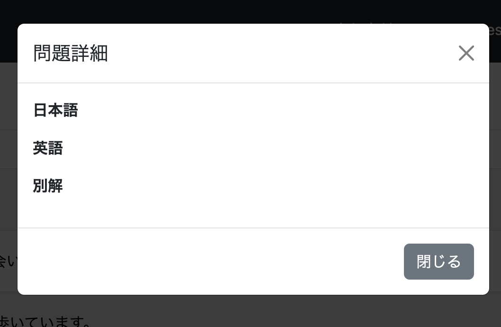
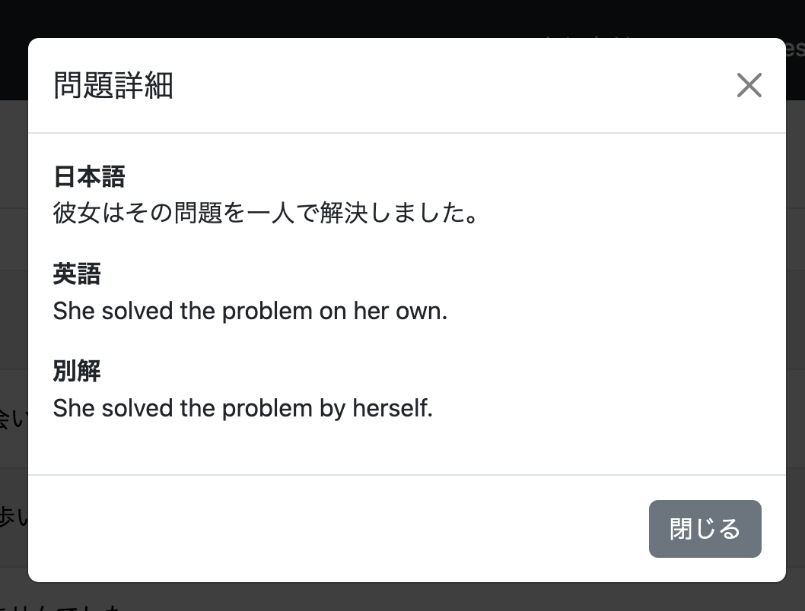
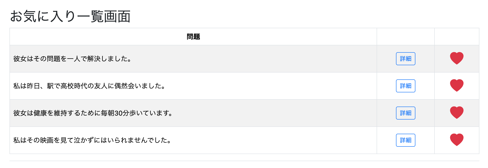
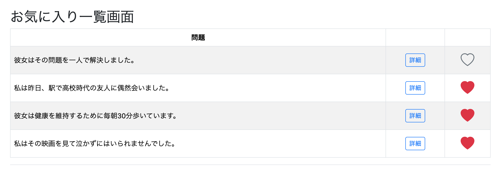
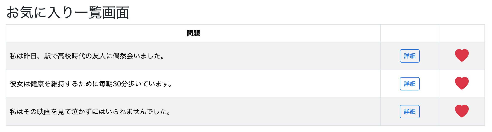

# お気に入り登録機能②
## ①をReviewに実装し、ログインメニューでお気に入り登録した問題一覧を確認する

①で通常学習画面に実装したお気に入り登録機能を、復習画面（Review）にも実装する。

また、ログイン後のメニューからユーザーがお気に入り登録した問題一覧を確認できる画面も実装する。

今回は

- Review画面へのお気に入り登録機能追加
- お気に入り一覧画面の作成

の2つをまとめて実装する。

通常学習画面へのお気に入り登録機能とReview画面への実装内容はほぼ同じであり、別々に学習ログへ残すよりも1つにまとめた方が実装の流れが分かりやすいと判断したためである。

---

# 実装1 Reviewにもお気に入り登録機能を実装する

## ReviewController
(feat: add favorite status to review question page)

### 修正前

```java
@GetMapping("/review/question")
public String getReviewQuestion(Model model,
                                HttpSession session,
                                @RequestParam(defaultValue = "0") int page) {

    List<Question> questions =
            (List<Question>) session.getAttribute("reviewQuestions");

    if (questions == null) {
        return "redirect:/";
    }

    questionModelUtil.setQuestionModel(model, questions, page);

    return "review/question";
}
```

### 修正後

```java
@GetMapping("/review/question")
public String getReviewQuestion(Model model,
                                HttpSession session,
                                @RequestParam(defaultValue = "0") int page,
                                @AuthenticationPrincipal UserDetails loginUser) {

    List<Question> questions =
            (List<Question>) session.getAttribute("reviewQuestions");

    if (questions == null) {
        return "redirect:/review/menu";
    }

    Question question = questions.get(page);

    questionModelUtil.setQuestionModel(model, questions, page);

    if (loginUser != null) {

        boolean isFavorite =
                favoritesService.isFavorite(
                        loginUser.getUsername(),
                        question.getQuestionId());

        model.addAttribute(
                "isFavorite",
                isFavorite);

    }

    return "review/question";
}
```

---

## 実装内容

通常学習画面と同様に、現在表示している問題がお気に入り登録済みかどうかを判定する。

そのために、

```java
Question question =
        questions.get(page);
```

で現在表示中の問題を取得する。

その後、

```java
favoritesService.isFavorite(...)
```

を呼び出し、

```
true
```

または

```
false
```

を取得する。

取得した結果を

```java
model.addAttribute(
    "isFavorite",
    isFavorite);
```

でModelへ渡す。

HTMLではこの値を利用して、

- 赤いハート
- 灰色ハート

を切り替える。

---

# review/question.html
(feat: add favorite support to review question page)

## ① CSRFトークンを追加する

AjaxでPOST通信を行うため、

```html
<meta name="_csrf"
      th:content="${_csrf.token}">

<meta name="_csrf_header"
      th:content="${_csrf.headerName}">
```

を追加する。

JavaScriptでは

```javascript
document.querySelector(
    'meta[name="_csrf"]')
```

のように取得して利用する。

---

## ② ハートボタンへ問題IDを持たせる

修正前

```html
<button id="favoriteButton"
        type="button"
        class="btn p-0 border-0 bg-transparent">

    <i id="favoriteIcon"
       class="bi bi-heart fs-2 text-secondary"></i>

</button>
```

修正後

```html
<button id="favoriteButton"
        type="button"
        class="btn p-0 border-0 bg-transparent"
        th:data-question-id="${question.questionId}">

    <i id="favoriteIcon"
       th:class="${isFavorite}
            ? 'bi bi-heart-fill fs-2 text-danger'
            : 'bi bi-heart fs-2 text-secondary'">
    </i>

</button>
```

---

## 実装内容

JavaScriptがお気に入り登録・解除を行うためには、

```
questionId
```

が必要になる。

そのため、

```html
th:data-question-id
```

を追加し、

現在表示している問題IDをボタンへ保持させる。

JavaScriptでは

```javascript
button.dataset.questionId
```

で取得できる。

また、

Controllerから渡された

```java
isFavorite
```

を利用し、

```html
th:class
```

でハートアイコンを切り替える。

お気に入り登録済みなら

```
bi-heart-fill
text-danger
```

未登録なら

```
bi-heart
text-secondary
```

が表示されるようになった。

---

## 確認

Review画面でも通常学習画面と同様に、

- お気に入り登録済みなら赤いハート
- 未登録なら灰色ハート

が表示されるようになった。

# 実装2 お気に入り登録した問題一覧を表示する

ログイン後のメニューから、ユーザーがお気に入り登録した問題だけを一覧表示できる画面を作成する。

---

## 一覧画面の仕様を考える

実装に入る前に、お気に入り一覧画面をどのようなUIにするかを整理した。

### 一覧画面の構成

- 表形式で表示する
- 左から
  - 問題
  - 詳細
  - ハートマーク
  の3列とする

### 問題列

お気に入り登録した問題の日本語文を表示する。

### 詳細列

「詳細」ボタンを配置する。

クリックすると問題の

- 日本語
- 英語
- 別解

を表示する。

当初はJavaScriptのalertで表示することも考えたが、最終的にはBootstrapのモーダルを採用することにした。

### ハート列

ハートマークを配置する。

一覧画面から直接

- お気に入り登録解除
- 再登録

ができるようにする。

### ページング

お気に入り登録数が非常に多くなる可能性も考え、

後ほどページング機能も追加する予定とした。

---

# DB設計

お気に入り登録した問題一覧を取得するSQLを考える。

```sql
SELECT q.*
FROM favorites f
JOIN question q
ON f.question_id = q.question_id
WHERE f.user_id = :userId
ORDER BY f.created_at ASC;
```

favoritesテーブルには問題文そのものは保存されていない。

そのため、

```
favorites
```

と

```
question
```

をJOINし、

Questionエンティティとして取得する。

---

# FavoritesRepository
(feat: add favorite list query to FavoritesRepository)

```java
@Query(value = """
    SELECT q.*
    FROM favorites f
    JOIN question q
    ON f.question_id = q.question_id
    WHERE f.user_id = :userId
    ORDER BY f.created_at
    """, nativeQuery = true)

List<Question> getFavoritesList(
        @Param("userId") Long userId);
```

---

## 実装内容

ネイティブSQLを使用して、

お気に入り登録された問題一覧を取得する。

戻り値は

```java
List<Question>
```

としているため、

HTMLでは通常のQuestion一覧と同じように扱える。

---

# FavoritesService
(feat: add favorite list retrieval to FavoritesService)

当初は

```java
public List<Question> getFavoritesList(String loginUser)
```

として、

Service内で

```java
Users user =
    userServiceImpl.getUserOne(loginUser);
```

を呼び出していた。

しかし、

ユーザー情報の取得はControllerの責務である。

そのため、この実装は適切ではなかった。

---

## リファクタリング
(refactor: move user lookup from FavoritesService to controller)

Serviceは

```java
public List<Question> getFavoritesList(Long userId)
```

だけを受け取る形へ修正した。

```java
public List<Question> getFavoritesList(Long userId) {

    return favoritesRepository.getFavoritesList(userId);

}
```

ServiceはRepositoryを呼び出すことだけに責務を限定した。

---

# FavoriteController
(feat: add favorite list page controller)

```java
@GetMapping("/favorites/list")
public String getFavoritesList(
        @AuthenticationPrincipal UserDetails loginUser,
        Model model) {

    Users user =
            userServiceImpl.getUserOne(
                    loginUser.getUsername());

    List<Question> favoritesList =
            favoritesService.getFavoritesList(
                    user.getId());

    model.addAttribute(
            "favoritesList",
            favoritesList);

    return "favorite/list";
}
```

---

## 実装内容

Controllerでは

まずログインユーザーを取得する。

```java
Users user =
    userServiceImpl.getUserOne(...)
```

取得したユーザーIDを

FavoritesServiceへ渡し、

お気に入り一覧を取得する。

最後に

```java
model.addAttribute(...)
```

でHTMLへ渡す。

---

# favorites/list.html

一覧画面は実装量が多いため、

段階的に実装する。

まずは

- 問題一覧
- ハートマーク

だけ表示できるようにする。

---

## head

Bootstrap Iconsを利用するため、

```html
<link rel="stylesheet"
      href="https://cdn.jsdelivr.net/npm/bootstrap-icons@1.11.3/font/bootstrap-icons.min.css">
```

を追加する。

また、

一覧画面専用JavaScriptとして

```html
<script th:src="@{/js/favorites.js}" defer></script>
```

を読み込む。

---

## 一覧表示

```html
<tbody>

<tr th:each="item : ${favoritesList}">

    <td class="text-start"
        th:text="${item.japaneseText}">
    </td>

    <td class="align-middle">
        <!-- 詳細ボタン -->
    </td>

    <td>

        <button
            type="button"
            class="favoriteButton btn p-0 border-0 bg-transparent"
            th:data-question-id="${item.questionId}">

            <i class="bi bi-heart-fill fs-2 text-danger"></i>

        </button>

    </td>

</tr>

</tbody>
```

---

## 実装内容

Controllerから受け取った

```java
favoritesList
```

を

```html
th:each
```

で繰り返し表示する。

問題文は

```html
item.japaneseText
```

を表示する。

ハートマークは、

一覧画面に表示される時点では全てお気に入り登録済みであるため、

最初から

```
bi-heart-fill
text-danger
```

を指定し、

赤いハートを表示する。

この時点では、

ハートをクリックしても

登録・解除処理はまだ実装していない。

まずは一覧画面を表示できることを優先した。

# 詳細モーダルを実装する
(feat: add question detail modal to favorite list)

問題一覧から英訳を確認できるように、「詳細」ボタンを押すとモーダルが表示される機能を実装する。

一覧画面では問題数が多くなることが想定されるため、別ページへ遷移するのではなく、Bootstrapのモーダルを利用することにした。

---

## ① 「詳細」ボタンを作成する

まずは各問題に「詳細」ボタンを追加する。

```html
<button
    type="button"
    class="detailButton btn btn-outline-primary btn-sm"
    data-bs-toggle="modal"
    data-bs-target="#questionDetailModal">
    詳細
</button>
```

---

### 実装内容

Bootstrapでは

```html
data-bs-toggle="modal"
```

を指定すると、

このボタンをクリックしたときにモーダルを開くことができる。

さらに

```html
data-bs-target="#questionDetailModal"
```

で、

どのモーダルを表示するのかを指定している。

ここで指定している

```
questionDetailModal
```

は、この後作成するモーダル本体のidである。

---

## ② モーダル本体を作成する

一覧の下へモーダルを1つだけ配置する。

```html
<div class="modal fade" id="questionDetailModal">

    <div class="modal-dialog">

        <div class="modal-content">

            <div class="modal-header">

                <h5 class="modal-title">
                    問題詳細
                </h5>

                <button
                    type="button"
                    class="btn-close"
                    data-bs-dismiss="modal">
                </button>

            </div>

            <div class="modal-body">

                <p>
                    <strong>日本語</strong><br>
                    <span id="modalJapanese"></span>
                </p>

                <p>
                    <strong>英語</strong><br>
                    <span id="modalEnglish"></span>
                </p>

                <p id="modalAlternativeArea">

                    <strong>別解</strong><br>

                    <span id="modalAlternative"></span>

                </p>

            </div>

            <div class="modal-footer">

                <button
                    type="button"
                    class="btn btn-secondary"
                    data-bs-dismiss="modal">

                    閉じる

                </button>

            </div>

        </div>

    </div>

</div>
```

---

## モーダルの構造

Bootstrapのモーダルは

```
modal
    ↓
modal-dialog
    ↓
modal-content
```

という階層構造になっている。

さらに

```
modal-header
```

```
modal-body
```

```
modal-footer
```

へ分割することで、

ヘッダー・本文・フッターを整理できる。

今回は

本文部分へ

- 日本語
- 英語
- 別解

を表示する。

---

## なぜモーダルは1つだけなのか

一覧画面では

```html
<tr th:each="item : ${favoritesList}">
```

によって問題数だけ行が生成される。

もし各行ごとにモーダルを作ると、

100件表示した場合、

モーダルも100個生成されることになる。

そこで、

モーダルは1つだけ用意し、

クリックした問題のデータだけを書き換える方式を採用した。

---

## なぜモーダルでは `${item.xxx}` が使えないのか

一覧部分では

```html
<tr th:each="item : ${favoritesList}">
```

の内部であるため、

```html
${item.japaneseText}
```

などが使用できる。

しかし、

モーダル本体は

```html
th:each
```

の外側へ配置している。

そのため、

```
item
```

という変数自体が存在しない。

したがって

```html
${item.japaneseText}
```

などを書くことはできない。

---

## ③ 問題データをボタンへ保持する

そこで、

ボタンへ問題データを持たせる。

```html
<button

    class="detailButton"

    th:data-japanese="${item.japaneseText}"

    th:data-english="${item.englishText}"

    th:data-alternative="${item.alternativeAnswer}">

    詳細

</button>
```

`th:data-*`

を利用すると、

Thymeleafの値を

HTML5の

```
data-*
```

属性へ保存できる。

例えば

```html
th:data-japanese="${item.japaneseText}"
```

は、

最終的に

```html
data-japanese="私は昨日学校へ行きました。"
```

のようなHTMLへ変換される。

JavaScriptでは

```javascript
button.dataset.japanese
```

で取得できる。

---

## ④ BootstrapのJavaScriptを読み込む

モーダルを動作させるため、

Bootstrap Bundleを追加する。

```html
<script
    th:src="@{/webjars/bootstrap/js/bootstrap.bundle.min.js}">
</script>
```

Bundle版には

モーダルに必要なJavaScriptが含まれている。

---

## 確認

「詳細」ボタンをクリックすると、

Bootstrapのモーダルが表示されるようになった。

ただし、

この時点では

- 日本語
- 英語
- 別解

はまだ表示されず、

モーダルの中身は空である。

次にJavaScriptを利用して、

クリックした問題のデータをモーダルへ表示する処理を実装する。



---

# モーダルへ問題データを表示する
(feat: display question detail in modal)

モーダル自体は表示されるようになったため、

次はクリックした問題の

- 日本語
- 英語
- 別解

を表示する処理を実装する。

# JavaScriptで問題データをモーダルへ表示する
(feat: display question detail in modal)

モーダル自体は表示されるようになったが、この時点では中身は空である。

そこで、「詳細」ボタンを押した問題の

- 日本語
- 英語
- 別解（存在する場合のみ）

をJavaScriptでモーダルへ表示する。

---

## favorites.jsを作成する

一覧画面専用のJavaScriptとして

```
favorites.js
```

を作成する。

まずはHTMLの読み込み完了を待つ。

```javascript
document.addEventListener("DOMContentLoaded", function () {

});
```

---

## 「詳細」ボタンを取得する

```javascript
const detailButtons =
    document.querySelectorAll(".detailButton");
```

一覧に存在するすべての「詳細」ボタンを取得する。

---

## 各ボタンへクリックイベントを追加する

```javascript
detailButtons.forEach(function(button) {

    button.addEventListener("click", function() {

    });

});
```

どの問題の「詳細」ボタンを押しても、

クリックした問題のデータを取得できるようになる。

---

## ボタンへ保存していたデータを取得する

```javascript
const japanese =
    button.dataset.japanese;

const english =
    button.dataset.english;

const alternative =
    button.dataset.alternative;
```

ここで取得している値は

```html
th:data-japanese

th:data-english

th:data-alternative
```

へ保存していたデータである。

---

## モーダルへデータを表示する

```javascript
document.getElementById("modalJapanese").textContent =
    japanese;

document.getElementById("modalEnglish").textContent =
    english;
```

HTMLでは

```html
<span id="modalJapanese"></span>

<span id="modalEnglish"></span>

<span id="modalAlternative"></span>
```

だけを配置している。

JavaScriptで値を代入することで、

クリックした問題の内容を表示できる。

---

## 別解が存在する場合のみ表示する

まず

```javascript
const alternativeArea =
    document.getElementById("modalAlternativeArea");
```

を取得する。

別解が存在する場合

```javascript
document.getElementById("modalAlternative").textContent =
    alternative;

alternativeArea.style.display =
    "";
```

別解が存在しない場合

```javascript
document.getElementById("modalAlternative").textContent =
    "";

alternativeArea.style.display =
    "none";
```

別解が存在しない問題では、

「別解」という見出しごと非表示にしている。

---

## 確認

「詳細」ボタンを押すと、

- 日本語
- 英語
- 別解（存在する場合のみ）

がモーダルへ表示されるようになった。



---

# ハートマークによるお気に入り登録・解除
(feat: implement favorite toggle with ajax)

一覧画面では、

表示される問題はすべてお気に入り登録済みである。

そのため、

まずは赤いハートを表示する。

```html
<td>

    <button
        type="button"
        class="favoriteButton btn p-0 border-0 bg-transparent"
        th:data-question-id="${item.questionId}">

        <i class="bi bi-heart-fill fs-2 text-danger"></i>

    </button>

</td>
```

この時点では、

見た目が赤いだけであり、

クリックしても何も処理は行われない。

---

## CSRFトークンを追加する

Spring Securityでは、

POST通信時にCSRFトークンが必要になる。

そのため、

```html
<meta name="_csrf"
      th:content="${_csrf.token}">

<meta name="_csrf_header"
      th:content="${_csrf.headerName}">
```

を追加する。

JavaScriptでは

```javascript
document.querySelector(...)
```

で取得し、

Ajax通信時のヘッダーへ設定する。

---

## Ajaxでお気に入り登録・解除を行う

favorites.jsへ、

お気に入りボタンのクリック処理を追加する。

まず、

```javascript
const favoriteButtons =
    document.querySelectorAll(".favoriteButton");
```

で一覧のハートボタンを取得する。

クリックされると、

```javascript
button.dataset.questionId
```

から問題IDを取得する。

その後、

```javascript
fetch("/favorite/toggle")
```

を利用して、

Spring BootへPOST通信を行う。

---

## Spring Bootからの戻り値

Controllerでは

```
true
```

または

```
false
```

を返す。

- true
    - お気に入り登録された

- false
    - お気に入り登録解除された

JavaScriptでは、

この戻り値を利用して

ハートの見た目を切り替える。

登録済みなら

```javascript
favoriteIcon.classList.remove(
    "bi-heart",
    "text-secondary");

favoriteIcon.classList.add(
    "bi-heart-fill",
    "text-danger");
```

解除された場合は

```javascript
favoriteIcon.classList.remove(
    "bi-heart-fill",
    "text-danger");

favoriteIcon.classList.add(
    "bi-heart",
    "text-secondary");
```

を実行する。

これにより、

DBの状態と画面表示を一致させられる。

---

## 確認

実際にハートマークをクリックすると、

- ハートの色が切り替わる
- favoritesテーブルが更新される

ことを確認した。

また、

問題をお気に入り解除したあと一覧画面へ戻ると、

その問題はお気に入り一覧から表示されなくなることも確認できた。





---

# 所感

今回もバックエンドの実装自体は比較的短時間で完了した。

一方で、

- Bootstrapモーダル
- JavaScript
- Ajax
- CSRF
- アイコンの動的切り替え

などフロントエンド側の実装には予想以上に時間を要した。

特にモーダルは、

HTML・Bootstrap・JavaScriptが連携して初めて動作するため、

バックエンド中心の開発とは異なる難しさを感じた。

一方で、

今回の実装を通して

- data属性の利用方法
- Bootstrapモーダル
- fetchを用いたAjax通信
- Spring SecurityにおけるCSRF対策

など、

今後も再利用できる実装パターンを学ぶことができた。

---

# 次にやること

お気に入り一覧画面へページング機能を導入する。