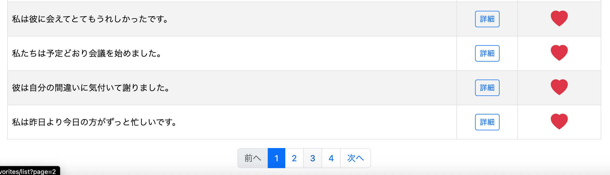
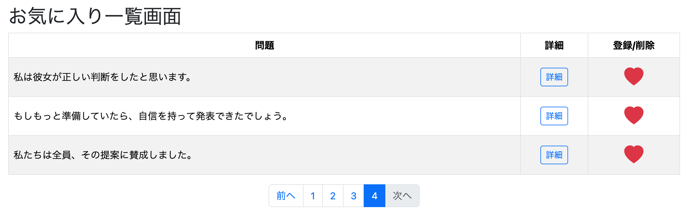

# お気に入り登録機能③ お気に入り登録一覧にページングを導入

熱心なユーザーは100件以上、場合によっては1000件以上の問題をお気に入り登録する可能性がある。そのような場合でも一覧画面を見やすく保つため、お気に入り一覧にページング機能を導入する。

ここでは以前学習した教科書の内容に沿って実装を進める。

---

# SELECT処理の修正

まずはデータ取得（SELECT処理）をページング対応に修正する。

ページングではSQLに次の2つの役割を持たせる必要がある。

- 画面に表示する件数だけ取得する（今回は1ページ50件）
- 検索条件に一致する総件数（COUNT）を取得する

総件数が分からなければ総ページ数を計算できないためである。

---

## MyBatisの場合

MyBatisでは通常、一覧取得用と件数取得用の2つのメソッドを用意する。

```java
/** 全体件数取得 */
int count(long userId);

/** 一覧取得 */
List<Question> getFavoritesList(long userId, Pageable pageable);
```

その後、それぞれに対応するSQLをMapper.xmlへ記述する。

---

## JPAの場合

最初はMyBatisと同じように、

```java
@Query(...)
List<Question> getFavoritesList(..., Pageable pageable);
```

と書きたくなる。

しかし、これではページング情報（総件数・総ページ数など）を保持できないため不十分である。

ページングでは戻り値を

```java
Page<Question>
```

へ変更する。

```java
@Query(value = """
    SELECT q.*
    FROM favorites f
    JOIN question q
      ON f.question_id = q.question_id
    WHERE f.user_id = :userId
    ORDER BY f.created_at
    """, nativeQuery = true)
Page<Question> getFavoritesList(
        @Param("userId") Long userId,
        Pageable pageable
);
```

これにより、取得したデータだけでなくページング情報も扱えるようになる。

---

# nativeQuery と JPQL の違い

## nativeQuery = true

`nativeQuery = true`はデータベースが理解する**SQLをそのまま書くモード**である。

特徴

- SQLをそのまま書ける
- JOINやLIMITを自由に使える
- DB固有のSQLも利用できる
- DBを変更するとSQLも修正が必要になる場合がある

例

```java
@Query(value = """
    SELECT *
    FROM question
    WHERE difficulty = :difficulty
    """, nativeQuery = true)
List<Question> findByDifficulty(...);
```

---

## nativeQuery = false（JPQL）

こちらはSQLではなく**JPQL（Java Persistence Query Language）**を書く。

SQL

```sql
SELECT *
FROM question
```

JPQL

```java
SELECT q
FROM Question q
```

JPQLでは

- テーブル名ではなくEntity名
- カラム名ではなくJavaフィールド名

を書く。

例

SQL

```sql
WHERE japanese_text = ?
```

JPQL

```java
WHERE q.japaneseText = :text
```

となる。

---

# Pageを返す方法は2通りある

ページングでは

- 表示データ取得
- 件数取得（COUNT）

の2つの処理が必要になる。

そのため実装方法は大きく2通りある。

## 方法①（初心者向け）

一覧取得メソッド

```java
List<Question> getFavoritesList(...)
```

件数取得メソッド

```java
long countFavorites(...)
```

をそれぞれ用意し、最終的に`Page<Question>`へ組み立てる方法。

---

## 方法②（JPAらしい実装）

Repositoryが直接

```java
Page<Question> getFavoritesList(...)
```

を返す方法。

この場合、Repositoryメソッド1つ呼ぶだけで、

- 表示データ取得
- 件数取得

の2つを内部的に実行していると考えればよい。

初心者なら方法①でも十分だが、

**実務では方法②の方がSpring Data JPAらしい実装**となる。

# nativeQueryでそのままページングしてはいけない理由

方法②をそのままnativeQueryで実装すると、

```java
@Query(value = """
    SELECT q.*
    FROM favorites f
    JOIN question q
      ON f.question_id = q.question_id
    WHERE f.user_id = :userId
    ORDER BY f.created_at
    """, nativeQuery = true)
Page<Question> getFavoritesList(
        @Param("userId") Long userId,
        Pageable pageable
);
```

となる。

しかし、この実装で正常に動作するかどうかは、

**Spring Data JPAがこのSQLからCOUNTクエリを自動生成できるかどうか**

に依存する。

Spring Data JPAはページングを行う際、

- データ取得SQL
- COUNT取得SQL

の2つを実行する。

JPQL（`nativeQuery = false`）であればCOUNTクエリを自動生成できることが多い。

しかし、ネイティブSQLではJOINなど複雑なSQLになると、自動生成できない場合がある。

これはJPAにとってネイティブSQLはあくまで**データベース固有のSQL**であり、すべてのSQLを100%解析できるわけではないためである。

その結果、

```
Cannot create count query
```

のような例外が発生することがある。

---

# 対応策① nativeQueryのまま実装する

nativeQueryを利用し続けるのであれば、自分でCOUNTクエリを書く。

```java
@Query(
    value = """
        SELECT q.*
        FROM favorites f
        JOIN question q
          ON f.question_id = q.question_id
        WHERE f.user_id = :userId
        ORDER BY f.created_at
        """,
    countQuery = """
        SELECT COUNT(*)
        FROM favorites f
        WHERE f.user_id = :userId
        """,
    nativeQuery = true
)
Page<Question> getFavoritesList(
        @Param("userId") Long userId,
        Pageable pageable
);
```

これならSpring Data JPAは自動生成せず、自分が記述したCOUNTクエリを利用する。

---

# 対応策② JPQLへ変更する

よりJPAらしい実装にするならJPQLへ変更する。

```java
@Query("""
    SELECT f.question
    FROM Favorites f
    WHERE f.user.id = :userId
    ORDER BY f.createdAt
    """)
Page<Question> getFavoritesList(
        @Param("userId") Long userId,
        Pageable pageable
);
```

JPQLではEntity同士の関連を利用して検索できるため、Spring Data JPAがCOUNTクエリも生成しやすくなる。

---

# 今回採用する方法

今回は**対応策②（JPQL）**を採用する。

理由は、

- Spring Data JPAらしい実装である
- Repositoryのコードがシンプルになる
- COUNTクエリの自動生成を利用できる

ためである。

ただし、この方法を採用するにはEntity同士の関連付けが必要になる。

現在の`Favorites`エンティティは`FavoritesKey`しか保持しておらず、

- Users
- Question

との関連を持っていない。

そのため、

```java
SELECT f.question
```

のようなJPQLは利用できない。

まずはEntityクラスを修正する。

---

# Entityクラスの修正

今回修正するクラスは4つである。

1. Favorites
2. Question
3. Users
4. FavoritesRepository

まずはFavoritesエンティティを修正する。

---

# Favorites.java

## 修正前

```java
public class Favorites {

    @EmbeddedId
    private FavoritesKey favoritesKey;

    private LocalDateTime createdAt;

}
```

---

## 修正後

```java
public class Favorites {

    @EmbeddedId
    private FavoritesKey favoritesKey;

    @ManyToOne
    @MapsId("userId")
    @JoinColumn(name = "user_id")
    private Users user;

    @ManyToOne
    @MapsId("questionId")
    @JoinColumn(name = "question_id")
    private Question question;

    private LocalDateTime createdAt;
}
```

## 各アノテーションの意味

### @ManyToOne

```java
@ManyToOne
@JoinColumn(name = "user_id")
private Users user;
```

favorites.user_id が users.id を参照していることを表す。

同様に

```java
@ManyToOne
@JoinColumn(name = "question_id")
private Question question;
```

は

favorites.question_id が question.question_id を参照していることを表す。

どちらも`@ManyToOne`なのは、

- 1人のユーザーは複数のお気に入りを持てる
- 1つの問題も複数のユーザーがお気に入り登録できる

ためである。

---

### なぜFavoritesKeyではなくFavoritesへ書くのか

`FavoritesKey`の役割は、

**「主キーの値だけを保持すること」**

である。

Entityとの関連まで持たせる役割ではないため、

`@ManyToOne`などは`Favorites`クラスへ記述する。

---

### @MapsId

```java
@MapsId("userId")
```

は

**「favoritesKey.userId と user.id は同じ値ですよ」**

ということをJPAへ伝えるためのアノテーションである。

`questionId`についても同様である。

# Question.java

## 修正前

```java
public class Question {

    @Id
    @Column(name = "question_id")
    private Long questionId;

    @Column(name = "japanese_text")
    private String japaneseText;

    @Column(name = "english_text")
    private String englishText;

    @Column(name = "alternative_answer")
    private String alternativeAnswer;

    @Column(name = "condition")
    private String condition;

    @Column(name = "difficulty")
    @Enumerated(EnumType.STRING)
    private Difficulty difficulty;
}
```

---

## 修正後

```java
public class Question {

    @Id
    @Column(name = "question_id")
    private Long questionId;

    @Column(name = "japanese_text")
    private String japaneseText;

    @Column(name = "english_text")
    private String englishText;

    @Column(name = "alternative_answer")
    private String alternativeAnswer;

    @Column(name = "condition")
    private String condition;

    @Column(name = "difficulty")
    @Enumerated(EnumType.STRING)
    private Difficulty difficulty;

    @OneToMany(mappedBy = "question")
    private List<Favorites> favorites;
}
```

## アノテーションの説明

```java
@OneToMany(mappedBy = "question")
private List<Favorites> favorites;
```

### @OneToMany

意味は

> **1つのQuestionに対して複数のFavoritesが対応する**

ということである。

例えば

```
Question(100)
 ├─ Favorite(user1)
 ├─ Favorite(user2)
 └─ Favorite(user3)
```

という関係を表している。

---

### List<Favorites> favorites

この問題をお気に入り登録している一覧を保持する。

例えば

```java
question.getFavorites();
```

とすると、

その問題をお気に入り登録しているFavorites一覧を取得できる。

---

### mappedBy = "question"

これが最も重要である。

意味は

> **関連付けの管理はFavoritesクラスのquestionフィールドが担当している**

ということである。

Favoritesには

```java
@ManyToOne
@JoinColumn(name = "question_id")
private Question question;
```

が存在する。

JPAはこの`question`フィールドを見て、

```
question_id列はこちらで管理している
```

と理解する。

そのためQuestion側では

```java
@OneToMany(mappedBy = "question")
```

と書くだけでよく、

再度`@JoinColumn`を書く必要はない。

---

# Users.java

## 修正前

```java
@Data
@Entity
@Table(name = "users")
public class Users {

    @Id
    @GeneratedValue(strategy = GenerationType.IDENTITY)
    private Long id;

    private String userId;

    private String password;

    private String role;
}
```

---

## 修正後

```java
@Data
@Entity
@Table(name = "users")
public class Users {

    @Id
    @GeneratedValue(strategy = GenerationType.IDENTITY)
    private Long id;

    private String userId;

    private String password;

    private String role;

    @OneToMany(mappedBy = "user")
    private List<Favorites> favorites;
}
```

`Question`と同様に、

```java
@OneToMany(mappedBy = "user")
```

を追加することで、

1人のユーザーが複数のお気に入りを持つ関係をJPAへ伝えている。

---

# FavoritesRepository.java

## 修正前

```java
@Query(value = """
    SELECT q.*
    FROM favorites f
    JOIN question q
      ON f.question_id = q.question_id
    WHERE f.user_id = :userId
    ORDER BY f.created_at
    """, nativeQuery = true)
List<Question> getFavoritesList(
        @Param("userId") Long userId
);
```

---

## 修正後

```java
@Query("""
    SELECT f.question
    FROM Favorites f
    WHERE f.user.id = :userId
    ORDER BY f.createdAt
    """)
Page<Question> getFavoritesList(
        @Param("userId") Long userId,
        Pageable pageable
);
```

## 解説

`JOIN`が不要になったのは、

`Favorites`エンティティに`Question`との関連（`@ManyToOne`）を定義したためである。

JPQLではEntity同士の関連をたどるだけで、

```java
f.question
```

と書けば、JPAが内部で必要なJOINを自動生成してくれる。

そのためRepositoryのコードを非常にシンプルに記述できる。

---

# Serviceの修正

## 修正前

```java
public List<Question> getFavoritesList(Long userId) {

    List<Question> favoritesList =
            favoritesRepository.getFavoritesList(userId);

    return favoritesList;
}
```

---

## 修正後

```java
public Page<Question> getFavoritesList(
        Long userId,
        Pageable pageable) {

    Page<Question> favoritesList =
            favoritesRepository.getFavoritesList(
                    userId,
                    pageable);

    return favoritesList;
}
```

通常は

```java
public Page<Question> getFavoritesList(
        Long userId,
        Pageable pageable) {

    return favoritesRepository.getFavoritesList(
            userId,
            pageable);
}
```

のようにローカル変数を作る必要はない。

今回は処理の流れを理解しやすくするため、一度ローカル変数へ格納している。

---

## PageImplを使わなかった理由

教科書では戻り値として`PageImpl`を利用していた。

しかし`PageImpl`は

> **RepositoryがPageを返してくれない場合**

に利用するクラスである。

今回はSpring Data JPAがRepositoryから

```java
Page<Question>
```

を返してくれるため、

`PageImpl`を利用する必要はない。

# Controllerの修正

画面から

> **「何ページ目を表示するか」**

という情報（`Pageable`）が送られてくる。

Controllerではこの`Pageable`をServiceへ渡し、`Page<Question>`を受け取る。

その後、取得したデータをModelへ登録することで画面へ表示できるようになる。

---

## 修正前

```java
@GetMapping("/favorites/list")
public String getFavoritesList(
        @AuthenticationPrincipal UserDetails loginUser,
        Model model) {

    Users user =
            userServiceImpl.getUserOne(
                    loginUser.getUsername());

    List<Question> favoritesList =
            favoritesService.getFavoritesList(user.getId());

    model.addAttribute(
            "favoritesList",
            favoritesList);

    return "favorites/list";
}
```

---

## 修正後

```java
@GetMapping("/favorites/list")
public String getFavoritesList(
        @AuthenticationPrincipal UserDetails loginUser,
        Model model,
        @PageableDefault(page = 0, size = 50)
        Pageable pageable) {

    Users user =
            userServiceImpl.getUserOne(
                    loginUser.getUsername());

    Page<Question> favoritesList =
            favoritesService.getFavoritesList(
                    user.getId(),
                    pageable);

    model.addAttribute(
            "favoritesList",
            favoritesList.getContent());

    model.addAttribute(
            "page",
            favoritesList);

    return "favorites/list";
}
```

## 解説

### Pageable

```java
@PageableDefault(page = 0, size = 50)
Pageable pageable
```

ブラウザから送られてくる

```
?page=0
?page=1
?page=2
```

などの情報を受け取り、

「何ページ目を取得するか」

をSpring Data JPAへ伝えるオブジェクトである。

---

### Page<Question>

```java
Page<Question> favoritesList
```

は、

現在のページのデータだけではなく、

- 総件数
- 総ページ数
- 現在のページ番号
- 最初のページか
- 最後のページか

など、ページングに必要な情報をすべて保持している。

---

### favoritesList.getContent()

```java
favoritesList.getContent()
```

は、

`Page<Question>`の中から

**現在のページに表示する問題一覧（List<Question>）だけ**

を取り出すメソッドである。

一覧表示にはこちらを利用する。

---

### pageをModelへ渡す理由

```java
model.addAttribute(
    "page",
    favoritesList);
```

としているのは、

Thymeleafで

- 総ページ数
- 現在ページ
- 前ページの有無
- 次ページの有無

などのページング情報を利用するためである。

---

# list.htmlの修正

一覧画面へページネーションを追加する。

```html
<!-- ページネーション -->
<nav aria-label="Page Navigation">
    <ul class="pagination justify-content-center">

        <!-- 前へ -->
        <li class="page-item"
            th:classappend="${page.first ? 'disabled' : ''}">

            <span th:if="${page.first}"
                  class="page-link">
                前へ
            </span>

            <a th:if="${!page.first}"
               th:href="@{/favorites/list(page=${page.number-1})}"
               class="page-link">
                前へ
            </a>

        </li>

        <!-- ページ番号 -->
        <th:block
            th:each="i : ${#numbers.sequence(0,page.totalPages-1)}">

            <li class="page-item"
                th:classappend="${i==page.number ? 'active' : ''}">

                <span
                    th:if="${i==page.number}"
                    th:text="${i+1}"
                    class="page-link">
                    1
                </span>

                <a
                    th:if="${i!=page.number}"
                    th:href="@{/favorites/list(page=${i})}"
                    class="page-link">

                    <span
                        th:text="${i+1}">
                    </span>

                </a>

            </li>

        </th:block>

        <!-- 次へ -->
        <li class="page-item"
            th:classappend="${page.last ? 'disabled' : ''}">

            <span
                th:if="${page.last}"
                class="page-link">
                次へ
            </span>

            <a
                th:if="${!page.last}"
                th:href="@{/favorites/list(page=${page.number+1})}"
                class="page-link">

                次へ

            </a>

        </li>

    </ul>
</nav>
```

このページネーションでは、

- 「前へ」
- 「次へ」
- ページ番号
- 現在ページのハイライト表示

をすべてSpring Data JPAの`Page`オブジェクトだけで実現できる。

---

# 実行（失敗）

ログイン時に

```
failed to lazily initialize a collection of role:
com.example.demo.entity.Users.favorites:
could not initialize proxy - no Session
```

という例外が発生し、ログインできなかった。

---

# 原因

結論から言うと、

**ログイン時にUsersオブジェクトを文字列化（toString()）したこと**

が原因である。

スタックトレースを見ると、

```
UserServiceImpl.java:57
```

で

```
Users.toString()
```

が呼ばれていることが分かった。

今回はUsersへ

```java
@OneToMany(mappedBy = "user")
private List<Favorites> favorites;
```

を追加したため、

Lombokが生成する`toString()`は

```text
Users(
    id=...,
    userId=...,
    password=...,
    role=...,
    favorites=[...]
)
```

まで表示しようとする。

しかし、

`favorites`はLazyロードである。

Lazyロードとは、

> **必要になるまでデータベースから取得しない**

というJPAの仕組みである。

今回は

```
Session終了
    ↓
favorites取得しようとする
    ↓
LazyInitializationException
```

となってしまった。

---

# 修正

`UserServiceImpl`

```java
public Users getUserOne(String userId) {

    System.out.println(
            "検索するuserId=" + userId);

    Optional<Users> option =
            repository.findByUserId(userId);

    System.out.println(
            "検索結果=" + option);

    return option.orElse(null);
}
```

を

```java
public Users getUserOne(String userId) {

    System.out.println(
            "検索するuserId=" + userId);

    Optional<Users> option =
            repository.findByUserId(userId);

    // System.out.println("検索結果=" + option);

    // または

    System.out.println(
            "検索結果="
            + option.orElse(null).getUserId());

    return option.orElse(null);
}
```

へ変更した。

`System.out.println(option)`は

```
option.toString()
```

↓

```
Users.toString()
```

↓

```
favoritesも表示しよう
```

となってしまう。

一方、

```java
option.orElse(null).getUserId()
```

であれば、

`favorites`へアクセスしないため例外は発生しない。

# 実行（成功）

修正後、ログインは正常に成功した。

その後、お気に入りを100件以上登録してページングを確認したところ、

- 1ページ50件表示
- 「前へ」「次へ」の切り替え
- ページ番号による移動

すべて正常に動作した。




---

# 追加修正

その後、実務的なEntity設計にするため、さらに以下の修正を行った。

## Users.java

```java
@OneToMany(mappedBy = "user")
@ToString.Exclude
private List<Favorites> favorites;
```

---

## Question.java

```java
@OneToMany(mappedBy = "question")
@ToString.Exclude
private List<Favorites> favorites;
```

---

## @ToString.Exclude を付ける理由

今回ログイン時に発生した`LazyInitializationException`の原因は、

Lombokの`@Data`が生成した`toString()`が

```java
favorites
```

まで出力しようとしたことだった。

そこで

```java
@ToString.Exclude
```

を付けることで、

```java
Users.toString()
```

や

```java
Question.toString()
```

実行時に

```java
favorites
```

を出力対象から除外できる。

これにより、

- 不要なLazyロード
- LazyInitializationException
- Entity同士の循環参照による無限ループ

などを防止できる。

実務でも`@OneToMany`を持つEntityでは、

```java
@ToString.Exclude
```

を付けるケースが非常に多い。

---

# 所感

ページング機能そのものの実装はそれほど難しくなかった。

しかし、Spring Data JPAを十分に活用するためには、

Repositoryだけではなく、

- Entity同士の関連
- Entity設計
- JPQLで利用しやすいオブジェクト構造

まで考慮して設計する必要があることを学んだ。

最初はテーブル構造だけを意識してEntityを作成していたが、

JPAでは

**「Entity同士がどのようにつながるか」**

まで設計しておくことが非常に重要であると実感した。

また、

- `Page`
- `Pageable`
- JPQL
- `@ManyToOne`
- `@OneToMany`
- `@MapsId`
- `@JoinColumn`

など、多くのJPA機能が連携して初めてシンプルなRepositoryを実現できることも理解できた。

---

# 次に実装する機能

- 復習画面でお気に入り登録した問題だけを学習できる機能
- 通常学習で未学習の問題だけを学習できる機能