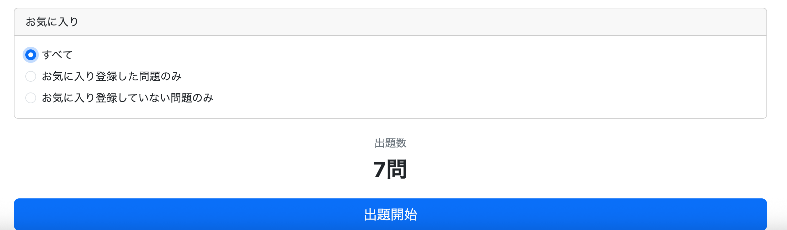
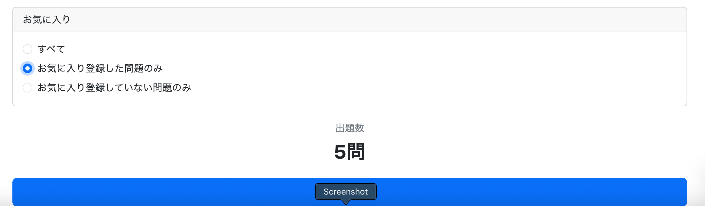
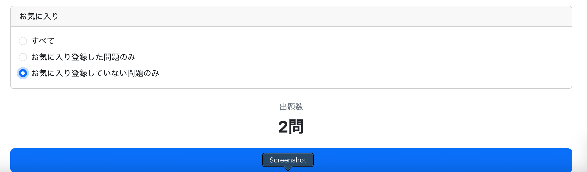
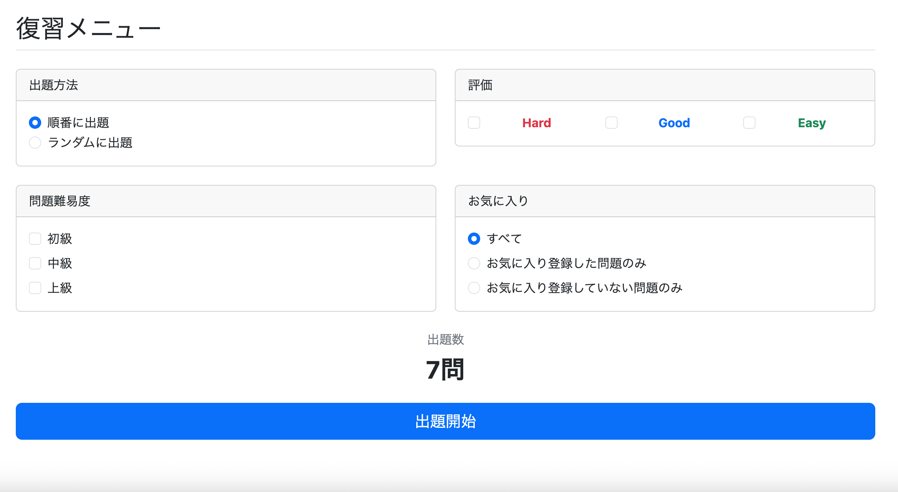

# 復習メニューの条件選択にお気に入り登録した問題も選択できるようにする

## 概要

これまで復習メニューでは、

- 評価（Hard / Good / Easy）
- 問題難易度（Beginner / Intermediate / Advanced）

のみを条件として問題を絞り込んでいた。

今回新たに、

- お気に入り登録した問題のみ
- お気に入り登録していない問題のみ
- 両方

も検索条件として追加する。

最終的な画面イメージは以下のようになる。

```text
出題方法
○ 順番に出題
● ランダムに出題

評価
☑ Hard
☑ Good
□ Easy

問題難易度
□ 初級
☑ 中級
☑ 上級

お気に入り
○ すべて
○ お気に入り登録した問題のみ
● お気に入り登録していない問題のみ
```

例えばこの場合は

- Hard または Good
- 中級または上級
- お気に入り登録していない問題

だけをランダムに出題する。

---

# 修正対象

この機能を実装するには少なくとも以下を修正する必要がある。

- StudyHistoryRepository
- ReviewService
- ReviewController
- review.js
- review/menu.html

---

# 実装順

今回は修正範囲が広いため、

まず

```
GET /review/menu
```

で最初に何が呼ばれるかを整理する。

```
ReviewController#getReviewMenu()

↓

review/menu.html

↓

review.js

↓

fetch("/review/count")

↓

ReviewController#getReviewMenu()

↓

ReviewService

↓

StudyHistoryRepository
```

つまり、

**最初に修正すべきなのは Repository の件数取得処理**

である。

---

# 総問題数取得処理

## 現在の実装

現在は

```sql
SELECT COUNT(*)
FROM study_history sh
JOIN question q
ON sh.question_id = q.question_id
WHERE sh.user_id = :userId
AND sh.evaluation IN (:evaluations)
AND q.difficulty IN (:difficulties)
```

によって

- Evaluation
- Difficulty

のみで問題数を取得している。

---

## 最初に考えた実装

お気に入り条件も追加するのであれば、

単純には

```sql
JOIN favorites

...

AND f.favorite IN (...)
```

を追加すればよいように思えた。

もし Favorites テーブルが

|user_id|question_id|favorite|
|-------|-----------|--------|
|1|10|1|
|1|11|0|

のように、

すべての問題について

```
1 = お気に入り
0 = 未登録
```

を保持していれば、この方法で実装できた。

---

# この方法が使えない理由

しかし今回の Favorites テーブルは

```
user_id
question_id
```

しか保持していない。

つまり

お気に入り登録した問題だけが存在し、

登録していない問題は

NULLではなく

**レコードそのものが存在しない。**

---

## Evaluation

Evaluation は

```
study_history
```

に保存される。

復習対象となる問題は必ず

Evaluation を持つため、

```
evaluation IN (...)
```

だけで検索できる。

---

## Difficulty

Difficulty は

Question テーブルに必ず

- BEGINNER
- INTERMEDIATE
- ADVANCED

のいずれかが設定される。

NULL は存在しない。

そのため

```
difficulty IN (...)
```

だけで検索できる。

---

## Favorites

Favorites は

お気に入り登録された問題だけを保持する。

つまり

```
登録済み
→ レコードあり

未登録
→ レコードなし
```

という構造になっている。

---

# Evaluation・Difficultyとの違い

Evaluation と Difficulty は

> 値を比較する

ことで検索できる。

一方 Favorites は

> レコードが存在するかどうか

を判定しなければならない。

ここが今回最も難しい点である。

---

# 考え方

Favorites テーブルで知りたいことは

```
favorite = 1
```

ではない。

知りたいのは

```
この問題が
Favorites テーブルに存在するか？
```

である。

つまり

値ではなく

**存在**

を判定する必要がある。

---

# LEFT JOIN を使う

まず Favorites を LEFT JOIN する。

```sql
SELECT *
FROM study_history sh
JOIN question q
ON sh.question_id = q.question_id

LEFT JOIN favorites f
ON sh.user_id = f.user_id
AND sh.question_id = f.question_id
```

---

## なぜ LEFT JOIN？

INNER JOIN にすると

お気に入り登録されていない問題は

結果セットから消えてしまう。

今回は

未登録問題も検索対象なので

LEFT JOIN を使用する。

---

## JOIN結果

例として

study_history

|user_id|question_id|
|-------|-----------|
|1|10|
|1|20|

favorites

|user_id|question_id|
|-------|-----------|
|1|10|

だった場合、

LEFT JOIN 後は

|sh.user_id|f.user_id|sh.question|f.question|
|----------|---------|-----------|----------|
|1|1|10|10|
|1|NULL|20|NULL|

となる。

つまり

Favorites に存在しない問題も

NULL を持つ行として残る。

---

# WHERE句

この特徴を利用すると、

```
AND f.question_id IS NOT NULL
```

↓

お気に入り登録した問題のみ

```
AND f.question_id IS NULL
```

↓

お気に入り登録していない問題のみ

何も付けない

↓

すべて

という3種類の検索が可能になる。

---

# 暫定実装

最初は

- お気に入りのみ
- 未登録のみ
- 全件

の3本のSQLで実装する。

その後、

重複部分が非常に多いため、

1本へ統合することにした。

---

# FavoriteCondition の導入

そこで

```java
public enum FavoriteCondition {

    ALL,

    FAVORITED,

    NOT_FAVORITED

}
```

を導入する。

ブラウザから

FavoriteCondition を受け取り、

Service が Repository へ渡す設計に変更する。

こうすることで

SQL を

1本だけで制御できるようになる。

# FavoriteCondition を利用した実装

## Repository の修正

### SQLを1本にまとめる

最初は

- お気に入り登録した問題のみ
- お気に入り登録していない問題のみ
- すべて

の3種類のSQLを作成した。

しかし、違うのは最後の検索条件だけであり、それ以外はすべて同じ内容である。

そのため、FavoriteCondition を引数として受け取り、SQLを1本にまとめることにした。

```java
@Query(value = """
        SELECT COUNT(*)
        FROM study_history sh
        JOIN question q
          ON sh.question_id = q.question_id
        LEFT JOIN favorites f
          ON sh.user_id = f.user_id
         AND sh.question_id = f.question_id
        WHERE sh.user_id = :userId
          AND sh.evaluation IN (:evaluations)
          AND q.difficulty IN (:difficulties)
          AND (
                :favoriteCondition = 'ALL'
             OR (:favoriteCondition = 'FAVORITED'
                 AND f.question_id IS NOT NULL)
             OR (:favoriteCondition = 'NOT_FAVORITED'
                 AND f.question_id IS NULL)
          )
        """, nativeQuery = true)
long countQuestions(
        @Param("userId") Long userId,
        @Param("evaluations") List<String> evaluations,
        @Param("difficulties") List<String> difficulties,
        @Param("favoriteCondition") String favoriteCondition
);
```

### なぜこれで動くのか

FavoriteCondition は

```
ALL
FAVORITED
NOT_FAVORITED
```

のいずれか1つしか渡されない。

例えば

```
favoriteCondition = ALL
```

なら

```
:favoriteCondition = 'ALL'
```

だけが真となるため、

お気に入り条件による絞り込みは行われない。

一方、

```
favoriteCondition = FAVORITED
```

なら

```
f.question_id IS NOT NULL
```

だけが有効になる。

同様に

```
favoriteCondition = NOT_FAVORITED
```

なら

```
f.question_id IS NULL
```

だけが評価される。

つまり、

Java の if 文を書かなくても、

SQLだけで条件分岐を実現できる。

---

# FavoriteCondition の実装

お気に入り条件を管理する enum を作成する。

```java
public enum FavoriteCondition {

    ALL,

    FAVORITED,

    NOT_FAVORITED

}
```

ブラウザから送られてきた値は

Spring MVC が自動的に

FavoriteCondition 型へ変換してくれる。

---

# ReviewService の修正

## countReviewQuestions

FavoriteCondition を引数として受け取るよう変更した。

### 修正前

```java
countReviewQuestions(
    Long userId,
    List<Evaluation> evaluations,
    List<Difficulty> difficulties
)
```

### 修正後

```java
countReviewQuestions(
    Long userId,
    List<Evaluation> evaluations,
    List<Difficulty> difficulties,
    FavoriteCondition favoriteCondition
)
```

Repository へ FavoriteCondition を渡すため、

```
convertFavoriteCondition()
```

を追加した。

```java
public String convertFavoriteCondition(
        FavoriteCondition favoriteCondition) {

    if (favoriteCondition == null) {
        return FavoriteCondition.ALL.name();
    }

    return favoriteCondition.name();

}
```

画面初回表示時など

FavoriteCondition が渡されない場合は

ALL を返すようにした。

---

# ReviewController の修正

## /review/count

ReviewService へ FavoriteCondition を渡せるようにする。

```java
@RequestParam(
    name = "favoriteCondition",
    required = false
)
FavoriteCondition favoriteCondition
```

を追加し、

```java
reviewService.countReviewQuestions(
        userId,
        evaluations,
        difficulties,
        favoriteCondition);
```

を呼び出すよう変更した。

---

# review.js の修正

## お気に入り条件を取得

今までは

- Evaluation
- Difficulty

だけを監視していた。

今回

FavoriteCondition も件数に影響するため、

監視対象へ追加した。

### 修正前

```javascript
const checkboxes =
    document.querySelectorAll(
        "input[name='evaluations'], input[name='difficulties']"
    );
```

### 修正後

```javascript
const conditions =
    document.querySelectorAll(
        "input[name='evaluations'], " +
        "input[name='difficulties'], " +
        "input[name='favoriteCondition']"
    );
```

---

## URLSearchParams

件数取得時に

FavoriteCondition も

GET パラメータとして送信する。

```javascript
params.append(
    "favoriteCondition",
    document.querySelector(
        "input[name='favoriteCondition']:checked"
    ).value
);
```

---

## イベント登録

変数名を

```
checkboxes
```

から

```
conditions
```

へ変更したため、

イベント登録も修正した。

```javascript
conditions.forEach(input => {

    input.addEventListener(
        "change",
        updateCount
    );

});
```

これにより、

評価・難易度だけでなく、

お気に入り条件を変更した場合も

リアルタイムで件数が更新されるようになった。

---

# review/menu.html の修正

お気に入り条件を選択するラジオボタンを追加した。

```text
お気に入り

○ すべて

○ お気に入り登録した問題のみ

○ お気に入り登録していない問題のみ
```

今回は

複数選択ではなく

単一選択とした。

理由は、

Repository の SQL を1本にまとめるためである。

選択された値は

```
ALL

FAVORITED

NOT_FAVORITED
```

として

ReviewController へ送信される。

# 実行（失敗）

実装後、復習メニューを開くと

```
出題数

大量の文字列……問
```

と表示され、本来表示されるはずの件数が表示されなかった。

サーバーログには

```text
ERROR: syntax error at end of input
Position: 396
```

というエラーが出力されていた。

---

# 原因

このエラーは、

> SQLの末尾まで解析したものの、構文が完結していない

ことを意味する。

Repository の SQL を確認したところ、

```sql
AND (
    :favoriteCondition = 'ALL'
 OR (:favoriteCondition = 'FAVORITED'
     AND f.question_id IS NOT NULL)
 OR (:favoriteCondition = 'NOT_FAVORITED'
     AND f.question_id IS NULL)
```

となっており、

最初の

```sql
AND (
```

に対応する閉じ括弧 `)` が不足していた。

そのため PostgreSQL が SQL 構文エラーを返し、

`/review/count`

は正常な件数ではなくエラーページ（HTML）を返していた。

review.js では

```javascript
const response = await fetch("/review/count?" + params);

const count = await response.text();

countArea.textContent = count + "問";
```

となっているため、

レスポンスとして返された HTML 全体をそのまま表示してしまい、

「大量の文字列……問」

という状態になっていた。

---

# 修正

不足していた閉じ括弧を追加した。

## 修正前

```sql
AND (
    :favoriteCondition = 'ALL'
 OR (:favoriteCondition = 'FAVORITED'
     AND f.question_id IS NOT NULL)
 OR (:favoriteCondition = 'NOT_FAVORITED'
     AND f.question_id IS NULL)
```

## 修正後

```sql
AND (
    :favoriteCondition = 'ALL'
 OR (:favoriteCondition = 'FAVORITED'
     AND f.question_id IS NOT NULL)
 OR (:favoriteCondition = 'NOT_FAVORITED'
     AND f.question_id IS NULL)
)
```

---

# 学んだこと

- `syntax error at end of input` は、括弧やクォーテーションなどの閉じ忘れで発生しやすい。
- `fetch()` の `response.text()` はサーバーが返した内容をそのまま取得するため、サーバー側で例外が発生するとエラーページもそのまま取得される。
- SQL の条件式が複雑になるほど、括弧の対応関係を丁寧に確認することが重要である。

---

# 実行

修正後、

管理者ユーザーで確認したところ

- 復習対象問題数：7問
- お気に入り登録した問題のみ：5問
- お気に入り登録していない問題のみ：2問

となり、

期待どおりに件数が変化した。




---

# デザインの修正

復習メニューは項目数が増えたため、

スクロールしなくても全体が見えるようレイアウトを改善した。

## 修正内容

Bootstrap の Grid システムを利用し、

4つのカード

- 出題方法
- 評価
- 問題難易度
- お気に入り

を

```html
<div class="row">

    <div class="col-md-6">
        ...
    </div>

    <div class="col-md-6">
        ...
    </div>

    <div class="col-md-6">
        ...
    </div>

    <div class="col-md-6">
        ...
    </div>

</div>
```

のように2列レイアウトへ変更した。

Bootstrap の Grid は

```
row
 ├── col
 ├── col
 ├── col
 └── col
```

という構造になっており、

`row` が横方向の行を作り、

その中へ `col-md-6` を配置することで

画面幅が十分ある場合は

```
□□□□
□□□□
```

という2×2のレイアウトになる。

これにより、

画面全体の高さを抑えつつ、

各カードのデザインも維持できた。

---

# 【追記】評価ボタン押下時のリダイレクト先修正

## 問題

今回の実装の挙動を確かめるため(問題数の表示がうまくいくか確かめるため)の準備としていくつかの問題に対し、

- 一部の問題は、お気に入り登録して評価ボタンを押してDBに保存
- その他の問題は、お気に入り未登録のまま評価ボタンを押してDBに保存

を試みた。

しかし `study/question.html` で評価ボタン（Hard / Good / Easy）のいずれを押しても、エラーページへ遷移してしまった。

ブラウザの開発者ツール（F12）のコンソールを確認すると、以下のエラーが発生していた。

```text
GET http://localhost:8080/study?page=2
404 (Not Found)
```

## 原因

`StudyController` の `postEvaluation()` メソッドで、評価登録後のリダイレクト先が古いURLのままになっていた。

学習画面のURLは

```text
/study/question
```

へ変更済みだったが、`postEvaluation()` は以前の

```text
/study
```

へリダイレクトしていたため、存在しないURLへアクセスして404エラーとなっていた。

## 修正

### StudyController の postEvaluation を修正

**Commit**

```text
fix: correct redirect URL after study evaluation
```

**修正前**

```java
return "redirect:/study?page=" + (page + 1);
```

**修正後**

```java
return "redirect:/study/question?page=" + (page + 1);
```

これにより、評価登録後に正しい学習画面へ遷移するようになった。

---

# 実行

レイアウトが改善され、

スクロールせずに各条件を確認・変更できるようになった。



---

# 所感

今回最も時間を要したのは Repository の SQL であった。

Evaluation や Difficulty は

「値を比較する」

だけで検索できたのに対し、

Favorites は

「レコードが存在するかどうか」

を判定する必要があった。

そのため、

単純な `IN (...)` では実装できず、

LEFT JOIN と `IS NULL` / `IS NOT NULL`

を利用した検索方法へ考え方を切り替える必要があった。

また、

最初は3本のSQLで実装を考えたが、

FavoriteCondition を導入することで

1本のSQLへ統合できた。

SQLだけで条件分岐を表現する方法を学べたことは、

今回最も大きな収穫である。

さらに、

SQL構文エラーが JavaScript の表示へどのような影響を与えるのかも確認でき、

サーバー側の例外が画面へどのように伝わるかについても理解を深めることができた。

---

# 次にやること

現在、

`study/question`

および

`review/question`

で Evaluation ボタンを押すと例外が発生するため、

次はその原因を調査・修正する。