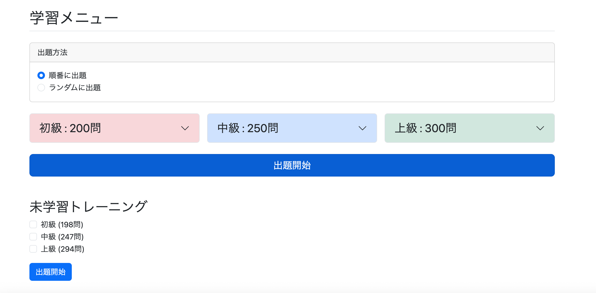

# 「未学習問題」のトレーニングを追加①　未学習問題数取得の実装

収録問題数が多いため、ユーザーにとっては学習済みの問題だけでなく、一度も学習したことがない問題も数多く存在する。

学習効率を高めるため、**未学習問題だけを取得して学習できる機能**を追加することにした。

---

## いきなり問題点

現在の`study/menu.html`では、

- 難易度
- 問題範囲（1-100、101-200...）

を選択して問題を取得する仕組みになっている。

この状態で「未学習問題のみ」を追加すると、現在のUIと相性が悪いことが分かった。

例えば、

- 初級
- 1-100
- 未学習のみ

を選択した場合、その範囲をすべて学習済みなら出題数は0件になる。

ユーザーは自分がどの範囲まで学習済みなのかを覚えているとは限らないため、

```
初級 1-100
↓
0問

初級 101-200
↓
0問

中級 1-100
↓
0問

中級 101-200
↓
15問
```

のように、未学習問題が残っている範囲を探し回る必要があり、使い勝手が悪くなる。

【ここにstudy/menu.htmlの画像を挿入】

---

## 対応策　新たな学習モードを追加する

現在の通常学習とは別に、

**未学習問題だけを学習する専用モード**

を追加することにした。

### 通常学習

- 出題範囲を指定して学習する
- ログイン不要

### 未学習トレーニング

- 未学習問題だけを取得して学習する
- ログインユーザー限定

と役割を分けることで、画面・処理ともに分かりやすくなる。

同じ`study/menu.html`内へ配置し、ログインしていない場合はエリア自体を表示しないことにした。

```
--------------------

未学習トレーニング（ログインユーザー限定）

────────────────

☑ 初級
☑ 中級
☑ 上級

[出題開始]
```

---

## もう一つの問題　DB管理をどうするか

未学習問題を取得するには、

「その問題がユーザーにとって未学習なのか」

を判定する仕組みが必要になる。

そこで2通りの方法を検討した。

### 方法1　StudyHistoryテーブルを利用する

新しいテーブルは追加せず、

`study_history`

と

`question`

をJOINし、`study_history`に存在しない問題を未学習問題として取得する。

#### メリット

- DB設計を変更する必要がない
- 既存のJOINによる取得方法をそのまま利用できる
- 実装量が少ない

#### 問題点

評価ボタンを押さずに「次の問題へ」を押した問題は、

`study_history`へ保存されないため、未学習問題として再度取得される。

そこで、この機能追加を機に「次の問題へ」ボタン自体を削除することも検討した。

現在の評価ボタンは

- 評価を保存する
- 次の問題へ進む

という2つの役割を持っている。

一方、「次の問題へ」ボタンは次へ進むだけであり、機能が重複している。

ユーザーにとっても、操作するボタンが減ることで画面が分かりやすくなる。

---

### 方法2　新しいテーブルを追加する

`appeared`

や

`studied`

などのテーブルを新設し、

```
user_id
question_id
```

を管理する方法も考えた。

問題表示時にその問題を保存し、

未学習問題取得時は、このテーブルへ存在しない問題を取得する。

#### メリット

本当の意味で

「一度でも表示した問題」

を管理できる。

#### デメリット

- 新しいテーブルが必要になる
- 問題表示のたびにINSERT処理が必要になる
- 実装量が増える
- 管理対象のテーブルが増える

---

## 「未学習問題」の定義を決める

最初は

「未登場問題」

という名前で考えていた。

しかし議論を進める中で、本当に必要なのは

「評価まで完了した問題」

と

「まだ評価していない問題」

を区別することだと分かった。

このアプリでは

```
問題表示
    ↓
評価ボタンを押す
    ↓
study_historyへ保存
    ↓
学習済み
```

と定義する。

逆に、

```
問題表示
    ↓
評価しない
    ↓
study_historyへ保存されない
    ↓
未学習
```

と定義することにした。

この定義なら、DB設計とアプリの動作を一致させられる。

---

## 方法1を採用する

最終的に方法1を採用することにした。

理由は、

- DBを増やす必要がない
- `study_history`だけで未学習問題を取得できる
- 「学習済み」の定義が明確になる
- UIをシンプルにできる
- コード量が少なく保守しやすい

ためである。

また、「次の問題へ」ボタンを廃止すれば、

- 学習済みとして保存
- 次の問題へ遷移

を評価ボタンだけで行えるようになり、画面操作も分かりやすくなる。

結果として、DB設計・画面設計・アプリの仕様を一貫した形でまとめることができた。

---

## 【追記・設計見直し】「次の問題へ」ボタンは残すことにした

実装を進める中で、「次の問題へ」ボタンを廃止する案について再検討した。

当初は、

- 評価ボタンだけで次の問題へ遷移する
- 評価を行った時点で学習済みとする

という仕様にすれば、画面操作もシンプルになると考えていた。

しかし、最終的には「次の問題へ」ボタンは削除しないことにした。

### 理由① ゲストユーザーとのUIを統一できる

ゲストユーザーには評価ボタンが表示されないため、「次の問題へ」ボタンだけで学習を進める仕様となっている。

ログインユーザーだけ「次の問題へ」ボタンを削除すると、ログインの有無によって画面構成が変わり、操作性に違和感が生じる。

### 理由② 「未学習」の定義を明確にした

未学習問題とは、

> **まだ評価（Good / Normal / Bad）が付けられていない問題**

と定義することにした。

そのため、

- 問題を閲覧しただけ
- 「次の問題へ」で飛ばしただけ

の場合は未学習のままとし、後日未学習問題トレーニングで再度出題されても問題ない。

### 結論

当初は「次の問題へ」ボタンを廃止する予定だったが、設計を見直した結果、ボタンは残すことにした。

これにより、

- ゲスト・ログインユーザーでUIを統一できる
- 「未学習＝未評価」という仕様と矛盾しない
- 実装を変更せず、一貫した設計を維持できる

というメリットが得られた。

---

## 未学習問題数取得の実装

### QuestionRepositoryにクエリを追加（git commit: `feat: count new study questions`）

未学習問題数を取得するため、`QuestionRepository`へ以下のクエリを追加した。

```java
@Query(value = """
        SELECT COUNT(*)
        FROM question q
        LEFT JOIN study_history sh
          ON q.question_id = sh.question_id
         AND sh.user_id = :userId
        WHERE q.difficulty IN (:difficulties)
          AND sh.question_id IS NULL
        """, nativeQuery = true)
long countNewQuestions(
        @Param("userId") Long userId,
        @Param("difficulties") List<String> difficulties
);
```

---

### StudyHistoryRepositoryではなくQuestionRepositoryを採用した理由

最初は復習機能で使用したSQLを参考に、

```sql
SELECT COUNT(*)
FROM study_history sh
LEFT JOIN question q
  ON sh.question_id = q.question_id
WHERE sh.user_id = :userId
  AND q.difficulty IN (:difficulties)
  AND sh.question_id IS NULL
```

のように考えた。

しかし、このSQLでは`study_history`が基準テーブルになるため、

「`study_history`に存在しない問題」

を取得することはできない。

この書き方で実現するには、`RIGHT JOIN`を使用する必要がある。

```sql
SELECT q.*
FROM study_history sh
RIGHT JOIN question q
  ON sh.question_id = q.question_id
 AND sh.user_id = :userId
WHERE q.difficulty IN (:difficulties)
  AND sh.question_id IS NULL
```

これなら、

- `question`には存在する
- `study_history`には存在しない

問題だけを取得できる。

---

### なぜLEFT JOINを採用したか

`LEFT JOIN`でも`RIGHT JOIN`でも取得結果は同じになる。

しかし実務では、

- `LEFT JOIN`の方が一般的
- 「取得したいテーブル」を左側へ置く方が読みやすい
- 他のSQLとの統一もしやすい

という理由から、

```sql
FROM question q
LEFT JOIN study_history sh
```

の書き方を採用した。

---

### StudyServiceImplにメソッドを追加

通常学習で使用している`countStudyQuestions()`を流用することも考えた。

しかし戻り値である`StudyMenuDto`には、

- 各難易度の問題数
- 100問ごとの出題範囲（`List<Range>`）

まで含まれている。

今回は問題数だけ取得できれば十分なので、専用DTOを作成することにした。

---

#### NewStudyCountDtoを追加（git commit: `feat: add new study count DTO`）

```java
public class NewStudyCountDto {

    private long beginnerCount;
    private long intermediateCount;
    private long advancedCount;

    // getter/setter
}
```

通常学習用DTOとは責務が異なるため、専用クラスとして実装した。

---

#### StudyServiceImplにcountNewStudyQuestionsメソッドを追加（git commit: `feat: add new study question count service`）

```java
public NewStudyCountDto countNewStudyQuestions(Long userId) {

    NewStudyCountDto count = new NewStudyCountDto();

    long beginnerCount =
            questionRepository.countNewQuestions(
                    userId,
                    Difficulty.BEGINNER.name());
    count.setBeginnerCount(beginnerCount);

    long intermediateCount =
            questionRepository.countNewQuestions(
                    userId,
                    Difficulty.INTERMEDIATE.name());
    count.setIntermediateCount(intermediateCount);

    long advancedCount =
            questionRepository.countNewQuestions(
                    userId,
                    Difficulty.ADVANCED.name());
    count.setAdvancedCount(advancedCount);

    return count;
}
```

各難易度の未学習問題数を取得し、`NewStudyCountDto`へ格納して返すようにした。

---

#### QuestionRepositoryにミス発見および修正（git commit: `fix: change difficulty parameter to string`）

実装後、Repositoryの引数を誤って`List<String>`で定義していたことに気付いた。

今回のクエリでは難易度は1つずつ取得するため、

```java
@Param("difficulties") List<String> difficulties
```

ではなく、

```java
@Param("difficulties") String difficulties
```

へ修正した。

このままではServiceから

```java
Difficulty.BEGINNER.name()
```

をそのまま渡すことができなかったためである。

---

### StudyControllerのgetStudyMenuメソッドを修正（git commit: `feat: show new study counts for logged-in users`）

通常学習はログインしていなくても利用できる。

一方、未学習問題数は`study_history`を参照するため、ログインユーザーのみ取得するように修正した。

#### 修正前

```java
@GetMapping("/study/menu")
public String getStudyMenu(Model model) {

    StudyMenuDto menu = studyService.countStudyQuestions();
    model.addAttribute("studyMenu", menu);

    return "study/menu";
}
```

#### 修正後

```java
@GetMapping("/study/menu")
public String getStudyMenu(
        Model model,
        @AuthenticationPrincipal UserDetails loginUser) {

    StudyMenuDto menu = studyService.countStudyQuestions();
    model.addAttribute("studyMenu", menu);

    if (loginUser != null) {

        Users user =
                userServiceImpl.getUserOne(
                        loginUser.getUsername());

        NewStudyCountDto count =
                studyService.countNewStudyQuestions(
                        user.getId());

        model.addAttribute("newQuestioncount", count);
    }

    return "study/menu";
}
```

未ログインユーザーが、不要なDBアクセスを行わないようにした。

---

#### @AuthenticationPrincipalは未ログインでも使える？

`@AuthenticationPrincipal UserDetails loginUser`

を引数に持つメソッドでも、未ログイン状態で問題なく実行できる。

Spring Securityでは、

- ログイン済み → `loginUser`へ`UserDetails`が渡される
- 未ログイン → `loginUser`へ`null`が渡される

という仕様になっている。

そのため、

```java
if (loginUser != null) {
    ...
}
```

としてから使用すれば問題ない。

---

### study/menu.htmlを修正（git commit: `feat: add new study training section`）

通常学習の下へ、

ログインユーザー限定の

「未学習トレーニング」

を追加した。

```html
<!-- 未学習トレーニング（ログインユーザーのみ） -->
<div sec:authorize="isAuthenticated()" class="mt-5">

    <h3>未学習トレーニング</h3>

    <form th:action="@{/study/new/start}" method="get">

        <div class="form-check">

            <input class="form-check-input"
                   type="checkbox"
                   id="newBeginner"
                   name="difficulties"
                   value="BEGINNER">

            <label class="form-check-label"
                   for="newBeginner">

                初級
                (<span
                    th:text="${newQuestioncount.beginnerCount}">
                    0
                </span>問)

            </label>

        </div>

        <div class="form-check">

            <input class="form-check-input"
                   type="checkbox"
                   id="newIntermediate"
                   name="difficulties"
                   value="INTERMEDIATE">

            <label class="form-check-label"
                   for="newIntermediate">

                中級
                (<span
                    th:text="${newQuestioncount.intermediateCount}">
                    0
                </span>問)

            </label>

        </div>

        <div class="form-check">

            <input class="form-check-input"
                   type="checkbox"
                   id="newAdvanced"
                   name="difficulties"
                   value="ADVANCED">

            <label class="form-check-label"
                   for="newAdvanced">

                上級
                (<span
                    th:text="${newQuestioncount.advancedCount}">
                    0
                </span>問)

            </label>

        </div>

        <button type="submit"
                class="btn btn-primary mt-3">

            出題開始

        </button>

    </form>

</div>
```

`sec:authorize="isAuthenticated()"`を利用することで、

ログインユーザーだけがこのエリアを表示できるようにした。

また、各難易度ごとの未学習問題数も同時に表示するようにした。

---

## 実行

`http://localhost:8080/study/menu`

へアクセスすると、

未学習トレーニングの項目が表示されるようになった。

また、

- 初級
- 中級
- 上級

それぞれの未学習問題数も正しく表示されることを確認した。



さらに、未ログイン状態でアクセスした場合は、

未学習トレーニング自体が表示されないことも確認できた。


---

## 所感

今回の実装そのものは、それほど難しくはなかった。

むしろ時間をかけたのは、

「どう実装するか」

ではなく、

「このアプリにとって自然な設計とは何か」

を考える部分だった。

特に、

- 通常学習とは別モードとして実装すること
- 未学習問題をどう定義するか
- 新しいテーブルを作るべきか

については、実装前に十分検討したことで、シンプルで一貫性のある設計にまとめることができた。

エンジニアリングでは、

「テーブルを1つ増やせば解決する」

ことは珍しくない。

しかし、本当に必要かを考え、既存の設計思想に沿った方法を選ぶ方が、長期的には保守しやすいシステムになるのだと感じた。

今回採用した方法は、現在のアプリ全体の設計ともよく整合していると思う。

---

## 次にやること

- 「未学習問題」のトレーニングを追加②　未学習問題を出題する