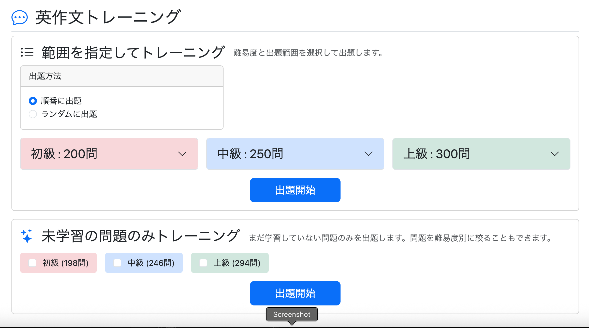
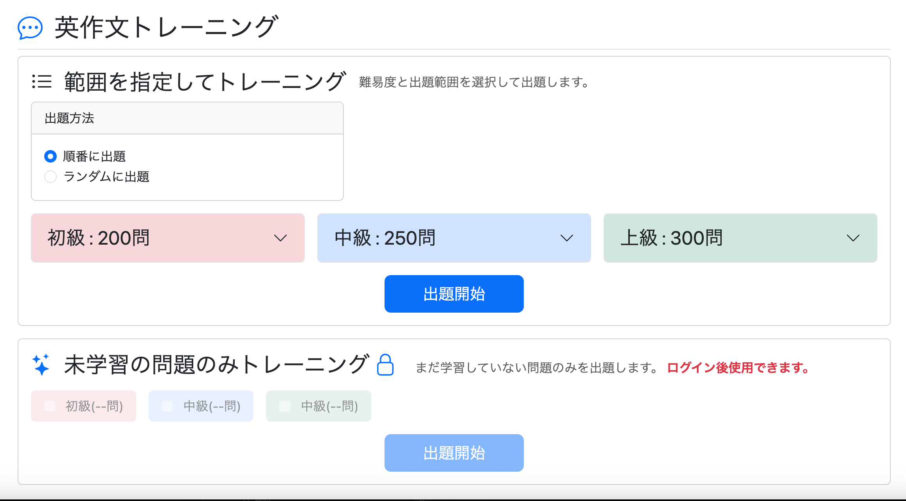

# 学習メニュー（study/menu.html）のUIを見直す

## 問題点

学習メニュー画面を確認したところ、以下のようなUI上の問題があった。

- 出題方法のカードと出題開始ボタンが横に大きすぎる
- Home画面へ戻るボタンがない
- 各学習モードの説明がなく、1つ目の学習モードには名称すら表示されていない
- 各学習モードの境界が曖昧で、別々の機能であることが一目で分かりにくい
- ログイン限定機能を非ログイン時に完全に非表示にしているため、
  - ログインすると利用できる機能が分かりにくい
  - 機能の存在自体をユーザーが知らずに終わってしまう


---

## 修正
（git commit: `"feat: improve study menu UI"`）

### 出題方法カードのサイズを調整

出題方法カードが横に広すぎたため、幅を固定してコンパクトなレイアウトへ変更した。

#### 変更前

```html
<!-- 出題方法 -->
<div class="card mb-4">

    <div class="card-header">
        ...
    </div>

    <div class="card-body">
        ...
    </div>

</div>
```

#### 変更後

```html
<div class="d-flex mb-4">

    <div class="card" style="width: 400px;">

        <div class="card-header">
            ...
        </div>

        <div class="card-body">
            ...
        </div>

    </div>

</div>
```

---

### 出題開始ボタンのサイズを調整

画面いっぱいに広がるボタンをやめ、中央配置のコンパクトなボタンへ変更した。

#### 変更前

```html
<button type="submit"
        class="btn btn-primary btn-lg w-100">
    出題開始
</button>
```

#### 変更後

```html
<div class="text-center mt-4">
    <button type="submit"
            class="btn btn-primary btn-lg px-5">
        出題開始
    </button>
</div>
```

---

### 未学習トレーニングのレイアウトを改善

通常学習モードと未学習トレーニングモードの出題開始ボタンの位置を揃えた。

また、画面をスクロールせずに利用できるようにするため、

- チェックボックスを縦並びから横並びへ変更
- 初級・中級・上級に通常学習モードと同じ色を付与

した。

```html
<div class="d-flex gap-3 mb-4">

    <label class="bg-danger-subtle rounded px-3 py-2">
        ...
    </label>

    <label class="bg-primary-subtle rounded px-3 py-2">
        ...
    </label>

    <label class="bg-success-subtle rounded px-3 py-2">
        ...
    </label>

</div>

<div class="text-center">
    <button type="submit"
            class="btn btn-primary btn-lg px-5">
        出題開始
    </button>
</div>
```

---

### 学習モード名と説明を追加

#### 範囲指定学習モード

```html
<div class="d-flex align-items-center gap-3 mb-2">
    <h3 class="mb-0">
        <i class="bi bi-list-ul me-2"></i>
        範囲を指定してトレーニング
    </h3>

    <p class="mb-0 text-muted">
        難易度と出題範囲を選択して出題します。
    </p>
</div>
```

#### 未学習トレーニングモード

```html
<div class="d-flex align-items-center gap-3 mb-2">
    <h3>
        <i class="bi bi-stars me-2 text-primary"></i>
        未学習の問題のみトレーニング
    </h3>

    <p class="mb-0 text-muted">
        まだ学習していない問題のみを出題します。
        問題を難易度別に絞ることもできます。
    </p>
</div>
```

---

### ページ見出しを変更

ページタイトルも分かりやすく変更した。

```html
<div class="header border-bottom mb-4">
    <h1 class="h2">
        <i class="bi bi-chat-dots me-2 text-primary"></i>
        英作文トレーニング
    </h1>
</div>
```

---

### 学習モードをカード化

通常学習と未学習トレーニングを、それぞれBootstrapのカードで囲み、視覚的に別の機能であることが分かるようにした。

```html
<div class="card mb-5">
    <div class="card-body">

        ...

    </div>
</div>
```

---

### 未学習トレーニングをゲストユーザーにも表示

これまでは未ログイン時には未学習トレーニングを完全に非表示にしていた。

しかし、

- ログインすると利用できる機能が伝わりにくい
- 機能自体の存在を知らずに終わってしまう

という問題があった。

そこで、ゲストユーザーには**利用できない状態のUI**を表示することにした。

- 鍵アイコンを表示
- 「ログイン後使用できます。」というメッセージを表示
- チェックボックスを`disabled`
- 出題開始ボタンを`disabled`
- `opacity-50`を利用して半透明表示

```html
<!-- 未学習トレーニング（ゲストのみ） -->
<div sec:authorize="isAnonymous()" class="mt-3">

    <div class="card mb-3">
        <div class="card-body">

            ...

            <label class="bg-danger-subtle rounded px-3 py-2 opacity-50">
                <input class="form-check-input me-2"
                       type="checkbox"
                       disabled>
                初級（--問）
            </label>

            ...

            <button type="button"
                    class="btn btn-primary btn-lg px-5 opacity-50"
                    disabled>
                出題開始
            </button>

        </div>
    </div>

</div>
```

これにより、ゲストユーザーにも「ログインすると利用できる機能」が分かるようになり、ログイン・新規登録への導線としても機能するようになった。

---

## 修正後

学習モードごとの違いが視覚的に明確になり、ユーザーがどの設定を選択すれば目的の問題を出題できるか分かりやすくなった。

また、ログイン中と非ログイン中で利用できる機能の違いも一目で分かるUIとなり、ユーザビリティが向上した。





---

## 次にやること

- 復習メニュー（`review/menu.html`）のUIを見直す