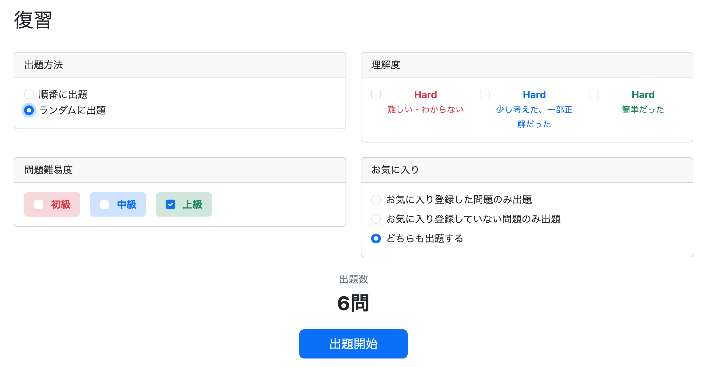

# 復習メニュー（`review/menu.html`）のUI改善

## 問題点

復習メニューには以下のようなUI上の課題があった。

- 出題開始ボタンが画面いっぱいに表示され、必要以上に大きく見える
- 評価（`Hard`、`Good`、`Easy`）の意味が画面上から分からず、初めて利用するユーザーには選択基準が伝わりにくい
- 問題難易度のチェックボックスが縦並びになっており、画面内で余計なスペースを消費していた

---

## 修正
（git commit: `feat: improve review menu UI`）

### 出題開始ボタンのサイズを調整

画面いっぱいに広がるボタンではなく、他の画面と同じサイズの中央配置ボタンへ変更した。

#### 変更前

```html
<button type="submit"
        class="btn btn-primary btn-lg w-100">
    出題開始
</button>
```

#### 変更後

```html
<div class="text-center mt-4">
    <button type="submit"
            class="btn btn-primary btn-lg px-5">
        出題開始
    </button>
</div>
```

これにより、通常学習画面と統一感のあるデザインとなった。

---

### 評価欄を「理解度」へ変更し、説明を追加

#### 問題点

これまでの画面では

- Hard
- Good
- Easy

という名称だけが表示されていたため、それぞれをどのような基準で選択すればよいのか分かりにくかった。

そこで、「評価」という表現をよりユーザー目線の**「理解度」**へ変更し、それぞれの選択肢に説明文を追加した。

#### 変更内容

カードタイトル

```text
評価
```

↓

```text
理解度
```

各選択肢も以下のように変更した。

```html
<label class="form-check-label">
    <span class="fw-bold text-danger">
        Hard
    </span>
    <br>
    <small class="text-danger">
        難しい・わからない
    </small>
</label>
```

```html
<label class="form-check-label">
    <span class="fw-bold text-primary">
        Good
    </span>
    <br>
    <small class="text-primary">
        少し考えた・一部正解だった
    </small>
</label>
```

```html
<label class="form-check-label">
    <span class="fw-bold text-success">
        Easy
    </span>
    <br>
    <small class="text-success">
        簡単だった
    </small>
</label>
```

説明文にも見出しと同じ色を使用することで、視覚的な統一感を持たせている。

---

### 問題難易度のレイアウトを改善

#### 問題点

問題難易度は縦並びのチェックボックスとなっており、画面の横幅を十分に活用できていなかった。

#### 修正

`d-flex`を利用して横並びに変更し、各選択肢を色付きラベル風のデザインへ変更した。

#### 変更前

```html
<div class="form-check mb-2">
    <input class="form-check-input"
           type="checkbox"
           name="difficulties"
           value="BEGINNER">

    <label class="form-check-label">
        初級
    </label>
</div>
```

#### 変更後

```html
<div class="d-flex gap-3">

    <label class="bg-danger-subtle rounded px-3 py-2">
        <input class="form-check-input me-2"
               type="checkbox"
               name="difficulties"
               value="BEGINNER">

        <span class="fw-bold text-danger">
            初級
        </span>
    </label>

    <label class="bg-primary-subtle rounded px-3 py-2">
        <input class="form-check-input me-2"
               type="checkbox"
               name="difficulties"
               value="INTERMEDIATE">

        <span class="fw-bold text-primary">
            中級
        </span>
    </label>

    <label class="bg-success-subtle rounded px-3 py-2">
        <input class="form-check-input me-2"
               type="checkbox"
               name="difficulties"
               value="ADVANCED">

        <span class="fw-bold text-success">
            上級
        </span>
    </label>

</div>
```

難易度ごとに背景色と文字色を設定することで、選択肢を直感的に識別できるようになった。

---

## 修正後

- 出題開始ボタンが適切なサイズとなり、通常学習画面とのデザインを統一できた。
- 「理解度」という表現と説明文を追加したことで、各評価を選択する基準が分かりやすくなった。
- 問題難易度を横並びの色付きラベルへ変更したことで、画面を有効活用でき、視認性も向上した。

全体として、復習メニューの操作性と視認性が改善され、初めて利用するユーザーにも分かりやすいUIとなった。

