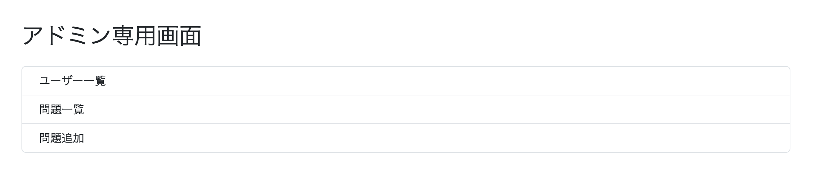
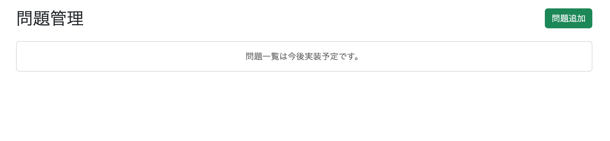
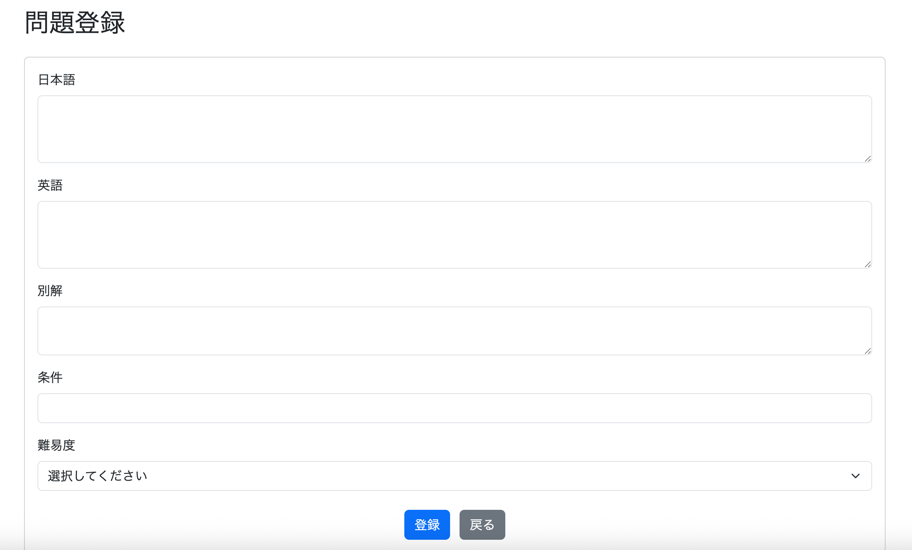
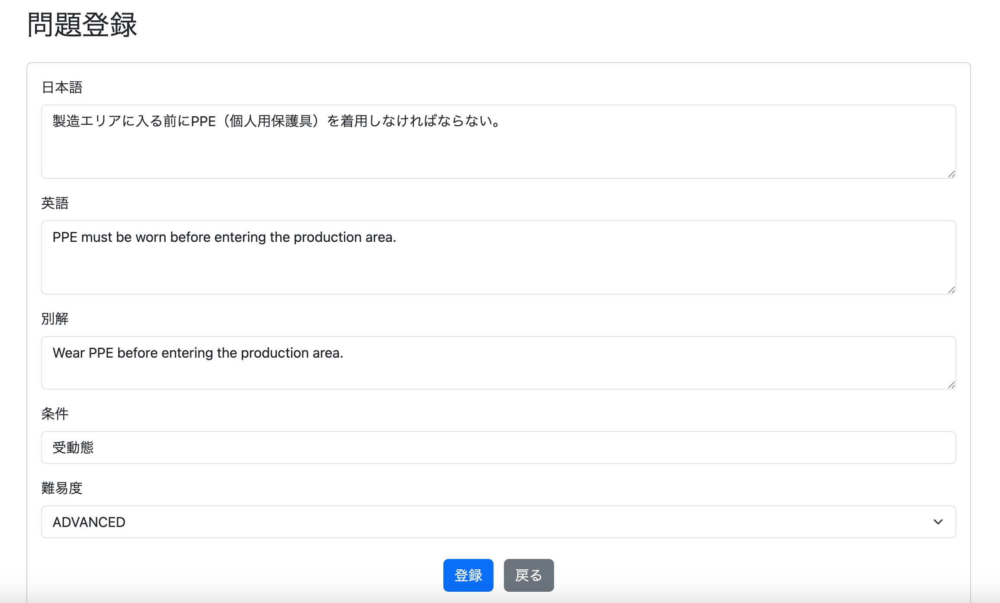
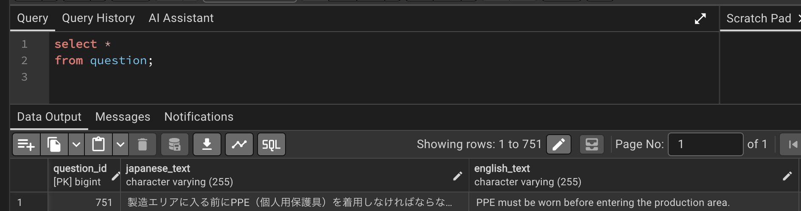

# 管理者による問題編集・追加・削除（CRUD完成）

管理者画面からも問題の追加・編集・削除を行えるようにする。 :contentReference[oaicite:0]{index=0}

## どんな画面にするか

まずは問題管理画面を作成する。

### admin/question/list.html（仮）

```text
──────────────────────────────────────────────────────────────────────────────
                                    ＋ 問題追加
──────────────────────────────────────────────────────────────────────────────

ID    日本語                    英語                     難易度  詳細 編集 削除
1     死への恐怖は死そのもの...  Fear of death is...      中級    詳細 編集 削除
2     女は秘密を着飾って美し...  A secret makes...       初級    詳細 編集 削除
...

──────────────────────────────────────────────────────────────────────────────
```

### 一覧画面の仕様

- 日本語・英語は全文ではなく20文字程度まで表示する。
- 難易度は背景色などを付け、一目で判別できるようにする。
- 詳細ボタンを押すとモーダルを表示し、以下を確認できる。
    - 日本語全文
    - 英語全文
    - 別解
    - Condition
- 編集ボタンを押すと編集画面へ遷移する。

```text
admin/question/edit?questionId=XXX
```

---

## 一覧画面にフィルタリング機能を追加したい

設計を進めていくうちに、一覧画面には検索・絞り込み機能も必要だと感じた。

### 難易度

- 初級
- 中級
- 上級

### 別解

- あり
- なし

### Condition

登録済みのConditionを選択できるようにする。

例

- 仮定法
- 動名詞
- 不定詞
- ...

UIは

- プルダウン
- チェックボックス

のどちらにするかは未定である。

### キーワード検索

```text
キーワード：[　　　　　　]
```

検索対象は

- 日本語
- 英語
- 別解

のみとする。

---

# 何から実装するべきか

最終的には

- 問題追加
- 問題編集
- 問題削除
- 問題検索

まで実装することになる。

しかし、最初に実装すべきなのは**追加・編集画面**である。

理由は、CRUDの基本機能であり、他の機能への依存が少ないためである。

実装順序は次のようにする。

1. 問題追加（INSERT）
2. 問題編集（UPDATE）
3. 問題削除（DELETE）
4. 問題一覧・検索（SELECT）

この順番に実装することで、CRUDの基本機能を先に完成させ、その後に一覧表示や検索機能を追加できる。

# 追加・編集画面（CRUDの基本）の実装

## 問題追加

まずは「問題を1件追加できる」状態にする。

`GET /admin/question/add` で問題登録画面を表示し、入力内容を送信すると `POST /admin/question/add` が実行される。

登録処理は次の流れで行われる。

```text
QuestionForm
        ↓
AdminController
        ↓
AdminService
        ↓
QuestionRepository
        ↓
save()
```

実装する内容は次のとおりである。

- QuestionForm作成
- AdminControllerに `getQuestionAdd()`、`postQuestionAdd()` を追加
- AdminServiceに `addQuestion()` を追加
- QuestionRepository（JPAのため追加実装不要）
- admin/question/add.html 作成

---

## QuestionForm作成（feat: add question form）

問題登録画面から送信されたデータを受け取るため、`QuestionForm` を作成する。

```java
@Data
public class QuestionForm {

    private String japaneseText;

    private String englishText;

    private String alternativeAnswer;

    private String condition;

    private Difficulty difficulty;
}
```

---

## AdminController（feat: add controller for question management）

### getQuestionList()

```java
@GetMapping("/admin/question/list")
public String getQuestionList() {
    return "admin/question/list";
}
```

これは問題一覧ページを表示するためのGetMappingである。

現時点では問題一覧を取得する処理はまだ実装していないため、画面を表示するだけとなっている。

先にこの画面を用意しておくことで、

- 問題登録後のリダイレクト先
- 「問題追加」ボタンの遷移先

として利用できる。

---

### getQuestionAdd()

```java
@GetMapping("/admin/question/add")
public String getQuestionAdd(
        Model model) {

    model.addAttribute(
            "questionForm",
            new QuestionForm());

    return "admin/question/add";
}
```

問題登録画面を表示するためのGetMappingである。

画面では `QuestionForm` を使用してフォーム入力を行うため、空の `QuestionForm` オブジェクトを生成し、Modelへ格納してから画面へ渡している。

これによりThymeleafでは、

```html
th:object="${questionForm}"
```

としてフォームとオブジェクトをバインドできる。

---

### postQuestionAdd()

```java
@PostMapping("/admin/question/add")
public String postQuestionAdd(
        @ModelAttribute QuestionForm form,
        Model model) {

    // バリデーションは後で実装

    log.info("問題登録 {}", form);

    adminService.addQuestion(form);

    return "redirect:/admin/question/list";
}
```

問題登録画面から送信されたデータを受け取り、Serviceへ渡して問題を登録する。

登録完了後は問題一覧画面へリダイレクトする。

なお、この時点ではバリデーションはまだ実装していないため、正常系のみ実装している。

## AdminService（feat: add question creation service）

Controllerから受け取った`QuestionForm`を`Question`エンティティへ変換し、データベースへ登録する。

```java
public void addQuestion(QuestionForm form) {

    Question question = new Question();

    question.setJapaneseText(form.getJapaneseText());
    question.setEnglishText(form.getEnglishText());
    question.setAlternativeAnswer(form.getAlternativeAnswer());
    question.setCondition(form.getCondition());
    question.setDifficulty(form.getDifficulty());

    Question savedQuestion = questionRepository.save(question);

    log.info("問題登録完了 questionId={}", savedQuestion.getQuestionId());

}
```

Controllerの役割はHTTPリクエストを受け取ることであり、エンティティへの変換や登録処理はServiceの責務である。

そのため、`QuestionForm`から`Question`への変換もServiceで行う。

---

## QuestionIdはどうやって振る？

`question_id`を自動採番するように`Question`エンティティクラスを修正すれば、Spring Data JPAが`save()`実行時に自動で採番されたIDを取得してくれる。

### Question.java（refactor: enable auto generation of question IDs）

```java
@Id
@GeneratedValue(strategy = GenerationType.IDENTITY)
@Column(name = "question_id")
private Long questionId;
```

これにより、問題登録時に`questionId`を自分で設定する必要はなくなる。

`save()`が実行されると、PostgreSQLのシーケンスから次の`question_id`が取得され、自動でINSERTされる。

また、`save()`の戻り値には採番後のエンティティが返されるため、

```java
savedQuestion.getQuestionId();
```

で登録された問題IDを取得できる。

---

## 重複チェックは必要か？

結論から言うと、**現時点では不要**である。

例えば、

```java
boolean isExists =
    questionRepository.existsByJapaneseText(...);
```

とすれば、日本語を基準に重複チェックできる。

また、

```java
boolean isExists =
    questionRepository.existsByEnglishText(...);
```

とすれば、英語を基準に判定することもできる。

しかし、日本語だけを重複チェック対象にすると、

- 私は学生です
    - I am a student.
    - I'm a student.

のように、日本語は同じでも英訳が異なる問題を登録できなくなってしまう。

そのため、将来的に重複チェックを実装する場合は、

- 日本語
- 英語

の組み合わせで判定する方が自然である。

今回はまずCRUDの完成を優先し、重複チェックは実装しないことにした。

---

## QuestionRepository

問題追加ではRepositoryに新しいメソッドを追加する必要はない。

現在、

```java
public interface QuestionRepository
        extends JpaRepository<Question, Long> {
}
```

となっている。

`JpaRepository`にはあらかじめ`save()`が用意されているため、

```java
questionRepository.save(question);
```

だけでINSERTを実行できる。

そのため、問題追加機能ではRepositoryの修正は不要である。

## admin/question/add.html（feat: add question registration page）

問題登録画面を作成する。

現時点ではバリデーションは実装せず、CRUDの基本機能を完成させることを優先した。

入力項目は次の5つである。

- 日本語
- 英語
- 別解
- Condition
- 難易度

送信ボタンを押すと、

```text
POST /admin/question/add
```

が実行される。

また、「戻る」ボタンを押すことで問題一覧画面へ戻れるようにした。

難易度については、

```html
<option
    th:each="difficulty :
        ${T(com.example.demo.entity.Difficulty).values()}"
```

とすることで、`Difficulty`列挙型から選択肢を自動生成している。

そのため、将来難易度を追加・変更した場合でも、HTMLを書き換える必要がない。

---

## admin.html（feat: add navigation for question management）

管理者画面から問題管理画面へ遷移できるようにリンクを追加した。

追加したメニューは次の2つである。

- 問題一覧
- 問題追加

これにより、管理者画面から直接、

- 問題一覧画面
- 問題登録画面

へアクセスできるようになった。

---

## admin/question/list.html（feat: add question list page）

問題一覧画面の土台となるページを作成した。

現時点では問題一覧を取得する処理はまだ実装していないため、

```text
問題一覧は今後実装予定です。
```

というプレースホルダーだけを表示している。

一方で、画面右上には

```text
＋ 問題追加
```

ボタンを配置し、

```text
/admin/question/add
```

へ遷移できるようにした。

この画面は今後、

- 問題一覧表示
- フィルタリング
- ページネーション
- 編集
- 削除

などを追加していく土台となる。

---

# 実行

実装後、次の点を確認した。

- 管理者画面から問題一覧画面へ遷移できること
- 問題一覧画面から問題登録画面へ遷移できること
- 問題登録後、問題一覧画面へリダイレクトされること





さらに、実際に問題を登録し、入力内容がデータベースへ正常に保存されることも確認した。




---

# 所感

今回の実装では、管理者による問題管理機能の第一歩として、**問題登録（Create）** を完成させることができた。

また、CRUDを実装する順番を

1. 追加
2. 編集
3. 削除
4. 一覧・検索

としたことで、依存関係の少ない機能から段階的に実装を進められた。

Spring Data JPAの`JpaRepository`を利用していたため、Repositoryへ独自メソッドを追加することなく`save()`だけで登録処理を実装できた点も、Spring Bootの利便性を改めて実感した。

さらに、`question_id`を自動採番へ変更したことで、今後の問題追加や編集機能をよりシンプルに実装できる土台が整った。

---

# 次やること

- 問題登録機能にバリデーションを実装する

