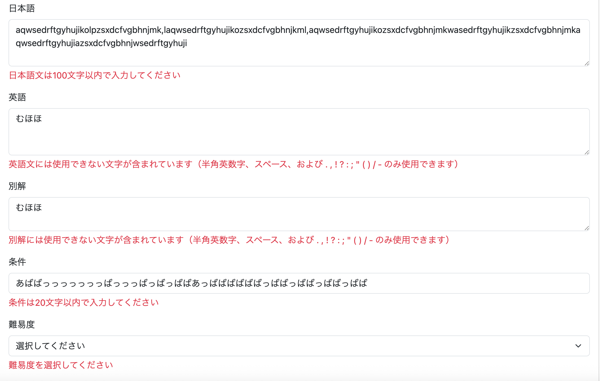

# 問題登録時のバリデーション

049で問題登録機能は実装できたものの、**入力値のバリデーションが存在しなかった。**

このままでは、

- 必須項目が空欄でも登録できてしまう
- 想定以上に長い文章を登録できてしまう
- 英語欄に日本語や特殊文字を入力できてしまう

などの問題がある。

そこで、Bean Validation（Hibernate Validator）を利用し、問題登録画面へ入力値のバリデーションを追加することにした。

---

# バリデーション仕様

まずは各入力項目の仕様を決める。

|項目|バリデーション|
|---|---|
|日本語文|必須・100文字以内|
|英語文|必須・200文字以内・半角英数字と一般的な英文記号のみ|
|別解|任意・200文字以内・英語文と同じ条件|
|Condition|20文字以内|
|Difficulty|必須（Enum選択）|

---

## 英語欄で許可する文字

英語文・別解では、日本語などの入力を防ぐため、入力可能な文字を制限する。

許可する文字は以下のとおり。

- 半角英字（A-Z、a-z）
- 半角数字（0-9）
- スペース
- ピリオド（.）
- カンマ（,）
- 感嘆符（!）
- 疑問符（?）
- コロン（:）
- セミコロン（;）
- アポストロフィ（'）
- ダブルクォーテーション（"）
- 丸括弧（()）
- スラッシュ（/）
- ハイフン（-）
- パーセント（%）
- アンパサンド（&）
- ドル記号（$）
- プラス（+）

これにより、一般的な英文で使用される文字は入力できる一方、日本語など想定外の文字は入力できなくなる。

---

## QuestionForm.javaの修正

**git commit**

```text
feat: add validation to question form
```

`QuestionForm`へBean Validationを追加する。

```java
@Data
public class QuestionForm {

    @NotBlank
    @Length(max = 100)
    private String japaneseText;

    @NotBlank
    @Length(max = 200)
    @Pattern(
            regexp = "^[a-zA-Z0-9 .,!?:;'\"()/-%$&+]+$"
    )
    private String englishText;

    @Length(max = 200)
    @Pattern(
            regexp = "^[a-zA-Z0-9 .,!?:;'\"()/-%$&+]*$"
    )
    private String alternativeAnswer;

    @Length(max = 20)
    private String condition;

    @NotNull
    private Difficulty difficulty;
}
```

### 各アノテーションの役割

- `@NotBlank`
    - 空文字・空白のみの入力を禁止する。
- `@Length`
    - 最大文字数を制限する。
- `@Pattern`
    - 正規表現に一致した文字だけ入力できるようにする。
- `@NotNull`
    - 難易度が未選択で送信されることを防ぐ。

これにより、Controllerへ処理が渡る前に入力内容を検証できるようになった。

## validationMessages.propertiesの修正

**git commit**

```text
feat: add validation messages for question form
```

Bean Validationにはデフォルトのエラーメッセージが用意されているが、

```
length must be between 0 and 100
```

のような英語メッセージが表示されてしまう。

そこで、`ValidationMessages.properties`へQuestionForm専用のメッセージを追加し、日本語で分かりやすく表示できるようにする。

```properties
Length.questionForm.japaneseText=日本語文は100文字以内で入力してください
Length.questionForm.englishText=英語文は200文字以内で入力してください
Length.questionForm.alternativeAnswer=別解は200文字以内で入力してください
Length.questionForm.condition=条件は20文字以内で入力してください

Pattern.questionForm.englishText=英語文には使用できない文字が含まれています（半角英数字、スペース、および . , ! ? : ; ' " ( ) / - のみ使用できます）
Pattern.questionForm.alternativeAnswer=別解には使用できない文字が含まれています（半角英数字、スペース、および . , ! ? : ; ' " ( ) / - のみ使用できます）

NotBlank.questionForm.japaneseText=日本語文は必須入力です
NotBlank.questionForm.englishText=英語文は必須入力です

NotNull.questionForm.difficulty=難易度を選択してください
```

フィールドごとにメッセージを定義することで、

- 日本語文
- 英語文
- 別解
- Condition
- Difficulty

それぞれに適したエラーメッセージを表示できるようになった。

---

## AdminControllerの修正

**git commit**

```text
feat: enable validation for question registration
```

続いてController側でBean Validationを有効化する。

```java
@PostMapping("/admin/question/add")
public String postQuestionAdd(
        @ModelAttribute @Validated QuestionForm form,
        BindingResult bindingResult,
        Model model) {

    // バリデーションエラー
    if (bindingResult.hasErrors()) {
        return "admin/question/add";
    }

    log.info("問題登録 {}", form);

    adminService.addQuestion(form);

    return "redirect:/admin/question/list";
}
```

### `@Validated`

`@Validated`を付与すると、`QuestionForm`に設定したBean Validationが自動的に実行される。

### `BindingResult`

バリデーション結果は`BindingResult`へ格納される。

```java
bindingResult.hasErrors()
```

が`true`であれば、何らかの入力エラーが存在することを意味する。

今回はエラーが発生した場合、

```java
return "admin/question/add";
```

として問題登録画面へ戻すようにした。

なお、`BindingResult`は**`@Validated`を付けた引数の直後に記述する必要がある。**

順番を誤るとSpringが正しくバリデーション結果を受け取れないため注意が必要である。

## admin/question/add.htmlの修正

**git commit**

```text
feat: display validation errors on question form
```

最後に、Controllerで検出したバリデーションエラーを画面へ表示できるようにする。

各入力項目の直下へ、`th:errors`を利用したエラーメッセージ表示を追加する。

### 日本語

```html
<textarea
    th:field="*{japaneseText}"
    class="form-control"
    rows="3"
    required>
</textarea>

<div class="text-danger mt-1"
     th:if="${#fields.hasErrors('japaneseText')}"
     th:errors="*{japaneseText}">
</div>
```

---

### 英語

```html
<textarea
    th:field="*{englishText}"
    class="form-control"
    rows="3"
    required>
</textarea>

<div class="text-danger mt-1"
     th:if="${#fields.hasErrors('englishText')}"
     th:errors="*{englishText}">
</div>
```

---

### 別解

```html
<textarea
    th:field="*{alternativeAnswer}"
    class="form-control"
    rows="2">
</textarea>

<div class="text-danger mt-1"
     th:if="${#fields.hasErrors('alternativeAnswer')}"
     th:errors="*{alternativeAnswer}">
</div>
```

---

### Condition

```html
<input
    type="text"
    th:field="*{condition}"
    class="form-control">

<div class="text-danger mt-1"
     th:if="${#fields.hasErrors('condition')}"
     th:errors="*{condition}">
</div>
```

---

### Difficulty

```html
<select
    th:field="*{difficulty}"
    class="form-select">

    <option value="">選択してください</option>

    <option
        th:each="difficulty : ${T(com.example.demo.entity.Difficulty).values()}"
        th:value="${difficulty}"
        th:text="${difficulty}">
    </option>

</select>

<div class="text-danger mt-1"
     th:if="${#fields.hasErrors('difficulty')}"
     th:errors="*{difficulty}">
</div>
```

`th:errors`は、Bean Validationによって発生したエラーメッセージを自動で表示してくれる。

また、`th:if`と組み合わせることで、エラーが存在するときだけメッセージを表示するようにした。

これにより、ユーザーは入力内容に問題があった場合、どの項目がどのような理由でエラーになったのかをすぐに確認できるようになった。

---

## 実行

`http://localhost:8080/admin/question/add`

へアクセスし、

- 必須項目を空欄にする
- 文字数制限を超える
- 英語欄へ日本語を入力する

などの入力を行い登録ボタンを押す。

するとバリデーションエラーが発生し、入力内容を保持したまま問題登録画面へ戻り、各項目の下へ対応するエラーメッセージが表示されることを確認した。



---

## 所感

Bean Validationを導入したことで、Controller内で入力チェックを個別に記述する必要がなくなり、コードが非常にシンプルになった。

また、バリデーションルールを`QuestionForm`へ集約できたため、入力仕様が分かりやすくなり、保守性も向上した。

さらに、`ValidationMessages.properties`を利用することで、ユーザーにとって分かりやすい日本語メッセージを表示できるようになり、操作性も改善された。

---

## 次やること

問題一覧画面（`/admin/question/list.html`）の実装