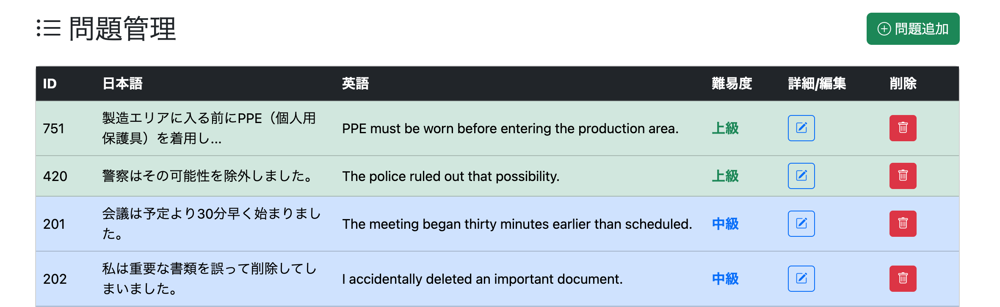
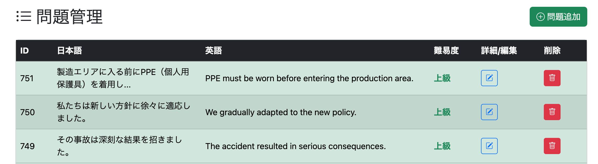

# アドミン専用の問題リスト表示ページを実装する

050で仮実装した `/admin/question/list.html` は、
現時点では `/admin/question/add` へのリンクボタンしか存在しない。

ここに実際に収録している問題一覧を表示し、
ページング機能も実装する。

---

# QuestionRepository.java

## 変更なし

Serviceから

```java
findAll(pageable);
```

を利用するため、Repositoryへの追記は不要である。

### findAll()にPageableを渡せるの？

渡せる。

`JpaRepository`にはあらかじめ次の2種類の`findAll()`が用意されている。

```java
findAll();
```

全件取得。

```java
findAll(Pageable pageable);
```

ページングされた結果を取得。

これは自分で実装するメソッドではなく、
`JpaRepository`が標準で提供しているオーバーロードである。

---

# AdminService.javaを修正
(commit: `feat: add paginated question retrieval service`)

```java
// 問題一覧取得(ページング付き全件取得)
public Page<Question> getAllQuestions(Pageable pageable) {

    Page<Question> questionList =
            questionRepository.findAll(pageable);

    return questionList;
}
```

## なぜServiceでPage<Question>を返すのか

今回必要なのは、

- 問題一覧
- 総ページ数
- 現在ページ
- 最初・最後のページかどうか

など、ページネーションに必要な情報である。

`Page<Question>`はこれらすべてを保持しているため、
ControllerではそのままHTMLへ渡すだけでよい。

---

# AdminController.javaを修正
(commit: `feat: add paginated question list endpoint`)

```java
@GetMapping("/admin/question/list")
public String getAdminQuestionList(
        @PageableDefault(page = 0, size = 50)
        Pageable pageable,
        Model model) {

    Page<Question> allQuestionList =
            adminService.getAllQuestions(pageable);

    model.addAttribute(
            "questionList",
            allQuestionList.getContent());

    model.addAttribute(
            "page",
            allQuestionList);

    return "/admin/question/list";
}
```

## 各処理の説明

### Pageable

```java
@PageableDefault(page = 0, size = 50)
```

デフォルトでは

- 1ページ目
- 50件表示

となる。

URLに

```text
?page=3
```

などが付与されれば、
Springが自動で`Pageable`へ変換してくれる。

---

### getAllQuestions()

Serviceから
ページング済みの問題一覧を取得する。

戻り値は`Page<Question>`である。

---

### getContent()

```java
allQuestionList.getContent()
```

現在のページに表示する問題一覧だけを取得する。

例えば

```text
全750件
50件表示
```

なら

```text
201〜250件目
```

だけが返される。

---

### pageをHTMLへ渡す理由

`Page<Question>`には

- 現在ページ
- 総ページ数
- 前ページ有無
- 次ページ有無

などが含まれている。

HTMLではこれらを利用して
ページネーションを描画する。

---

## `questionList`という名前にした理由

現在は

- 全問題一覧

のみを表示している。

しかし今後、

- 全問題一覧
- 検索結果一覧

の両方を
同じ`/admin/question/list.html`で表示する予定である。

そのためControllerでは

```java
allQuestionList
```

など用途に応じた変数名を使用し、

HTMLへ渡す際は

```java
questionList
```

という共通名に統一した。

これによりHTML側は

「どのように取得された一覧か」

を意識する必要がなくなり、
テンプレートをそのまま再利用できる。

# admin/question/list.htmlを修正
(commit: `feat: implement admin question list page`)

## 問題一覧テーブルを実装

ページングされた問題一覧を表示する画面を作成する。

### タイトル部分

画面上部には

- タイトル
- 問題追加ボタン

を配置した。

```html
<h2>
    <i class="bi bi-list-ul"></i>
    問題管理
</h2>

<a href="/admin/question/add">
    問題追加
</a>
```

管理画面であることが一目で分かり、
そのまま新規問題登録へ遷移できるようにしている。

---

## 問題一覧テーブル

BootstrapのTableを利用して一覧を表示する。

表示項目は

- 問題ID
- 日本語
- 英語
- 難易度
- 詳細・編集
- 削除

とした。

一覧画面では内容を確認することが目的であり、
全文を表示する必要はないため、日本語・英語ともに文字数を制限している。

---

### 日本語

```java
#strings.length(question.japaneseText) > 25
```

25文字を超える場合は

```text
・・・
```

を付与して省略表示する。

---

### 英語

```java
#strings.length(question.englishText) > 70
```

70文字を超える場合は同様に省略表示する。

英語は日本語より文字数が多くなるため、
日本語より長めに表示している。

---

## 難易度ごとに色分け

一覧を見ただけで難易度が分かるように、
行背景と文字色を変更した。

|難易度|背景色|文字色|
|---|---|---|
|初級|薄い赤|赤|
|中級|薄い青|青|
|上級|薄い緑|緑|

これにより難易度が一覧から視覚的に判別しやすくなった。

---

## 詳細・編集ボタン

各問題ごとに編集ボタンを配置した。

```html
<a
    th:href="@{/admin/question/edit(questionId=${question.questionId})}">
```

クリックすると対象問題の編集画面へ遷移する。

---

## 削除ボタン

削除ボタンも各問題に配置した。

現時点では見た目のみ実装し、
削除機能は今後実装予定とする。

---

# ページネーション

ページ下部にはページネーションを配置した。

BootstrapのPaginationコンポーネントを利用し、

- 前へ
- ページ番号
- 次へ

を表示する。

```html
<ul class="pagination">

    前へ

    ページ番号

    次へ

</ul>
```

---

## 「前へ」

```java
page.first
```

で現在が先頭ページか判定する。

先頭ページであれば

```html
disabled
```

を付与し、
クリックできないようにした。

---

## ページ番号

```java
#numbers.sequence(...)
```

を利用して

```text
1
2
3
・・・
```

を生成する。

現在ページは

```java
page.number
```

と比較し、

```html
active
```

を付与することで色を変えている。

---

## 「次へ」

最後のページでは

```java
page.last
```

がtrueとなる。

その場合

```html
disabled
```

を付与し、
次ページへ遷移できないようにしている。

---

## ここで何をしているのか

Controllerから渡された

```java
Page<Question>
```

には

- 問題一覧
- 現在ページ
- 総ページ数
- 最初・最後のページ判定

などページネーションに必要な情報が全て含まれている。

HTMLではその情報を利用し、

- 一覧表示
- ページ番号生成
- 前へ・次へボタンの制御

を行っている。

このように、

ページネーションに必要な情報はControllerで取得し、
表示だけをHTMLが担当する構成にすることで、
役割を明確に分離できる。

---

# 実行

```
http://localhost:8080/admin/question/list
```

へアクセスすると、

問題一覧が50件ずつページングされて表示されることを確認した。



---

# 改善点① ページ表記が見にくい

現在のページネーションでは

```text
1 2 3 4 5 6 7 8 9 10 11 12 ...
```

のように全ページ番号が表示される。


ページ数が増えるほど見づらくなるため改善する。

一般的なWebサイトでは、

先頭・現在付近・末尾のみを表示するケースが多い。

例えば、

先頭付近では

```text
1 2 3 4 5 6 ... 20
```

中央付近では

```text
1 ... 7 8 9 10 11 12 13 ... 20
```

末尾付近では

```text
1 ... 15 16 17 18 19 20
```

のように表示される。

今回もこのようなページネーションを実装する。

Thymeleafだけでも実装できるが、

表示するページ番号をController・Service側で計算し、

HTMLには

「表示するページ番号」

だけを渡す方が保守性が高いと判断した。

# どういう表示にするか

ページネーションは、

- 現在ページを中心に表示する
- 最初と最後のページへすぐ移動できる

というUIを目指す。

文章だけではイメージしづらいため、期待する表示パターンを整理した。

---

## ケース1

```text
1 ... 8 9 [10] 11 12 ... 100
```

- 現在ページを中心に前後2ページずつ表示する。
- 最初と最後のページも表示する。

---

## ケース2

```text
1 ... 4 5 [6] 7 8 ... 100
```

ケース1と同じ考え方。

---

## ケース3

```text
1 2 [3] 4 5 ... 100
```

最初のページと現在ページから2ページ前が一致するため、

```text
1 ... 2
```

とはせず、

```text
1 2
```

と表示する。

---

## ケース4

```text
1 [2] 3 4 5 ... 100
```

現在ページが先頭に近いため、

本来

```text
0 1 [2] 3 4
```

となるはずの表示範囲を右へ広げ、

```text
1 [2] 3 4 5
```

となるよう補正する。

---

## ケース5

```text
[1] 2 3 4 5 ... 100
```

現在ページが最初のページであるため、

表示範囲を

```text
1〜5
```

まで広げる。

---

## ケース6

```text
1 2 3 [4] 5 6 ... 100
```

最初のページとの差が1ページしかない場合、

```text
1 ... 2 3
```

ではなく、

```text
1 2 3
```

として表示する。

---

# 各ケースの実現方法

## ケース1・2

まず、

ページネーション計算に使用する値を用意する。

- currentPage
- startPage
- endPage
- displayStartPage
- displayEndPage

---

### currentPage

現在ページ。

```java
int currentPage = page.getNumber();
```

---

### startPage

最初のページ番号。

今回は0固定。

```java
int startPage = 0;
```

---

### endPage

最後のページ番号。

```java
int endPage = page.getTotalPages() - 1;
```

`Page#getTotalPages()`はページ数を返すため、

ページ番号へ変換するために1引く。

---

### displayStartPage

表示開始ページ。

```java
int displayStartPage =
        Math.max(startPage, currentPage - 2);
```

---

### displayEndPage

表示終了ページ。

```java
int displayEndPage =
        Math.min(endPage, currentPage + 2);
```

これで

```text
8 9 [10] 11 12
```

のような表示範囲が取得できる。

---

しかし、

```text
[1] 2 3
```

や

```text
97 98 [99] 100
```

では表示ページ数が不足してしまう。

そのため補正処理を追加する。

---

## ケース3・4・5

表示ページ数が5ページ未満になった場合、

不足しているページ数だけ反対側へ表示範囲を広げる。

例えば、

```text
[1] 2 3
```

なら

```text
[1] 2 3 4 5
```

となるように補正する。

逆に、

```text
97 98 [99] 100
```

なら

```text
95 96 97 98 [99]
```

となるよう左へ広げる。

不足ページ数は

```java
int shortage =
        4 - (displayEndPage - displayStartPage);
```

で求められる。

先頭側へ寄っている場合は

```java
displayEndPage =
        Math.min(endPage,
                displayEndPage + shortage);
```

末尾側へ寄っている場合は

```java
displayStartPage =
        Math.max(startPage,
                displayStartPage - shortage);
```

として補正する。

---

## ケース6

表示範囲が確定したあと、

省略記号(`...`)を表示するか判定する。

```java
boolean showFirstEllipsis =
        displayStartPage >= 3;

boolean showLastEllipsis =
        displayEndPage <= endPage - 3;
```

例えば

```text
1 2 3 [4]
```

のように、

最初のページとの差が1しかない場合は、

```text
1 ... 2 3 [4]
```

ではなく、

```text
1 2 3 [4]
```

と表示する。

---

# DTOを利用してHTMLへ渡す

今回HTMLへ渡したい情報は、

- currentPage
- displayStartPage
- displayEndPage
- showFirstEllipsis
- showLastEllipsis

の5つである。

これらは`Page<?>`が持っている情報ではないため、

別途HTMLへ渡す必要がある。

ここで着目したいのは、

今回渡したい情報は

**ページネーションに関する複数の値のまとまり**

であるという点である。

そこで、

ページネーション専用DTO

```text
PaginationDto
```

を作成することにした。

Controllerでは、

通常のページ情報は

```java
page
```

として渡し、

ページネーション表示専用の情報は

```java
pagination
```

としてDTOにまとめてHTMLへ渡す。

これにより、

Controller・HTML双方の責務が明確になり、

今後ページネーションの仕様変更があっても修正しやすい構成となる。

# Serviceを修正
(commit: `feat: add pagination calculation service`)

## createPaginationメソッドを作成

ページネーション表示に必要な情報を計算するため、
`createPagination()`メソッドを新しく作成する。

```java
public PaginationDto createPagination(Page<?> page) {

    // 現在のページ番号(0始まり)
    int currentPage = page.getNumber();

    // ページ番号の最小値・最大値
    int startPage = 0;
    int endPage = page.getTotalPages() - 1;

    // 現在ページの前後2ページを表示範囲とする
    int displayStartPage =
            Math.max(startPage, currentPage - 2);

    int displayEndPage =
            Math.min(endPage, currentPage + 2);

    // 表示ページ数が5ページ未満の場合は不足分を補う
    int shortage = 0;

    // 先頭側に寄っている場合は右側へ表示範囲を広げる
    if (displayStartPage == startPage) {

        shortage =
                4 - (displayEndPage - displayStartPage);

        displayEndPage =
                Math.min(endPage,
                        displayEndPage + shortage);

    // 末尾側に寄っている場合は左側へ表示範囲を広げる
    } else if (displayEndPage == endPage) {

        shortage =
                4 - (displayEndPage - displayStartPage);

        displayStartPage =
                Math.max(startPage,
                        displayStartPage - shortage);
    }

    // 先頭・末尾の省略記号(...)を表示するか判定
    boolean showFirstEllipsis =
            displayStartPage >= 3;

    boolean showLastEllipsis =
            displayEndPage <= endPage - 3;

    // DTOへ格納
    PaginationDto pagination =
            new PaginationDto();

    pagination.setCurrentPage(currentPage);
    pagination.setDisplayStartPage(displayStartPage);
    pagination.setDisplayEndPage(displayEndPage);
    pagination.setShowFirstEllipsis(showFirstEllipsis);
    pagination.setShowLastEllipsis(showLastEllipsis);

    return pagination;
}
```

## createPaginationで行っていること

このメソッドは、`Page`オブジェクトを受け取り、ページネーション表示に必要な情報だけを計算して返す役割を持つ。

まず現在のページ番号と、最初・最後のページ番号を取得する。

続いて、現在ページを中心に前後2ページずつ表示する範囲を計算する。

ただし現在ページが先頭や末尾に近い場合は表示ページ数が減ってしまうため、不足しているページ数だけ反対側へ表示範囲を広げる補正を行う。

最後に、

- 先頭側の`...`
- 末尾側の`...`

を表示する必要があるか判定し、それらすべてを`PaginationDto`へ格納して返している。

Service側で表示範囲を計算しておくことで、HTML側は渡された情報を表示するだけとなり、Thymeleafの記述をシンプルに保つことができる。

---

## getAllQuestionsメソッドは修正する？

今回は修正しない。

`getAllQuestions()`は問題一覧を取得する役割、

`createPagination()`はページネーション表示情報を計算する役割であり、それぞれ責務が異なるためである。

Controllerでは、

```java
Page<Question>
```

と

```java
PaginationDto
```

をそれぞれ取得し、両方をHTMLへ渡す構成としている。

---

# PaginationDtoを作成
(commit: `feat: add PaginationDto for pagination view`)

ページネーション表示に必要な情報をまとめて管理するDTOを作成する。

```java
package com.example.demo.dto;

import lombok.Data;

@Data
public class PaginationDto {

    private int currentPage;

    private int displayStartPage;

    private int displayEndPage;

    private boolean showFirstEllipsis;

    private boolean showLastEllipsis;

}
```

## DTOを作成した理由

今回HTMLへ渡したい値は5つ存在する。

- 現在ページ
- 表示開始ページ
- 表示終了ページ
- 先頭側の省略記号表示有無
- 末尾側の省略記号表示有無

これらをModelへ個別に追加することも可能だが、

```java
model.addAttribute(...);
```

が増え続け、Controller・HTMLともに管理しづらくなる。

そこでページネーション専用DTOとしてまとめることで、

```java
model.addAttribute("pagination", pagination);
```

だけで関連する情報を一括して受け渡せるようになった。

また、今後ページネーションに必要な情報が増えても、DTOへ項目を追加するだけで済むため拡張性も高い。

---

# AdminControllerを修正
(commit: `feat: add pagination data to admin question list`)

## 修正前

```java
Page<Question> allQuestionList =
        adminService.getAllQuestions(pageable);

model.addAttribute(
        "questionList",
        allQuestionList.getContent());

model.addAttribute(
        "page",
        allQuestionList);
```

---

## 修正後

```java
Page<Question> allQuestionList =
        adminService.getAllQuestions(pageable);

PaginationDto pagination =
        adminService.createPagination(allQuestionList);

model.addAttribute(
        "questionList",
        allQuestionList.getContent());

model.addAttribute(
        "page",
        allQuestionList);

model.addAttribute(
        "pagination",
        pagination);
```

## 変更内容

問題一覧を取得したあと、

```java
createPagination()
```

を呼び出してページネーション表示用のDTOを作成するようにした。

HTMLでは

- `page`
- `pagination`

の2つを利用する。

`page`はSpring Dataが提供する標準的なページ情報、

`pagination`は今回独自に計算した表示用情報である。

役割を分離することで、それぞれの責務が明確になり、Controller・HTMLともに読みやすい実装となった。

# admin/question/list.htmlを修正
(commit: `feat: improve pagination UI for question list`)

ページネーションを見やすくするため、表示方法を全面的に見直した。

従来は全ページ番号をそのまま表示していたが、

- 最初のページ
- 現在ページ周辺
- 最後のページ

のみを表示する一般的なUIへ変更した。

具体的には、

- 1ページ目を必要に応じて表示
- 表示範囲の開始〜終了ページだけをループ
- `...` を条件付きで表示
- 最終ページを必要に応じて表示

という構成に変更した。

---

## 1ページ目

```html
<li class="page-item"
    th:classappend="${page.number == 0} ? ' active'">

    <a class="page-link"
       th:href="@{/admin/question/list(page=0,size=${page.size})}">

        1

    </a>

</li>
```

1ページ目は常に表示する。

現在ページが1ページ目であれば
`active`を付与し、
現在位置を分かりやすくする。

---

## 先頭側の「...」

```html
<li class="page-item disabled"
    th:if="${pagination.showFirstEllipsis}">
```

Serviceで計算した

```java
showFirstEllipsis
```

がtrueのときだけ表示する。

これにより

```text
1 2 3 4
```

のようなケースでは

```text
1 ... 2 3 4
```

とはならない。

---

## 中央のページ番号

```html
th:each="i :
${#numbers.sequence(
pagination.displayStartPage,
pagination.displayEndPage)}"
```

ここでは

```java
displayStartPage
```

から

```java
displayEndPage
```

までだけをループしている。

以前のように

```text
1〜100
```

すべて生成するのではなく、

必要最小限のページ番号だけ表示するようになった。

また、

```java
th:if="${i != 0 and i != page.totalPages - 1}"
```

としているため、

最初・最後のページはここでは表示しない。

重複表示を防ぐためである。

---

## 末尾側の「...」

```html
<li class="page-item disabled"
    th:if="${pagination.showLastEllipsis}">
```

こちらもService側で計算した結果を利用する。

例えば

```text
95 96 97 98 99 100
```

のようなケースでは

```text
...
```

は表示されない。

---

## 最終ページ

```html
<li class="page-item"
    th:if="${page.totalPages > 1}">
```

ページ数が2ページ以上ある場合だけ表示する。

現在ページが最後なら

```html
active
```

を付与する。

---

## 前へ・次へ

前後のページ遷移は従来と同様である。

```java
page.first
```

なら「前へ」を無効化し、

```java
page.last
```

なら「次へ」を無効化する。

---

## ここで何をしているのか

今回の修正では、

ページ番号の計算はServiceへ移し、

HTMLは

「表示する」

ことだけに専念するよう役割を整理した。

そのため、

Thymeleaf側では

```java
pagination.displayStartPage
```

などDTOの値を利用するだけで、

複雑なページネーションを実現できている。

Controller・Service・HTMLそれぞれの責務が明確になり、

保守性の高い設計となった。

---

# 実行

```
http://localhost:8080/admin/question/list
```

へアクセスし、

先頭・中央・末尾など様々なページへ移動して動作を確認した。

期待どおり、

現在ページ周辺のみを表示するページネーションとなり、

ページ数が多くても見やすいUIになった。


---

# 改善点② 問題表示順を修正

問題一覧を表示してみると、

表示順が一定ではなく見づらいことが分かった。

ID昇順でも問題ないが、

この画面は新しい問題を登録したあとにリダイレクトされる画面でもある。

そのため、

直前に登録した問題をすぐ確認できるよう、

新しい問題を先頭へ表示する設計のほうが使いやすいと判断した。

つまり、

```sql
ORDER BY question_id DESC
```

で取得するよう変更する。

---

# QuestionRepositoryを修正
(commit: `feat: add query to retrieve questions in descending ID order`)

```java
Page<Question>
findAllByOrderByQuestionIdDesc(
        Pageable pageable);
```

を追加する。

Spring Data JPAでは、

メソッド名だけで

```sql
ORDER BY question_id DESC
```

を自動生成できる。

もちろん、

```java
@Query
```

を使ってJPQLを書くことも可能である。

---

# AdminServiceを修正
(commit: `refactor: retrieve questions in descending ID order`)

```java
public Page<Question> getAllQuestions(
        Pageable pageable) {

    return questionRepository
            .findAllByOrderByQuestionIdDesc(
                    pageable);
}
```

取得するRepositoryメソッドを変更するだけで、

ControllerやHTMLを変更する必要はない。

Serviceの責務を保ったまま、

表示順だけを変更できる。

# 実行

```
http://localhost:8080/admin/question/list
```

へアクセスすると、

問題が新しく登録された順（問題ID降順）で表示されるようになったことを確認した。



---

# 所感

今回の実装では、単に問題一覧を表示するだけでなく、実用的な管理画面としての使いやすさも意識して設計を進めた。

特にページネーションは、単純にページ番号をすべて表示するだけであれば比較的簡単に実装できる。しかし実際のWebアプリケーションでは、

- 現在ページ周辺のみ表示する
- 先頭・末尾ページへすぐ移動できる
- 必要な場合だけ`...`を表示する

といった工夫が施されていることが多い。

今回そのロジックを自分で設計・実装したことで、ページネーションのアルゴリズムについて理解を深めることができた。

また、

- Serviceで表示範囲を計算する
- DTOでページネーション情報をまとめる
- HTMLは表示だけに専念する

という責務分離を意識したことで、保守性・可読性ともに高い構成にできたと感じる。

問題一覧の表示順についても、新しく追加した問題をすぐ確認できるよう降順表示へ変更した。

今後は検索条件や並び替え機能を追加していく予定であるため、今回の実装はその土台となるものになった。

---

# 反省

## 「追加順」を保証するなら問題IDでは不十分

今回は

```sql
ORDER BY question_id DESC
```

としたが、

厳密には

```text
問題ID = 登録順
```

とは限らない。

例えば、

- データ移行
- IDの再採番
- INSERT方法の変更

などが行われると、問題IDと登録順が一致しなくなる可能性がある。

本当に「新しく登録した順」を保証したいのであれば、

```text
created_at
```

カラムを持たせ、

```sql
ORDER BY created_at DESC
```

とする設計が一般的である。

その意味では、要件定義・テーブル設計の段階で登録日時を保持するカラムを用意しておくべきだった。

今後、追加日時や更新日時による検索・並び替えを行う可能性も考えると、初期設計の重要性を改めて実感した。

---

# 次にやること

- `admin/question/list.html`へ問題検索機能を追加する
- 日本語・英語・条件・難易度など複数条件で検索できるようにする
- 検索結果も現在の一覧画面をそのまま再利用する
- 並び替え機能（ID順・難易度順・登録順など）の追加も検討する