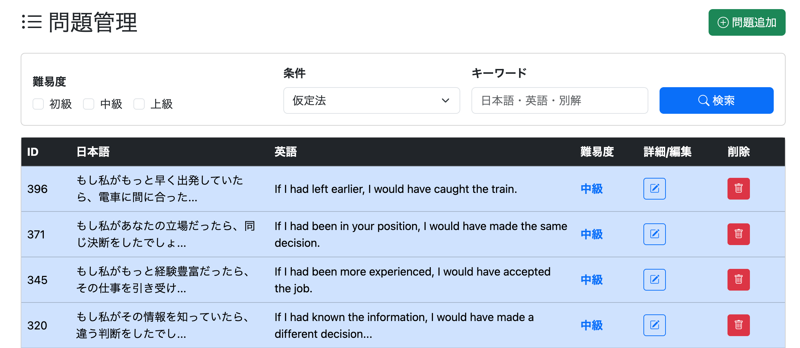
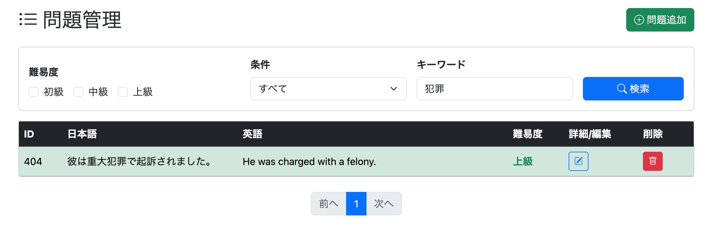

# /admin/question/list.htmlに検索機能を追加する

管理者画面の問題一覧は登録済み問題を一覧表示するだけだったため、問題数が増えるにつれて目的の問題を探しづらくなってきた。

そこで以下の条件で検索できる機能を追加することにした。

- 難易度（複数選択）
- 条件（Condition）
- キーワード

キーワードは

- 日本語文
- 英語文
- 別解

を対象に部分一致検索する。

---

# QuestionRepository.java

## Condition一覧取得用のクエリを追加
*(feat(admin): add service to retrieve all registered conditions)*

検索フォームのCondition欄は、登録済みのConditionをプルダウン表示したい。

そのため、QuestionテーブルからConditionを重複なしで取得するクエリを追加した。

```java
@Query("""
    SELECT DISTINCT q.condition
    FROM Question q
    WHERE q.condition IS NOT NULL
    ORDER BY q.condition
""")
List<String> findDistinctConditions();
```

### 処理内容

- NULLを除外
- DISTINCTで重複排除
- アルファベット順に並び替え

---

## 問題検索用クエリを追加
*(feat(admin): implement filtered question search service)*

管理画面から検索条件を受け取り、条件に一致する問題だけ取得するクエリを追加した。

```java
@Query(value = """
    SELECT q.*
    FROM question q
    WHERE q.difficulty IN (:difficulties)
      AND q.condition IN (:condition)
      AND (
            LOWER(q.japanese_text)
                LIKE LOWER(CONCAT('%', :keyword, '%'))
         OR LOWER(q.english_text)
                LIKE LOWER(CONCAT('%', :keyword, '%'))
         OR LOWER(q.alternative_answer)
                LIKE LOWER(CONCAT('%', :keyword, '%'))
      )
    ORDER BY q.question_id DESC
    """, nativeQuery = true)
List<Question> findFilteredQuestions(
        @Param("difficulties") List<String> difficulties,
        @Param("conditions") List<String> conditions,
        @Param("keyword") String keyword);
```

検索条件は以下の3種類である。

- 難易度
- Condition
- キーワード

キーワード検索ではLIKEを使用し、部分一致検索としている。

また、LOWER()を使用することで英語は大文字・小文字を区別せず検索できるようにした。

---

## 実装後に発覚した問題

実装後に検索を実行すると、

```
No argument for named parameter ':condition'
```

という例外が発生した。

原因はSQL内では

```sql
:condition
```

となっていたにもかかわらず、

Repositoryメソッドでは

```java
@Param("conditions")
```

となっており、パラメータ名が一致していなかったためである。

SQL側を

```sql
:conditions
```

へ修正したことで解決した。

同時にページネーションへ対応するため、

- 戻り値を `Page<Question>`
- 引数へ `Pageable`

を追加した。

```java
@Query(value = """
    SELECT q.*
    FROM question q
    WHERE q.difficulty IN (:difficulties)
      AND q.condition IN (:conditions)
      AND (
            LOWER(q.japanese_text)
                LIKE LOWER(CONCAT('%', :keyword, '%'))
         OR LOWER(q.english_text)
                LIKE LOWER(CONCAT('%', :keyword, '%'))
         OR LOWER(q.alternative_answer)
                LIKE LOWER(CONCAT('%', :keyword, '%'))
      )
    ORDER BY q.question_id DESC
    """, nativeQuery = true)
Page<Question> findFilteredQuestions(
        @Param("difficulties") List<String> difficulties,
        @Param("conditions") List<String> conditions,
        @Param("keyword") String keyword,
        Pageable pageable);
```

# AdminService

## 問題検索メソッドを追加
*(feat(admin): add filtered question search service)*

Repositoryへ検索条件を渡すサービスメソッドを追加した。

```java
public Page<Question> getFilteredQuestions(
        List<Difficulty> difficulties,
        List<String> conditions,
        String keyword,
        Pageable pageable) {

    if (conditions == null || conditions.isEmpty()) {
        conditions = getAllConditions();
    }

    if (difficulties == null || difficulties.isEmpty()) {
        difficulties = Arrays.asList(Difficulty.values());
    }

    return questionRepository.findFilteredQuestions(
            reviewService.convertDifficulty(difficulties),
            conditions,
            keyword,
            pageable);
}
```

### Condition未選択時の対応

検索画面ではConditionを選択しない場合もある。

その場合、

```java
conditions == null || conditions.isEmpty()
```

となるため、

```java
conditions = getAllConditions();
```

として登録済みConditionをすべて検索対象にしている。

---

### 難易度未選択時の対応

難易度もチェックしない状態で検索できるようにした。

未選択の場合は

```java
Arrays.asList(Difficulty.values())
```

を使用し、

- 初級
- 中級
- 上級

すべてを検索対象にしている。

これにより、どちらも未選択なら全件検索となる。

---

## Condition一覧取得メソッドを追加
*(feat(admin): add service to retrieve all conditions)*

検索フォームのプルダウン生成用にCondition一覧を取得するメソッドを追加した。

```java
public List<String> getAllConditions() {
    return questionRepository.findDistinctConditions();
}
```

RepositoryをControllerから直接呼ばず、Service経由で取得する構成としている。

---

# AdminController

## 検索用エンドポイントを追加
*(feat(admin): add question search endpoint)*

検索フォームから送信された条件を受け取り、検索結果を表示するGETエンドポイントを追加した。

```java
@GetMapping("/admin/question/search")
public String getAdminQuestionSearch(
        @PageableDefault(page = 0, size = 50) Pageable pageable,
        @RequestParam(required = false) List<Difficulty> difficulties,
        @RequestParam(required = false) List<String> conditions,
        @RequestParam(required = false) String keyword,
        Model model) {

    Page<Question> allFilteredQuestionList =
            adminService.getFilteredQuestions(
                    difficulties,
                    conditions,
                    keyword,
                    pageable);

    PaginationDto pagination =
            adminService.createPagination(
                    allFilteredQuestionList);

    model.addAttribute(
            "questionList",
            allFilteredQuestionList.getContent());

    model.addAttribute(
            "page",
            allFilteredQuestionList);

    model.addAttribute(
            "pagination",
            pagination);

    model.addAttribute(
            "conditions",
            adminService.getAllConditions());

    model.addAttribute(
            "selectedDifficulties",
            difficulties);

    model.addAttribute(
            "selectedConditions",
            conditions);

    model.addAttribute(
            "keyword",
            keyword);

    return "/admin/question/list";
}
```

### `required = false` を指定

検索条件はすべて任意入力である。

そのため、

```java
@RequestParam(required = false)
```

を指定し、

未入力でもエラーにならないようにした。

---

## 実装後に発覚した問題①

検索後にConditionプルダウンが表示されなくなった。

原因は、

```java
model.addAttribute("conditions",
        adminService.getAllConditions());
```

を追加し忘れていたためである。

検索画面では

```html
th:each="condition : ${conditions}"
```

でプルダウンを生成しているため、

Modelへ渡さないと一覧を表示できない。

この処理を追加して解決した。

```
fix(admin): add conditions to search model
```

---

## 実装後に発覚した問題②

検索を実行すると、

入力した検索条件がすべて初期状態へ戻ってしまった。

そこで、

```java
selectedDifficulties
selectedConditions
keyword
```

をModelへ追加し、

検索条件を画面へ保持できるように修正した。

```
feat(admin): support question search conditions
```

---

## 通常一覧表示も修正

通常の一覧表示でもCondition一覧を使用するため、

```java
@GetMapping("/admin/question/list")
```

にも以下を追加した。

```java
model.addAttribute(
        "conditions",
        adminService.getAllConditions());
```

これにより、

- 初回表示
- 検索結果表示

どちらでも同じ検索フォームを利用できるようになった。

# admin/question/list.html

## 検索フォームを追加
*(feat(admin): add question search form)*

管理画面の問題一覧ページ上部に検索フォームを追加した。

検索条件は以下の3項目である。

- 難易度
- Condition
- キーワード

フォームはGETメソッドで送信し、検索結果をURLパラメータとして扱う構成にした。

```html
<form th:action="@{/admin/question/search}"
      method="get"
      class="card p-3 mb-3">
```

---

## 難易度

難易度は

- 初級
- 中級
- 上級

の3つをチェックボックスで選択できるようにした。

```html
<input class="form-check-input"
       type="checkbox"
       name="difficulties"
       value="BEGINNER">
```

検索後もチェック状態を維持するため、

```html
th:checked="${selectedDifficulties != null
    and selectedDifficulties.contains(...)}"
```

を使用している。

---

## Condition

ConditionはRepositoryから取得した一覧をプルダウン表示している。

```html
<select class="form-select"
        name="conditions">

    <option value="">
        すべて
    </option>

    <option
        th:each="condition : ${conditions}"
        th:value="${condition}"
        th:text="${condition}"
        th:selected="${selectedConditions != null
            and selectedConditions.contains(condition)}">
    </option>

</select>
```

登録済みConditionが自動で表示されるため、新しいConditionを追加してもHTMLを修正する必要はない。

---

## キーワード

キーワードはテキストボックスで入力できるようにした。

```html
<input class="form-control"
       type="text"
       name="keyword"
       placeholder="日本語・英語・別解"
       th:value="${keyword}">
```

検索後も入力内容が残るよう、

```html
th:value="${keyword}"
```

を設定している。

---

## 検索ボタン

検索実行用のボタンを配置した。

```html
<button class="btn btn-primary"
        type="submit">

    <i class="bi bi-search"></i>

    検索

</button>
```

Bootstrap Iconsを使用し、検索アイコンを表示している。

---

# 実行確認

管理画面

```
http://localhost:8080/admin/question/list
```

へアクセスし、

- 難易度
- Condition
- キーワード

それぞれ単独・組み合わせの検索を実施した。

また、

- 検索結果が正しく絞り込まれること
- ページネーションが動作すること
- 検索条件が保持されること

を確認した。




---

# 所感

管理画面の一覧表示に検索機能を追加したことで、大量の問題データから目的の問題を探しやすくなった。

今回の実装ではRepository・Service・Controller・Viewのすべてを修正する必要があり、検索機能が各レイヤーをまたぐ処理であることを改めて理解できた。

また、検索処理そのものだけでなく、

- 検索条件の保持
- Condition一覧の再取得
- 未選択時のデフォルト処理
- ページネーション対応

など、実際に使いやすい検索画面にするためには周辺処理も重要であることを学んだ。

特にModelへ必要な属性を渡し忘れたことで画面表示が崩れた経験から、ControllerがViewにどのデータを渡しているかを意識して実装することの大切さを実感した。

---

# 次やること

- ユーザー向け問題一覧ページを実装する（編集機能なし）
```