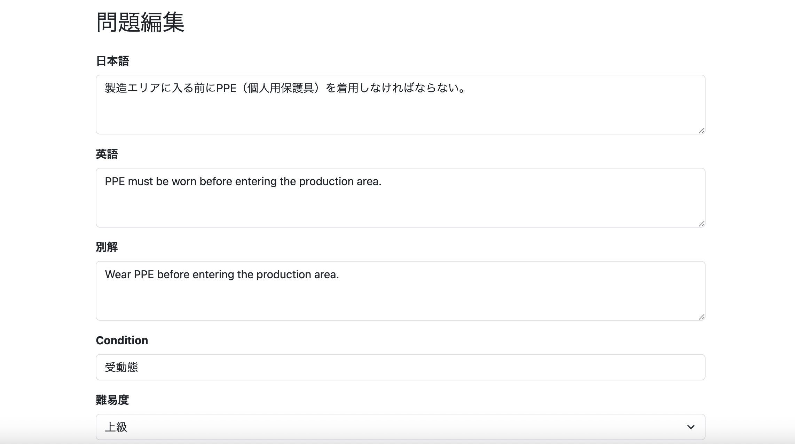
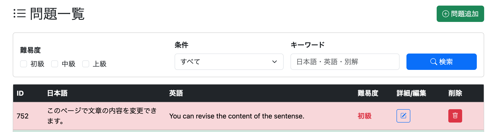
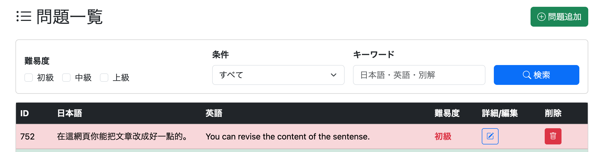
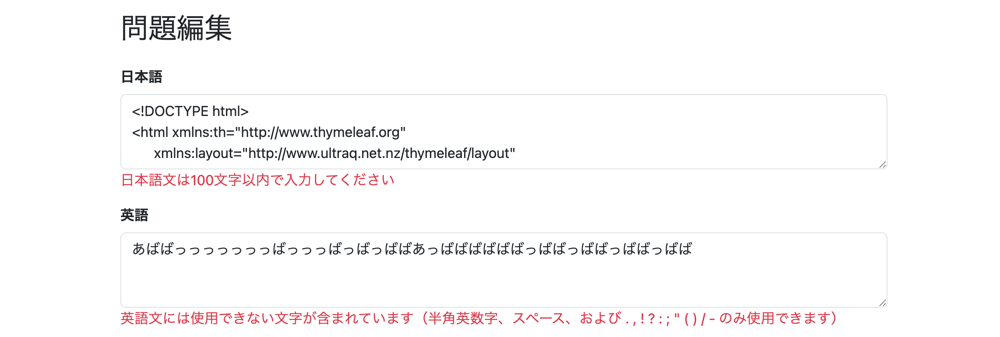

# 053 アドミン画面に問題編集機能を実装する

管理画面から既存の問題を編集できる機能を実装する。

編集画面へは問題一覧から

```
/admin/question/edit?questionId=XXX
```

の形式で遷移する。

---

# 編集画面（GET）の実装

編集画面では、既存の問題内容をフォームへ表示する必要がある。

処理の流れは次のとおり。

```
Repository
    ↓
Question(Entity)
    ↓
Service
    ↓
QuestionDto
    ↓
Controller
    ↓
Model
    ↓
admin/question/edit.html
```

---

## QuestionDtoを作成

**commit**

```
feat(admin): add QuestionDto for question edit
```

```java
@Data
public class QuestionDto {

    private long questionId;

    private String japaneseText;

    private String englishText;

    private String alternativeAnswer;

    private String difficulty;

    private String condition;

}
```

### なぜQuestionDtoを作るのか

編集画面では、画面へ表示するためだけのデータが必要になる。

Entityをそのまま画面へ渡すことも可能だが、

- EntityをView層へ直接公開しない
- 画面で必要な項目だけを渡せる
- 将来的な項目追加・変更に強い

という理由からDTOへ変換して返す設計にした。

なお、`questionId` は画面表示では使用しないが、

後で更新処理を実装する際に必要になるため、この段階で保持しておく。

---

## QuestionRepository

修正なし。

`QuestionRepository` は

```java
JpaRepository<Question, Long>
```

を継承しているため、

```java
findById()
```

がそのまま利用できる。

そのため、編集前データ取得専用のSQLを書く必要はない。

---

## AdminServiceを修正

### 問題を1件取得するメソッドを追加

**commit**

```
feat(admin): add service to retrieve question for edit
```

```java
public QuestionDto getOneQuestion(long questionId) {

    Question question = questionRepository.findById(questionId)
            .orElseThrow(() ->
                    new IllegalArgumentException("Question not found."));

    QuestionDto dto = new QuestionDto();

    dto.setQuestionId(question.getQuestionId());
    dto.setJapaneseText(question.getJapaneseText());
    dto.setEnglishText(question.getEnglishText());
    dto.setAlternativeAnswer(question.getAlternativeAnswer());
    dto.setDifficulty(question.getDifficulty().name());
    dto.setCondition(question.getCondition());

    return dto;

}
```

### 例外処理について

問題が存在しなかった場合は

```java
orElseThrow()
```

を利用して例外を送出している。

これは実務でも一般的な書き方である。

編集画面は一覧画面の「編集」ボタンから遷移するため、

通常運用では存在しないIDが渡されることはない。

そのため、

- 存在しないIDが送られてきたら異常系
- Controllerで無理に回復させない
- 共通例外ハンドラやデフォルトエラーページへ任せる

という設計にした。

---

## AdminControllerを追加

**commit**

```
feat(admin): add question edit page endpoint
```

```java
@GetMapping("/admin/question/edit")
public String getAdminQuestionEdit(
        @RequestParam long questionId,
        Model model) {

    QuestionDto question =
            adminService.getOneQuestion(questionId);

    model.addAttribute("question", question);

    return "/admin/question/edit";

}
```

### 実装時の反省

最初は

```
Question(Entity)
    ↓
Controller
    ↓
QuestionDto
```

という変換をControllerで行っていた。

しかし、

Entity→DTOへの変換はService層の責務である。

Controllerは

- Serviceを呼び出す
- Modelへ詰める

だけにする方が責務が明確になるため、Serviceへ処理を移動した。

---

## admin/question/edit.htmlを作成

**commit**

```
feat(admin): add question edit page
```

編集画面を新規作成した。

フォームには

- 日本語
- 英語
- 別解
- Condition
- 難易度

を配置し、

`th:field` を利用してQuestionDtoの内容をフォームへ表示する。

画面下部には

- 戻る
- 更新する

ボタンを配置した。

---

## 動作確認

```
/admin/question/edit?questionId=XXX
```

へアクセスすると、

対象問題の内容がフォームへ表示される編集画面が完成した。




---

# 問題更新処理（POST）の実装

編集画面を表示できるようになったので、次は更新処理を実装する。

---

## QuestionRepository

修正不要。

今回も `JpaRepository` が提供する `save()` を利用するため、UPDATE用のSQLを書く必要はない。

更新の流れは次のようになる。

```java
Question question =
        questionRepository.findById(questionId)
                .orElseThrow();

question.setJapaneseText(...);
question.setEnglishText(...);
question.setAlternativeAnswer(...);
question.setDifficulty(...);
question.setCondition(...);

questionRepository.save(question);
```

この

```
Entity取得
    ↓
値を書き換える
    ↓
save()
```

という書き方はSpring Bootでは非常に一般的であり、

- 可読性が高い
- 保守しやすい
- Entityの状態管理をSpringへ任せられる

というメリットがある。

### UPDATEクエリを書く方法もある

もちろんRepositoryへUPDATEクエリを書くことも可能である。

```java
@Modifying
@Query(...)
```

を利用すれば直接更新できる。

しかし今回のような管理画面の編集機能では、

Entityを取得して更新する方法の方がSpring Bootらしい実装であるため採用した。

---

## AdminServiceを修正

### 問題更新メソッドを追加

**commit**

```
feat(admin): implement question update service
```

```java
public void updateOneQuestion(long questionId,
                              QuestionForm form) {

    Question question =
            questionRepository.findById(questionId)
            .orElseThrow(() ->
                new IllegalArgumentException(
                        "Question not found."));

    // 更新前ログ
    log.info("Before: {}", question);

    question.setJapaneseText(form.getJapaneseText());
    question.setEnglishText(form.getEnglishText());
    question.setAlternativeAnswer(form.getAlternativeAnswer());
    question.setDifficulty(form.getDifficulty());
    question.setCondition(form.getCondition());

    questionRepository.save(question);

    // 更新後ログ
    log.info("After : {}", question);

}
```

### 更新前・更新後のログを出力

更新前後のEntityをログへ出力しておくことで、

- 更新内容の確認
- デバッグ
- 動作確認

が容易になる。

---

## AdminControllerを修正

### POST処理を追加

**commit**

```
feat(admin): add question edit submission handler
```

```java
@PostMapping("/admin/question/edit")
public String postAdminQuestionEdit(

        @RequestParam long questionId,

        @ModelAttribute
        @Validated
        QuestionForm form,

        BindingResult bindingResult,

        Model model) {

    if (bindingResult.hasErrors()) {

        model.addAttribute("question", form);

        return "admin/question/edit";

    }

    adminService.updateOneQuestion(questionId, form);

    return "redirect:/admin/question/list";

}
```

### バリデーション

ここでは、

```java
@Validated
```

と

```java
BindingResult
```

を利用して通常の入力チェックを行う。

エラーがある場合は更新を行わず、

編集画面へ戻す。

---

## edit.htmlを修正

**commit**

```
feat(admin): add hidden questionId field to edit form
```

フォームへhidden項目を追加する。

```html
<input type="hidden"
       name="questionId"
       th:value="${question.questionId}">
```

### hidden項目が必要な理由

編集画面では、

「どの問題を更新するか」

という情報をPOST時にも保持しておく必要がある。

しかし画面上には表示したくないため、

hidden項目として送信する。

これによりControllerでは

```java
@RequestParam long questionId
```

として対象問題を特定できる。

---

## QuestionFormを修正

**commit**

```
feat(admin): add questionId to QuestionForm
```

```java
private Long questionId;
```

を追加する。

### なぜ追加するのか

編集画面では、

入力項目だけでなく、

更新対象の問題IDもフォームと一緒に送信する必要がある。

そのためQuestionFormでもquestionIdを保持できるようにした。

---

## QuestionDtoを修正

**commit**

```
refactor(admin): change questionId type in QuestionDto
```

```java
private String questionId;
```

↓

```java
private long questionId;
```

### 型を変更した理由

questionIdは数値で管理されており、

RepositoryやEntityでも`long`型を利用している。

DTOだけString型にすると

毎回型変換が必要になってしまう。

そのためEntity・Service・Controllerと型を統一するために

`long`

へ変更した。

---

## 動作確認

編集画面から内容を変更し、

「更新する」

ボタンを押すと、

対象問題が正常に更新されることを確認した。

↓更新前


↓更新後


---

# 編集画面にバリデーションエラーメッセージを表示する

Controller側ではすでに

```java
if (bindingResult.hasErrors()) {
    return "admin/question/edit";
}
```

としていたため、

不正な入力があってもデータベースの更新は行われなかった。

しかし、このままではユーザーには何が間違っているのか分からない。

そこで、各入力項目の下へエラーメッセージを表示できるように修正した。

---

## QuestionForm

修正なし。

QuestionFormには登録画面で使用しているバリデーションアノテーションが既に付与されているため、

編集画面でもそのまま利用できる。

---

## AdminControllerを修正

**commit**

```
fix(admin): unify questionForm model attribute for edit validation
```

```java
@GetMapping("/admin/question/edit")
public String getAdminQuestionEdit(
        @RequestParam long questionId,
        Model model) {

    QuestionDto question =
            adminService.getOneQuestion(questionId);

    model.addAttribute("questionForm", question);

    return "/admin/question/edit";

}

@PostMapping("/admin/question/edit")
public String postAdminQuestionEdit(

        @RequestParam long questionId,

        @ModelAttribute("questionForm")
        @Validated
        QuestionForm form,

        BindingResult bindingResult,

        Model model) {

    if (bindingResult.hasErrors()) {

        model.addAttribute("questionForm", form);

        return "admin/question/edit";

    }

    adminService.updateOneQuestion(questionId, form);

    return "redirect:/admin/question/list";

}
```

### なぜ`questionForm`へ統一したのか

編集画面では、

- 初回表示（GET）では `QuestionDto`
- 更新処理（POST）では `QuestionForm`

という2種類のオブジェクトを使用している。

当初は

```java
model.addAttribute("question", ...)
```

としていたが、この状態ではSpringが保持する

```
BindingResult.questionForm
```

との名前が一致しないため、

Thymeleafがバリデーションエラーメッセージを取得できなかった。

そこで、

表示用のDTOと入力用のFormは型こそ異なるものの、

HTML上では同じ

```text
questionForm
```

という属性名で扱うように統一した。

これにより、

- 初回表示ではQuestionDto
- エラー時の再表示ではQuestionForm

のどちらも同じフォームとして扱えるようになり、

バリデーションエラーメッセージも正常に表示されるようになった。

---

## admin/question/edit.htmlを修正

**commit**

```
fix(admin): show validation errors on question edit form
```

各入力項目の直下へ

```html
<div class="text-danger"
     th:if="${#fields.hasErrors(...)}"
     th:errors="*{...}">
</div>
```

を追加した。

対象項目は以下の5つ。

- 日本語
- 英語
- 別解
- Condition
- 難易度

これにより、入力エラーが発生した場合は該当項目の直下へエラーメッセージが表示されるようになった。

---

# 動作確認

編集画面で不正な入力を行い、

「更新する」

を押すと、

入力内容を保持したまま各項目の下へバリデーションエラーメッセージが表示されることを確認した。



---

# 所感

今回の実装では、

- HTML → Java への入力データは **Form**
- Java → HTML への表示データは **DTO**

という役割分担を採用した。

この設計自体は責務が明確になり非常に分かりやすい。

一方で、

Spring MVCではバリデーション結果（BindingResult）はモデル属性名とセットで管理されるため、

DTOとFormで異なるモデル属性名を使用すると、Thymeleafがエラーメッセージを正しく取得できないことが分かった。

そのため、

DTOとFormは型を分けつつも、

HTML側では同じモデル属性名を共有する必要があることを学んだ。

---

# 次にやること

- 会員向け問題一覧画面を実装する
- 一般会員でも問題一覧を閲覧できるようにする
- 編集・削除機能は管理者専用のままとする