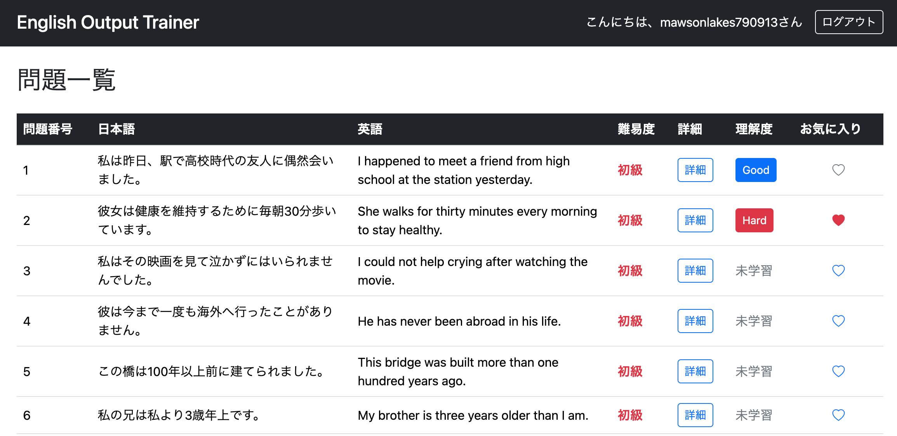
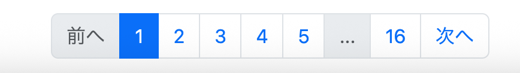
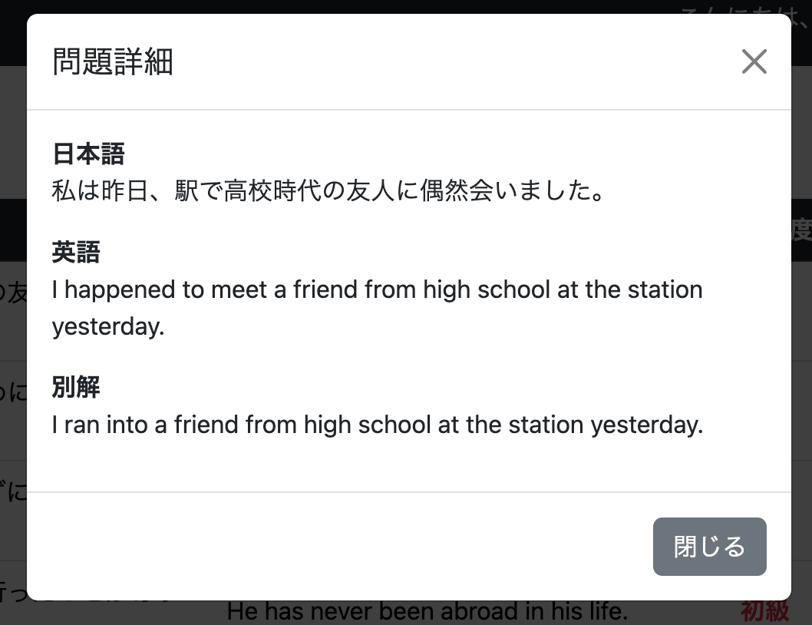
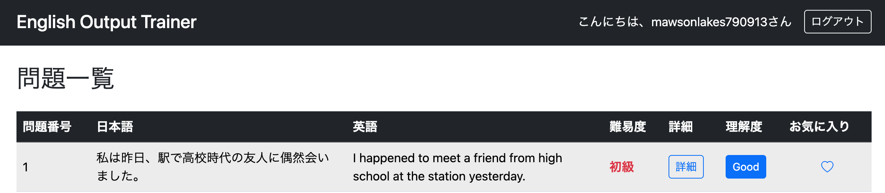
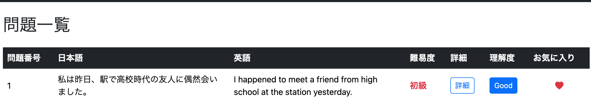
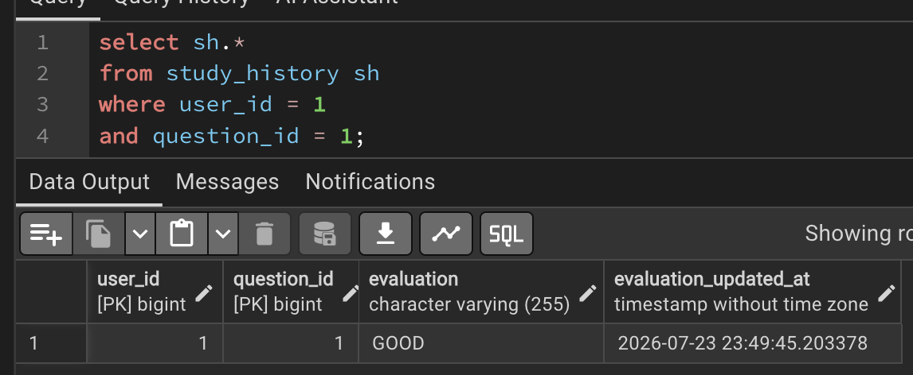
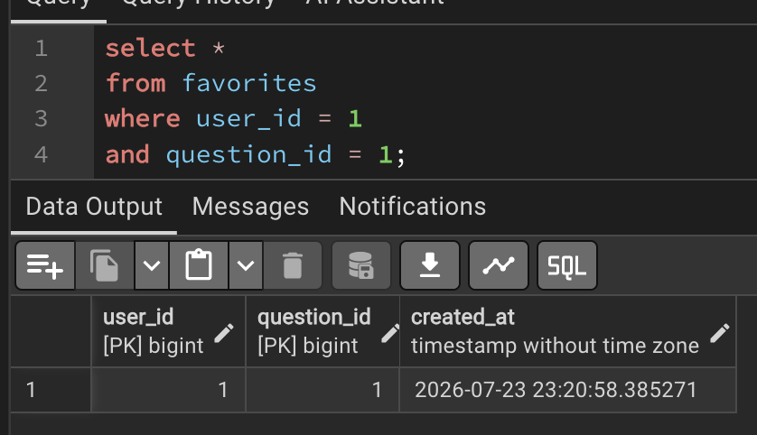
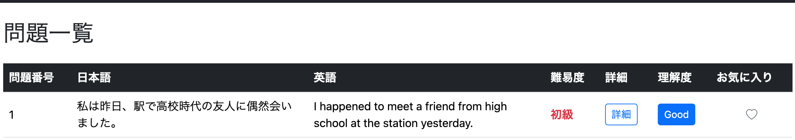
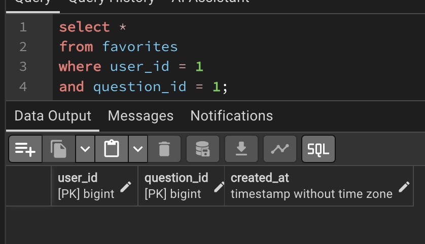

# ログインメニューからも問題一覧と問題検索を使用できるようにする①
# 問題一覧の取得および編集

## 概要

これまで問題一覧および問題検索は管理者専用画面でのみ利用できた。

今回は、**ログインユーザーも所蔵問題を一覧表示し、自身の学習状況を確認できる画面**を追加する。

追加する画面は以下とする。

```
/user/question/list
```

なお、本チャプターでは**問題一覧の取得**までを実装し、**検索機能**は次チャプターで実装する。

---

## 管理画面との違い

### Admin画面

目的は

- 問題の追加
- 問題の編集
- 問題の管理

である。

### User画面

目的は

- 所蔵問題の確認
- 自身の学習状況の確認
- 理解度(Evaluation)の確認
- お気に入り登録状況の確認

である。

管理ではなく「閲覧・学習支援」が目的となる。

---

## 一覧画面の表示内容

画面では以下の情報を表示する。

|項目|
|---|
|問題番号|
|日本語|
|英語|
|難易度|
|理解度(Evaluation)|
|お気に入り|
|詳細|

---

## 詳細ボタンを設ける理由

日本語・英語・別解は一覧に収まらない場合がある。

例えば

```
Spring Bootの操作は手を動かしてこそ...
```

のように途中までしか表示されない。

そのため全文を確認できるよう、
詳細ボタン押下時にモーダルを表示する仕様とした。

---

# QuestionRepository.java

## クエリを追加

**commit**

```
feat: add query for user question list
```

```java
@Query(value = """
SELECT
    q.question_id        AS questionId,
    q.japanese_text      AS japaneseText,
    q.english_text       AS englishText,
    q.alternative_answer AS alternativeAnswer,
    q.condition          AS condition,
    q.difficulty         AS difficulty,
    sh.evaluation        AS evaluation,
    CASE
        WHEN f.question_id IS NOT NULL THEN TRUE
        ELSE FALSE
    END AS favorite
FROM question q
LEFT JOIN study_history sh
ON (
    q.question_id = sh.question_id
    AND sh.user_id = :userId
)
LEFT JOIN favorites f
ON (
    q.question_id = f.question_id
    AND f.user_id = :userId
)
ORDER BY q.question_id ASC
""",
countQuery = """
SELECT COUNT(*)
FROM question
""",
nativeQuery = true)
Page<UserQuestionListDto> getUserQuestionList(
        @Param("userId") Long userId,
        Pageable pageable);
```

---

## このクエリで取得したいデータ

以下のすべてのケースを取得する必要がある。

- 一度も学習していない問題
- 理解度を登録済みの問題
- 理解度登録済みかつお気に入り登録済みの問題
- 理解度未登録だがお気に入り登録済みの問題

そのため、

- Question
- StudyHistory
- Favorites

の3テーブルを組み合わせて取得する必要がある。

---

## 最初につまずいた点

当初は

```sql
StudyHistory
↓

Favorites
```

のように結合しようとしていた。

しかし、

**StudyHistoryが存在しない問題**

ではJOINできないことに気付いた。

---

## StudyHistoryとFavoritesは兄弟テーブル

両者とも

```
Question
    │
    ├── StudyHistory
    └── Favorites
```

という構造になっている。

つまり、

StudyHistory同士を結合する必要はなく、

Questionを中心として

```
Question
    ↓
StudyHistory

Question
    ↓
Favorites
```

という2本のLEFT JOINで十分である。

JOIN条件は

```sql
question.question_id = study_history.question_id
AND study_history.user_id = :userId
```

```sql
question.question_id = favorites.question_id
AND favorites.user_id = :userId
```

のみでよい。

---

## favoriteをbooleanで取得する理由

一覧画面で必要なのは

- お気に入り登録されているか
- 登録されていないか

だけである。

そのため、

```
Favoritesオブジェクト
```

ではなく

```
true / false
```

として取得した方が扱いやすい。

```sql
CASE
WHEN f.question_id IS NOT NULL
THEN TRUE
ELSE FALSE
END
```

とすることで、

HTML側では

```java
question.favorite
```

だけで判定できるようになる。

---

## SELECT q.* にしない理由

今回取得したいデータは

- Question
- StudyHistory
- Favorites

にまたがっている。

そのため

```sql
SELECT q.*
```

だけでは

```
evaluation
favorite
```

を取得できない。

また、

取得する列を明示することで

- 必要なデータだけ取得できる
- DTOへマッピングしやすい
- SQLの可読性が高い

というメリットもある。

---

## DTOを利用する理由

今回のSELECT結果は

Questionエンティティでは受け取れない。

理由は

```
Question列
+

StudyHistory列

+

Favorites列
```

を同時に取得しているためである。

そのためDTOへマッピングする。

```
QuestionRepository
        ↓
UserQuestionListDto
        ↓
Controller
        ↓
HTML
```

という流れになる。

---

# UserQuestionListDtoの作成

## UserQuestionListDtoを作成する

**commit**

```text
feat(user): add UserQuestionListDto for user question list
```

```java
public interface UserQuestionListDto {

    Long getQuestionId();

    String getJapaneseText();

    String getEnglishText();

    String getAlternativeAnswer();

    String getCondition();

    Difficulty getDifficulty();

    Evaluation getEvaluation();

    boolean isFavorite();

}
```

---

## interfaceで作成する理由

Spring Data JPAでは、

```java
SELECT
```

で取得した結果をDTOへ直接マッピングする仕組み（Interface Projection）が用意されている。

そのため、

```java
class UserQuestionListDto
```

ではなく、

```java
interface UserQuestionListDto
```

を作成し、

```java
getQuestionId()

getJapaneseText()

getEvaluation()

isFavorite()
```

などのGetterだけを定義すれば、自動でSQL結果をマッピングしてくれる。

メリットとして

- DTOクラスを実装する必要がない
- コンストラクタを書かなくてよい
- 必要な列だけ取得できる
- SQLとの相性が非常によい

という点が挙げられる。

---

# UserServiceImpl

## メソッドを追加

**commit**

```text
feat: add user question list service
```

```java
public Page<UserQuestionListDto> getUserQuestionList(
        long userId,
        Pageable pageable) {

    return questionRepository.getUserQuestionList(
            userId,
            pageable);

}
```

ServiceではRepositoryを呼び出すだけのシンプルな構成とした。

---

# UserMenuController

## メソッドを追加

**commit**

```text
feat: add user question list page
```

```java
@GetMapping("/user/question/list")
public String getUserQuestionList(
        @AuthenticationPrincipal UserDetails loginUser,
        @PageableDefault(page = 0, size = 50)
        Pageable pageable,
        Model model) {

    Users user =
        userServiceImpl.getUserOne(
                loginUser.getUsername());

    Long userId = user.getId();

    Page<UserQuestionListDto> userQuestionList =
            userServiceImpl.getUserQuestionList(
                    userId,
                    pageable);

    model.addAttribute(
            "questionList",
            userQuestionList.getContent());

    model.addAttribute(
            "page",
            userQuestionList);

    return "/user/question/list";

}
```

---

## 処理の流れ

```
ブラウザ

↓

/user/question/list

↓

ログインユーザー取得

↓

Users取得

↓

userId取得

↓

Repositoryから問題一覧取得

↓

Modelへ格納

↓

user/question/list.html
```

---

# user/question/list.html

## 一覧画面を作成する

**commit**

```text
feat: add question list page
```

一覧画面では以下の項目を表示する。

|項目|
|---|
|問題番号|
|日本語|
|英語|
|難易度|
|詳細|
|理解度|
|お気に入り|

---

## 難易度表示

Difficultyに応じて色分けして表示する。

|Difficulty|表示|
|---|---|
|BEGINNER|赤（初級）|
|INTERMEDIATE|青（中級）|
|ADVANCED|緑（上級）|

視認性を高めるため、文字色のみで難易度が判別できるようにした。

---

## 理解度(Evaluation)

StudyHistoryが存在しない場合は

```
未学習
```

と表示する。

StudyHistoryが存在する場合は

- Hard
- Good
- Easy

のボタンを表示する。

このボタンは後に理解度変更ボタンとして利用する。

---

## お気に入り表示

Favoritesの有無に応じて

登録済み

```html
<i class="bi bi-heart-fill text-danger"></i>
```

未登録

```html
<i class="bi bi-heart"></i>
```

を表示する。

後にJavaScriptからクリックイベントを設定するため、

```html
favoriteButton
```

クラスを付与している。

---

## 詳細ボタン

現段階では見た目だけ実装する。

次の修正でモーダル表示を追加する。

---

## ページネーション

Spring Data JPAの

```java
Page<UserQuestionListDto>
```

を利用してページ番号を表示する。

ここではシンプルな

- 前へ
- ページ番号
- 次へ

のみ実装した。

後ほどAdmin画面と同様のページネーションへ改善する。

---

# 実行

```
http://localhost:8080/user/question/list
```

へアクセスすると、

各ユーザーごとに

- 理解度
- お気に入り状態

を反映した問題一覧が表示されるようになった。



---

## 現時点で残っている課題

まだ以下は実装されていない。

- 詳細ボタン
- 理解度変更
- お気に入り登録・解除
- ページネーションUI改善

続いてこれらを実装していく。

# ページネーションの改善

一覧画面は表示できたものの、ページネーションに問題があったため改善を行う。

---

# QuestionRepository.java

## countQueryを追加する

**commit**

```text
fix(repository): add countQuery for user question pagination
```

```java
@Query(
    value = """
    SELECT
        q.question_id         AS questionId,
        q.japanese_text       AS japaneseText,
        q.english_text        AS englishText,
        q.alternative_answer  AS alternativeAnswer,
        q.condition           AS condition,
        q.difficulty          AS difficulty,
        sh.evaluation         AS evaluation,
        CASE
            WHEN f.question_id IS NOT NULL THEN TRUE
            ELSE FALSE
        END AS favorite
    FROM question q
    LEFT JOIN study_history sh
      ON (
            q.question_id = sh.question_id
        AND sh.user_id = :userId
      )
    LEFT JOIN favorites f
      ON (
            q.question_id = f.question_id
        AND f.user_id = :userId
      )
    ORDER BY q.question_id ASC
    """,
    countQuery = """
        SELECT COUNT(*)
        FROM question q
    """,
    nativeQuery = true
)
```

---

## countQueryを追加する理由

Spring Data JPAでは、

```java
Page<T>
```

を返却する場合、

- 一覧取得SQL
- 全件数取得SQL

の2つが必要となる。

Repositoryメソッドを自動生成している場合は、

```sql
SELECT ...
```

と

```sql
SELECT COUNT(*)
```

をSpring Data JPAが自動生成してくれる。

しかし今回はNative Queryを使用しているため、

件数取得用SQLも自分で定義しなければならない。

そのため、

```java
countQuery
```

を追加する必要があった。

---

# UserMenuController

## getUserQuestionList()を修正する

**commit**

```text
feat(controller): add pagination to user question list
```

```java
PaginationDto pagination =
    adminService.createPagination(
            userQuestionList);

model.addAttribute(
        "pagination",
        pagination);
```

---

## PaginationDtoを利用する理由

ページ数が多くなると、

```
1 2 3 4 5 6 7 8 9 ...
```

のように全ページを表示するのは見づらい。

そのため、

PaginationDtoを利用して

- 現在ページ
- 表示開始ページ
- 表示終了ページ
- 「...」を表示するか

などをまとめて管理する。

---

## 課題

現在、

```java
createPagination()
```

はAdminServiceに実装されている。

しかし、

管理画面とユーザー画面の両方から利用しているため、

将来的には共通Serviceへ切り出した方が責務としては望ましい。

---

# user/question/list.html

## ページネーションを改善する

**commit**

```text
feat(view): improve pagination for user question list
```

Admin画面と同様のページネーションへ変更した。

改善後は

- 前へ
- 先頭ページ
- ...
- 現在ページ周辺
- ...
- 最終ページ
- 次へ

という構成となる。

---

## 改善点

従来は全ページ番号を表示していた。

例えば100ページある場合、

```
1 2 3 4 5 6 ...
```

と大量のページ番号が並ぶ。

改善後は

```
1
...
48 49 50 51 52
...
100
```

のように必要なページだけ表示するため、

非常に見やすくなった。

---

# 実行

```
http://localhost:8080/user/question/list
```

へアクセスすると、

改善されたページネーションUIが表示されるようになった。



---

# ボタンからDBを更新する

一覧画面では、

- 理解度(Evaluation)
- お気に入り(Favorites)

も変更できるようにする。

新しくServiceを書くのではなく、

すでに作成済みのController・Serviceを再利用する方針とした。

---

# 理解度(Evaluation)の変更

## StudyController.java

**commit**

```text
feat(controller): add evaluation toggle endpoint
```

```java
@PostMapping("/evaluation/toggle")
@ResponseBody
public void toggleEvaluation(
        @AuthenticationPrincipal UserDetails loginUser,
        @RequestParam Long questionId,
        @RequestParam Evaluation evaluation) {

    evaluationService.updateEvaluation(
            loginUser.getUsername(),
            questionId,
            evaluation);

}
```

---

## EvaluationService

EvaluationServiceには、

理解度の

- INSERT
- UPDATE

を行う

```java
updateEvaluation()
```

がすでに存在する。

そのため、

今回新しく実装する必要はなく、

既存メソッドをそのまま利用した。

内部では

```
StudyHistory存在

↓

UPDATE

存在しない

↓

INSERT
```

という流れになっている。

---

# お気に入り登録の変更

## FavoritesController

既存の

```java
toggleFavorite()
```

を利用する。

```java
@PostMapping("/favorite/toggle")
@ResponseBody
public boolean toggleFavorite(...)
```

---

## FavoritesService

FavoritesServiceにも

```java
toggleFavorite()
```

が実装済みである。

内部では

```
Favorites存在

↓

DELETE

存在しない

↓

INSERT
```

という構成になっている。

そのため、

こちらも既存処理を再利用するだけで実装できた。

---

## 既存処理を再利用したメリット

今回追加したのは

一覧画面からDBを更新する機能である。

しかし、

更新処理そのものは

以前から

- Study画面
- Review画面

で使用していた。

そのため、

Controller・Serviceを共通利用でき、

コードの重複を避けることができた。

# JavaScriptによる画面操作の実装

一覧画面から以下の操作を行えるようにする。

- 問題詳細のモーダル表示
- 理解度(Evaluation)の変更
- お気に入り登録・解除

そのため、ユーザー問題一覧専用のJavaScriptファイルを作成する。

---

# js/user/question/list.js

## JavaScriptファイルを作成する

**commit**

```text
feat(js): add user question list interactions
```

```javascript
document.addEventListener("DOMContentLoaded", function () {

    // ======================
    // CSRF情報
    // ======================

    const csrfToken =
        document.querySelector(
            'meta[name="_csrf"]'
        ).content;

    const csrfHeader =
        document.querySelector(
            'meta[name="_csrf_header"]'
        ).content;


    // ======================
    // 詳細モーダル
    // ======================

    const detailButtons =
        document.querySelectorAll(".detailButton");

    detailButtons.forEach(function (button) {

        button.addEventListener("click", function () {

            document.getElementById("modalJapanese").textContent =
                button.dataset.japanese;

            document.getElementById("modalEnglish").textContent =
                button.dataset.english;

            const alternativeArea =
                document.getElementById("modalAlternativeArea");

            if (button.dataset.alternative) {

                document.getElementById("modalAlternative").textContent =
                    button.dataset.alternative;

                alternativeArea.style.display = "";

            } else {

                document.getElementById("modalAlternative").textContent = "";

                alternativeArea.style.display = "none";

            }

        });

    });


    // ======================
    // Evaluation変更
    // ======================

    let currentQuestionId = null;

    const evaluationButtons =
        document.querySelectorAll(".evaluationButton");

    evaluationButtons.forEach(function (button) {

        button.addEventListener("click", function () {

            currentQuestionId =
                button.dataset.questionId;

        });

    });

    const evaluationSelectButtons =
        document.querySelectorAll(".evaluationSelect");

    evaluationSelectButtons.forEach(function (button) {

        button.addEventListener("click", function () {

            const evaluation =
                button.dataset.evaluation;

            if (currentQuestionId === null) {

                console.error(
                    "問題IDを取得できませんでした"
                );

                return;

            }

            fetch("/evaluation/toggle", {

                method: "POST",

                headers: {
                    "Content-Type":
                        "application/x-www-form-urlencoded",

                    [csrfHeader]:
                        csrfToken
                },

                body:
                    "questionId=" +
                    encodeURIComponent(currentQuestionId) +
                    "&evaluation=" +
                    encodeURIComponent(evaluation)

            })
            .then(function (response) {

                if (!response.ok) {

                    throw new Error(
                        "理解度の更新に失敗しました: " +
                        response.status
                    );

                }

                location.reload();

            })
            .catch(function (error) {

                console.error(error);

            });

        });

    });


    // ======================
    // お気に入り登録・解除
    // ======================

    const favoriteButtons =
        document.querySelectorAll(".favoriteButton");

    favoriteButtons.forEach(function (button) {

        button.addEventListener("click", function () {

            const questionId =
                button.dataset.questionId;

            const favoriteIcon =
                button.querySelector("i");

            fetch("/favorite/toggle", {

                method: "POST",

                headers: {
                    "Content-Type":
                        "application/x-www-form-urlencoded",

                    [csrfHeader]:
                        csrfToken
                },

                body:
                    "questionId=" +
                    encodeURIComponent(questionId)

            })
            .then(function (response) {

                if (!response.ok) {

                    throw new Error(
                        "お気に入り更新失敗"
                    );

                }

                return response.text();

            })
            .then(function (result) {

                if (result === "true") {

                    favoriteIcon.classList.remove(
                        "bi-heart",
                        "text-secondary"
                    );

                    favoriteIcon.classList.add(
                        "bi-heart-fill",
                        "text-danger"
                    );

                } else {

                    favoriteIcon.classList.remove(
                        "bi-heart-fill",
                        "text-danger"
                    );

                    favoriteIcon.classList.add(
                        "bi-heart",
                        "text-secondary"
                    );

                }

            })
            .catch(function (error) {

                console.error(error);

            });

        });

    });

});
```

---

## DOMContentLoadedを利用する理由

```javascript
document.addEventListener("DOMContentLoaded", ...)
```

を使用することで、HTMLの読み込みが完了してからJavaScriptを実行できる。

これにより、

```javascript
document.querySelectorAll(...)
```

や

```javascript
document.getElementById(...)
```

を実行した時点で、対象要素がまだ存在しない問題を防げる。

---

## CSRF情報の取得

Spring SecurityではPOSTリクエストにCSRFトークンが必要となる。

そのため、HTMLに埋め込んだ以下のmetaタグから、

- CSRFトークン
- CSRFヘッダー名

を取得する。

```javascript
const csrfToken =
    document.querySelector(
        'meta[name="_csrf"]'
    ).content;

const csrfHeader =
    document.querySelector(
        'meta[name="_csrf_header"]'
    ).content;
```

取得した値は、

```javascript
fetch()
```

のheadersに設定する。

```javascript
headers: {
    "Content-Type":
        "application/x-www-form-urlencoded",

    [csrfHeader]:
        csrfToken
}
```

これにより、Spring Securityに拒否されずPOSTリクエストを送信できる。

---

# 詳細モーダルの処理

## data属性から問題情報を取得する

詳細ボタンには以下の情報を設定する。

```html
th:data-japanese="${question.japaneseText}"
th:data-english="${question.englishText}"
th:data-alternative="${question.alternativeAnswer}"
```

JavaScriptでは、

```javascript
button.dataset.japanese
button.dataset.english
button.dataset.alternative
```

として取得する。

取得した値をモーダル内の要素へ設定する。

```javascript
document.getElementById("modalJapanese").textContent =
    button.dataset.japanese;
```

---

## 別解が存在しない場合

別解が存在しない場合は、別解欄自体を非表示にする。

```javascript
if (button.dataset.alternative) {

    alternativeArea.style.display = "";

} else {

    alternativeArea.style.display = "none";

}
```

これにより、別解が空の問題で不要な見出しだけが表示されることを防げる。

---

# 理解度変更の処理

## 現在選択中の問題IDを保持する

一覧には複数の理解度ボタンが存在する。

理解度ボタンを押した時点で、

```javascript
currentQuestionId
```

へ対象の問題IDを保存する。

```javascript
let currentQuestionId = null;
```

```javascript
currentQuestionId =
    button.dataset.questionId;
```

その後、モーダル内で選択された理解度と組み合わせてPOSTする。

---

## Evaluation変更リクエスト

モーダル内の

- Hard
- Good
- Easy

のいずれかを押すと、

```javascript
button.dataset.evaluation
```

から変更後のEvaluationを取得する。

```javascript
const evaluation =
    button.dataset.evaluation;
```

送信内容は以下となる。

```text
questionId=問題ID
evaluation=HARDまたはGOODまたはEASY
```

```javascript
body:
    "questionId=" +
    encodeURIComponent(currentQuestionId) +
    "&evaluation=" +
    encodeURIComponent(evaluation)
```

---

## 更新後に画面を再読み込みする理由

理解度更新後は、

```javascript
location.reload();
```

で画面を再読み込みする。

これにより、

- DBから最新のEvaluationを再取得
- ボタンの色を更新
- ボタンの表示文字を更新

できる。

理解度の変更頻度は高くないため、今回は部分的なDOM更新ではなく、再読み込みによる単純な実装とした。

---

# お気に入り登録・解除の処理

## FavoritesControllerの戻り値を利用する

`/favorite/toggle`は、お気に入り更新後の状態をbooleanで返す。

|戻り値|状態|
|---|---|
|true|お気に入り登録済み|
|false|お気に入り未登録|

JavaScriptではレスポンスを文字列として受け取る。

```javascript
return response.text();
```

その後、

```javascript
if (result === "true")
```

で判定する。

---

## お気に入り登録時のアイコン変更

登録後は、空のハートを削除する。

```javascript
favoriteIcon.classList.remove(
    "bi-heart",
    "text-secondary"
);
```

塗りつぶされた赤いハートを追加する。

```javascript
favoriteIcon.classList.add(
    "bi-heart-fill",
    "text-danger"
);
```

---

## お気に入り解除時のアイコン変更

解除後は、塗りつぶされた赤いハートを削除する。

```javascript
favoriteIcon.classList.remove(
    "bi-heart-fill",
    "text-danger"
);
```

空のハートを追加する。

```javascript
favoriteIcon.classList.add(
    "bi-heart",
    "text-secondary"
);
```

理解度変更とは異なり、ハートアイコンはJavaScriptで直接変更するため、画面を再読み込みする必要がない。

---

# user/question/list.htmlの修正

## モーダル・JavaScript連携を追加する

**commit**

```text
feat(view): add modals and interactions to user question list
```

---

## headへ追加

Bootstrapのモーダルを動作させるため、Bootstrap JavaScriptを読み込む。

```html
<script th:src="@{/webjars/bootstrap/js/bootstrap.bundle.min.js}">
</script>
```

専用JavaScriptも読み込む。

```html
<script th:src="@{/js/user/question/list.js}"
        defer>
</script>
```

また、POSTリクエストに必要なCSRF情報をmetaタグへ設定する。

```html
<meta name="_csrf"
      th:content="${_csrf.token}">

<meta name="_csrf_header"
      th:content="${_csrf.headerName}">
```

---

# 詳細ボタンの修正

修正前は、見た目だけのボタンだった。

```html
<button class="btn btn-outline-primary btn-sm">
    詳細
</button>
```

修正後はBootstrapのモーダルを開き、問題情報をdata属性へ保持する。

```html
<button type="button"
        class="detailButton btn btn-outline-primary btn-sm"
        data-bs-toggle="modal"
        data-bs-target="#questionDetailModal"
        th:data-japanese="${question.japaneseText}"
        th:data-english="${question.englishText}"
        th:data-alternative="${question.alternativeAnswer}">
    詳細
</button>
```

---

## 各属性の役割

|属性|役割|
|---|---|
|`detailButton`|JavaScriptから取得するためのクラス|
|`data-bs-toggle="modal"`|Bootstrapモーダルを開く|
|`data-bs-target`|開くモーダルを指定|
|`data-japanese`|日本語文を保持|
|`data-english`|英語文を保持|
|`data-alternative`|別解を保持|

---

# Evaluationボタンの修正

例えばHardの場合は以下のようにする。

```html
<button
    th:if="${question.evaluation == T(com.example.demo.entity.Evaluation).HARD}"
    type="button"
    class="btn btn-sm btn-danger evaluationButton"
    th:data-question-id="${question.questionId}"
    data-bs-toggle="modal"
    data-bs-target="#evaluationModal">
    Hard
</button>
```

GoodとEasyも同様に、

```html
evaluationButton
```

クラスと問題IDを設定する。

---

## 未学習は変更対象外とする

Evaluationが`null`の場合は、

```html
<span th:if="${question.evaluation == null}"
      class="text-secondary">
    未学習
</span>
```

と表示する。

未学習問題に最初のEvaluationを与える操作は通常学習画面で行うため、一覧画面では編集対象としない。

---

# 問題詳細モーダルを追加する

```html
<div class="modal fade"
     id="questionDetailModal">

    <div class="modal-dialog">

        <div class="modal-content">

            <div class="modal-header">

                <h5 class="modal-title">
                    問題詳細
                </h5>

                <button type="button"
                        class="btn-close"
                        data-bs-dismiss="modal">
                </button>

            </div>

            <div class="modal-body">

                <p>
                    <strong>日本語</strong><br>
                    <span id="modalJapanese"></span>
                </p>

                <p>
                    <strong>英語</strong><br>
                    <span id="modalEnglish"></span>
                </p>

                <p id="modalAlternativeArea">
                    <strong>別解</strong><br>
                    <span id="modalAlternative"></span>
                </p>

            </div>

            <div class="modal-footer">

                <button type="button"
                        class="btn btn-secondary"
                        data-bs-dismiss="modal">
                    閉じる
                </button>

            </div>

        </div>

    </div>

</div>
```

一覧表では省略される可能性のある日本語・英語・別解を、全文表示できるようになった。

---

# 理解度変更モーダルを追加する

```html
<div class="modal fade"
     id="evaluationModal">

    <div class="modal-dialog">

        <div class="modal-content">

            <div class="modal-header">

                <h5 class="modal-title">
                    理解度変更
                </h5>

                <button type="button"
                        class="btn-close"
                        data-bs-dismiss="modal">
                </button>

            </div>

            <div class="modal-body text-center">

                <button type="button"
                        class="btn btn-danger evaluationSelect"
                        data-evaluation="HARD">
                    Hard
                </button>

                <button type="button"
                        class="btn btn-primary evaluationSelect"
                        data-evaluation="GOOD">
                    Good
                </button>

                <button type="button"
                        class="btn btn-success evaluationSelect"
                        data-evaluation="EASY">
                    Easy
                </button>

            </div>

        </div>

    </div>

</div>
```

---

## evaluationSelectクラスの役割

モーダル内の3つのボタンには、

```html
evaluationSelect
```

クラスを設定する。

JavaScriptではこのクラスを持つすべてのボタンへクリックイベントを登録する。

また、

```html
data-evaluation="HARD"
```

の値によって、変更後のEvaluationを判断する。

---

# 実行

以下へアクセスする。

```text
http://localhost:8080/user/question/list
```

---

## 問題詳細の確認

詳細ボタンを押すと、一覧画面では省略されていた問題文をモーダルで全文確認できるようになった。



---

## 理解度の変更

Hard・Good・Easyのいずれかが登録されている問題では、理解度ボタンを押せるようになった。

理解度ボタンを押すとモーダルが表示され、変更後の理解度を選択できる。

変更前はEasyだった問題を確認する。




モーダルからGoodへ変更すると、DBのEvaluationが更新された。

また、画面を再読み込みしたことで、ボタンの表示と色もGoodへ変更された。





---

## お気に入り登録の解除

最初はお気に入り登録されている問題を確認する。




ハートマークを押すと、お気に入りが解除された。

画面上では赤い塗りつぶしハートから、空のハートへ即座に変化した。

また、DBからFavoritesのレコードが削除されていることも確認できた。





---

# 所感

今回、初めてQuestionだけでなく、

- StudyHistory
- Favorites

を含めた複数テーブルの情報を、1つの一覧画面へ表示した。

特に、StudyHistoryとFavoritesを直接結合するのではなく、Questionを中心としてそれぞれLEFT JOINする構成を理解するまでに時間がかかった。

一方で、理解度更新やお気に入り更新では、すでに作成済みのControllerやServiceを再利用できたため、サーバー側の更新処理は比較的スムーズに実装できた。

機能の追加が進むにつれ、現在はJavaやSpring Boot側よりも、JavaScript・Bootstrap・Thymeleafを組み合わせたフロント側の実装で手こずることが増えてきた。

これは、バックエンド側の基本的な処理について理解が進み、既存処理を再利用しながら実装できるようになってきた結果とも考えられる。

---

## 今回見えた設計上の課題

機能が拡大するにつれて、当初は特定画面専用として実装していた処理が、別の画面からも必要になるケースが増えてきた。

例えば、

```java
createPagination()
```

はAdminServiceに実装されているが、現在はユーザー画面からも利用している。

また、理解度更新やお気に入り更新も、最初に実装した画面以外から再利用されるようになった。

この状態では、

- 後から作成したServiceが先に作成したServiceへ依存する
- Controllerの配置とURLの役割が一致しなくなる
- 共通処理の置き場所が曖昧になる
- クラスの責務が徐々に広がる

といった問題が起こりやすい。

---

## 将来に活かせる点

要件定義の段階で、将来的に複数画面から利用される可能性がある処理を予測できれば、最初から共通処理として設計できる。

例えば、以下のように責務を分けることが考えられる。

```text
PaginationService
    └── ページネーション表示範囲の計算

EvaluationController
    └── 理解度変更API

FavoritesController
    └── お気に入り変更API

UserQuestionService
    └── ユーザー向け問題一覧・検索

AdminQuestionService
    └── 管理者向け問題追加・編集・削除
```

ただし、開発初期の段階ですべての利用方法を完全に予測することは難しい。

そのため、

1. まず必要な場所へ実装する
2. 複数箇所から使われるようになった時点で共通化を検討する
3. 動作を維持しながら少しずつリファクタリングする

という進め方も現実的である。

今回のように、既存処理を再利用できることに気付けた点は、今後の設計改善につながる重要な経験となった。

---

# 次にやること

## ログインメニューからも問題一覧と問題検索を使用できるようにする②

次は、ユーザー向け問題一覧画面へ検索機能を追加する。

実装予定は以下である。

- 難易度による絞り込み
- 条件による絞り込み
- キーワード検索
- 理解度による絞り込み
- お気に入り登録済み問題の絞り込み
- ページング時の検索条件維持

次の学習ログでは、一覧取得用クエリを検索条件に対応させ、ユーザーが自身の学習状況に応じて問題を探せるようにする。