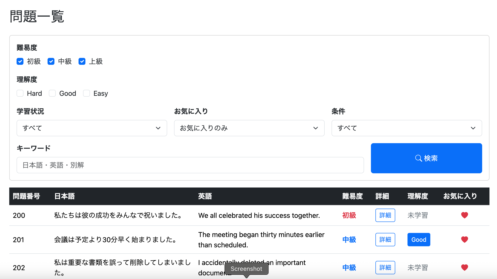
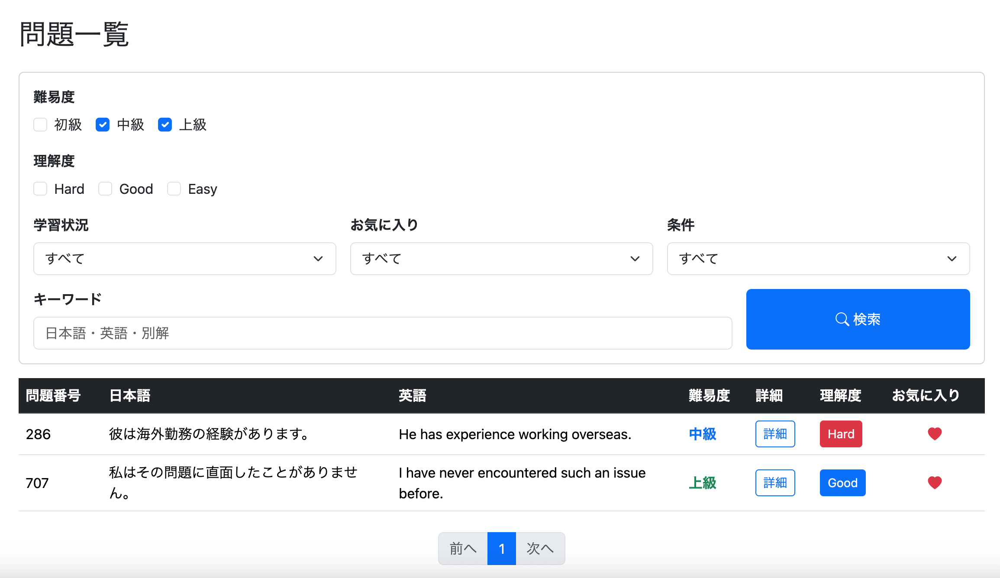
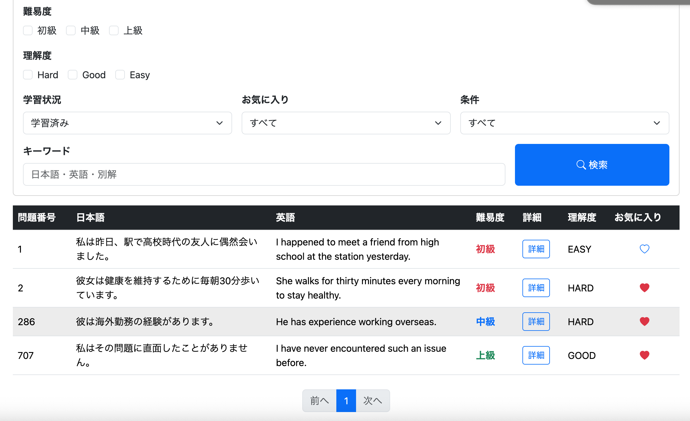
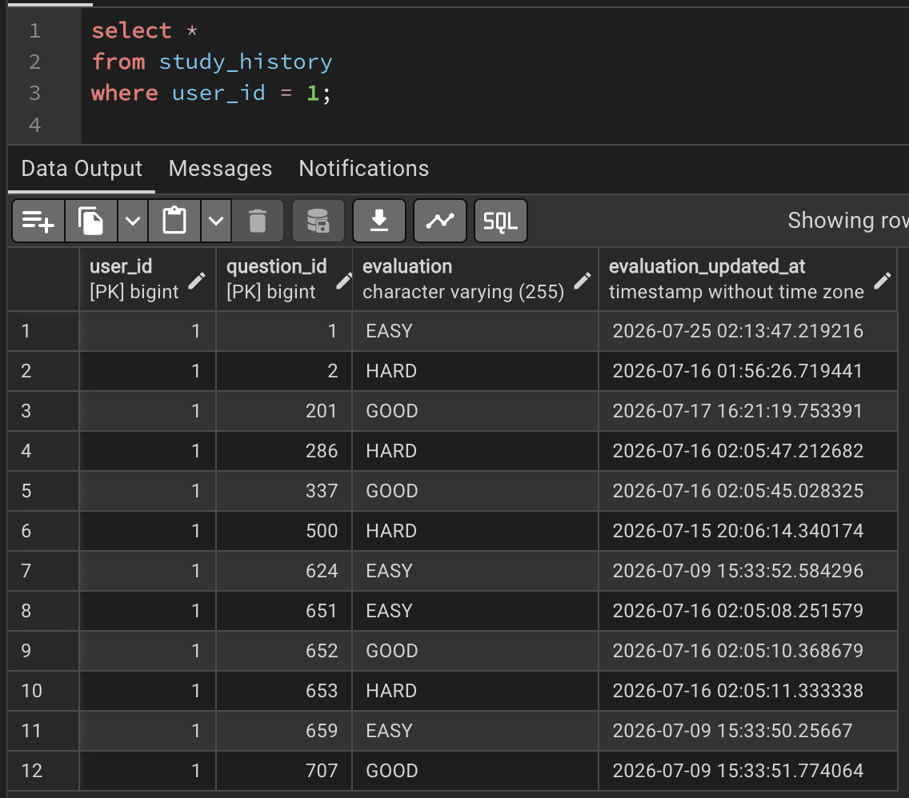
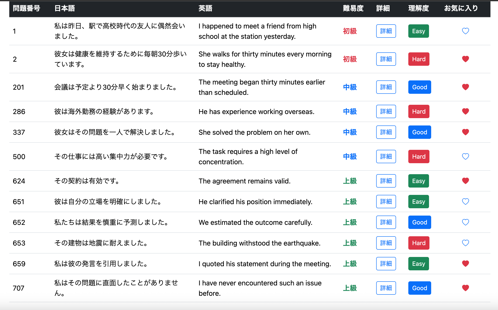
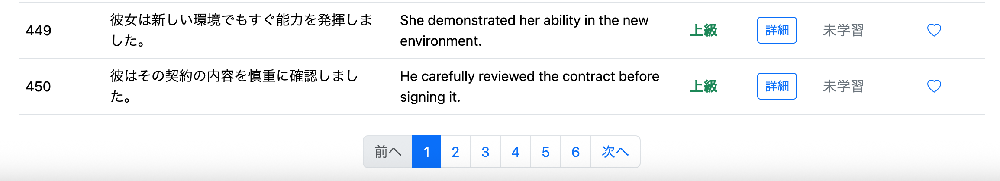
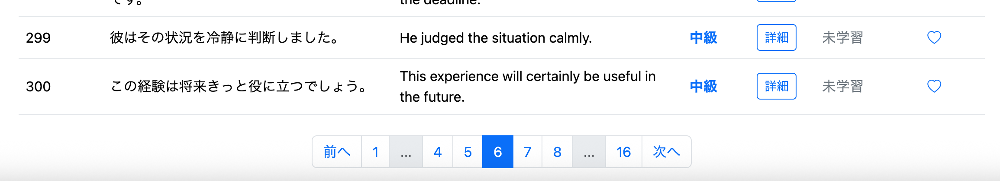

# #055 ログインメニューからも問題一覧と問題検索を使用できるようにする②
# 検索機能の実装

## 検索項目を決める

Repositoryに検索用SQLを書く前に、検索画面に実装する検索項目を先に決める。

| 項目 | 動作 |
|------|------|
| 難易度 | 無選択：全難易度 / 選択：指定した難易度のみ |
| 学習状態 | すべて・学習済みのみ・未学習のみ |
| 理解度 | 無選択：全理解度 / 選択：指定した理解度のみ |
| 条件 | 無選択：全条件 / 選択：指定した条件のみ |
| お気に入り | すべて・お気に入りのみ・お気に入り以外 |
| キーワード | 日本語・英語・別解を対象に検索 |



---

# 検索条件の矛盾

## 問題点

学習状態と理解度は、そのままでは矛盾した条件を指定できてしまう。

### 例①

```
学習状態：未学習のみ
理解度：Hard
```

未学習問題には理解度（Evaluation）が存在しないため、この条件は成立しない。

---

### 例②

```
学習状態：すべて
理解度：Hard
```

未学習問題には理解度が存在しないため、「すべて」と「Hard」の組み合わせも曖昧な検索条件となる。

---

## 対応

矛盾した検索条件は複数のレイヤーで防止する。

- JavaScriptで入力を制御する
- Serviceでも必要に応じて制御する
- RepositoryではSQLの条件分岐によって矛盾を解消する

---

# QuestionRepository.javaに検索用クエリを追加

**commit**

```text
feat(user): add filtered question list query
```

一覧表示用SQLを拡張し、

- 難易度
- 学習状態
- 理解度
- お気に入り状態
- 条件
- キーワード

で検索できるようにする。

---

## 一覧表示よりSQLが長くなる理由

通常の一覧表示では、

- 問題取得
- 評価取得
- お気に入り取得

程度で済むためSQLは比較的短い。

一方、検索画面では、

- 難易度
- 理解度
- 学習状態
- お気に入り
- 条件
- キーワード

という複数条件を自由に組み合わせられる。

そのため、`WHERE`句の条件分岐が増え、一覧表示用SQLよりも長いクエリとなっている。

---

# StudyConditionとは

`studyCondition`は学習状態による検索条件を表す文字列である。

| 値 | 意味 |
|----|------|
| `ALL` | 学習状態で絞り込まない |
| `LEARNED_ONLY` | 学習済み問題のみ |
| `UNLEARNED_ONLY` | 未学習問題のみ |

例えば、

```java
studyCondition = "ALL";
```

であれば学習済み・未学習を区別せず取得する。

```java
studyCondition = "LEARNED_ONLY";
```

なら学習済みのみ、

```java
studyCondition = "UNLEARNED_ONLY";
```

なら未学習のみ取得する。

この値をSQLへ渡すことで、一つのクエリで検索条件を切り替えられるようにしている。

---

# 学習状態と理解度の矛盾を解消するSQL

```sql
AND (
    :studyCondition = 'UNLEARNED_ONLY'
    OR sh.evaluation IN (:evaluations)
)
AND (
       :studyCondition = 'ALL'
    OR (:studyCondition = 'LEARNED_ONLY'
        AND sh.question_id IS NOT NULL)
    OR (:studyCondition = 'UNLEARNED_ONLY'
        AND sh.question_id IS NULL)
)
```

---

## ① 理解度検索の制御

```sql
AND (
    :studyCondition = 'UNLEARNED_ONLY'
    OR sh.evaluation IN (:evaluations)
)
```

### 未学習のみ検索

```
studyCondition = UNLEARNED_ONLY
```

の場合、

```sql
:studyCondition = 'UNLEARNED_ONLY'
```

がTRUEとなるため、

```sql
sh.evaluation IN (:evaluations)
```

は評価されない。

つまり、理解度検索は実質的に無効となる。

---

### 学習済み・ALL

`UNLEARNED_ONLY`以外では、

```sql
sh.evaluation IN (:evaluations)
```

が有効となるため、理解度による絞り込みが行われる。

---

## ② 学習状態の制御

```sql
AND (
       :studyCondition = 'ALL'
    OR (:studyCondition = 'LEARNED_ONLY'
        AND sh.question_id IS NOT NULL)
    OR (:studyCondition = 'UNLEARNED_ONLY'
        AND sh.question_id IS NULL)
)
```

ここでは取得対象を切り替えている。

### ALL

学習済み・未学習を区別しない。

### LEARNED_ONLY

`study_history`が存在する問題だけ取得する。

### UNLEARNED_ONLY

`study_history`が存在しない問題だけ取得する。

---

## なぜLEARNED_ONLYでevaluationを再判定しないのか

`LEARNED_ONLY`の場合は、

最初の条件

```sql
sh.evaluation IN (:evaluations)
```

によって、理解度条件を満たしていることが保証されている。

そのため、

```sql
AND (
    :studyCondition = 'LEARNED_ONLY'
    AND sh.question_id IS NOT NULL
)
```

だけで十分であり、

```sql
AND sh.evaluation IN (:evaluations)
```

を再度記述する必要はない。

このように、

- 1つ目の条件：理解度
- 2つ目の条件：学習状態

と役割を分離することで、SQLを比較的シンプルに保つことができる。

---

## countQueryにも同じ条件を書く理由

Spring Data JPAで`Page`を返す場合は、

1. 表示データ取得用SQL
2. 全件数取得用SQL（`countQuery`）

の2つが実行される。

もし`countQuery`が検索条件を持たなければ、

例えば

- 全問題数：750件
- 検索結果：18件

であっても、ページネーションは750件を基準に作成されてしまう。

その結果、

- 存在しないページが表示される
- 空ページへ遷移できる

という不具合が発生する。

そのため、`countQuery`にも検索SQLと同じ`JOIN`および`WHERE`条件を記述し、検索結果と同じ条件で件数を取得する必要がある。

## 学習済・未学習ALLと理解度の選択は両立しない

一見すると、

- 学習状態：**すべて**
- 理解度：**Hard・Good・Easy**

は同時に指定できそうに見える。

しかし、本アプリではこの組み合わせを「未学習問題＋Hard問題」としては扱わない仕様としている。

### 理由① 未学習問題には理解度が存在しない

未学習問題は`study_history`にレコードが存在しないため、

```text
evaluation = NULL
```

となる。

そのため、

```
理解度 = Hard
```

のように理解度を指定した場合、未学習問題は理解度による検索対象にならない。

例えば、

- 学習状態：すべて
- 理解度：Hard

で検索すると取得されるのは、

- 学習済み
- Hard評価

の問題のみである。

---

### 理由② ユーザーの目的とも一致しない

仮に、

```
未学習問題
+
Hard問題
```

を同時に取得することもできる。

しかし、

「理解度を指定した」

ということは、

**学習済み問題の中から特定の理解度を検索したい**

という意図であると考えられる。

そのため本アプリでは、

**理解度が指定された場合は理解度検索を優先し、未学習問題は検索対象外**

という仕様とした。

---

### フロント側でも制御可能

JavaScript側でも、

例えば

- 「すべて」を選択したら理解度をリセットする
- 理解度を変更したら学習状態を変更する

などの入力制御を行うことができる。

SQLだけで制御することも可能だが、

フロント側でも矛盾した入力を防止することで、より分かりやすいUIになる。

---

# StudyConditionクラスを作成

**commit**

```text
feat(user): add StudyCondition enum
```

```java
public enum StudyCondition {

    ALL,
    LEARNED_ONLY,
    UNLEARNED_ONLY

}
```

学習状態を表す列挙型を追加する。

---

# UserServiceImplにメソッドを追加

## getFilteredUserQuestionList

**commit**

```text
feat(user): implement filtered question list service
```

検索画面から受け取った検索条件をRepositoryへ渡し、検索結果を取得する。

Repositoryへ渡す前に、

- Difficulty
- Evaluation
- StudyCondition
- FavoriteCondition

を文字列へ変換する。

条件（condition）が未指定の場合は、全条件を対象とする。

---

## Repository側で矛盾を解消できる理由

一見すると、

```java
if ("UNLEARNED_ONLY".equals(convertedStudyCondition)) {
    convertedEvaluations = null;
}
```

のようにJava側で理解度条件を消せばよいように思える。

しかし、この方法ではRepositoryへ`null`を渡すことになり、SQLが正常に実行できない。

実際には、そのような処理は不要である。

Repositoryでは、以下の条件によって理解度検索を自動的に切り替えている。

```sql
AND (
    :studyCondition = 'UNLEARNED_ONLY'
    OR sh.evaluation IN (:evaluations)
)
```

例えば、

```
studyCondition = UNLEARNED_ONLY
evaluation = HARD
```

という矛盾した入力が渡された場合、

SQLでは

```sql
TRUE
OR sh.evaluation IN ('HARD')
```

となる。

`OR`は左辺がTRUEであれば全体がTRUEとなるため、

```sql
sh.evaluation IN (:evaluations)
```

は実質的に無視される。

さらに、

```sql
AND (
    :studyCondition = 'UNLEARNED_ONLY'
    AND sh.question_id IS NULL
)
```

によって、

未学習問題だけが取得される。

つまり、Repository側のSQLだけで矛盾した検索条件を自然に解消できている。

---

## convertStudyCondition

**commit**

```text
feat(user): add StudyCondition converter
```

```java
public String convertStudyCondition(
        StudyCondition studyCondition) {

    String convertedStudyCondition;

    if (studyCondition == null) {

        convertedStudyCondition =
                StudyCondition.ALL.name();

    } else {

        convertedStudyCondition =
                studyCondition.name();

    }

    return convertedStudyCondition;
}
```

### なぜ

```java
StudyCondition.name();
```

ではダメなのか

`name()`はEnumインスタンスのメソッドである。

そのため、

```java
StudyCondition.name();
```

のようにクラス名から呼び出すことはできない。

実際に保持しているEnum値

```java
studyCondition
```

に対して

```java
studyCondition.name();
```

と呼び出す必要がある。

また、`studyCondition`が`null`の場合は`name()`を呼び出せないため、

```java
StudyCondition.ALL.name();
```

を返すことで、検索条件未指定時でも安全に処理できるようにしている。

---

# AdminServiceを修正

**commit**

```text
refactor(admin): reuse difficulty conversion logic
```

`getFilteredQuestions()`で行っていた難易度変換処理を削除した。

理由は、

`ReviewService`の

```java
convertDifficulty()
```

と全く同じ処理だったためである。

重複コードをなくし、共通メソッドを利用するように修正した。

# UserMenuControllerに検索用メソッドを追加

**commit**

```text
feat(user): add question search endpoint
```

一覧画面から検索条件を受け取り、検索結果を表示するControllerを追加する。

検索条件として受け取る項目は以下のとおりである。

- 難易度
- 理解度
- 学習状態
- お気に入り状態
- 条件
- キーワード

取得した検索条件を`UserServiceImpl#getFilteredUserQuestionList()`へ渡し、検索結果を取得する。

また、検索フォームへ現在の検索条件を戻すため、

```java
selectedDifficulties
selectedEvaluations
selectedStudyCondition
selectedFavoriteCondition
selectedConditions
keyword
```

をModelへ追加する。

これにより、検索後も入力内容が保持されるようになる。

---

# list.jsに検索条件制御を追加

**commit**

```text
feat(user): disable evaluation filters for unlearned search
```

学習状態で

```
未学習のみ
```

が選択された場合、

理解度のチェックボックスを無効化する。

### 理由

未学習問題には理解度が存在しないため、

```
未学習のみ
```

と

```
Hard
Good
Easy
```

を同時に指定することは意味がない。

そこで、

```javascript
studyCondition.value === "UNLEARNED_ONLY"
```

の場合は、

```javascript
cb.checked = false;
cb.disabled = true;
```

とし、理解度を選択できないようにした。

学習状態を変更すると、自動的に理解度も有効・無効が切り替わる。

---

# list.htmlに検索フォームを追加

**commit**

```text
feat(user): add question search form
```

問題一覧画面の上部に検索フォームを追加する。

検索項目は以下の6種類とした。

- 難易度
- 理解度
- 学習状態
- お気に入り状態
- 条件
- キーワード

フォームはGETメソッドで送信し、

```text
/user/question/search
```

へ検索条件を渡す。

---

## 各入力項目

### 難易度

チェックボックス

- 初級
- 中級
- 上級

---

### 理解度

チェックボックス

- Hard
- Good
- Easy

---

### 学習状態

プルダウン

- すべて
- 学習済み
- 未学習

---

### お気に入り

プルダウン

- すべて
- お気に入りのみ
- お気に入り以外

---

### 条件

プルダウン

登録済みの条件一覧を表示する。

---

### キーワード

テキストボックス

以下を対象に部分一致検索する。

- 日本語
- 英語
- 別解

---

# 実行 / 問題点①

## 学習状態「すべて」で未学習問題が取得されない

### 問題

難易度だけを指定し、

```
学習状態：すべて
```

で検索すると、

本来取得されるはずの

- 学習済み問題
- 未学習問題

の両方ではなく、

**学習済み問題だけ**が表示された。




---

## 原因

検索SQLでは、

```sql
sh.evaluation IN (:evaluations)
```

という条件を利用していた。

しかし、

未学習問題には

```
study_history
```

が存在しないため、

```
evaluation
```

も存在しない。

そのため、

未学習問題はSQLの条件を満たせず、検索対象から除外されていた。

---

## 修正

**commit**

```text
fix(search): correct study condition and NULL condition filtering
```

学習状態ごとに取得対象を切り替えるよう、

検索条件を以下のように修正した。

```sql
AND (
    (:studyCondition = 'ALL'
        AND (
            sh.question_id IS NULL
            OR (
                sh.question_id IS NOT NULL
                AND sh.evaluation IN (:evaluations)
            )
        )
    )

    OR (:studyCondition = 'LEARNED_ONLY'
        AND sh.question_id IS NOT NULL
        AND sh.evaluation IN (:evaluations)
    )

    OR (:studyCondition = 'UNLEARNED_ONLY'
        AND sh.question_id IS NULL
    )
)
```

これにより、

- **すべて**
    - 未学習問題
    - 指定した理解度の学習済み問題

- **学習済みのみ**
    - 指定した理解度の学習済み問題

- **未学習のみ**
    - 未学習問題

という期待通りの検索結果が取得できるようになった。

# 実行 / 問題点②

## pgAdmin4とブラウザで検索結果が一致しない

### 問題

学習状態「学習済みのみ」で検索すると、

- pgAdmin4：12件
- ブラウザ：4件

となり、取得件数が一致しなかった。




---

## 原因調査

最初は以下のようなSpring Data JPAやHibernate周りの問題を疑った。

- SpEL
- Interface Projection
- Hibernate
- `Page`
- Enum変換
- Native Query

そこで、一つずつ切り分けながら調査を行った。

調査の結果、

- Hibernateへ渡されるバインド値は正常
- `Page<UserQuestionListDto>`でも取得件数は同じ
- `List<Object[]>`へ変更しても取得件数は変わらない

ことが分かった。

つまり、

**SQLそのものが期待した件数を返していない**

ことが原因だった。

---

## 原因

pgAdmin4で取得されたデータを確認すると、

```
201
337
652
```

の3件は、

```text
condition = NULL
```

だった。

一方、検索SQLでは

```sql
AND q.condition IN (:conditions)
```

となっていた。

`conditions`には登録済み条件しか入っておらず、

```
NULL
```

は含まれない。

SQLでは

```sql
NULL IN (...)
```

はTRUEにならないため、

`condition`がNULLの問題は検索対象から除外されていた。

そのため、

pgAdmin4では取得できていた問題の一部がブラウザでは取得できず、検索件数が一致しなかった。

---

# QuestionRepositoryを修正

**commit**

```text
fix(search): correct study condition and NULL condition filtering
```

## condition検索を修正

`condition`がNULLの問題も検索対象に含めるため、

以下のように修正した。

```sql
AND (
    q.condition IS NULL
    OR q.condition IN (:conditions)
)
```

これにより、

- 条件が設定されている問題
- 条件がNULLの問題

の両方を検索対象に含められるようになった。

その結果、

ブラウザの検索結果とpgAdmin4の検索結果が一致するようになった。

---

# 実行

学習済み問題を検索すると、

ブラウザでも12件表示されることを確認した。



---

# 問題点③

## ページネーションで検索条件が失われる

例えば、

```
難易度：上級
学習状態：未学習
```

で検索すると複数ページに分かれる。

しかし、

ページ番号をクリックすると、

検索条件がすべてリセットされ、

全件検索へ戻ってしまった。





---

## 原因

検索フォームはGETメソッドで送信しているため、

検索条件はURLのクエリパラメータとして渡される。

例えば、

```text
/user/question/search?difficulties=ADVANCED&studyCondition=UNLEARNED_ONLY
```

となる。

しかし、

ページネーションでは

```text
/user/question/search?page=1
```

だけが生成されていた。

つまり、

- difficulties
- evaluations
- studyCondition
- favoriteCondition
- conditions
- keyword

がURLから消えてしまっていた。

そのためControllerでは

「検索条件なし」

と判断され、

全件検索が実行されていた。

---

## 対応

ページネーションでも検索条件を維持するため、

すべてのページネーションリンクへ現在の検索条件を引き継ぐ必要がある。

さらに、

このタイミングでController構成も見直すことにした。

---

# Controller構成の見直し

## 従来の構成

```
GET /user/question/list
```

一覧表示専用

↓

```
GET /user/question/search
```

検索専用

という2つのControllerに分かれていた。

---

## 問題点

一覧表示と検索表示は、

取得するデータも画面も全く同じであり、

違うのは検索条件があるかどうかだけである。

しかしControllerを分けていたため、

- ページネーション
- 初期表示
- 検索後

で遷移先が異なり、

検索条件の引き継ぎなどの処理が複雑になっていた。

---

## 修正

一覧表示用Controllerを削除し、

```
GET /user/question/search
```

だけで

- 初回表示
- 検索
- ページネーション

のすべてを処理する構成へ変更する。

検索条件が未指定であれば、

Service側でデフォルト値を設定し、

全件検索として扱う。

このようにControllerを一本化することで、

画面遷移が単純になり、

検索・ページネーション・初回表示を同じ処理で実現できるようになった。

# UserMenuControllerを修正

**commit**

```text
refactor(user): unify question list and search controller
```

## getUserQuestionSearchを修正

一覧表示と検索処理を一つのControllerで扱えるように修正する。

ポイントは以下の2点である。

- 検索条件が未指定（`null`）の場合は全件検索として扱う
- 一覧表示専用Controllerを不要にする

```java
@GetMapping("/user/question/search")
public String getUserQuestionSearch(
        @AuthenticationPrincipal UserDetails loginUser,
        @PageableDefault(page = 0, size = 50) Pageable pageable,
        @RequestParam(required = false) List<Difficulty> difficulties,
        @RequestParam(required = false) List<Evaluation> evaluations,
        @RequestParam(required = false) StudyCondition studyCondition,
        @RequestParam(required = false) FavoriteCondition favoriteCondition,
        @RequestParam(required = false) List<String> conditions,
        @RequestParam(required = false, defaultValue = "") String keyword,
        Model model) {
```

検索条件をそのままServiceへ渡し、

```java
Page<UserQuestionListDto> questionList =
        userServiceImpl.getFilteredUserQuestionList(
                userId,
                difficulties,
                evaluations,
                studyCondition,
                favoriteCondition,
                conditions,
                keyword,
                pageable);
```

検索条件が指定されていない場合は、

Service側でデフォルト値へ変換する。

そのため、

- 初回表示
- 検索
- ページネーション

のすべてを同じControllerで処理できるようになった。

---

## getUserQuestionListを削除

一覧表示専用だった

```java
GET /user/question/list
```

は不要となったため削除する。

今後は

```text
GET /user/question/search
```

のみを利用する。

これにより、

Controllerの責務が単純になり、

画面遷移も統一された。

---

# UserServiceImplを修正

**commit**

```text
refactor(user): support default search conditions in user question search
```

## 理由

`UserMenuController`で

- 初回表示
- 検索

を共通化したため、

このメソッドは検索条件が何も指定されていない状態でも呼び出されるようになった。

そのため、

各検索条件が`null`または空であれば、

全件検索となるようデフォルト値を設定する。

また、

検索条件をRepositoryへ渡す前にデフォルト値を設定することで、

- `convertDifficulty()`
- `convertEvaluation()`
- `convertStudyCondition()`
- `convertFavoriteCondition()`

が常に有効な値を扱えるようになった。

### デフォルト値

| 項目 | デフォルト |
|------|-----------|
| 難易度 | 全難易度 |
| 理解度 | 全理解度 |
| 学習状態 | ALL |
| お気に入り | ALL |
| 条件 | 全条件 |
| キーワード | 空文字 |

---

# list.htmlを修正

**commit**

```text
fix(user): preserve search conditions during pagination
```

ページネーションでも検索条件を保持できるように修正する。

Controllerでは、

現在の検索条件を

```java
selectedDifficulties
selectedEvaluations
selectedStudyCondition
selectedFavoriteCondition
selectedConditions
keyword
```

としてModelへ渡している。

そこで、

ページネーションリンクにもこれらの検索条件をすべて付与する。

例えば「前へ」は、

```html
<a class="page-link"
   th:href="@{/user/question/search(
       page=${page.number-1},
       size=${page.size},
       difficulties=${selectedDifficulties},
       evaluations=${selectedEvaluations},
       studyCondition=${selectedStudyCondition},
       favoriteCondition=${selectedFavoriteCondition},
       conditions=${selectedConditions},
       keyword=${keyword}
   )}">
```

のように変更する。

同様に、

- 1ページ目
- 中央のページ番号
- 最終ページ
- 次へ

についても、

現在の検索条件をすべて引き継ぐよう修正する。

これにより、

ページを移動しても検索条件が維持されるようになった。


---

# 実行

以下を確認した。

- すべての検索条件で正しく検索できる
- ページネーションが正常に動作する
- ページ遷移後も検索条件が保持される

問題一覧・検索・ページネーションを一つのControllerへ統一したことで、

シンプルな構成のまま安定して動作するようになった。

---

# 所感・反省点

今回の実装では、

検索条件の組み合わせが多かったため、

RepositoryのSQLが非常に長くなってしまった。

特に、

- 学習状態
- 理解度
- お気に入り
- 条件
- キーワード

を一つのSQLで処理しようとしたため、

`WHERE`句の条件分岐が複雑になった。

また、

問題の切り分けにも時間がかかった。

当初は、

- Interface Projection
- Hibernate
- Native Query
- `Page`
- Enum変換

などSpring Data JPA側の問題を疑い、

一つずつ原因を調査した。

しかし最終的な原因は、

- 学習状態の条件分岐
- `condition`が`NULL`の場合の検索条件

というSQLそのものにあった。

この経験から、

SQLに問題がある可能性も早い段階で疑い、

実際に生成されたSQLや取得データを確認しながら切り分けることの重要性を学んだ。

また、

今回のように一つの巨大なSQLで対応する以外にも、

- クエリを用途ごとに分割する
- Java側で条件分岐してRepositoryを呼び分ける

という設計も考えられる。

実務では可読性や保守性も重要になるため、

状況に応じて適切な設計を選択することが大切である。

---

# 次やること

- ControllerやServiceなど内部構造の見直し
- URL・パス設計の整理
- UIの改善
- コード全体のリファクタリング