# 実装し忘れていた細かい機能の追加

実装終盤で見つかった細かな機能追加・改善・UI修正をまとめて実施した。

---

# 1. 問題削除機能の追加

管理画面から問題を削除できる機能を実装する。

## QuestionRepository

`Question`エンティティは`questionId`を`@Id`としているため、`JpaRepository<Question, Long>`が標準で提供している`deleteById()`を利用できる。

そのため、専用の削除メソッドを追加する必要はない。

```java
questionRepository.deleteById(questionId);
```

---

## FavoritesRepository

問題削除時に、お気に入り情報も削除するため、以下のメソッドを追加する。

```java
void deleteByQuestionQuestionId(Long questionId);
```

---

## StudyHistoryRepository

問題削除時に、学習履歴も削除するため、以下のメソッドを追加する。

```java
void deleteByStudyHistoryKeyQuestionId(Long questionId);
```

---

## AdminService

問題本体を削除する前に、関連するお気に入り情報・学習履歴を削除する。

```java
@Transactional
public void deleteOneQuestion(Long questionId) {

    favoritesRepository.deleteByQuestionQuestionId(questionId);
    studyHistoryRepository.deleteByStudyHistoryKeyQuestionId(questionId);
    questionRepository.deleteById(questionId);

}
```

---

## AdminQuestionController

問題削除用のPOSTメソッドを追加する。

```java
@PostMapping("/admin/question/delete")
public String postAdminQuestionDelete(
        @RequestParam long questionId,
        RedirectAttributes redirectAttributes) {

    adminService.deleteOneQuestion(questionId);

    redirectAttributes.addFlashAttribute(
            "successMessage",
            "問題を削除しました。");

    return "redirect:/admin/question/search";
}
```

---

## `/admin/question/list.html`

削除ボタンをフォームへ変更し、削除対象の問題IDを送信する。

```html
<form th:action="@{/admin/question/delete}" method="post">

    <input type="hidden"
           name="questionId"
           th:value="${question.questionId}">

    <button type="submit"
            class="btn btn-outline-danger btn-sm"
            title="削除"
            onclick="return confirm('この問題を削除しますか？');">

        <i class="bi bi-trash"></i>

    </button>

</form>
```

---

## 実装後

管理画面から不要な問題を削除できるようになった。

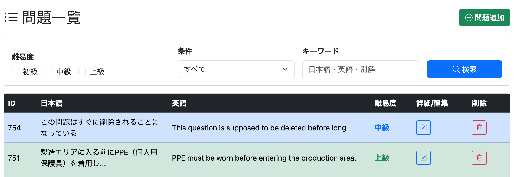

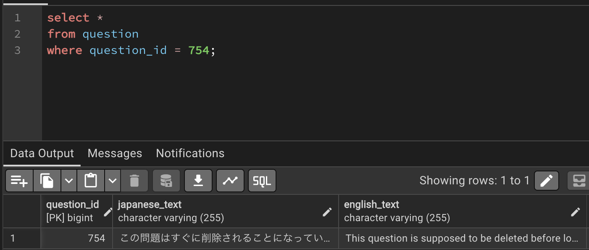

削除前には確認ダイアログも表示される。

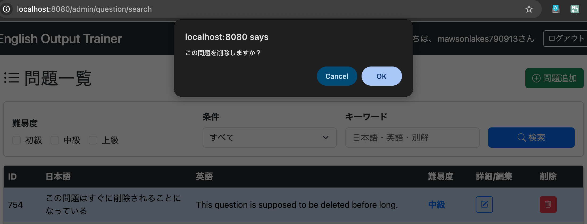

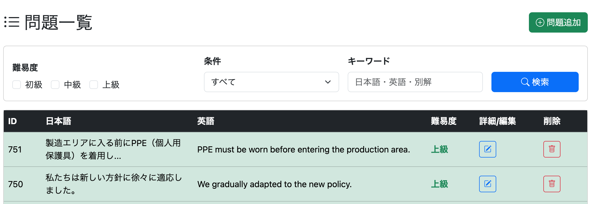

問題が正常に削除されることも確認できた。

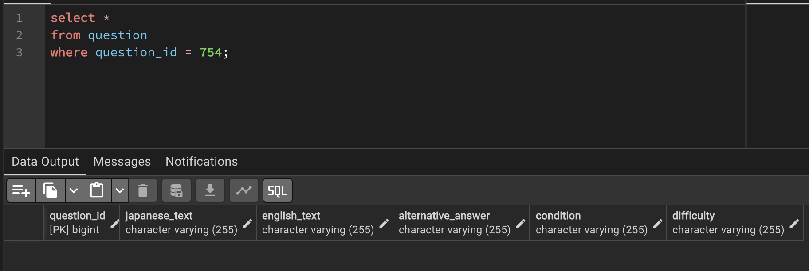

---

# 2. 問題検索結果数の表示（Admin）

管理画面の問題一覧に、

```text
1-50 / 全751件
```

のような現在表示中の範囲と総件数を表示する。

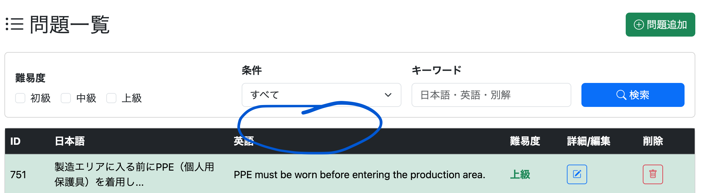

## 初期案

当初は、

- DTOを新規作成する
- 件数取得用のCountQueryを追加する
- DTOで表示範囲を管理する

という構成を検討した。

### QuestionListRangeDto

検索結果の表示範囲を管理するDTOを作成する。

```java
@Data
public class QuestionListRangeDto {

    private long totalCount;
    private List<Range> ranges;

}
```

---

### QuestionRepository

検索条件に一致する問題数を取得するため、件数取得用のクエリを追加する。

```java
@Query(
    value = """
        SELECT COUNT(*)
        FROM question q
        WHERE q.difficulty IN (:difficulties)
          AND (
                :includeAllConditions = true
                OR q.condition = :condition
          )
          AND (
                LOWER(q.japanese_text) LIKE LOWER(CONCAT('%', :keyword, '%'))
             OR LOWER(q.english_text) LIKE LOWER(CONCAT('%', :keyword, '%'))
             OR LOWER(q.alternative_answer) LIKE LOWER(CONCAT('%', :keyword, '%'))
          )
        """,
    nativeQuery = true
)
Long countAdminQuestions(
        @Param("difficulties") List<String> difficulties,
        @Param("condition") String condition,
        @Param("includeAllConditions") boolean includeAllConditions,
        @Param("keyword") String keyword);
```

---

### AdminService

検索条件に一致する総件数を取得し、表示範囲を作成する。

```java
public long countQuestions(
        List<Difficulty> difficulties,
        String condition,
        String keyword) {

    if (difficulties == null || difficulties.isEmpty()) {
        difficulties = Arrays.asList(Difficulty.values());
    }

    boolean includeAllConditions =
            condition == null || condition.isBlank();

    if (keyword == null) {
        keyword = "";
    }

    return questionRepository.countAdminQuestions(
            searchConditionConverter.convertDifficulty(difficulties),
            condition,
            includeAllConditions,
            keyword);
}
```

```java
public QuestionListRangeDto createQuestionListRange(Long totalCount) {

    QuestionListRangeDto questionListRange = new QuestionListRangeDto();

    List<Range> ranges = createRanges(totalCount);

    questionListRange.setRanges(ranges);

    return questionListRange;
}
```

```java
private List<Range> createRanges(long count) {

    List<Range> ranges = new ArrayList<>();

    for (long start = 1; start <= count; start += 50) {

        if (start + 49 <= count) {
            ranges.add(new Range(start, start + 49));
        } else {
            ranges.add(new Range(start, count));
        }

    }

    return ranges;
}
```

---

### AdminQuestionController

DTOを取得し、画面へ渡す。

```java
QuestionListRangeDto questionRange =
        createQuestionListRange(
                adminService.countQuestions(
                        difficulties,
                        condition,
                        keyword));
```

```java
model.addAttribute("totalCount", questionRange.getTotalCount());
model.addAttribute("questionRange", questionRange);
```

---

## 却下した理由

Spring Data JPAの`Page`には、

- 現在のページ番号
- 1ページあたりの表示件数
- 現在表示している件数
- 総件数

など、表示範囲を計算するために必要な情報がすべて含まれている。

そのため、新たにDTOや件数取得用クエリを追加する必要はなく、今回の要件に対しては**オーバーエンジニアリング**であると判断した。

よりシンプルな実装へ変更することにした。

---

## 実際の実装（feat: display search result range in admin question list）

### AdminQuestionController

`Page<Question> allFilteredQuestionList`を取得した直後に、以下を追加する。

```java
long start =
        allFilteredQuestionList.getNumber()
        * allFilteredQuestionList.getSize()
        + 1;

long end =
        start
        + allFilteredQuestionList.getNumberOfElements()
        - 1;

model.addAttribute("start", start);
model.addAttribute("end", end);
model.addAttribute("total",
        allFilteredQuestionList.getTotalElements());
```

### コード解説

検索結果の表示範囲を画面へ渡すための処理である。

まず、表示開始位置を計算する。

```java
long start =
        allFilteredQuestionList.getNumber()
        * allFilteredQuestionList.getSize()
        + 1;
```

`Page#getNumber()`は現在のページ番号（0始まり）、`Page#getSize()`は1ページあたりの表示件数を返す。

これらを利用することで、現在のページが全体の何件目から始まるかを求められる。

例えば、2ページ目（ページ番号1）で1ページ50件表示している場合、

```text
1 × 50 + 1 = 51
```

となり、51件目から表示していることになる。

続いて、表示終了位置を計算する。

```java
long end =
        start
        + allFilteredQuestionList.getNumberOfElements()
        - 1;
```

`Page#getNumberOfElements()`は現在のページに実際に表示されている件数を返す。

最終ページでは表示件数が50件未満になることもあるため、この値を利用して終了位置を算出している。

例えば、最終ページで31件表示されている場合、

```text
701 + 31 - 1 = 731
```

となり、表示範囲は701〜731件目となる。

最後に、

```java
model.addAttribute("start", start);
model.addAttribute("end", end);
model.addAttribute("total",
        allFilteredQuestionList.getTotalElements());
```

によって、

- 開始番号
- 終了番号
- 検索結果総件数

をViewへ渡している。

これにより、

```text
1-50 / 全751件
```

のような表示を実現できる。

---

### `/admin/question/list.html`

以下を追加する。

```html
<span th:text="${start}"></span>
-
<span th:text="${end}"></span>
/
全<span th:text="${total}"></span>件
```

---

## 実装後

管理画面の問題一覧に、現在表示中の範囲と総件数が表示されるようになった。

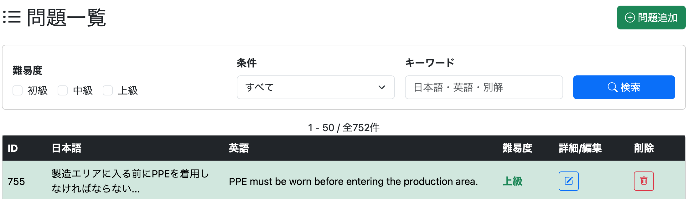

---

# 3. 問題検索結果数の表示（User）

ユーザー向け問題一覧についても、管理画面と同様に検索結果の表示範囲を追加する。

実装内容は管理画面と同じであるため、

- `UserQuestionController`
- `/user/question/list.html`

へ同様の処理を適用する。

# 4. メッセージは一回限りの表示にする

現状では、

- ログアウト後の「ログアウトしました」
- ログイン失敗時の「ユーザ名かパスワードが正しくありません」

などのメッセージが、ページを更新しても表示され続けてしまう。

---

# ログアウトしました

## 現状

`SecurityConfig`では、

```java
.logout(logout -> logout
        .logoutUrl("/logout")
        .logoutSuccessUrl("/?logout")
)
```

としている。

また、`home.html`では、

```html
<div th:if="${param.logout}"
     class="text-danger">
    ログアウトしました
</div>
```

としている。

この実装では、URLに`?logout`が付いている限り、ページを更新するたびにメッセージが表示され続けてしまう。

---

## 修正（feat: show logout success message only once）

`logoutSuccessHandler`を利用する。

`logoutSuccessHandler`とは、ログアウト成功時に任意の処理を実行するための機能である。

`logoutSuccessUrl()`ではリダイレクト先しか指定できないが、`logoutSuccessHandler`を利用すると、

- Sessionへの値の保存
- Cookie操作
- ログ出力
- リダイレクト先の動的変更

などを自由に実装できる。

今回は、Sessionへログアウトメッセージを保存し、その後トップページへリダイレクトする。

---

### SecurityConfig

```java
.logout(logout -> logout
        .logoutUrl("/logout")
        .logoutSuccessHandler(new LogoutSuccessHandler() {

            @Override
            public void onLogoutSuccess(
                    HttpServletRequest request,
                    HttpServletResponse response,
                    Authentication authentication)
                    throws IOException {

                HttpSession session = request.getSession(true);

                session.setAttribute(
                        "logoutMessage",
                        "ログアウトしました。");

                response.sendRedirect("/");

            }

        })
)
```

---

### コード解説

`LogoutSuccessHandler`は、ログアウト成功時に呼び出される。

```java
HttpSession session = request.getSession(true);
```

でSessionを取得し、

```java
session.setAttribute(
        "logoutMessage",
        "ログアウトしました。");
```

によって、一時的にログアウトメッセージを保存している。

最後に、

```java
response.sendRedirect("/");
```

によってトップページへリダイレクトする。

メッセージ自体はSessionに保存されているため、URLパラメータを利用する必要がなくなる。

---

## HomeController

```java
@GetMapping("/")
public String getHome(Model model,
                      HttpSession session) {

    boolean resumable =
            session.getAttribute("questions") != null;

    model.addAttribute(
            "resumable",
            resumable);

    String logoutMessage =
            (String) session.getAttribute("logoutMessage");

    if (logoutMessage != null) {

        model.addAttribute(
                "successMessage",
                logoutMessage);

        session.removeAttribute(
                "logoutMessage");

    }

    return "home";
}
```

---

### コード解説

まずSessionからログアウトメッセージを取得する。

```java
String logoutMessage =
        (String) session.getAttribute("logoutMessage");
```

メッセージが存在する場合のみ、

```java
model.addAttribute(
        "successMessage",
        logoutMessage);
```

によって画面へ渡す。

その後、

```java
session.removeAttribute("logoutMessage");
```

でSessionから削除する。

これにより、一度表示された後はページを更新しても再表示されなくなる。

---

## home.html

以下へ変更する。

```html
<div class="alert alert-success"
     th:if="${successMessage}"
     th:text="${successMessage}">
</div>
```

---

# ユーザ名かパスワードが正しくありません

## 修正（feat: show login failure message only once）

ログイン失敗時も同様に、`AuthenticationFailureHandler`を利用してメッセージを一度だけ表示する。

`AuthenticationFailureHandler`とは、認証失敗時に任意の処理を実行するための機能である。

---

### SecurityConfig

```java
.formLogin(login -> login
    .loginPage("/login")
    .usernameParameter("userId")
    .passwordParameter("password")
    .defaultSuccessUrl("/", false)
    .failureHandler(new AuthenticationFailureHandler() {

        @Override
        public void onAuthenticationFailure(
                HttpServletRequest request,
                HttpServletResponse response,
                AuthenticationException exception)
                throws IOException {

            HttpSession session =
                    request.getSession(true);

            session.setAttribute(
                    "loginErrorMessage",
                    "ユーザ名かパスワードが正しくありません。");

            response.sendRedirect("/login");
        }

    })
    .permitAll()
)
```

---

### コード解説

認証に失敗すると、

```java
onAuthenticationFailure()
```

が呼び出される。

ここでSessionへエラーメッセージを保存し、

```java
response.sendRedirect("/login");
```

によってログイン画面へリダイレクトする。

URLパラメータを利用しないため、更新後もメッセージが残ることはない。

---

## LoginController

```java
@GetMapping("/login")
public String getLogin(Model model,
                       HttpSession session) {

    String loginErrorMessage =
            (String) session.getAttribute(
                    "loginErrorMessage");

    if (loginErrorMessage != null) {

        model.addAttribute(
                "loginErrorMessage",
                loginErrorMessage);

        session.removeAttribute(
                "loginErrorMessage");

    }

    return "login";
}
```

---

### コード解説

Sessionからログインエラーメッセージを取得し、

```java
model.addAttribute()
```

によって画面へ渡す。

表示後は、

```java
session.removeAttribute()
```

によってSessionから削除するため、一度だけ表示される。

---

## login.html

```html
<div class="text-danger"
     th:if="${loginErrorMessage}"
     th:text="${loginErrorMessage}">
</div>
```

---

## 修正後

ログアウト成功時・ログイン失敗時ともに、メッセージは一度だけ表示されるようになった。

---

# 5. データ更新成功時のメッセージ表示

現状では、

- 問題追加
- 問題編集
- ユーザー情報変更

など、データ更新成功時のメッセージが表示されない。

そのため、成功時のメッセージを表示するよう修正する。

# 問題を追加（feat: show success message after adding question）

問題追加成功時に、「問題を追加しました」と表示する。

## AdminQuestionController.postQuestionAdd

`RedirectAttributes`の`FlashAttribute`を利用する。

Controllerから`redirect:`する場合は、`FlashAttribute`がリダイレクト先へ値を一時的に引き継ぐ。

また、表示後は自動的に破棄されるため、ページを更新しても再表示されない。

以下を追加する。

```java
redirectAttributes.addFlashAttribute(
        "successMessage",
        "問題を追加しました。");
```

---

## `/admin/question/list.html`

以下を追加する。

```html
<div class="alert alert-success"
     th:if="${successMessage}"
     th:text="${successMessage}">
</div>
```

---

## 実装後

問題追加後、問題一覧へ戻ると成功メッセージが表示されるようになった。

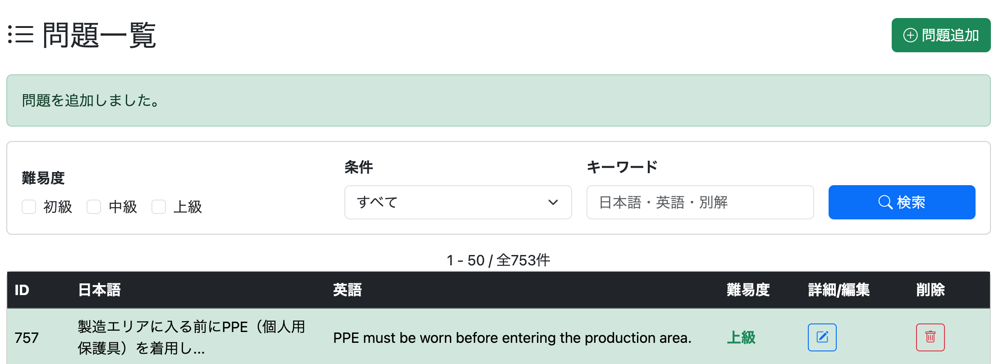

---

# 問題を編集（feat: show success message after editing question）

問題編集成功時に、「問題を編集しました」と表示する。

## AdminQuestionController.postAdminQuestionEdit

以下を追加する。

```java
redirectAttributes.addFlashAttribute(
        "successMessage",
        "問題を編集しました。");
```

---

## `/admin/question/list.html`

すでに以下を実装済みのため、修正は不要である。

```html
<div class="alert alert-success"
     th:if="${successMessage}"
     th:text="${successMessage}">
</div>
```

---

## 実装後

問題編集後、問題一覧へ戻ると成功メッセージが表示されるようになった。


---

# 問題を削除

問題削除については、`AdminQuestionController.postAdminQuestionDelete()`ですでに`FlashAttribute`を利用しているため、修正は不要である。


---

# ユーザーIDを変更（feat: show success message after updating user ID）

ユーザーID変更成功時に、「ユーザーIDを変更しました。再度ログインしてください。」と表示する。

## UserProfileController.postEditUserId

リダイレクト先へURLパラメータを付与する。

```java
return "redirect:/login";
```

↓

```java
return "redirect:/login?userIdChanged";
```

---

## `/login.html`

以下を追加する。

```html
<div class="alert alert-success"
     th:if="${param.userIdChanged}">
    ユーザーIDを変更しました。再度ログインしてください。
</div>
```

さらに、URLパラメータを削除するため、以下も追加する。

```html
<script th:if="${param.userIdChanged}">
    history.replaceState({}, "", "/login");
</script>
```

---

### コード解説

ユーザーID変更後は、

```text
/login?userIdChanged
```

へリダイレクトされる。

```html
th:if="${param.userIdChanged}"
```

によって成功メッセージを表示し、その後、

```javascript
history.replaceState({}, "", "/login");
```

を実行することで、ブラウザのURLから`?userIdChanged`を削除している。

これにより、ページを更新してもメッセージは再表示されない。

---

## 実装後

ユーザーID変更後、ログイン画面に成功メッセージが表示されるようになった。


---

# パスワード変更（feat: show success message after changing password）

パスワード変更成功時に、「パスワードを変更しました。再度ログインしてください。」と表示する。

## UserProfileController.postEditPassword

リダイレクト先を変更する。

```java
return "redirect:/login";
```

↓

```java
return "redirect:/login?passwordChanged";
```

---

## `/login.html`

以下を追加する。

```html
<div class="alert alert-success"
     th:if="${param.passwordChanged}">
    パスワードを変更しました。再度ログインしてください。
</div>
```

さらに、URLパラメータを削除する。

```html
<script th:if="${param.passwordChanged}">
    history.replaceState({}, "", "/login");
</script>
```

---

### コード解説

ユーザーID変更時と同様に、

```text
/login?passwordChanged
```

へリダイレクトし、

```html
th:if="${param.passwordChanged}"
```

で成功メッセージを表示する。

表示後は、

```javascript
history.replaceState({}, "", "/login");
```

によってURLからパラメータを削除するため、ページ更新時にメッセージは再表示されない。

---

## 実装後

パスワード変更後、ログイン画面に成功メッセージが表示されるようになった。

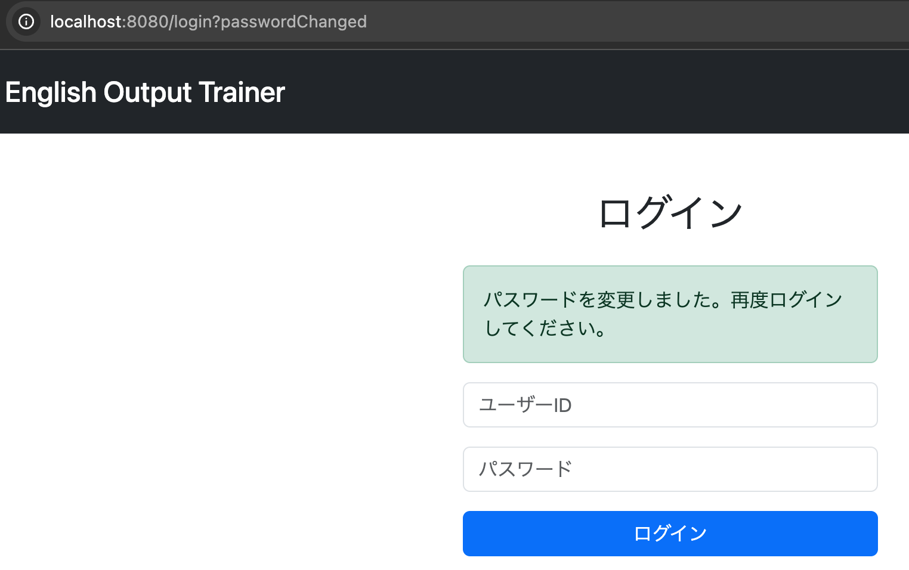

---

# 6. `/signup/signup.html`のパスワード入力欄を伏字にする

パスワード入力欄が通常のテキスト入力になっているため、伏字表示へ変更する。

## `/signup/signup.html`（fix: mask password fields on signup page）

パスワード入力欄・確認用入力欄ともに、

```html
<input type="text">
```

を

```html
<input type="password">
```

へ変更する。

---

## 修正後

パスワード入力欄・確認用入力欄ともに伏字表示になった。

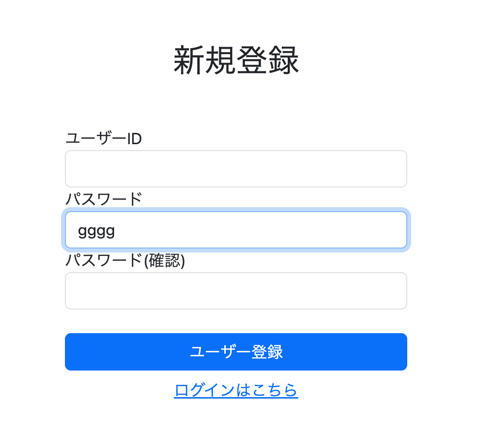

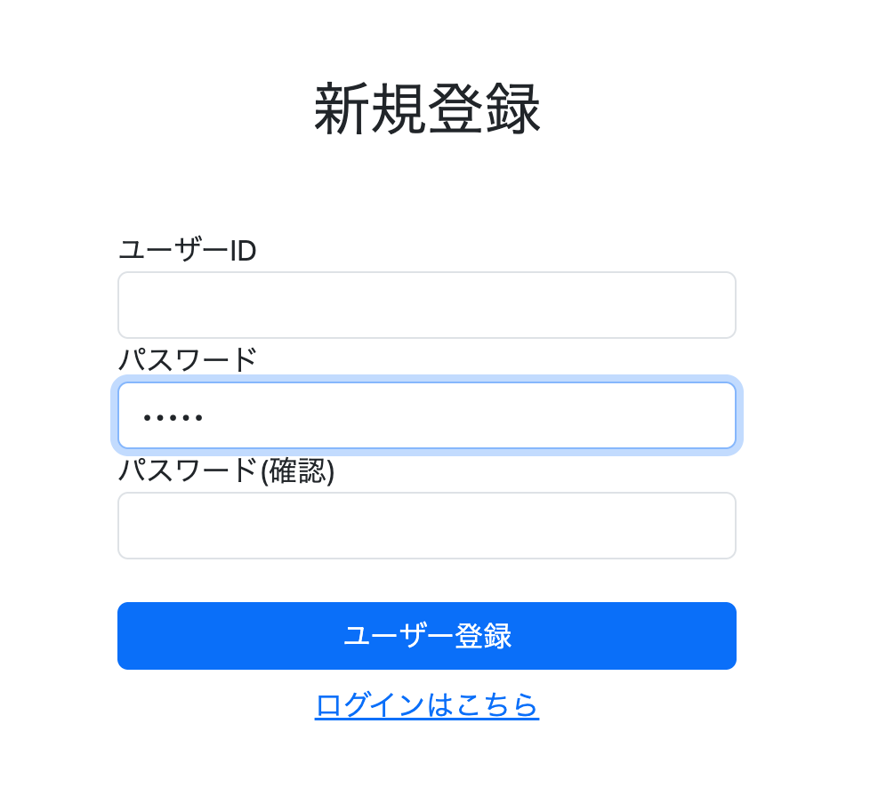

# 7. 管理画面のURLを整理する

URL構成に一貫性を持たせるため、管理画面のユーザー管理機能のURLを変更する。

変更内容は以下のとおりである。

```text
/admin/list          → /admin/user/list
/admin/delete        → /admin/user/delete
```

---

## ユーザー一覧（refactor: reorganize admin user list page structure）

### AdminUserController.getUserList

```java
@GetMapping("/admin/list")
public String getUserList(Model model) {

    List<Users> userList = adminService.getUsers();

    model.addAttribute("userList", userList);

    return "userList";

}
```

↓

```java
@GetMapping("/admin/user/list")
public String getUserList(Model model) {

    List<Users> userList = adminService.getUsers();

    model.addAttribute("userList", userList);

    return "/admin/user/list";

}
```

---

### `/admin/menu.html`

リンク先を変更する。

```html
<a th:href="@{/admin/list}"
   class="list-group-item list-group-item-action">
```

↓

```html
<a th:href="@{/admin/user/list}"
   class="list-group-item list-group-item-action">
```

---

### テンプレートを移動

```text
/userList.html
```

↓

```text
/admin/user/list.html
```

---

## ユーザー削除（refactor: reorganize admin user deletion endpoint）

### AdminUserController

```java
@PostMapping("/admin/delete")
public String deleteUser(
        @RequestParam String userId,
        Model model) {

    adminService.deleteOneUser(userId);

    return "redirect:/admin/list";
}
```

↓

```java
@PostMapping("/admin/user/delete")
public String getDeleteUser(
        @RequestParam String userId,
        Model model) {

    adminService.deleteOneUser(userId);

    return "redirect:/admin/user/list";
}
```

---

### `/admin/user/list.html`

フォームの送信先を変更する。

```html
<form th:action="@{/admin/delete}" method="post">

    <td th:text="${item.userId}"></td>

    <td th:text="${item.role}"></td>

    <td>

        <input type="hidden"
               name="userId"
               th:value="${item.userId}">

        <button type="submit"
                class="btn btn-danger">

            削除

        </button>

    </td>

</form>
```

↓

```html
<form th:action="@{/admin/user/delete}" method="post">

    <td th:text="${item.userId}"></td>

    <td th:text="${item.role}"></td>

    <td>

        <input type="hidden"
               name="userId"
               th:value="${item.userId}">

        <button type="submit"
                class="btn btn-danger">

            削除

        </button>

    </td>

</form>
```

---

# 8. ユーザー削除前に確認ダイアログを表示する

誤ってユーザーを削除してしまうことを防ぐため、削除前に確認ダイアログを表示する。

## `/admin/user/list.html`（fix: add confirmation dialog before deleting user）

削除ボタンを以下のように変更する。

```html
<button type="submit"
        class="btn btn-danger"
        onclick="return confirm('ユーザーを削除しますか？');">

    削除

</button>
```

---

## 実装後

ユーザー削除前に確認ダイアログが表示されるようになった。

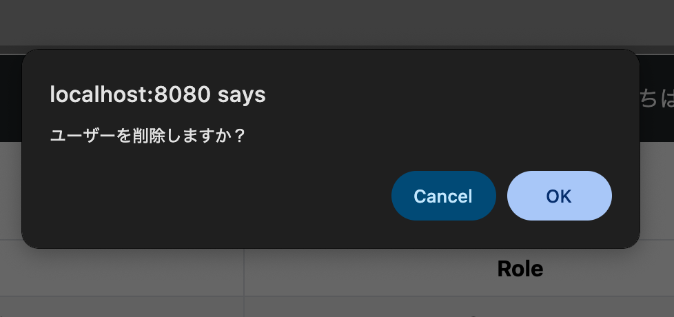

---

# 9. `/study/menu.html`でラベルをクリックしても選択できるようにする

現状では、ラジオボタン本体をクリックしなければ選択できず、使い勝手がよくない。

ラベルをクリックした場合でも選択できるよう修正する。

## `/study/menu.html`（fix: make radio button labels clickable）

### inputへ`id`を追加する

```html
<input class="form-check-input"
       type="radio"
       name="random"
       value="false"
       id="inOrder"
       checked>

<input class="form-check-input"
       type="radio"
       name="random"
       value="true"
       id="random">
```

---

### labelへ`for`を追加する

```html
<label class="form-check-label"
       for="inOrder">

    順番に出題

</label>

<label class="form-check-label"
       for="random">

    ランダムに出題

</label>
```

これにより、ラベル部分をクリックしてもラジオボタンが選択されるようになった。

---

# 10. 学習完了画面に遷移ボタンを追加する

現状では、「Topに戻る」ボタンしか存在しない。

学習完了後に次の操作へ進みやすくするため、

- 通常学習メニュー
- 復習メニュー（ログイン時のみ）

へ戻るボタンを追加する。

## `/complete.html`（feat: add navigation buttons to completion pages）

```html
<a th:href="@{/}"
   class="btn btn-secondary">

    Topに戻る

</a>
```

↓

```html
<div class="d-flex flex-column align-items-center gap-2 mt-3">

    <a th:href="@{/}"
       class="btn btn-secondary">

        Topに戻る

    </a>

    <a th:href="@{/study/menu}"
       class="btn btn-primary">

        通常学習メニューに戻る

    </a>

    <a sec:authorize="isAuthenticated()"
       th:href="@{/review/menu}"
       class="btn btn-success">

        復習メニューに戻る

    </a>

</div>
```

---

## 実装後

学習完了画面から各メニューへ直接戻れるようになった。

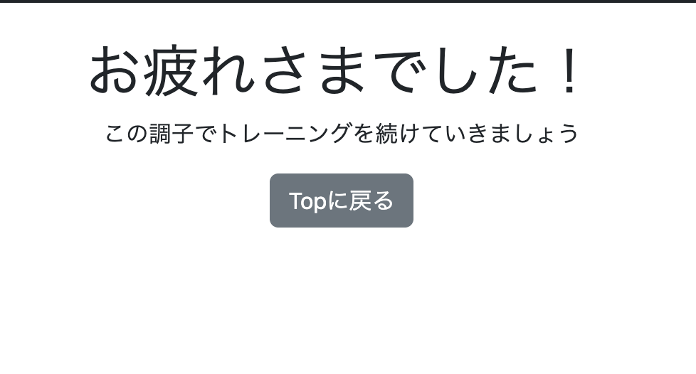

ログイン中は復習メニューへのボタンも表示される。

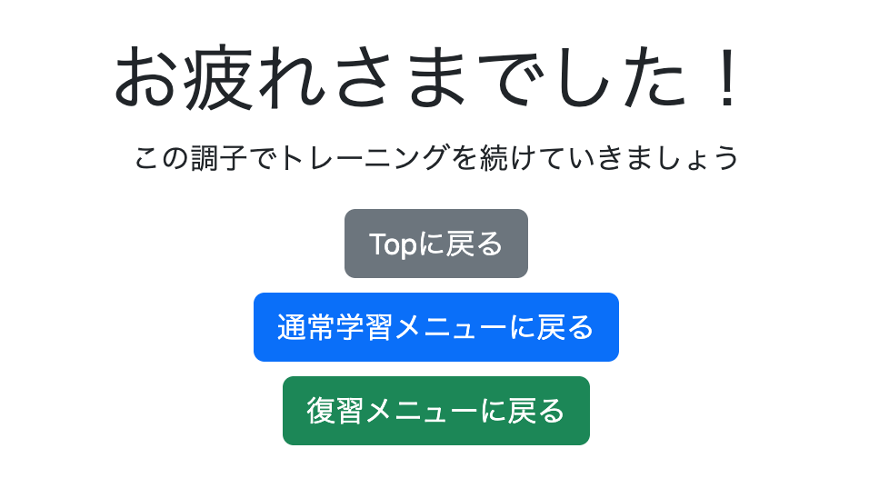

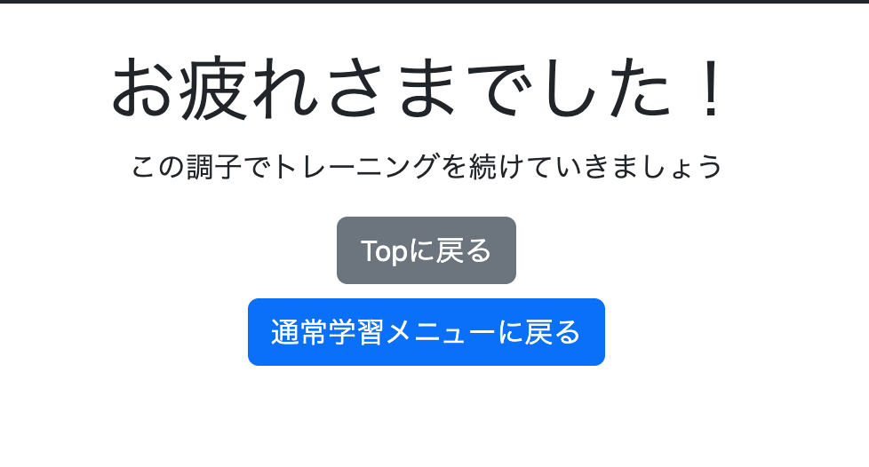

# 11. プロフィール画面に退会機能を追加する（feat: add account deletion button to user profile）

プロフィール画面から退会できるようにする。

## UserProfileController

退会処理自体はすでに実装済みのため、Controllerの修正は不要である。

```java
@PostMapping("/user/delete")
public String cancelMembership(
        @AuthenticationPrincipal UserDetails loginUser,
        HttpServletRequest request)
        throws ServletException {

    userAccountService.cancelMembership(loginUser.getUsername());

    request.logout();

    return "redirect:/user/canceled";
}

@GetMapping("/user/canceled")
public String getCanceled() {
    return "user/canceled";
}
```

---

## `/user/profile.html`

退会ボタンを追加する。

```html
<form th:action="@{/user/delete}" method="post">

    <button type="submit"
            class="btn btn-danger"
            onclick="return confirm('退会しますか？ 学習履歴は消去されます');">

        退会する

    </button>

</form>
```

---

## 実装後

プロフィール画面に退会ボタンが表示されるようになった。

退会前には確認ダイアログが表示され、退会処理も正常に実行できることを確認した。

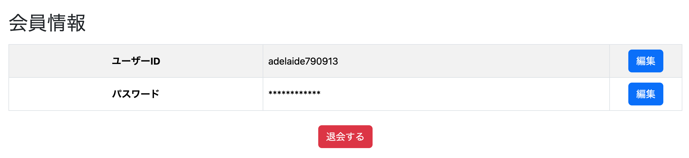

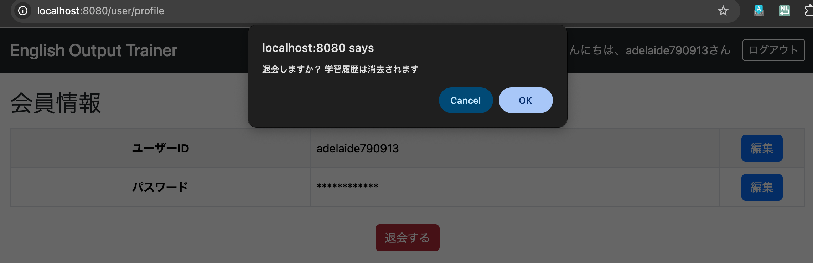

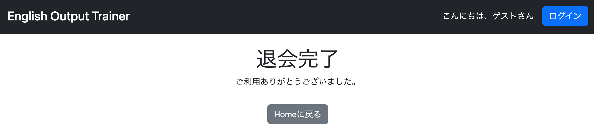

---

# 12. 各画面にナビゲーションボタンを追加する（feat: add navigation buttons across application）

画面遷移を分かりやすくするため、各画面へ戻るボタン・ホームボタンを追加する。

---

## 戻るボタンを追加

対象画面は以下のとおり。

- `/admin/menu`
- `/user/menu`
- `/admin/question/list`
- `/admin/question/add`
- `/admin/user/list`
- `/user/profile`
- `/user/question/list`
- `/user/edit/userId`
- `/user/edit/password`

---

### `/admin/menu.html`

```html
<div class="text-center mt-3">

    <a th:href="@{/user/menu}"
       class="btn btn-secondary">

        userメニューに戻る

    </a>

</div>
```

---

### `/admin/question/list.html`

```html
<div class="text-center mt-3 mb-3">

    <a th:href="@{/admin/menu}"
       class="btn btn-secondary">

        adminメニューに戻る

    </a>

</div>
```

---

### `/admin/question/add.html`

```html
<a th:href="@{/admin/menu}"
   class="btn btn-secondary ms-2">

    adminメニューに戻る

</a>
```

---

### `/admin/user/list.html`

```html
<div class="text-center mt-3 mb-3">

    <a th:href="@{/admin/menu}"
       class="btn btn-secondary">

        adminメニューに戻る

    </a>

</div>
```

---

### `/user/profile.html`

```html
<div class="text-center mt-2 mb-2">

    <a th:href="@{/user/menu}"
       class="btn btn-secondary">

        会員メニューに戻る

    </a>

</div>
```

---

### `/user/question/list.html`

```html
<div class="text-center mt-3 mb-3">

    <a th:href="@{/user/menu}"
       class="btn btn-secondary">

        会員メニューに戻る

    </a>

</div>
```

---

### `/user/edit/userId.html`
### `/user/edit/password.html`

```html
<div class="text-center mt-3">

    <a th:href="@{/user/profile}"
       class="btn btn-secondary">

        戻る

    </a>

</div>
```

---

## Topへ戻るボタンを追加

対象画面は以下のとおり。

- `/login`
- `/study/menu`
- `/review/menu`
- `/signup/signup`

---

### `/user/menu.html`

```html
<div class="text-center mt-3">

    <a th:href="@{/}"
       class="btn btn-secondary">

        Topに戻る

    </a>

</div>
```

---

### `/study/menu.html`

```html
<div class="text-center mt-5 mb-3">

    <a th:href="@{/}"
       class="btn btn-secondary">

        Topに戻る

    </a>

</div>
```

---

### `/review/menu.html`

```html
<div class="text-center mt-3 mb-3">

    <a th:href="@{/}"
       class="btn btn-secondary">

        Topに戻る

    </a>

</div>
```

---

### `/signup/signup.html`

```html
<div class="text-center mt-3 mb-3">

    <a th:href="@{/}"
       class="btn btn-secondary">

        Topに戻る

    </a>

</div>
```

これにより、各画面から適切な画面へ戻れるようになり、操作性が向上した。

# 13. チュートリアルページを追加する（feat: add application tutorial page）

アプリケーションの使い方を説明するチュートリアルページを追加する。

---

## HomeController

以下のメソッドを追加する。

```java
@GetMapping("/tutorial")
public String getTutorial() {
    return "tutorial";
}
```

---

## `/tutorial.html`

チュートリアルページを新規作成する。

内容はアプリケーション全体の使い方を説明する文章で構成されているため、ここでは省略する。

---

## `/home.html`

トップページへチュートリアルへのリンクを追加する。

```html
<a th:href="@{/tutorial}"
   class="btn btn-secondary">

    このアプリケーションについて

</a>
```

---

## commit忘れ対応

ホーム画面へのリンク追加を別コミットで行ったため、以下のコミットを追加した。

```text
feat: add tutorial link to home page
```

---

## 実装後

トップページからチュートリアルページへ遷移できるようになった。

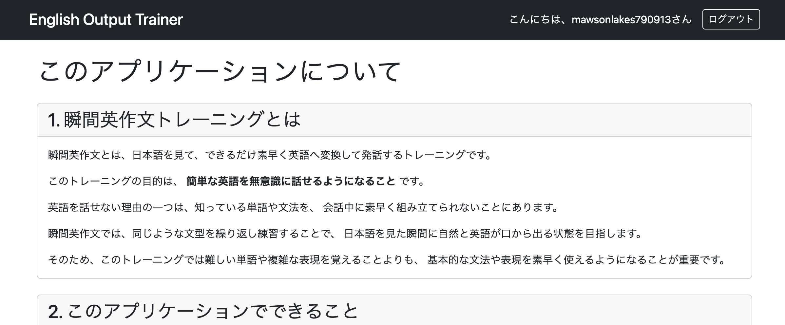

---

# 14. 不要ファイルを削除する（chore: remove unused template files）

現在使用していないテンプレートを削除した。

```text
deleted:
templates/admin/admin.html

deleted:
templates/favorites/list.html

deleted:
templates/signup.html

deleted:
templates/study.html

deleted:
templates/studytemp.html
```

---

# すべてのリファクタリングを終えて

今回の作業では、

- 実装漏れの機能追加
- UI・UX改善
- メッセージ表示の改善
- URL構成の整理
- ナビゲーション追加
- チュートリアル追加
- 不要ファイル削除

など、リリース前の仕上げとなる改善を数多く実施した。

特に印象的だったのは、実装終盤になっても細かな修正が数多く発生したことである。

もし要件定義の段階でもっと画面遷移やUI、運用面まで含めて詳細に設計できていれば、終盤でこれほど多くの修正は発生しなかったと思われる。

今回の開発を通して、**要件定義を十分に詰めてから実装へ入ることの重要性**を改めて実感した。

---

# 次にやること

## 1. 例外処理

- `@ControllerAdvice`による共通例外処理
- 404・500エラーページの作成
- `IllegalArgumentException`や`DuplicateKeyException`の整理
- Controllerごとに分散している例外処理の共通化

---

## 2. ログ

- `log.info()`の見直し
- `warn`・`error`の使い分け
- パスワードなどの個人情報が出力されていないか確認
- ログメッセージの統一

---

## 3. AOP

- ログ出力をAOPへ移行できる箇所があるか検討
- 必要に応じて実行時間計測を追加
- 例外ログの共通化

無理に導入する必要はないため、効果が見込める場合のみ採用する。

---

## 4. セキュリティ

- URL権限の最終確認
- CSRF設定の確認
- 管理画面へ一般ユーザーがアクセスできないことの確認
- 二重送信・不正アクセスの確認
- パスワード入力欄やログアウト処理などの最終確認

---

## 5. 設定の外部化

- `application.properties`の整理
- マジックナンバー・固定文字列の見直し
- 必要に応じて`@Value`や`@ConfigurationProperties`を利用
- 将来変更される可能性がある設定値の外部化