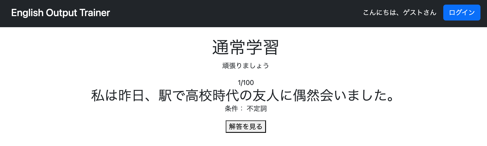

# リファクタリング・改善メモ

## 1. 初回表示時のURLを統一

### 問題点

`study/question`および`review/question`の初回表示だけ

```
/study/question
/review/question
```

となり、2問目以降は

```
/study/question?page=1
/review/question?page=1
```

となっていた。

### 修正

開始画面からのリダイレクト先を`page=0`付きに変更した。

#### StudyController

```java
// return "redirect:/study/question";
return "redirect:/study/question?page=0";
```

#### ReviewController

```java
// return "redirect:/review/question";
return "redirect:/review/question?page=0";
```

### 修正後

初回からURLが

```
/study/question?page=0
/review/question?page=0
```

となり、ページ番号の表現を統一できた。

---

## 2. ログイン時にもログインボタンが表示される

### 問題点

ログイン後も「ログイン」ボタンが表示されたままとなっており、現在の認証状態が分かりにくいUIになっていた。


### 修正（git commit: `fix: show login/logout buttons based on authentication status`）

Spring SecurityのThymeleaf拡張を利用し、認証状態に応じて表示するボタンを切り替えるように修正した。

#### `layout/header.html`

##### Spring Securityの名前空間を追加

```html
<html xmlns:th="http://www.thymeleaf.org"
      xmlns:layout="http://www.ultraq.net.nz/thymeleaf/layout"
      xmlns:sec="http://www.thymeleaf.org/extras/spring-security">
```

##### ログイン・ログアウトボタンの表示を認証状態で切り替え

```html
<!-- ログインしていないときだけ表示 -->
<a sec:authorize="isAnonymous()"
   class="btn btn-primary"
   href="/login">
    ログイン
</a>

<!-- ログインしているときだけ表示 -->
<form sec:authorize="isAuthenticated()"
      method="post"
      th:action="@{/logout}"
      class="m-0">

    <button type="submit"
            class="btn btn-outline-light btn-sm">
        ログアウト
    </button>

</form>
```

### 修正後

認証状態に応じて表示されるボタンが切り替わるようになった。

- **未ログイン時**：ログインボタンのみ表示
- **ログイン中**：ログアウトボタンのみ表示

これにより、現在のログイン状態が分かりやすいUIになった。


---

## 3. Home画面に一時的なメニューを作る

### 問題点

もともとのHome画面には、テスト用に作成した`/study/start`へ遷移するボタンしか配置されていなかった。

しかし現在はこのURLを直接利用することはなくなっており、

- ログイン
- 新規登録
- 通常学習
- 復習
- ユーザーメニュー

などへ遷移する導線も存在しなかった。

そのため、Home画面をトップページとして利用できるよう再構成することにした。

---

### 修正
（git commit: `"feat: redesign home page navigation"`）

`home.html`のコンテンツ部分を全面的に作り直した。

#### 変更前

Home画面には

- 「新規開始」
- 「途中から始める」

のみが表示され、学習開始方法を選択するための画面となっていた。

またJavaScriptによって

- 順番に出題
- ランダムに出題

を表示するだけの構成になっていた。

#### 変更後

Bootstrapを利用し、トップページとして利用しやすいレイアウトへ変更した。

表示するメニューは以下のとおり。

| ボタン | 表示条件 |
|--------|----------|
| 通常学習 | 常に表示 |
| 復習 | ログイン時のみ |
| メニュー | ログイン時のみ |
| ログイン | 未ログイン時のみ |
| 新規登録 | 未ログイン時のみ |

Spring Securityの

```html
sec:authorize="isAuthenticated()"
```

および

```html
sec:authorize="isAnonymous()"
```

を利用することで、ログイン状態に応じて表示するボタンを切り替えた。

---

### 修正後

Home画面から主要な機能へ直接アクセスできるようになった。

また、開発中も各画面へ素早く遷移できるようになり、ページ遷移の確認が容易になった。


---

## 4. ログイン成功後の遷移先をHome画面へ変更

### 問題点

ログイン成功後の遷移先が

```
/menu
```

（ユーザーメニュー）

になっていた。

しかし、Home画面をトップページとして再構成したため、Home画面を起点としたほうが各機能へアクセスしやすくなる。

---

### 修正
（git commit: `"fix: redirect users to saved request after login"`）

`SecurityConfig`の設定を以下のように変更した。

#### 変更前

```java
.defaultSuccessUrl("/menu", true)
```

#### 変更後

```java
.defaultSuccessUrl("/", false)
```

---

### `false`を採用した理由

当初は

```java
.defaultSuccessUrl("/", true)
```

として、ログイン成功後は必ずHome画面へ戻すことを考えていた。

しかし、今後の機能追加を考えると、**ログイン前にアクセスしようとしていたページへ戻るほうが自然**であると判断した。

例えば、

- 復習画面(`/review/menu`)へアクセスしようとしてログインを求められた場合
- 問題画面で「ログインするとお気に入り機能が利用できます」という案内からログインした場合

などでは、ログイン後にHome画面へ戻されるよりも、元の画面へ戻ったほうが操作を継続しやすい。

そのため、

```java
.defaultSuccessUrl("/", false)
```

を採用し、**Saved Request（保存されたリクエスト）が存在する場合はそのページへ戻り、存在しない場合のみHome画面へ遷移する**設定へ変更した。

この設定により、将来的にログイン導線をさまざまな画面へ追加しても、ユーザーは本来行おうとしていた操作をそのまま続行できるようになった。

---

### 修正後

- Home画面からログインした場合はHome画面へ戻る
- ログインが必要な画面から遷移した場合は、その画面へ戻る

という、より自然な画面遷移となった。

---

## 5. お気に入り登録ボタン（ハートマーク）の表示を制御する

### 問題点

非ログイン状態でも、`study/question.html`にお気に入り登録ボタン（ハートマーク）が表示されてしまっていた。

お気に入り機能自体はログインユーザーしか利用できないため、ボタンを表示していてもクリックして利用することはできない。しかし、ユーザーから見ると「何のためのボタンなのか」が分かりづらく、UIとしても不自然である。

なお、`review/question.html`はログインユーザーしかアクセスできない画面であるため、こちらは修正する必要がない。

---

### 修正
（git commit: `"fix: hide favorite button for anonymous users"`）

#### `study/question.html`

##### htmlタグにSpring Securityの名前空間を追加

`sec:authorize`を利用できるように、`html`タグへSpring Securityの名前空間を追加した。

```html
<html xmlns:th="http://www.thymeleaf.org"
      xmlns:layout="http://www.ultraq.net.nz/thymeleaf/layout"
      xmlns:sec="http://www.thymeleaf.org/extras/spring-security"
      layout:decorate="~{layout/layout}">
```

---

##### お気に入り登録ボタンをログインユーザーのみに表示

お気に入り登録ボタン全体を

```html
sec:authorize="isAuthenticated()"
```

で囲むことで、ログインしているユーザーのみ表示されるようにした。

```html
<div sec:authorize="isAuthenticated()">

    <button id="favoriteButton"
            type="button"
            class="btn p-0 border-0 bg-transparent"
            th:data-question-id="${question.questionId}">

        <i id="favoriteIcon"
           th:class="${isFavorite}
                ? 'bi bi-heart-fill fs-2 text-danger'
                : 'bi bi-heart fs-2 text-secondary'">
        </i>

    </button>

</div>
```

---

### 修正後

非ログイン状態で通常学習画面へアクセスすると、お気に入り登録ボタン（ハートマーク）が表示されないことを確認した。

これにより、ログインユーザーだけが利用できる機能を適切に隠すことができ、画面が分かりやすくなった。



---

## 6. Headerのサービス名をクリックするとホーム画面へ戻れるようにする

### 問題点

大きな問題ではないが、多くのWebサイトではヘッダーに表示されているサービス名やロゴをクリックするとホーム画面へ戻れるようになっている。

本アプリではその機能が実装されていなかったため、利便性向上のため追加することにした。

---

### 修正
（git commit: `feat: add home link to header title`）

#### 変更前

```html
<h1 class="h4 m-0">
    English Output Trainer
</h1>
```

#### 変更後

```html
<h1 class="h4 m-0">
    <a th:href="@{/}"
       class="text-white text-decoration-none">
        English Output Trainer
    </a>
</h1>
```

サービス名全体をリンク化し、クリックするとホーム画面（`/`）へ遷移するようにした。

また、

- `text-white`
- `text-decoration-none`

を指定することで、従来と同じ見た目を維持している。

---

### 修正後

サービス名をクリックするとホーム画面へ遷移することを確認した。

これにより、どの画面からでもヘッダーのサービス名をクリックするだけでホーム画面へ戻れるようになり、操作性が向上した。