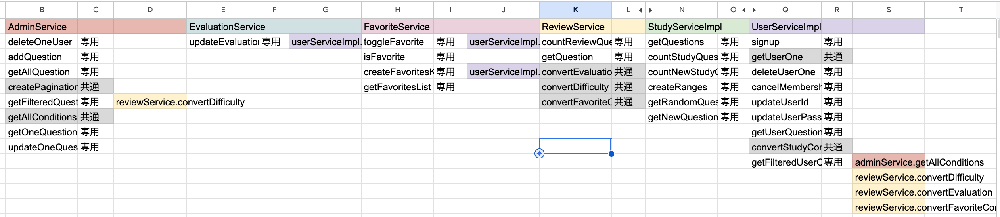
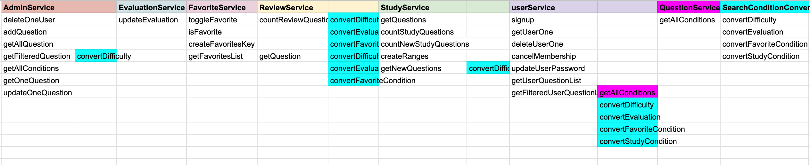

# 0056 リファクタリング（仕上げ） Service編

## はじめに

当初の予定よりもアプリケーションの規模が大きくなり、Serviceクラスの責務や依存関係が複雑になってきた。

機能追加を優先して開発を進めてきたため、

- 同じような処理が複数のServiceに存在する
- Service同士の依存が増えている
- 命名規則に統一性がない
- 一つのServiceが複数の責務を持っている

といった問題が見え始めた。

そこで今回は、新しい機能を追加するのではなく、**Service層全体の設計を見直し、保守性・可読性を向上させること**を目的としてリファクタリングを行う。:contentReference[oaicite:0]{index=0}

---

# リファクタリングの目的

今回の目的は次の4点である。

- 共通処理の整理
- Serviceごとの責務を明確にする
- Service同士の依存関係を減らす
- 将来の機能追加を行いやすい構成へ改善する

アプリケーションの動作は変更せず、内部設計のみを改善する。

---

# 1. リファクタリング前の調査

## まず依存関係を可視化する

今回はServiceクラス全体を整理するため、一つのクラスを修正すると影響範囲が広くなることが予想された。

そこで最初に、

- 各Serviceが持つメソッド
- どのServiceがどのServiceを利用しているか

を一覧にまとめ、依存関係を可視化した。

これは実務でもよく行われる手法であり、大規模なリファクタリングでは非常に重要な作業である。



---

## 共通処理を洗い出す

依存関係を整理すると、複数のServiceで似たような役割を持つメソッドが存在することが分かった。

|メソッド|共通化|配置先|
|--------|------|-------|
|createPagination()|○|PaginationService|
|getAllConditions()|△|QuestionService|
|convertDifficulty()|○|SearchConditionConverter|
|convertEvaluation()|○|SearchConditionConverter|
|convertFavoriteCondition()|○|SearchConditionConverter|
|convertStudyCondition()|○|SearchConditionConverter|
|getUserOne()|×|UserService|

ここから、それぞれ本来どのクラスが持つべき責務なのかを考えていく。

---

# 2. 不要なインタフェースの削除と命名の整理

## StudyService

まず気になったのがStudyServiceである。

```java
StudyService
StudyServiceImpl
```

という構成になっていたが、

- インタフェースは空
- 実装クラスは1つだけ

という状態だった。

インタフェースを用意する理由が存在しないため、

```
StudyServiceImpl implements StudyService
```

から

```
StudyService
```

へ変更した。

同時に不要になったStudyServiceインタフェースを削除した。

### commit

```text
refactor: remove StudyService interface and rename StudyServiceImpl
```

---

## UserService

一方、

```
UserServiceImpl
```

には対応するインタフェースが存在しなかった。

つまり、

```
StudyServiceImpl
```

と

```
UserServiceImpl
```

で命名ルールが統一されていない状態だった。

そこで、

```
UserServiceImpl
```

を

```
UserService
```

へ変更し、命名規則を統一した。

---

## 呼び出し側も修正

クラス名変更に伴い、

- UserMenuController
- SignupController
- AdminController
- FavoritesController
- ReviewController
- UserDetailsServiceImpl
- EvaluationService
- FavoritesService

など、UserServiceやStudyServiceをDIしているクラスもすべて修正した。

### commit

```text
refactor: update service references after service class renaming
```

# 3. 共通処理を責務ごとに分離する

## 目的

依存関係を整理した結果、複数のServiceで利用されている汎用的な処理が見つかった。

これらをそれぞれ本来の責務を持つクラスへ移動し、Serviceごとの役割を明確にする。

---

# 3-1. PaginationServiceの作成

## 背景

`AdminService`には、

```java
createPagination()
```

というページネーション生成処理が存在していた。

しかし、この処理は

- Question
- Review
- User

などとは関係なく、ページネーションを生成するだけの汎用処理である。

つまり、AdminServiceが持つ責務ではない。

---

## 修正

ページネーション生成専用クラスとして

```text
PaginationService
```

を作成し、

`createPagination()`

をそのまま移動した。

### commit

```text
refactor: extract pagination logic into PaginationService
```

---

移行後は不要になった

```java
AdminService.createPagination()
```

を削除した。

### commit

```text
refactor: remove createPagination from AdminService
```

---

## 呼び出し側の修正

### AdminController

```java
private final AdminService adminService;
```

↓

```java
private final PaginationService paginationService;
```

---

### UserMenuController

```java
private final AdminService adminService;
```

↓

```java
private final PaginationService paginationService;
```

### commit

```text
refactor: update pagination service references
```

---

# 3-2. QuestionServiceの作成

## 背景

`AdminService`には

```java
getAllConditions()
```

が存在していた。

内部では

```java
questionRepository.findDistinctConditions()
```

を呼び出しているだけであり、

Questionに属する処理である。

そのため、AdminServiceが持つ責務ではない。

---

## 修正

Questionに関する共通処理をまとめるため、

```text
QuestionService
```

を新しく作成した。

そして、

```java
getAllConditions()
```

をそのまま移行した。

### commit

```text
refactor: extract question condition logic into QuestionService
```

---

移行後、

```java
AdminService.getAllConditions()
```

は不要になったため削除した。

### commit

```text
refactor: remove getAllConditions from AdminService
```

---

## 呼び出し側の修正

### AdminService

変更前

```java
if (conditions == null || conditions.isEmpty()) {
    conditions = getAllConditions();
}
```

変更後

```java
if (conditions == null || conditions.isEmpty()) {
    conditions = questionService.getAllConditions();
}
```

---

### UserService

変更前

```java
if (conditions == null || conditions.isEmpty()) {
    conditions = getAllConditions();
}
```

変更後

```java
if (conditions == null || conditions.isEmpty()) {
    conditions = questionService.getAllConditions();
}
```

---

### AdminController

変更前

```java
model.addAttribute(
        "conditions",
        adminService.getAllConditions());
```

変更後

```java
model.addAttribute(
        "conditions",
        questionService.getAllConditions());
```

---

### UserMenuController

変更前

```java
model.addAttribute(
        "conditions",
        adminService.getAllConditions());
```

変更後

```java
model.addAttribute(
        "conditions",
        questionService.getAllConditions());
```

### commit

```text
refactor: update question service references
```

---

# 3-3. SearchConditionConverterの作成

## 背景

ReviewServiceとUserServiceには、

- convertDifficulty()
- convertEvaluation()
- convertFavoriteCondition()
- convertStudyCondition()

が存在していた。

これらはすべて

**EnumをRepository検索用の値へ変換する**

という共通した責務を持っている。

そのため、それぞれのServiceが持つよりも、一か所へ集約した方が保守しやすいと判断した。

---

## 修正

変換専用クラスとして

```text
SearchConditionConverter
```

を作成した。

そして、

- convertDifficulty()
- convertEvaluation()
- convertFavoriteCondition()
- convertStudyCondition()

をすべてこのクラスへ移動した。

### commit

```text
refactor: move search condition conversion logic to SearchConditionConverter
```

---

## ReviewService・UserServiceから削除

移行後、ReviewService・UserServiceからConvert系メソッドを削除した。

### commit

```text
refactor: remove converter methods from ReviewService and UserService
```

---

## 呼び出し側の修正

### AdminService

変更前

```java
reviewService.convertDifficulty(difficulties);
```

変更後

```java
searchConditionConverter.convertDifficulty(difficulties);
```

---

### ReviewService

変更前

```java
convertEvaluation(...)
convertDifficulty(...)
convertFavoriteCondition(...)
```

変更後

```java
searchConditionConverter.convertEvaluation(...)
searchConditionConverter.convertDifficulty(...)
searchConditionConverter.convertFavoriteCondition(...)
```

---

### StudyService

変更前

```java
reviewService.convertDifficulty(...)
```

変更後

```java
searchConditionConverter.convertDifficulty(...)
```

---

### UserService

変更前

```java
reviewService.convertDifficulty(...)
reviewService.convertEvaluation(...)
convertStudyCondition(...)
reviewService.convertFavoriteCondition(...)
```

変更後

```java
searchConditionConverter.convertDifficulty(...)
searchConditionConverter.convertEvaluation(...)
searchConditionConverter.convertStudyCondition(...)
searchConditionConverter.convertFavoriteCondition(...)
```

### commit

```text
refactor: update search condition converter references
```

---

ここまでで、

- PaginationService
- QuestionService
- SearchConditionConverter

という3つの共通クラスが追加され、Serviceごとの責務が以前より明確になった。

# 4. Serviceクラス内の重複コードを整理する

## 目的

Serviceクラスの責務を整理したあと、各Serviceの内部を確認すると、同じ処理を複数のメソッドで繰り返している箇所が見つかった。

ここでは責務を変えるのではなく、重複コードを削減し、可読性と保守性を向上させることを目的とする。

---

# 4-1. AdminService

## 問題点

`addQuestion()`と`updateOneQuestion()`では、

```java
question.setJapaneseText(form.getJapaneseText());
question.setEnglishText(form.getEnglishText());
question.setAlternativeAnswer(form.getAlternativeAnswer());
question.setDifficulty(form.getDifficulty());
question.setCondition(form.getCondition());
```

というQuestionエンティティへの値のコピー処理が完全に重複していた。

同じ処理が複数箇所に存在すると、

- 修正漏れが発生しやすい
- コード量が増える
- 可読性が下がる

という問題がある。

---

## 修正

QuestionFormからQuestionへの値コピーを行うprivateメソッドを作成した。

```java
private void copyQuestionForm(Question question, QuestionForm form) {

    question.setJapaneseText(form.getJapaneseText());
    question.setEnglishText(form.getEnglishText());
    question.setAlternativeAnswer(form.getAlternativeAnswer());
    question.setDifficulty(form.getDifficulty());
    question.setCondition(form.getCondition());

}
```

---

### addQuestion()

変更前

```java
Question question = new Question();

question.setJapaneseText(...);
question.setEnglishText(...);
・・・
```

変更後

```java
Question question = new Question();

copyQuestionForm(question, form);
```

---

### updateOneQuestion()

変更前

```java
question.setJapaneseText(...);
question.setEnglishText(...);
・・・
```

変更後

```java
copyQuestionForm(question, form);
```

---

### commit

```text
refactor(admin): extract QuestionForm mapping into private method
```

---

# 4-2. EvaluationService

## 検討した内容

EvaluationServiceでは、

```java
StudyHistoryKey
```

を生成する処理が存在する。

一方、

FavoritesServiceには、

```java
FavoritesKey
```

を生成する

```java
createFavoritesKey()
```

が存在するため、

これを共通化できないか検討した。

例えば、

```java
FavoritesKey key = favoritesService.createFavoritesKey(...);
```

のように利用する案である。

---

## 結論

今回は共通化しないことにした。

理由は、

- FavoritesKey
- StudyHistoryKey

はどちらも

```
userId
questionId
```

を持っているものの、

**別のエンティティに対応する異なる型**

だからである。

無理に共通化すると、

FavoritesServiceがEvaluationServiceの事情まで知ることになり、

責務が曖昧になる。

今回の規模では、

多少の重複よりも責務を優先することにした。

---

# 4-3. FavoritesService

## 問題点

FavoritesServiceでは、

```java
toggleFavorite()
```

の中で

```java
Users user = userService.getUserOne(loginUser);
```

を実行しているにもかかわらず、

さらに

```java
createFavoritesKey()
```

の内部でも

```java
Users user = userService.getUserOne(loginUser);
```

を実行していた。

つまり、

同じユーザー情報を二度取得していた。

---

## 修正

Usersエンティティをそのまま渡すように変更した。

変更前

```java
public boolean isFavorite(String loginUser, long questionId)
```

変更後

```java
public boolean isFavorite(Users user, long questionId)
```

---

また、

```java
createFavoritesKey()
```

も

変更前

```java
createFavoritesKey(String loginUser, ...)
```

から

変更後

```java
createFavoritesKey(Users user, ...)
```

へ変更した。

これにより、

Users取得は呼び出し元で一度だけ行えばよくなった。

---

## 呼び出し側

StudyController

ReviewController

も修正し、

```java
Users user = userService.getUserOne(...);
```

を取得してから

```java
favoritesService.isFavorite(user, ...)
```

を呼び出すようにした。

---

### commit

```text
refactor(favorites): pass Users object instead of username
```

---

# 4-4. StudyService

## 不要メソッドの削除

以前使用していた

```java
getRandomQuestion()
```

は、

学習機能の初期実装時に使用していたメソッドであり、

現在は一切利用されていない。

不要なコードを残しておくと、

将来

「まだ使われているメソッドなのでは？」

という誤解を招く原因になる。

そのため、このメソッドを削除した。

---

### commit

```text
refactor: remove unused getRandomQuestion method from StudyService
```

---

ここまでで、

- 重複コードの削除
- privateメソッドへの共通化
- 不要メソッドの削除

を行い、各Serviceの内部実装も整理することができた。

# 5. UserService.getUserOne()の呼び出し元をControllerへ統一する

## 背景

ここまでのリファクタリングにより、

- PaginationService
- QuestionService
- SearchConditionConverter

など、Serviceごとの責務はかなり整理された。

一方で、

```java
UserService.getUserOne()
```

だけは呼び出し元が統一されておらず、

- Controllerから呼ばれる場合
- Serviceから呼ばれる場合

が混在していた。

具体的には、

- EvaluationService
- FavoritesService

が内部で

```java
userService.getUserOne(...)
```

を呼び出していた。

このままでも動作に問題はないが、設計としては一貫性に欠ける状態であった。 

---

# 設計方針の検討

## 考え方① Serviceが必要な情報は自分で取得する

一般的なWebアプリケーションでは、

「そのServiceが必要な情報は、そのService自身が取得する」

という設計もよく採用される。

例えば、

```
Controller
    ↓
EvaluationService
        ↓
UserService
```

という構造である。

### メリット

- Controllerが非常に薄くなる
- 認証方式が変わってもControllerの修正が少ない
- Springを含め、多くのWebアプリケーションで採用されている設計

---

## 考え方② Controllerで必要なデータを揃えてServiceへ渡す

一方、このアプリでは

> Service同士の依存をできるだけ減らす

という方針でリファクタリングを進めてきた。

その流れで考えると、

```
Controller
    ↓
UserService
    ↓
Users取得

Controller
    ↓
EvaluationService
```

という構造の方が自然である。

EvaluationServiceは

「評価を更新する」

という責務だけを持ち、

UserServiceを知らなくて済む。

---

## 今回採用した方針

今回のアプリケーションでは、

Service同士の依存関係をできるだけ減らすことを優先した。

そのため、

**Usersエンティティが既に取得できるのであれば、Controllerで取得してServiceへ渡す**

というルールに統一することにした。 

これにより、

```
Controller
    ↓
UserService

Controller
    ↓
EvaluationService
```

となり、

EvaluationServiceはUserServiceへ依存しなくなる。

同様に、

```
Controller
    ↓
UserService

Controller
    ↓
FavoritesService
```

となり、

FavoritesServiceもUserServiceへ依存しなくなる。

---

# EvaluationServiceの修正

## 修正前

```java
public void updateEvaluation(
        String loginUser,
        Long questionId,
        Evaluation evaluation)
```

Service内部で

```java
Users user = userService.getUserOne(loginUser);
```

を取得していた。

---

## 修正後

```java
public void updateEvaluation(
        Users user,
        Long questionId,
        Evaluation evaluation)
```

UsersエンティティはController側で取得し、

EvaluationServiceは評価更新だけを担当するように変更した。

---

## Controller側の修正

対象

- StudyController.postEvaluation()
- StudyController.toggleEvaluation()
- ReviewController.postEvaluation()

各Controllerで

```java
Users user =
        userService.getUserOne(
                loginUser.getUsername());
```

を取得してから、

```java
evaluationService.updateEvaluation(
        user,
        questionId,
        evaluation);
```

を呼び出すよう修正した。

### commit

```text
refactor: move user lookup from EvaluationService to controllers
```

---

# FavoritesServiceの修正

## 修正前

```java
toggleFavorite(String loginUser, ...)
```

Service内部で

```java
Users user = userService.getUserOne(loginUser);
```

を取得していた。

---

## 修正後

```java
toggleFavorite(Users user, ...)
```

UsersエンティティをControllerから受け取るよう変更した。

---

## FavoritesController

Controllerで

```java
Users user =
        userService.getUserOne(
                loginUser.getUsername());
```

を取得してから、

```java
favoritesService.toggleFavorite(
        user,
        questionId);
```

を呼び出すよう変更した。

### commit

```text
refactor: move user lookup from FavoritesService to controllers
```

---

# 不要なDIの削除

EvaluationService・FavoritesServiceから

```java
private final UserService userService;
```

が不要になったため削除した。

また、今回のリファクタリングで不要になったService全体のDIもあわせて整理した。

### commit

```text
refactor: remove unused service dependencies
```

---

# 修正後

今回の修正により、

```
Controller
    ↓
EvaluationService

Controller
    ↓
FavoritesService
```

という構造になり、

Service同士の依存関係をさらに削減することができた。




結果として、

- 呼び出し関係が追いやすい
- Serviceの責務がより明確になった
- 将来的な変更の影響範囲を小さくできる

という効果が得られた。

---

# 今回のリファクタリングを振り返って(反省点)

今回の議論を通して感じたのは、

「Controllerで取得するか、Serviceで取得するか」

という問題そのものよりも、

**UserServiceが多くの責務を抱えすぎていること**が根本原因ではないか、ということである。 

現在のUserServiceには、

- サインアップ
- ユーザー情報取得
- ユーザー情報更新
- 退会処理
- 管理者用ユーザー管理
- ユーザー問題一覧取得

など、異なるユースケースが混在している。

例えば責務ごとに分割すると、

- UserAccountService
- SignupService
- UserQuestionService
- AdminUserService

のような構成が考えられる。

このように分割すれば、それぞれのServiceはより単一責務に近づき、依存関係もさらに整理されるだろう。

ただし、現時点ではアプリケーションの規模や開発状況を考慮すると、そこまで大きな変更は行わず、まずは今回の範囲で依存関係を整理することを優先した。

---

# 所感

今回のリファクタリングでは機能追加は一切行わず、内部設計の改善に集中した。

共通処理の切り出し、命名規則の統一、重複コードの削除、そしてService同士の依存関係の整理を進めたことで、クラスごとの責務が以前より明確になった。

特に、実装を進める中で「とりあえず動くコード」から一歩進み、「なぜそのクラスがその処理を持つべきなのか」を意識して設計を見直せたことは、大きな収穫だった。

今回整理した構成は、今後Controllerや例外処理などをリファクタリングしていく際の土台にもなると考えている。

---

# 次やること

- Controller層のリファクタリング