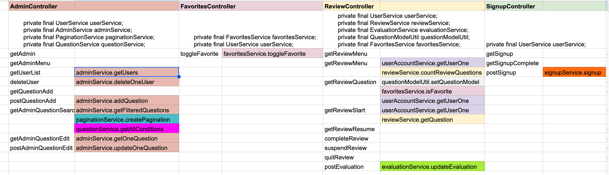
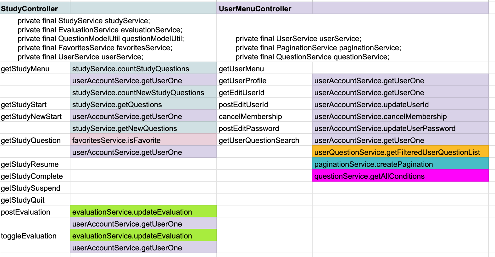
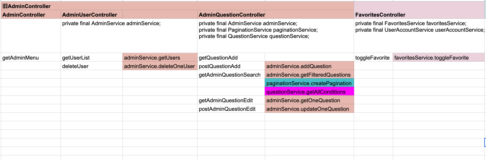
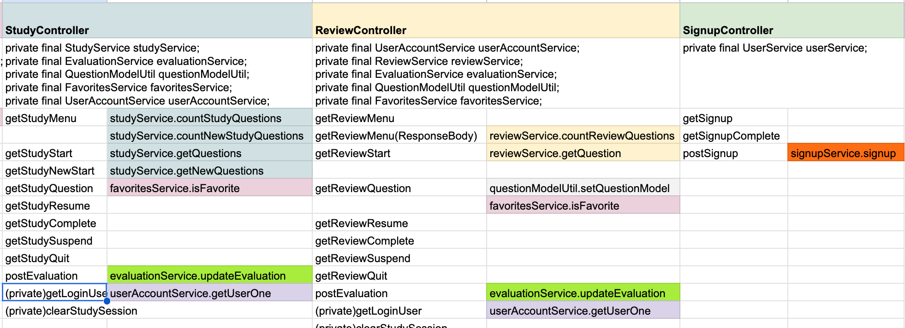
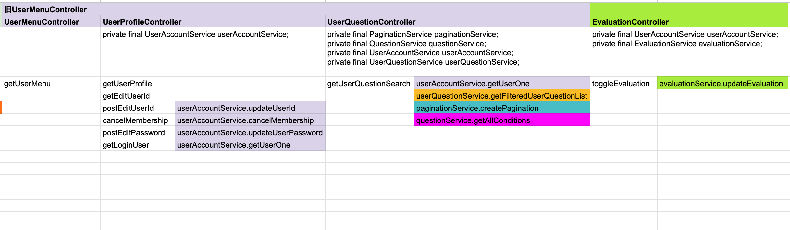

# 0057 リファクタリング（仕上げ） Controller編

今回はController全体の設計を見直す。

Serviceクラスの責務整理が完了したため、最後にControllerの責務や依存関係を整理し、より保守しやすい構成を目指す。

---

# 準備① /favorites/list.htmlに関わる部分は削除する

当初は、各ユーザーがお気に入り登録した問題を一覧表示するために、

```
/favorites/list
```

を実装していた。

しかし、問題一覧・検索画面の実装により、

```
/user/question/search
```

から、

- お気に入りのみ
- お気に入り以外
- 全問題

を検索条件によって切り替えられるようになった。

例えば、

```
http://localhost:8080/user/question/search
    ?studyCondition=ALL
    &favoriteCondition=FAVORITED
```

とするだけで、お気に入り登録した問題だけを表示できる。

このように、お気に入り一覧専用画面が担っていた役割は問題一覧・検索画面で代替できるようになったため、

```
/favorites/list
```

の存在意義はほとんど無くなった。

そこで今回は、

- FavoritesController
- FavoritesService
- FavoritesRepository

のお気に入り一覧取得処理を削除することにした。

なお、

```
/favorites/list.html
```

については、念のため削除せず残しておく。

## 削除

**commit**

```
refactor: remove unused favorites list retrieval methods
```

以下のメソッドを削除する。

### FavoritesController

- getFavoritesList()

### FavoritesService

- getFavoritesList()

### FavoritesRepository

- getFavoritesList()

---

## 修正

**commit**

```
refactor: replace favorites menu with question list search
```

メニュー画面から

```
/favorites/list
```

へのリンクを削除し、代わりに

```
/user/question/search
```

へのリンクを追加する。

### 修正前

```html
<a th:href="@{/favorites/list}"
   class="list-group-item list-group-item-action">

    <i class="bi bi-star-fill me-2"></i>
    お気に入り登録一覧

</a>
```

### 修正後

```html
<a th:href="@{/user/question/search}"
   class="list-group-item list-group-item-action">

    <i class="bi bi-list-ul me-2"></i>
    問題一覧・検索

</a>
```

これにより、お気に入り専用画面ではなく、問題一覧画面を検索条件によって切り替える設計へ統一した。

---

# 準備② 各ControllerとServiceクラスとの関係の可視化

Serviceクラスのリファクタリング時と同様に、各Controllerが利用しているServiceおよび呼び出しているメソッドを一覧として整理した。




この一覧を作成することで、Controller全体の責務や依存関係を俯瞰できるようになり、責務の偏りや重複処理、リファクタリング候補を把握しやすくなった。

## 分かったこと

### Controller同士が依存していない

Controllerが他のControllerを直接呼び出す設計にはなっておらず、MVCとして理想的な構造になっている。

Controller同士の責務が明確に分離されているため、一つのControllerを修正しても他のControllerへの影響が少ない設計になっていた。

---

### StudyControllerとReviewControllerの構造が非常によく似ている

どちらも、

```
メニュー
    ↓
開始
    ↓
問題表示
    ↓
評価更新
```

という共通した流れで構成されている。

設計思想が統一されているため、今後も同じ考え方で機能追加や保守を行いやすい構成になっていることが分かった。

---

### Serviceの責務分離が効果を発揮している

Service編でPaginationServiceやQuestionServiceを切り出した効果が、この一覧を見るとよく分かる。

Controllerが一つの巨大なServiceへ依存するのではなく、目的ごとに分割されたServiceを利用する構成になっており、依存関係が以前よりも分かりやすく整理されていた。

---

# リファクタリングできそうな点

## AdminControllerには重複処理が残っている

一覧を見ると、

- getAdminQuestionList()
- getAdminQuestionSearch()

では、

- ページネーション生成
- 条件一覧取得

などの共通処理が存在している。

このあたりは共通化、または設計を見直す余地がある。

---

## StudyControllerとReviewControllerの中で共通化できそう

例えば、

```java
Users user = userAccountService.getUserOne(loginUser.getUsername());
```

はStudyControllerでも複数回登場している。

そのため、

```java
private Users getLoginUser(UserDetails loginUser) {
    return userAccountService.getUserOne(loginUser.getUsername());
}
```

のようなprivateメソッドを各Controllerに作成することで、重複コードを減らせそうである。

ただし、これはStudyControllerとReviewController自体を共通化するという意味ではない。

両Controllerは、

- 問題をセッションへ保存する
- セッションから取得する
- 中断
- 中止
- 完了

などの処理は非常によく似ている。

一方で、

- セッション名
- 問題取得方法
- 出題条件

などは異なっている。

これらを無理に共通化すると、

- 抽象クラス
- ジェネリクス
- Strategyパターン

などが必要となり、かえって構造が複雑になる可能性がある。

そのため、Controller同士を共通化するのではなく、**各Controller内部で共通化できる処理のみを整理する方針**とした。

---

## UserMenuControllerは現時点で最も責務が集中している

このControllerだけで、

- プロフィール表示
- ユーザーID変更
- パスワード変更
- 退会
- 問題検索

を担当している。

今後さらに整理するのであれば、

- UserProfileController
- UserQuestionController

のように責務ごとへ分割する候補になりそうである。

---

## AdminControllerも同じく責務が集中している

AdminControllerについても、

- 管理メニュー
- ユーザー管理
- 問題管理

を一つのControllerが担当している。

こちらも責務ごとに分割する余地がある。

---

## StudyControllerのtoggleEvaluationメソッドはStudyとは責務が異なる

`/evaluation/toggle`は通常学習の画面遷移ではなく、問題一覧画面からAjaxで評価を変更するためのAPIである。

そのため、StudyControllerに配置するよりも、EvaluationControllerなど専用のControllerへ移動した方が責務を明確に分離できそうである。

# リファクタリング

## 1. AdminControllerの重複を修正

現在の管理画面では、

- `GET /admin/question/list`
  - 全件表示
- `GET /admin/question/search`
  - 条件付き検索

という2つのURLが存在している。

しかし、どちらも最終的には

```
admin/question/list.html
```

を表示しており、違いは取得するデータだけである。

ログインユーザー向けの問題一覧も、以前は

```
/user/question/list
/user/question/search
```

の2つのURLが存在していたが、最終的に

```
/user/question/search
```

へ統一した。

これと同じ考え方で、管理画面についても検索画面へ一本化することにした。

---

### AdminController

#### getAdminQuestionListを削除

問題一覧専用のエンドポイントを廃止し、

```
/admin/question/search
```

へ統一する。

---

### AdminService

検索画面だけで全件表示・条件検索の両方に対応できるよう修正する。

従来は条件のみを補完していた。

```java
if (conditions == null || conditions.isEmpty()) {
    conditions = questionService.getAllConditions();
}
```

しかし、検索画面を初期表示として利用するためには、

- 難易度
- 条件
- キーワード

すべてについて未入力時の初期値を補完する必要がある。

そこで以下のように修正した。

```java
if (difficulties == null || difficulties.isEmpty()) {
    difficulties = Arrays.asList(Difficulty.values());
}

if (conditions == null || conditions.isEmpty()) {
    conditions = questionService.getAllConditions();
}

if (keyword == null) {
    keyword = "";
}
```

これにより、

- 初回アクセス
- 全件表示
- 条件検索

のすべてを同じServiceメソッドで処理できるようになった。

#### 追記 不要なメソッドを削除

一本化によりAdminServiceクラスのメソッドgetAllQuestionsは不要になったので削除する

```
refactor: remove unused getAllQuestions method from AdminService
```

---

### admin/menu.html

問題一覧へのリンクを修正する。

#### 修正前

```html
<a th:href="@{/admin/question/list}"
   class="list-group-item list-group-item-action">

    <i class="bi bi-card-list me-2"></i>
    問題一覧

</a>
```

#### 修正後

```html
<a th:href="@{/admin/question/search}"
   class="list-group-item list-group-item-action">

    <i class="bi bi-card-list me-2"></i>
    問題一覧

</a>
```

---

### admin/question/list.html

ページネーションを修正する。

従来はページ番号だけを引き継いでいたため、

検索後にページを移動すると検索条件が失われてしまっていた。

そのため、

- 難易度
- 条件
- キーワード

も一緒に引き継ぐよう修正する。

例えば、

#### 修正前

```html
th:href="@{/admin/question/list(page=${page.number-1},size=${page.size})}"
```

となっていたものを、

#### 修正後

```html
th:href="@{/admin/question/search(
    page=${page.number-1},
    size=${page.size},
    difficulties=${selectedDifficulties},
    conditions=${selectedConditions},
    keyword=${keyword}
)}"
```

へ変更する。

同様に、

- 前へ
- 1ページ目
- 中央ページ
- 最終ページ
- 次へ

すべてのページネーションリンクについて、現在の検索条件を保持するよう修正する。

これにより、ページ移動後も検索条件が維持されるようになった。

---

## ついでに問題発見

管理画面で条件を未選択にすると、本来は全問題が表示されるはずである。

しかし実際には、

**Conditionが設定されている問題だけ**が表示されていた。

【ここに画像を挿入】

---

## 原因

従来のSQLでは、

```sql
AND q.condition IN (:conditions)
```

という条件で検索していた。

一方、

`question`テーブルでは`condition`はNULLを許可している。

SQLでは、

```
NULL IN (...)
```

は成立しないため、

`condition`がNULLの問題は検索対象から除外されてしまう。

その結果、

条件を未選択にしても、

実際には「Conditionが設定されている問題」しか取得できていなかった。

これは本来意図していた仕様ではない。

---

## 修正

### QuestionRepository

検索条件を補完する方式をやめ、

**条件で絞り込むかどうか**を表す

```java
includeAllConditions
```

を導入した。

Repositoryは以下のように修正する。

（ここにRepositoryコードを掲載）

```java
boolean includeAllConditions
```

は、

「Conditionによる絞り込みを行うかどうか」

を表すフラグである。

#### true

条件は未選択とみなし、

Conditionによる絞り込みを行わない。

そのため、

ConditionがNULLの問題も含めて全問題を検索対象とする。

#### false

ユーザーがConditionを選択しているため、

指定されたConditionのみを検索対象とする。

これにより、

- 条件未選択時は全問題取得
- 条件選択時のみCondition検索

という、本来意図していた仕様を実現できるようになった。

---

### AdminService

従来は、

```java
condition = questionService.getAllConditions();
```

のように条件一覧を補完していた。

しかし、この方法ではNULLのConditionを持つ問題は取得できない。

そこで、

```java
boolean includeAllConditions =
        condition == null || condition.isBlank();
```

という判定へ変更した。

これにより、

- true
    - Conditionによる絞り込みを行わない
- false
    - Conditionで絞り込む

という仕様になった。

キーワードについては従来どおり、

```java
if (keyword == null) {
    keyword = "";
}
```

として空文字へ変換する。

最後に、

Repositoryへ

- difficulty
- condition
- includeAllConditions
- keyword

を渡すよう修正した。

これにより、

Condition未設定の問題も検索対象に含められるようになった。

---

### AdminController

検索条件が

```
List<String> conditions
```

から

```
String condition
```

へ変更されたため、

Controllerも合わせて修正する。

```java
@RequestParam(required = false)
String condition
```

Controllerでは検索条件の解釈は行わず、

受け取った値をそのままServiceへ渡すだけとした。

検索条件の判定や検索ロジックは、従来どおりServiceへ委譲する設計とする。

---

### admin/question/list.html

条件が複数選択から単一選択へ変更されたため、

選択状態の判定も修正する。

#### 修正前

```html
th:selected="${selectedConditions != null
    and selectedConditions.contains(condition)}"
```

#### 修正後

```html
th:selected="${condition == selectedConditions}"
```

これにより、

- 「すべて」が選択されている場合
- 特定のConditionが選択されている場合

のどちらでも正しく選択状態が維持されるようになった。

---

## 修正後

```
/admin/question/search
```

へアクセスすると、

ConditionがNULLの問題も含め、

すべての問題が表示されることを確認できた。

【ここに画像を挿入】

# 2. StudyControllerの整理

StudyControllerを確認すると、同じ処理が複数のメソッドで繰り返し記述されていた。

例えば、

```java
Users user = userAccountService.getUserOne(loginUser.getUsername());
```

というログインユーザー取得処理である。

Controller内だけでも複数回登場しており、今後修正が必要になった場合はすべて修正しなければならない。

そこで、この処理をprivateメソッドとして切り出すことにした。

---

## StudyController

### ログインユーザー取得処理を共通化

**commit**

```
refactor: extract login user helper in StudyController
```

以下のprivateメソッドを追加する。

```java
private Users getLoginUser(UserDetails loginUser) {
    return userAccountService.getUserOne(loginUser.getUsername());
}
```

各メソッドでは、

```java
Users user = userAccountService.getUserOne(loginUser.getUsername());
```

としていた箇所を、

```java
Users user = getLoginUser(loginUser);
```

へ置き換える。

これにより、

- 重複コードを削減できる
- ログインユーザー取得処理が一か所にまとまる
- 将来取得方法を変更しても修正箇所が一か所で済む

ようになった。

なお、この共通化はStudyController内部のみで行っており、他Controllerとの共通化は行わない。

---

# 3. ReviewControllerの整理

ReviewControllerについても同様の問題があった。

ログインユーザー取得処理が複数箇所に存在していたため、StudyControllerと同じ考え方で共通化する。

---

## ReviewController

### ログインユーザー取得処理を共通化

**commit**

```
refactor: extract login user helper in ReviewController
```

以下のprivateメソッドを追加する。

```java
private Users getLoginUser(UserDetails loginUser) {
    return userAccountService.getUserOne(loginUser.getUsername());
}
```

各メソッドでは、

```java
Users user = userAccountService.getUserOne(loginUser.getUsername());
```

としていた箇所を、

```java
Users user = getLoginUser(loginUser);
```

へ置き換える。

これにより、StudyControllerと同様に重複コードを削減できた。

---

# 4. UserMenuControllerの責務を分割する

Controller一覧を確認すると、UserMenuControllerは担当する機能が最も多かった。

具体的には、

- プロフィール表示
- ユーザーID変更
- パスワード変更
- 退会
- 問題一覧・検索

を一つのControllerで担当している。

機能として関連性はあるものの、責務としては大きく

- ユーザー情報管理
- 問題一覧・検索

の2つに分けられる。

そこで、問題一覧・検索に関する処理を別Controllerへ切り出すことにした。

---

## UserQuestionControllerを新規作成

**commit**

```
refactor: split question search into UserQuestionController
```

以下の処理をUserMenuControllerから移動する。

- 問題一覧表示
- 問題検索

これにより、

### UserMenuController

- プロフィール表示
- ユーザーID変更
- パスワード変更
- 退会

のみを担当するControllerとなる。

### UserQuestionController

- 問題一覧表示
- 問題検索

のみを担当するControllerとなる。

Controller名と責務が一致し、役割が分かりやすくなった。

---

# 5. AdminControllerの責務を分割する

AdminControllerについても同様に、一つのControllerが多くの役割を担当していた。

具体的には、

- 管理メニュー
- ユーザー管理
- 問題管理

を一つのControllerで担当している。

そこで、問題管理を別Controllerへ切り出す。

---

## AdminQuestionControllerを新規作成

**commit**

```
refactor: split question management into AdminQuestionController
```

以下の処理を移動する。

- 問題一覧
- 問題検索
- 問題登録
- 問題編集

これにより、

### AdminController

- 管理メニュー
- ユーザー管理

のみを担当する。

### AdminQuestionController

- 問題一覧
- 問題検索
- 問題登録
- 問題編集

のみを担当する。

責務が明確になり、Controller名から担当機能が分かる構成となった。

# 6. EvaluationControllerを新規作成する

Controller一覧を確認したところ、

```
/evaluation/toggle
```

だけがStudyControllerに配置されていた。

しかし、このAPIは通常学習の画面遷移とは関係がなく、問題一覧画面からAjaxで評価を変更するためのAPIである。

つまり、

- StudyController
- ReviewController

のどちらにも属さない機能である。

責務を考えると、「評価を更新するController」として独立させた方が自然である。

そこで、EvaluationControllerを新規作成し、評価更新APIを移動することにした。

---

## EvaluationControllerを作成

**commit**

```
refactor: move evaluation toggle to EvaluationController
```

StudyControllerから

```java
@PostMapping("/evaluation/toggle")
```

をEvaluationControllerへ移動する。

Controllerは、

- リクエストを受け取る
- EvaluationServiceへ処理を委譲する
- レスポンスを返す

という役割だけを担当する。

評価更新そのもののロジックは、従来どおりEvaluationServiceに委譲する。

これにより、

### StudyController

- 通常学習

### ReviewController

- 復習

### EvaluationController

- 評価更新API

というように、それぞれの責務を明確に分離できた。

---

# リファクタリング後の確認

Controller全体の依存関係を再度確認した。





## 確認できたこと

### Controllerの責務がより明確になった

今回のリファクタリングにより、

- 問題一覧・検索
- 問題管理
- 評価更新

といった独立性の高い機能を、それぞれ専用のControllerへ分割できた。

その結果、各Controllerが担当する役割をController名から判断しやすくなった。

---

### Controller内部の重複コードを削減できた

StudyControllerとReviewControllerでは、ログインユーザー取得処理をprivateメソッドとして共通化した。

共通化した範囲は各Controller内部に限定しているため、責務を崩すことなく重複コードだけを削減できた。

---

### Serviceとの依存関係も整理された

Service編で責務分離を行ったことに加え、Controller側の責務も整理したことで、ControllerからServiceへの依存関係が以前より把握しやすくなった。

各Controllerは必要なServiceだけを利用する構成となり、責務の境界もより明確になった。

---

# 今回のリファクタリングを終えて

今回のControllerリファクタリングでは、動作を変更することなく設計の改善を目的として作業を進めた。

具体的には、

- 不要になった機能の削除
- Controller間の責務整理
- Controller内部の重複コード削減
- 責務ごとのController分割

を行った。

Controllerはアプリケーションの入口となるクラスであるため、責務が曖昧になると保守性が大きく低下する。

今回の整理により、各Controllerの役割が明確になり、今後の機能追加や保守を行いやすい構成へ改善できた。

---

# 次にやること

StudyとReviewでは、中断および再開機能に必要なController・Serviceまでは実装済みである。

しかし、現時点ではフロント側からそれらを利用する手段がなく、ユーザーが中断・再開機能を利用できない状態となっている。

次回は、

- 学習中断ボタンの追加
- 再開ボタンの追加
- 中断した学習データの読み込み

を実装し、中断・再開機能をフロント側まで完成させる。