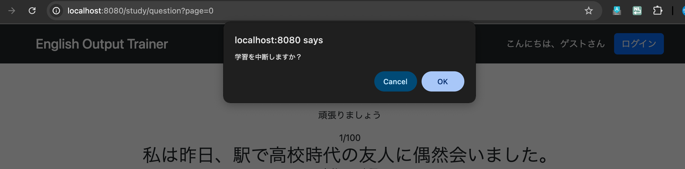
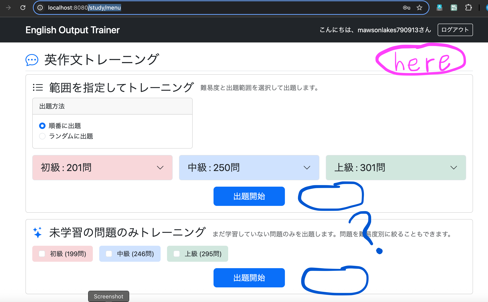
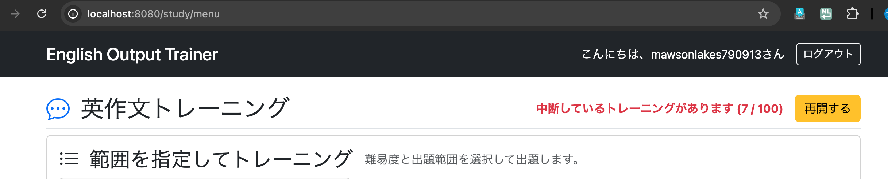
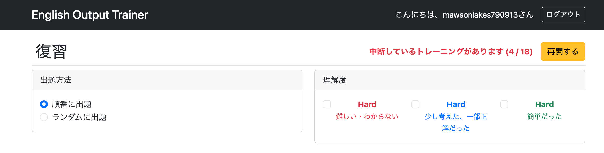
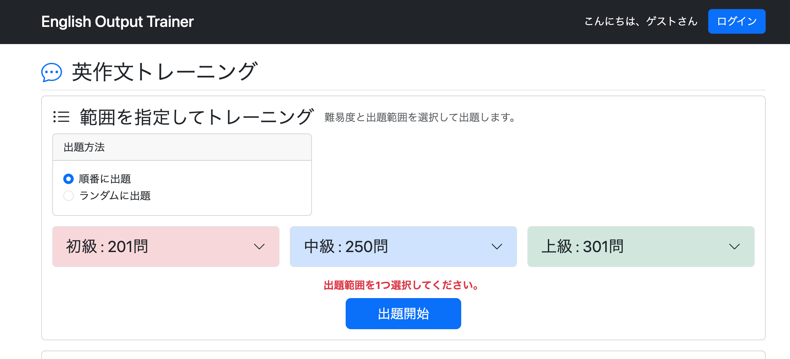

# 0058 StudyとReviewにおける中断および再開機能の実装

StudyおよびReviewでは、中断・再開機能に必要なController・Serviceまでは実装済みである。

しかし、現時点ではフロント側からそれらを利用する手段がなく、ユーザーは中断したトレーニングを再開できない状態となっている。

そこで今回は、

- 学習中断ボタン
- 再開ボタン
- 中断した学習データの読み込み

をフロント側まで実装し、中断・再開機能を完成させる。

---

# 現状確認

Study・Reviewともに、

```
/study/question?page=XXX
/review/question?page=XXX
```

でトレーニング中に「中断する」ボタンを押すと、

- 問題セット
- 現在のページ番号

をセッションへ保存し、後から途中のページから再開できるようになっている。



中断ボタンを押すと確認ダイアログが表示され、「OK」を押すことでセッションへ問題セットとページ情報が保存される。

しかし、

- `/study/menu`
- `/review/menu`
- ホーム画面

には再開ボタンが存在しないため、ユーザーは新しいトレーニングを開始するしかない。

新しいトレーニングを開始すると、既存のセッション情報は破棄され、新しい問題セットへ置き換わってしまうため、中断したトレーニングを再開できない。

---

## 実装済みの機能

バックエンドでは、すでに以下の機能は完成している。

- 問題セットとページ情報をセッションへ保存してトレーニングを中断する機能
- 保存した問題セットとページ情報から途中再開する機能
- セッション内の問題セットを破棄しトレーニングを終了する機能
- 問題ページからこれらを実行するボタン

実際に、

```
/study/resume
/review/resume
```

へ直接アクセスすると途中から再開できることも確認済みであり、バックエンドの実装が正しいことは証明済みである。

---

## 未実装の機能

未実装なのは、

- `/study/menu`
- `/review/menu`

から

- 再開する
- 破棄して新規開始する

というUIのみである。

したがって今回は、各メニュー画面から中断したトレーニングを再開できるUIを実装する。

---

# UI設計

## プラン1

各メニュー画面へ「再開する」ボタンを追加する。

中断データが存在する場合は、

```
中断しているトレーニングがあります
23 / 100

[再開する]
```

のように表示し、

```
/study/resume
/review/resume
```

へ遷移できるようにする。

中断データが存在しない場合は、再開ボタンを無効化する。

---

## プラン2

メニュー画面を開いた瞬間に、

```
中断しているトレーニングがあります
23 / 100

[再開]
```

というモーダルまたはアラートを表示する。

中断データが存在しない場合は表示しない。

---

# プラン1を採用

今回は**プラン1**を採用する。

理由は、

- 実装がシンプル
- JavaScriptが不要
- ユーザーの操作を妨げない
- Bootstrapらしい自然なUIになる

ためである。

一方、プラン2ではメニューを開くたびにモーダルが表示されるため、

「最初から学習したい」

という場合でも毎回閉じる操作が必要になってしまう。

---

# ボタン配置の検討

当初は通常学習カード内へ再開ボタンを追加する案を検討した。

しかし、

- 通常学習
- 未学習トレーニング

の2つのカードが存在するため、

「どちらを再開するボタンなのか」

が分かりにくくなることが判明した。



そこで、

ヘッダー右上へ配置することにした。

この位置であれば、

- レイアウトが崩れない
- 通常学習・未学習トレーニングどちらにも属さない共通機能として表現できる
- 画面全体の状態を示すUIとして自然

というメリットがある。

---

# 実装（Study）

## バックエンド

### StudyController.getStudyMenu

**commit**

```
feat: add resume state to study menu controller
```

### 実装

```java
@GetMapping("/study/menu")
public String getStudyMenu(@AuthenticationPrincipal UserDetails loginUser,
                           HttpSession session,
                           Model model) {

    // 通常問題数を取得
    StudyMenuDto menu = studyService.countStudyQuestions();
    model.addAttribute("studyMenu", menu);

    // 未学習問題数を取得
    if (loginUser != null) {
        Users user = getLoginUser(loginUser);
        NewStudyCountDto count = studyService.countNewStudyQuestions(user.getId());
        model.addAttribute("newQuestioncount", count);
    }

    // セッションから情報を取得
    List<Question> questions =
            (List<Question>) session.getAttribute("studyQuestions");

    Integer currentPage =
            (Integer) session.getAttribute("studyCurrentPage");

    // 中断データが存在するか判定
    boolean canResume = questions != null && currentPage != null;

    model.addAttribute("canResume", canResume);

    if (canResume) {
        model.addAttribute("currentPage", currentPage);
        model.addAttribute("totalCount", questions.size());
    }

    return "study/menu";
}
```

### 解説

まずセッションから

- 問題セット
- 現在ページ

を取得する。

その後、

```java
questions != null && currentPage != null
```

で中断データが存在するか判定し、

- `canResume`
- `currentPage`
- `totalCount`

をViewへ渡す。

---

## フロント側

### ボタン配置

ヘッダーをFlexレイアウトへ変更する。

```html
<div class="header border-bottom pb-2 mb-2 d-flex justify-content-between align-items-center">

    <h1 class="h2 mb-0">
        <i class="bi bi-chat-dots me-2 text-primary"></i>
        英作文トレーニング
    </h1>

    <div th:if="${canResume}">
        <!-- 中断情報 -->
    </div>

</div>
```

---

### study/menu.html

**commit**

```
feat: add resume section to study menu
```

### 実装

```html
<div class="header border-bottom pb-2 mb-2 d-flex justify-content-between align-items-center">

    <h1 class="h2 mb-0">
        <i class="bi bi-chat-dots me-2 text-primary"></i>
        英作文トレーニング
    </h1>

    <div th:if="${canResume}"
         class="d-flex align-items-center gap-3">

        <span class="text-danger fw-bold">
            中断しているトレーニングがあります
            (<span th:text="${currentPage + 1}"></span>
            /
            <span th:text="${totalCount}"></span>)
        </span>

        <a th:href="@{/study/resume}"
           class="btn btn-warning">
            再開する
        </a>

    </div>

</div>
```

`pb-2`を追加した理由は、再開ボタンとヘッダー下線が近接しすぎていたためである。

---

## 実装後

セッションに中断データが存在する場合、

```
/study/menu
```

へアクセスすると、

- 中断情報
- 再開ボタン

が表示され、途中からトレーニングを再開できるようになった。



---

# 実装（Review）

## バックエンド

### ReviewController.getReviewMenu

**commit**

```
feat: add resume state to review menu controller
```

### 実装

```java
@GetMapping("/review/menu")
public String getReviewMenu(HttpSession session,
                            Model model) {

    List<Question> questions =
            (List<Question>) session.getAttribute("reviewQuestions");

    Integer currentPage =
            (Integer) session.getAttribute("reviewCurrentPage");

    boolean canResume = questions != null && currentPage != null;

    model.addAttribute("canResume", canResume);

    if (canResume) {
        model.addAttribute("currentPage", currentPage);
        model.addAttribute("totalCount", questions.size());
    }

    return "review/menu";
}
```

---

## フロント側

### review/menu.html

**commit**

```
feat: add resume section to review menu
```

### 実装

```html
<div class="header border-bottom pb-2 mb-2 d-flex justify-content-between align-items-center">

    <h1 class="h2 mb-0">
        <i class="bi bi-arrow-repeat me-2 text-primary"></i>
        復習
    </h1>

    <div th:if="${canResume}"
         class="d-flex align-items-center gap-3">

        <span class="text-danger fw-bold">
            中断しているトレーニングがあります
            (<span th:text="${currentPage + 1}"></span>
            /
            <span th:text="${totalCount}"></span>)
        </span>

        <a th:href="@{/review/resume}"
           class="btn btn-warning">
            再開する
        </a>

    </div>

</div>
```

---

## 実装後

セッションに中断データが存在する場合、

```
/review/menu
```

へアクセスすると、

途中から復習トレーニングを再開できるようになった。



---

# ついでに修正

**commit**

```
fix: redirect to study menu when no range is selected
```

通常学習で出題範囲を選択せずに「出題開始」を押すと、

```
500 Internal Server Error
```

になってしまっていたため修正した。

---

## StudyController.getStudyStart

### 修正前

```java
if (selectedCount != 1) {
    throw new IllegalArgumentException("範囲は1つだけ選択してください");
}
```

### 修正後

```java
if (selectedCount != 1) {
    redirectAttributes.addFlashAttribute(
            "errorMessage",
            "出題範囲を1つ選択してください。");
    return "redirect:/study/menu";
}
```

---

## 修正内容

修正前は、

```
IllegalArgumentException
```

を送出していたため、500エラー画面が表示されていた。

修正後は、

- メニュー画面へリダイレクト
- エラーメッセージを表示

するよう変更した。

ユーザーの入力ミスは例外ではなく、元の画面へ戻してメッセージを表示する方がWebアプリケーションでは一般的である。

---

## RedirectAttributes.addFlashAttributeとは

`RedirectAttributes`は、リダイレクト先へ一時的なデータを渡すための仕組みである。

例えば、

```java
redirectAttributes.addFlashAttribute(
    "errorMessage",
    "出題範囲を1つ選択してください。");
```

とすると、

```java
return "redirect:/study/menu";
```

で遷移した先では、

```html
<p th:if="${errorMessage}"
   class="text-danger fw-bold mb-2 text-center"
   th:text="${errorMessage}">
</p>
```

のように表示できる。

Flash Attributeはリダイレクト直後の1回だけ有効であり、その後は自動的に破棄される。

そのため、

- 入力エラー
- 登録完了
- 更新完了
- 削除完了

など、一度だけ表示したいメッセージによく利用される。

---

## 実装後

出題範囲を選択せずに通常学習を開始した場合でも、

```
/study/menu
```

へリダイレクトされ、

```
出題範囲を1つ選択してください。
```

というエラーメッセージが表示されるようになった。

## /study/menu.html

リダイレクト後に表示するエラーメッセージを追加する。

```html
<!-- エラーメッセージ -->
<p th:if="${errorMessage}"
   class="text-danger fw-bold mb-2 text-center"
   th:text="${errorMessage}">
</p>
```

`RedirectAttributes.addFlashAttribute()`によって渡された`errorMessage`が存在する場合のみ表示される。

Bootstrapの`text-danger`を利用することで、枠付きのアラートではなくシンプルな赤文字として表示している。

---

## 実装後

通常学習で出題範囲を選択せずに「出題開始」を押した場合、

```
/study/menu
```

へリダイレクトされ、

```
出題範囲を1つ選択してください。
```

というエラーメッセージが表示されるようになった。



500 Internal Server Errorではなく元の画面へ戻るため、ユーザーはそのまま出題範囲を選択し直して再度トレーニングを開始できるようになった。

---

# 次にやること

これまでControllerやServiceを中心にリファクタリングを行ってきたため、今後はそれ以外のバックエンドについても見直していく。

対象となるのは、

- Repository
- Entity
- DTO
- Form
- Utilityクラス

などである。

重複コードの削除や責務の見直し、命名の統一などを行い、保守性・可読性の向上を目指す。