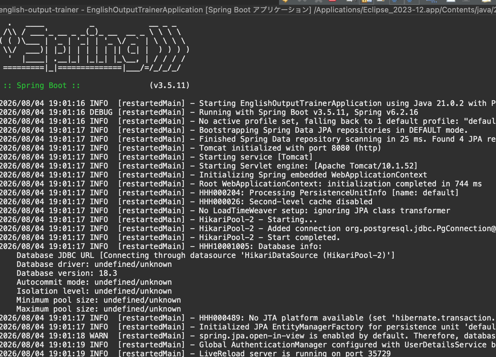
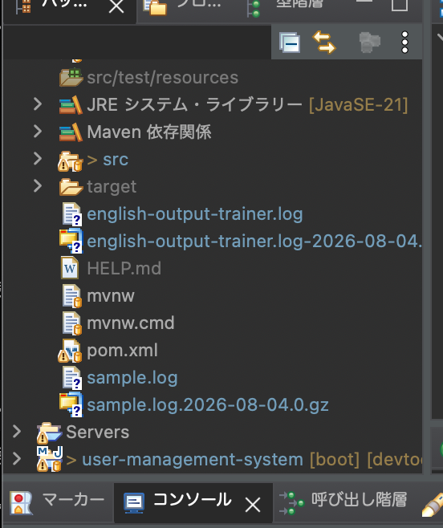

# 062 ログ

アプリケーションの稼働状況を把握し、万が一の障害時に原因を特定するために、ログは欠かせない存在である。

実はログについては、アプリケーションの規模がまだ小さい頃に一部実装しており、

```java
log.info("ユーザー登録開始");
```

のようなログ出力が各メソッドに点在している。

しかし、これは

> 「INFOレベルのログを出力する」

という指示に過ぎない。

実際にそのログを

- コンソールへ出力する
- ログファイルへ保存する
- 両方へ出力する
- ログレベルによって出力を制御する

といった設定は別の仕組みで管理されている。

この仕組みを提供しているのが、Javaで最も広く利用されているログ出力ライブラリの一つである**Logback**である。

Logbackは、

- `log.debug()`
- `log.info()`
- `log.warn()`
- `log.error()`

などで出力されたログを、実際にどこへ・どのように出力するかを管理するライブラリである。

---

# 今回やること

今回はLogbackを導入し、

- コンソール・ログファイルなど、どこへ出力するか
- ログレベルごとにどこまで出力するか
- ログローテーション

を設定する。

さらに、アプリケーション全体を見直し、

- ログ出力の内容
- ログレベル
- ログの追加漏れ
- 不要・重複ログ

についても整理する。

---

# コンソールへの出力設定

**commit**

```text
feat: configure Logback console logging
```

## application.ymlによる設定

まずはSpring Boot標準のプロパティ設定でログ出力を確認する。

```yaml
logging:
  file:
    path: ./
    name: sample.log

  logback:
    rollingpolicy:
      max-file-size: 10KB
      max-history: 7
      file-name-pattern: ${LOG_FILE}.%d{yyyy-MM-dd}.%i.gz

  level:
    '[com.example.demo]': debug
```

### logging.file

ログファイルの出力先を指定する。

| プロパティ | 説明 |
|------------|------|
| path | 出力先ディレクトリ |
| name | ログファイル名 |

---

### logging.logback.rollingpolicy

ログローテーションの設定を行う。

| プロパティ | 説明 |
|------------|------|
| max-file-size | 最大サイズ |
| max-history | 保持数 |
| file-name-pattern | ローテーション後のファイル名 |

ログを1ファイルへ出力し続けると、

- ファイルが巨大化する
- 検索しづらくなる
- ディスク容量を圧迫する

などの問題があるため、ログローテーションを利用する。

---

## XMLファイルへ移行

実際の開発では、application.ymlよりも柔軟な設定ができる

```
logback-spring.xml
```

を利用する。

今回は

1. 標準出力
2. ファイル出力
3. ログレベル設定

の順で設定を追加する。

---

# 標準出力

まずapplication.ymlの

```yaml
logging.file
logging.logback
```

をコメントアウトする。

一方、

```yaml
logging:
  level:
```

だけは段階的にXMLへ移行するため残しておく。

---

## logback-spring.xml作成

```
src/main/resources
```

へ

```
logback-spring.xml
```

を作成する。

Spring Bootでは通常の

```
logback.xml
```

ではなく、

```
logback-spring.xml
```

を利用することが推奨されている。

---

## propertyタグ

XML内で共通利用する設定値を定義する。

```xml
<property name="charset" value="UTF-8"/>
<property name="format"
          value="%d{yyyy/MM/dd HH:mm:ss} %-5level [%thread] - %msg%n"/>
```

定義した値は

```xml
${charset}
```

のように参照できる。

---

## appenderタグ

ログの出力先を定義する。

今回は

```xml
ConsoleAppender
```

を利用してコンソールへ出力する。

主な設定項目

| プロパティ | 説明 |
|------------|------|
| charset | 文字コード |
| pattern | ログフォーマット |
| target | 出力先 |

---

## rootタグ

アプリケーション全体のログ設定を行う。

```xml
<root level="INFO">
    <appender-ref ref="STDOUT"/>
</root>
```

これにより

- INFO
- WARN
- ERROR

がコンソールへ出力される。

---

## 実行確認

Spring Bootを起動し、

Eclipseコンソールのログフォーマットが設定どおりに変更されていることを確認する。



これでXMLによる標準出力設定は完了である。

# ファイル出力

**commit**

```text
feat: configure Logback file logging and log rotation
```

次に、ログをファイルへ出力する設定を行う。同時に、ログローテーションもXMLで設定する。

## logback-spring.xml

以下の設定を追加する。

```xml
<property name="file.path"
          value="./english-output-trainer.log"/>

<property name="file.path.pattern"
          value="${file.path}-%d{yyyy-MM-dd}.log.zip"/>
```

### RollingFileAppender

ログをファイルへ出力するには

```xml
RollingFileAppender
```

を使用する。

```xml
<appender name="APP_LOG"
          class="ch.qos.logback.core.rolling.RollingFileAppender">
```

主な設定項目は以下のとおりである。

| プロパティ | 説明 |
|------------|------|
| file | ログファイルの出力先 |
| encoder.pattern | ログフォーマット |
| rollingPolicy | ログローテーションの設定 |

---

### TimeBasedRollingPolicy

ログローテーションのルールを設定する。

```xml
<rollingPolicy
    class="ch.qos.logback.core.rolling.TimeBasedRollingPolicy">
```

主な設定項目は以下のとおりである。

| プロパティ | 説明 |
|------------|------|
| fileNamePattern | ローテーション後のファイル名 |
| maxHistory | 保持日数 |
| cleanHistoryOnStart | 起動時に古いログを削除するか |

今回は

```xml
<fileNamePattern>
    ${file.path}-%d{yyyy-MM-dd}.log.zip
</fileNamePattern>
```

としているため、

日付が変わるたびに

```
english-output-trainer.log
```

↓

```
english-output-trainer.log-2026-08-04.log.zip
```

のようにローテーションされる。

また

```xml
<maxHistory>30</maxHistory>
```

としているため、

30日分のログを保持する。

---

### rootタグ

最後に

```xml
<root level="INFO">
    <appender-ref ref="STDOUT"/>
    <appender-ref ref="APP_LOG"/>
</root>
```

とすることで、

- コンソール
- ログファイル

両方へログが出力されるようになる。

---

## 実行確認

Spring Bootを起動し、

プロジェクトを更新すると

```
english-output-trainer.log
```

が生成される。



日付が変わってから再度起動すると、

ローテーションされたログファイルが生成される。

これでファイル出力の設定は完了である。

---

# ログレベルの変更

**commit**

```text
feat: configure package-specific log levels
```

最後に、XMLファイル側でログレベルを設定する。

まず、application.ymlで設定していた

```yaml
logging.level
```

をコメントアウトする。

---

## XMLでログレベルを設定

```xml
<!-- ログ出力レベル -->
<logger name="com.example.demo"
        level="debug"/>

<logger name="org.hibernate.SQL"
        level="debug"/>

<!-- 必要な場合のみ有効 -->
<!--
<logger
    name="org.hibernate.type.descriptor.sql.BasicBinder"
    level="trace"/>
-->
```

---

## この設定にした理由

### com.example.demo

現在は開発中であるため、

アプリケーション全体のDEBUGログを出力できるようにする。

---

### org.hibernate.SQL

Hibernateが実行するSQLを確認できるようにする。

SQLの動作確認や障害調査に役立つ。

---

### BasicBinder

SQLへバインドされる値まで出力できる。

ただし、

ログ量が非常に多くなるため、

通常はコメントアウトし、

必要なときだけ有効化する。

---

## ログレベル

Logbackでは

```text
TRACE
↓
DEBUG
↓
INFO
↓
WARN
↓
ERROR
```

の順にレベルが高くなる。

設定したレベル以上のログだけが出力される。

例えば

```
INFO
```

を指定すると、

- INFO
- WARN
- ERROR

だけが出力される。

一方

```
DEBUG
```

なら

- DEBUG
- INFO
- WARN
- ERROR

が出力される。

---

## TERASOLUNAを参考にログレベルを決定

ログレベルの使い分けについて厳密な決まりはないが、

今回はTERASOLUNAのガイドラインを参考に設計を行った。

| レベル | 用途 |
|---------|------|
| TRACE | 性能ログ |
| DEBUG | 開発時のデバッグ |
| INFO | 業務イベント・アクセスログ |
| WARN | 業務エラー |
| ERROR | システムエラー |

---

## 実行確認

Spring Bootを起動し、

JPAを利用する画面へアクセスすると、

HibernateのSQLログが

```
DEBUG
```

レベルで出力される。

このログが表示されれば、

`logback-spring.xml`が正しく読み込まれていることを確認できる。

# Controller・Serviceのログ見直し

Logbackの設定が完了したため、次にアプリケーション全体のログを見直した。

今回対象としたのは、

- Controller
- Service

の全メソッドである。

各メソッドについて以下の観点で可視化を行った。

- log.xxx()があるか
- その他のログ（System.out.println等）があるか
- ログレベルは適切か
- 新たなログを追加すべきか
- 開始ログが必要か
- 終了ログが必要か
- 例外ログが必要か

これらを一覧表にまとめることで、ログの抜け漏れや重複を整理した。

---

# Controllerのログ方針

Controllerでは以下のように役割を整理した。

## DEBUG

Controller開始時など、

開発時のみ確認したい情報を出力する。

例

- サインアップ開始
- パスワード変更開始

など

---

## INFO

Controllerでは基本的にINFOログは出力しない。

業務イベントはServiceで実行されるためである。

---

## 例外ログ

Controllerでは例外ログを出力しない。

今後導入予定の

- GlobalControllerAdvice

で共通的に出力する。

---

## BindingResult

BindingResultによる入力エラーは

正常系の画面遷移である。

そのためログを出力しない。

---

# Serviceのログ方針

Serviceでは業務イベントをINFOで記録する。

例

- 問題登録
- 問題更新
- 問題削除
- ユーザー削除
- ユーザー登録
- パスワード変更
- お気に入り追加・解除
- 評価更新

など

---

## 開始ログ

重要な業務イベントでは開始ログを出力する。

例

```text
問題削除開始
ユーザー削除開始
退会開始
```

---

## 終了ログ

正常終了した場合のみ出力する。

例

```text
問題削除完了
ユーザー削除完了
退会完了
```

---

## Before / Afterログ

更新処理については

```text
Before
After
```

のログを残すことで、

変更内容まで追跡できるようにした。

そのため、

更新処理では開始ログを追加しないメソッドもある。

代表例

- updateOneQuestion()

---

## DEBUGログ

検索処理など、

開発時のみ確認したい処理はDEBUGを利用する。

ただし、

単純な検索処理ではログ自体不要と判断したメソッドも多い。

---

## System.out.println()の廃止

System.out.println()はログへ統一した。

例えば

```java
System.out.println(...)
```

は

```java
log.debug(...)
```

へ置き換え、

不要なものは削除した。

---

# ログ追加基準

今回の見直しでは、

以下を基準としてログを追加した。

## INFOを追加したもの

- 登録
- 更新
- 削除
- 退会
- お気に入り追加・解除
- 評価更新
- 学習・復習の中断
- 学習・復習の終了

など、

データ変更を伴う重要な業務イベント。

---

## DEBUGを追加したもの

開発時のみ確認したい情報。

例

- Controller開始
- デバッグ用途の検索

---

## ログを追加しなかったもの

以下はログ不要と判断した。

- 単純な検索処理
- DTO生成
- Model設定
- ページネーション生成
- Repositoryへそのまま委譲するだけの処理

これらは状態変更を伴わず、

運用上ログを残す価値が低いためである。

# ログレベルの最終方針

ログレベルについては、TERASOLUNAのガイドラインを参考に、以下のように整理した。

| ログレベル | 用途 |
|------------|------|
| TRACE | 性能解析など、非常に詳細なログ（今回は使用しない） |
| DEBUG | 開発時のみ必要となるデバッグ情報 |
| INFO | 登録・更新・削除などの業務イベント |
| WARN | 業務例外（今回は未使用） |
| ERROR | システム例外（今回は未使用） |

現在の設定は

```xml
<logger name="com.example.demo" level="debug"/>
```

となっているため、

- DEBUG
- INFO
- WARN
- ERROR

がすべて出力される。

---

# 例外ログやWARN・ERRORがない理由

## WARNログがない理由

TERASOLUNAでは、業務例外（Business Exception）が発生した際にWARNログを出力することを推奨している。

しかし、本アプリケーションでは、

- `DuplicateKeyException`
- `CurrentPasswordMismatchException`

などの業務例外は、Controllerで`catch`し、`BindingResult`へエラーメッセージを設定して画面へ戻している。

これらはユーザーが通常の操作で発生させ得る入力エラーであり、運用上必ずしもログへ残す必要はないと判断した。

そのため、現時点ではWARNログを出力していない。

---

## ERRORログがない理由

ERRORログは、

- システム例外
- 想定外の例外
- アプリケーションの継続が困難な障害

などを記録するためのログである。

本アプリケーションでは、今後`GlobalControllerAdvice`を導入し、共通例外処理で例外ログを記録する方針としている。

そのため、ControllerやServiceで個別にERRORログを出力していない。

---

# 今回見直した内容

今回のログ見直しでは、以下を実施した。

- Logbackの導入
- `logback-spring.xml`の作成
- コンソール出力設定
- ログファイル出力設定
- ログローテーション設定
- パッケージごとのログレベル設定
- Hibernate SQLログ設定
- Controller全メソッドのログ見直し
- Service全メソッドのログ見直し
- ログレベル（DEBUG・INFO）の整理
- 不要な`System.out.println()`の削除・置換
- 開始ログ・終了ログの追加
- ログの重複整理
- 業務イベントのINFOログ追加
- 例外ログの方針整理

---

# 今回の所感

ログは単に`log.info()`や`log.debug()`を書くだけではなく、

- どのレベルで出力するか
- どこへ出力するか
- 何を記録するか
- どこまで記録するか

まで含めて設計する必要があることが分かった。

また、Controller・Serviceの全メソッドを一覧化したことで、

- ログの追加漏れ
- ログの重複
- 不要なログ
- `System.out.println()`の残存

などを可視化できた。

特に、

「開始ログはControllerなのかServiceなのか」

「更新処理ではBefore/Afterログだけで十分ではないか」

など、ログをどこへ配置するのが適切なのかを整理できたことは大きな収穫だった。

一方で、現在はWARN・ERRORログは実装しておらず、今後は`GlobalControllerAdvice`を導入して例外処理を共通化し、システム例外や業務例外のログ出力についても見直していく予定である。

# ログの見直しを終えた所感

今回は、Logbackの設定だけでなく、Controller・Serviceの全メソッドを対象にログの見直しを行った。

特に、各メソッドについて

- ログが存在するか
- ログレベルは適切か
- 開始ログ・終了ログは必要か
- 例外ログは必要か

という観点で一覧化したことで、ログの役割や配置を客観的に整理することができた。

また、実際に可視化してみると、

- 単純な検索処理にはログは不要
- 更新・削除などの業務イベントはINFOで記録する
- ControllerとServiceで同じ内容のログを出力しない
- Before/Afterログがある更新処理では開始ログは不要

など、これまで感覚的に判断していた内容を明確なルールとして整理することができた。

さらに、

- `System.out.println()`の排除
- DEBUGとINFOの役割分担
- ログメッセージの統一

まで行えたことで、アプリケーション全体のログ方針に一貫性を持たせることができた。

一方で、現在はWARN・ERRORログについては実装していない。

これは、

- 業務例外はControllerで処理して画面へ返していること
- システム例外は今後GlobalControllerAdviceで共通処理する予定であること

を踏まえた判断である。

今回の見直しにより、ログ設定だけでなく、アプリケーション全体の責務分担や例外処理の設計についても改めて整理する良い機会となった。

---

# 次にやること

次回は、AOP（Aspect Oriented Programming）の導入を検討する。

具体的には、

- ログ出力をAOPへ移行できる箇所があるか検討する
- 必要に応じて処理時間の計測ログを追加する
- 例外ログの共通化を検討する

ただし、AOPを導入すること自体が目的ではない。

現在の実装と比較し、

- 重複コードの削減
- 保守性の向上
- ログ管理の一元化

といった十分な効果が見込める場合のみ採用する予定である。