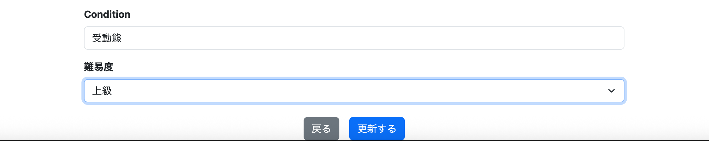
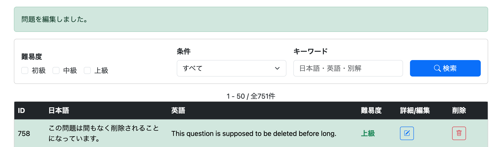
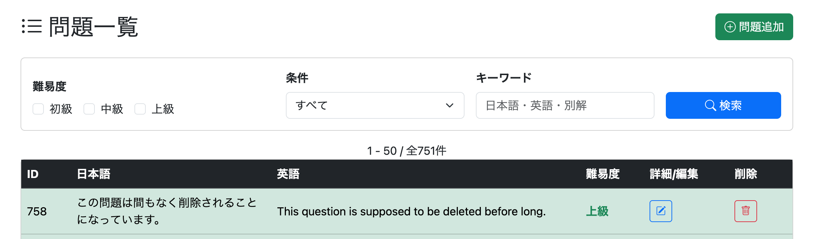
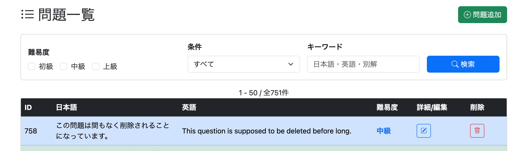
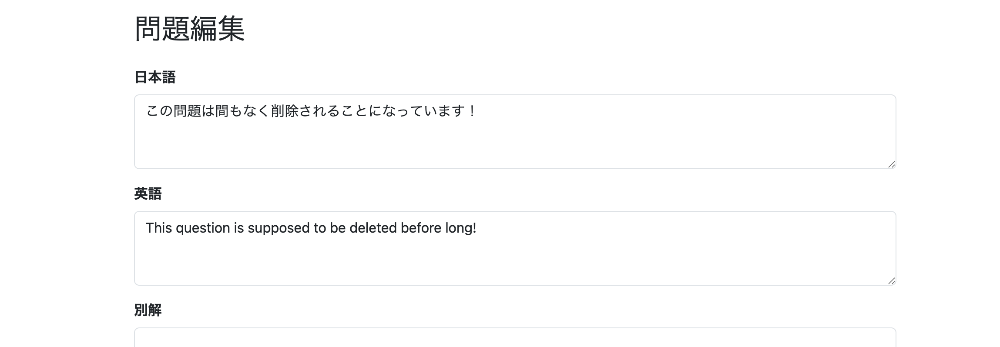
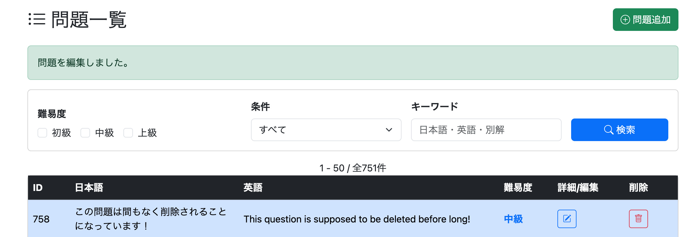

# 0064 セキュリティの見直し

## 概要

アプリケーション全体のセキュリティについて最終確認を行う。

確認項目は以下のとおり。

- URL権限の最終確認
- CSRF設定の確認
- 管理画面へ一般ユーザーがアクセスできないことの確認
- 二重送信・不正アクセスの確認
- パスワード入力欄やログアウト処理などの最終確認

---

# 1. URL権限の最終確認

## 目的

開発当初に設定した`SecurityConfig`に対し、その後多くの画面・機能を追加したため、

- どのURLを公開するのか
- どのURLを認証・認可するのか

を改めて確認する必要がある。

そのため、ブラウザからアプリケーション内の各ページへ直接アクセスし、ログイン状態ごとの挙動を確認した。

---

## 非ログイン時の確認

### `/tutorial`

本来は誰でも閲覧できるページであるにもかかわらず、ログイン画面へリダイレクトされてしまった。

これは`SecurityConfig`の設定漏れであった。

---

## ログイン時（Generalユーザー）

Generalユーザーでログインしているにもかかわらず、以下の管理画面へアクセスできてしまった。

- `/admin/menu`
- `/admin/question/add`
- `/admin/question/search`
- `/admin/question/edit?questionId=...`
- `/admin/user/list`

このことから、

「ログイン済みであれば誰でもアクセスできる設定」

になっている可能性があると考えた。

---

## SecurityConfigの確認

修正前

```java
// セキュリティ対象外の設定
http.authorizeHttpRequests(authorize -> authorize
        .requestMatchers(
                PathRequest.toStaticResources().atCommonLocations()
        ).permitAll()
        .requestMatchers("/").permitAll()
        .requestMatchers("/login").permitAll()
        .requestMatchers("/study", "/study/**").permitAll()
        .requestMatchers("/signup", "/signup/**").permitAll()
        .requestMatchers("/complete").permitAll()
        .requestMatchers("/user/canceled").permitAll()
        .requestMatchers("/admin").hasAuthority("ROLE_ADMIN")
        .anyRequest().authenticated()
);
```

### 問題点

- `/tutorial`が`permitAll()`へ含まれていない
- `/admin`のみ指定されており、`/admin/**`全体が権限制御されていない

---

## 修正

**commit**

```text
fix: update SecurityConfig URL authorization rules
```

修正後

```java
// セキュリティ対象外の設定
http.authorizeHttpRequests(authorize -> authorize
        .requestMatchers(
                PathRequest.toStaticResources().atCommonLocations()
        ).permitAll()
        .requestMatchers("/").permitAll()
        .requestMatchers("/login").permitAll()
        .requestMatchers("/study", "/study/**").permitAll()
        .requestMatchers("/signup", "/signup/**").permitAll()
        .requestMatchers("/complete").permitAll()
        .requestMatchers("/user/canceled").permitAll()
        .requestMatchers("/tutorial").permitAll()
        .requestMatchers("/admin", "/admin/**").hasAuthority("ROLE_ADMIN")
        .anyRequest().authenticated()
);
```

これにより、

- `/tutorial`は誰でも閲覧可能
- `/admin/**`は管理者のみアクセス可能

となった。

---

## StudyControllerの不具合修正

**commit**

```text
fix: correct redirect path in StudyController
```

URL権限を検証している際、

非ログイン状態で

```
/study/question
```

へアクセスすると、

なぜかログイン画面へ遷移してしまう現象を発見した。

調査したところ、

```java
// /questionへの直接アクセスを禁ずる
if (questions == null) {
    return "redirect:study/menu";
}
```

となっており、

リダイレクト先のパスに`/`が不足していた。

修正後

```java
// /questionへの直接アクセスを禁ずる
if (questions == null) {
    return "redirect:/study/menu";
}
```

修正後は正常に`/study/menu`へリダイレクトされることを確認した。

---

# 2. CSRF設定の確認

## 概要

CSRFについては、新たな実装を追加するのではなく、

**CSRF対策が正しく有効になっていること**

を確認する工程である。

---

## SecurityConfig

```java
// http.csrf(csrf -> csrf.disable());
```

はコメントアウトされたままであり、

CSRFは有効になっていることを確認した。

---

## POST処理の確認

以下のPOST処理がすべて正常に動作することを確認した。

- ログイン
- サインアップ
- 問題登録
- 問題編集
- 問題削除
- お気に入り登録
- 評価登録
- ユーザーID変更
- パスワード変更
- 退会

以上より、

CSRFトークンが適切に付与・検証されていることを確認した。

---

# 3. 管理画面へ一般ユーザーがアクセスできないことの確認

この項目については、

URL権限の最終確認時に同時に確認した。

また、

管理機能そのものもGeneralユーザーには表示されないUIとなっているため、

UI・URLの両面からアクセス制御されていることを確認した。

---

# 4. 二重送信・不正アクセスの確認

## 概要

これはCSRFとは異なり、

**ユーザーが想定外の操作をしても安全に動作するか**

を確認する工程である。

---

## 二重送信の確認

以下のPOST処理について、

- 問題登録
- 問題編集
- 問題削除
- サインアップ
- ユーザーID変更
- パスワード変更
- 退会

などで

- ボタン連打
- F5（更新）
- 戻る→再送信

を行っても問題が発生しないことを確認した。

このアプリケーションでは、

**PRG（Post / Redirect / Get）**

を採用しているため、

POST後は必ずGETへリダイレクトされる。

そのため、

F5を押しても再実行されるのはGETのみであり、

POSTは自動的には再送信されない。

つまり、

問題登録後にF5を押しても、

同じ問題が二重登録されることはない。

この項目は実装というより、最終確認としての意味合いが強い。

---

## 検証

### ボタン連打

一番上の問題の難易度を

```
中級
↓
上級
```

へ変更し、



更新ボタンを連打すると、



何事もなく更新が完了した。

---

### F5（更新）

更新完了後にF5を実施した。



問題なく一覧画面が再表示され、

更新処理が再実行されないことを確認した。

---

### 戻る→再送信

確認内容としては、

**本当にPOSTが再送信されるか**

を確認するだけでよい。

「この問題は間もなく削除されることになっています。」



↓

「この問題は間もなく削除されることになっています！」



↓

編集完了



↓

ブラウザの「戻る」で編集画面へ戻り、

「この問題は間もなく削除されることになっています。」

へ戻す。


↓

編集完了


正常にPOSTが再送信され、

編集内容が更新されることを確認した。

---

## 不正アクセスの確認

URLを直接入力した場合の挙動を確認した。

対象例

- `/admin/question/edit`
- `/study/question`
- `/review/question`
- `/user/edit/password`

など。

確認内容

- 権限がないユーザーはアクセスできないこと
- セッションが存在しない場合は適切な画面へ戻ること
- エラーになっても情報漏えいにつながる情報が表示されないこと

これらについては、

URL権限の確認時にほぼすべて確認済みであり、

発見した問題もすべて修正済みである。

---

# 5. パスワード入力欄・ログアウト処理などの最終確認

これまで実装・修正してきた認証関連について、

最終確認を行った。

---

## パスワード入力欄

以下の画面について、

`<input type="password">`

となっていることを確認した。

- ログイン
- サインアップ
- パスワード変更

入力内容が伏せ字表示となることも確認済みである。

---

## ログアウト処理

以下について確認した。

- ログアウトボタンで正常にログアウトできる
- ログアウトメッセージが表示される
- ログアウト後は保護ページ（例：`/user/edit/password`、`/admin/menu`など）へアクセスすると再度ログインが要求される
- ログアウト後にユーザー情報や学習状態が残らない

すべて正常であることを確認した。

---

## Remember Me

以下について確認した。

- ブラウザを閉じてもログイン状態が維持される
- ログアウトするとRemember Meも解除される

問題なく動作することを確認した。

---

## 認証関連メッセージ

以下について正常に表示されることを確認した。

- ログアウト成功メッセージ
- ユーザーID変更完了メッセージ
- パスワード変更完了メッセージ

---

# 所感

Spring Securityは、認証・認可・CSRF・Remember Me・ログアウト処理など、多くの概念が関係するため、実装当初は設定項目も多く理解するのに時間がかかった。

しかし、今回あらためてアプリケーション全体のセキュリティを見直したことで、設定漏れやリダイレクトパスの記述ミスなど、小さな不具合を発見・修正することができた。

また、URL権限・CSRF・管理画面のアクセス制御・二重送信防止・ログアウト処理など、Spring Securityの基本的なセキュリティ機能が期待どおりに動作していることも確認できた。

実装だけで終わらせず、最後に全体を検証する工程を設けたことで、セキュリティ面についても安心して次のリファクタリングへ進める状態になったと感じる。

---

# 次にやること

## 0065 設定の外部化（必要ならば）

- `application.properties`の整理
- マジックナンバー・固定文字列の見直し
- 必要に応じて`@Value`や`@ConfigurationProperties`を利用
- 将来変更される可能性がある設定値の外部化