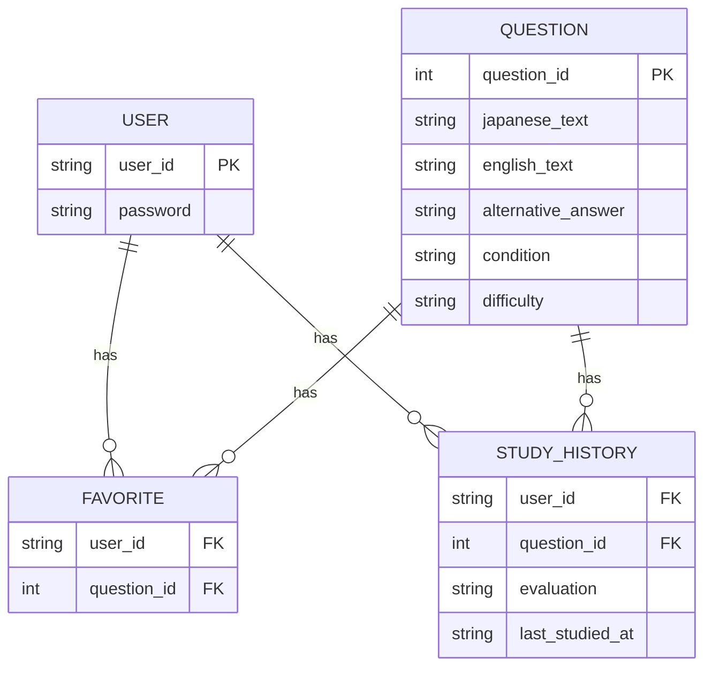

```mermaid
erDiagram

    USER ||--o{ FAVORITE : has
    QUESTION ||--o{ FAVORITE : has
    USER ||--o{ STUDY_HISTORY : has
    QUESTION ||--o{ STUDY_HISTORY : has

    USER {
        string user_id PK
        string password
    }

    QUESTION {
        int question_id PK
        string japanese_text
        string english_text
        string alternative_answer
        string condition
        string difficulty
    }

    FAVORITE {
        string user_id FK
        int question_id FK
    }

    STUDY_HISTORY {
        string user_id FK
        int question_id FK
        string evaluation
        string last_studied_at
    }
```