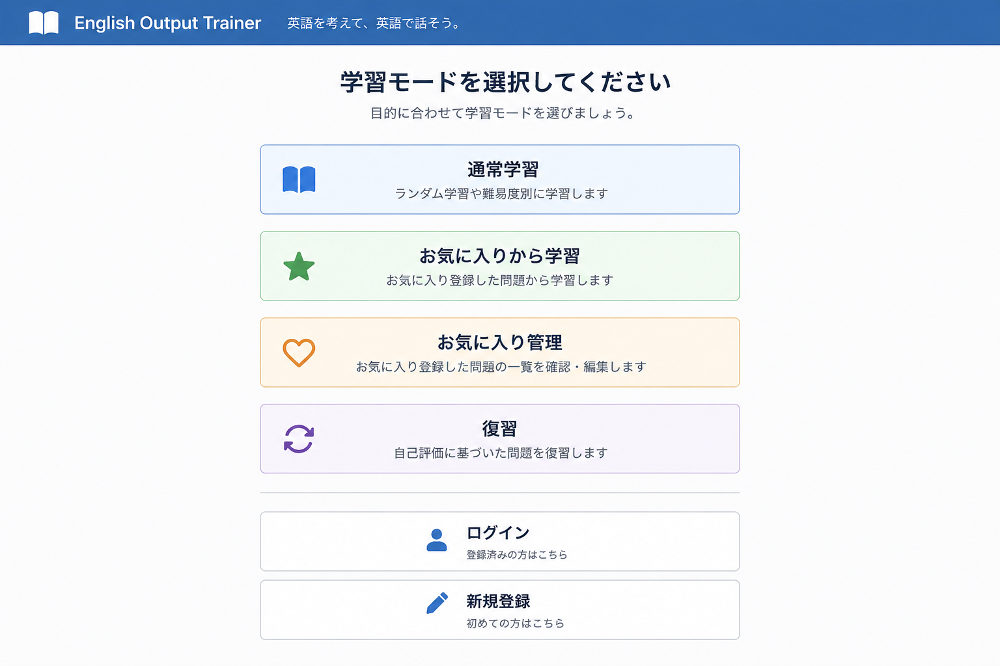
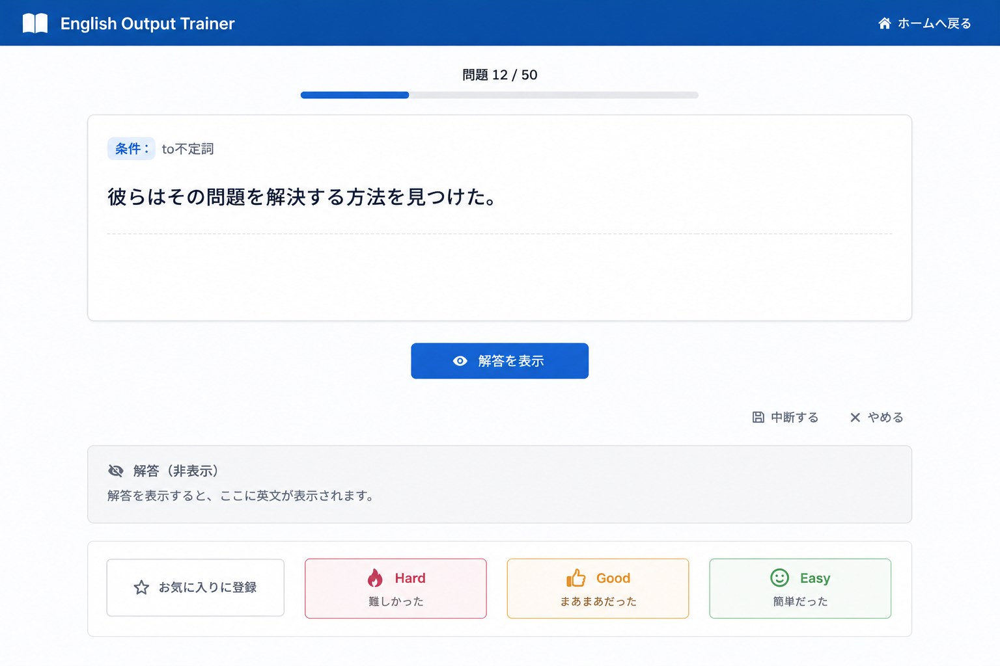
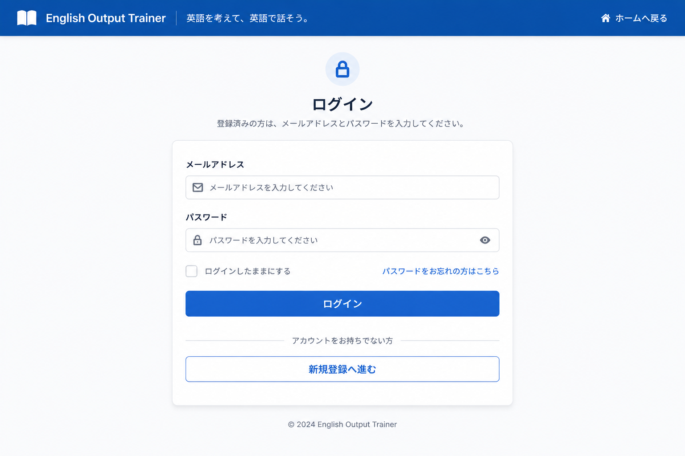
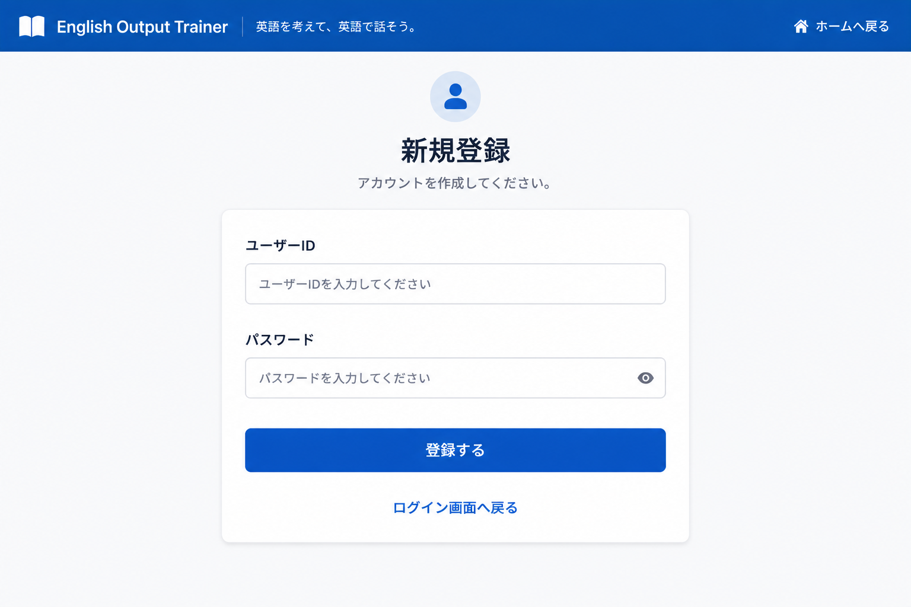
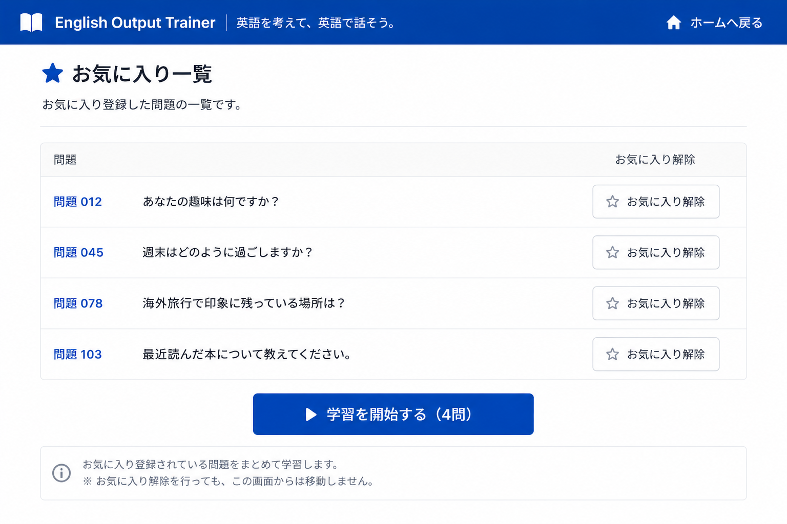
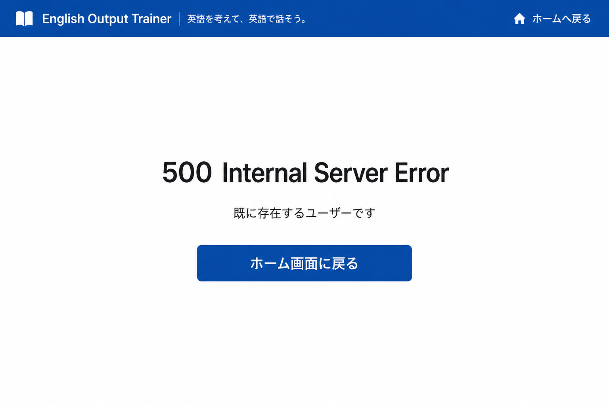

# 画面設計書

## 1. 画面一覧

| No | 画面名 | 概要 | 主な機能 |
|----|--------|------|----------|
| 1 | ホーム画面 | 学習モードを選択する | 通常学習（難易度別学習、ランダム学習）、お気に入りから学習、復習 |
| 2 | 問題画面 | 問題および回答を表示する | 問題表示、ヒント表示、回答表示、お気に入り登録 |
| 3 | ログイン画面 | ユーザー認証を行う | ログイン |
| 4 | 新規登録画面 | ユーザー登録を行う | アカウント登録 |
| 5 | お気に入り一覧画面 | お気に入り問題を表示する | 問題選択 |
| 6 | エラー画面 | エラー内容を表示する | 共通エラー画面、コード別エラー画面 |
| 7 | 学習範囲選択画面 | 学習対象範囲を選択する | 範囲選択、学習開始 |

---

# G01 ホーム画面

## 概要

学習モードを選択する画面。ユーザーは通常学習、お気に入り学習、復習を選択して学習を開始する。また、ログインおよび新規登録を行うことができる。

## レイアウト

- 通常学習
  - 難易度別学習
  - ランダム学習
- お気に入りから学習
- お気に入り管理
- 復習
  - Hardから出題
  - Goodから出題
  - Hard + Goodから出題
- ログイン
- 新規登録

※対象問題数が一定数を超える場合は、学習範囲選択画面を経由する（詳細は備考参照）。

## 項目定義

### 初期表示

| 項目名 | 種別 | 説明 |
|---------|---------|---------|
| 通常学習 | ボタン | 通常学習メニューを表示する |
| 復習 | ボタン | 復習メニューを表示する |
| お気に入りから学習 | ボタン | お気に入り問題を学習する |
| お気に入り管理 | ボタン | お気に入り一覧画面を表示する |
| ログイン | ボタン | ログイン画面へ遷移する |
| 新規登録 | ボタン | 新規登録画面へ遷移する |

### 通常学習選択後

| 項目名 | 種別 | 説明 |
|---------|---------|---------|
| ランダム学習 | ボタン | 全問題からランダムに出題する |
| 難易度別学習 | ボタン | 難易度を指定して学習する |

### 難易度別学習選択後

| 項目名 | 種別 | 説明 |
|---------|---------|---------|
| 初級 | ボタン | 初級問題を対象に学習する |
| 中級 | ボタン | 中級問題を対象に学習する |
| 上級 | ボタン | 上級問題を対象に学習する |

### 復習選択後

| 項目名 | 種別 | 説明 |
|---------|---------|---------|
| Hardから出題 | ボタン | Hard評価の問題のみをランダム出題する |
| Goodから出題 | ボタン | Good評価の問題のみをランダム出題する |
| Hard + Goodから出題 | ボタン | HardおよびGood評価の問題をランダム出題する |

## 画面遷移

| 操作 | 遷移先 |
|--------|--------|
| ランダム学習 | G02 問題画面 |
| 初級（順番に出題） | G07 学習範囲選択画面 |
| 初級（ランダムに出題） | G02 問題画面 |
| 中級（順番に出題） | G07 学習範囲選択画面 |
| 中級（ランダムに出題） | G02 問題画面 |
| 上級（順番に出題） | G07 学習範囲選択画面 |
| 上級（ランダムに出題） | G02 問題画面 |
| お気に入りから学習 | G03 ログイン画面 または G02 問題画面 |
| お気に入り管理 | G03 ログイン画面 または G05 お気に入り一覧画面 |
| Hardから出題 | G03 ログイン画面 または G02 問題画面 |
| Goodから出題 | G03 ログイン画面 または G02 問題画面 |
| Hard + Goodから出題 | G03 ログイン画面 または G02 問題画面 |
| ログイン | G03 ログイン画面 |
| 新規登録 | G04 新規登録画面 |

## 備考

- お気に入りから学習および復習はログインが必要。
- ログイン済みの場合はログイン画面を経由せず直接遷移する。
- 対象問題数が100件以下の場合は問題画面へ直接遷移する。
- 対象問題数が101件以上の場合は学習範囲選択画面を経由して問題画面へ遷移する。
- 難易度の区分（初級・中級・上級）は暫定であり、問題数や学習効果に応じて細分化する可能性がある。
- 学習範囲選択の選択肢は、対象問題の検索結果件数に応じて動的に生成する。
- 学習範囲の番号は問題IDではなく、SQL検索結果に対する連番を表す。
- 学習範囲選択は通常学習（ランダム学習、難易度別学習）のみ適用する。
- お気に入り学習は登録された全問題を対象として出題する。
- お気に入り学習は登録された全問題を対象としてランダム出題する。
- お気に入り学習には学習範囲選択を適用しない。
- 復習はユーザーの自己評価（Hard / Good）に基づいて出題対象を絞り込む。
- 復習問題は対象範囲内からランダム出題する。
- Easy評価の問題は復習対象に含めない。

---

# G02 問題画面

## 概要

問題の出題、ヒント表示、回答確認、お気に入り登録を行う画面。

## レイアウト

- 問題文表示エリア
- ヒント表示ボタン
- 回答表示ボタン

（回答表示後に表示）

- お気に入り登録ボタン
- Hardボタン
- Goodボタン
- Easyボタン

- 中断するボタン
- やめるボタン

## 項目定義

| 項目名 | 種別 | 説明 |
|---------|---------|---------|
| 問題文 | ラベル | 日本語の問題文を表示する |
| ヒントボタン | ボタン | ヒントを表示する |
| 回答ボタン | ボタン | 模範解答を表示する |
| お気に入りボタン | ボタン | 問題をお気に入り登録する（回答表示後のみ利用可能） |
| Hardボタン | ボタン | 学習結果をHardとして記録し、次の問題を表示する |
| Goodボタン | ボタン | 学習結果をGoodとして記録し、次の問題を表示する |
| Easyボタン | ボタン | 学習結果をEasyとして記録し、次の問題を表示する |
| 中断するボタン | ボタン | 学習状況を保存してホーム画面へ戻る |
| やめるボタン | ボタン | 学習状況を保存せずホーム画面へ戻る |

## 画面遷移

| 操作 | 遷移先 |
|--------|--------|
| Hard | G02 問題画面 |
| Good | G02 問題画面 |
| Easy | G02 問題画面 |
| お気に入り登録（未ログイン） | G03 ログイン画面 |
| 中断する | G01 ホーム画面 |
| やめる | G01 ホーム画面 |
| システムエラー発生 | G06 エラー画面 |

## 備考

- お気に入り登録はログインユーザーのみ利用可能。
- 学習モードに応じて出題対象が変化する。
- 文法条件（不定詞、動名詞、無生物主語など）は常時表示する。
- Hard / Good / Easy はユーザーによる自己評価を表す。
- 登録された評価は学習履歴として保存される。
- Hard評価およびGood評価の問題は復習機能の出題対象となる。
- Easy評価の問題は復習機能の出題対象としない。
- 次の問題に進むには Hard / Good / Easy のいずれかを押す必要がある。
- Hard / Good / Easy 押下時は、現在の問題に対する評価を保存した後、次の問題を取得して同一画面を再表示する。
- 中断するボタン押下時は JavaScript による確認ダイアログを表示する。
- やめるボタン押下時は JavaScript による確認ダイアログを表示する。

---

# G03 ログイン画面

## 概要

ユーザー認証を行う画面。

## レイアウト

- ユーザーID入力欄
- パスワード入力欄
- Remember-meチェックボックス
- ログインボタン
- 新規登録リンク

## 項目定義

| 項目名 | 種別 | 説明 |
|---------|---------|---------|
| ユーザーID | テキストボックス | ログインIDを入力する |
| パスワード | パスワード入力 | パスワードを入力する |
| Remember-me | チェックボックス | 次回以降のログイン状態を保持する |
| ログインボタン | ボタン | 認証を実行する |
| 新規登録リンク | リンク | 新規登録画面へ遷移する |

## バリデーション

| 項目名 | 条件 | エラーメッセージ |
|---------|---------|---------|
| ユーザーID | 必須入力 | ユーザーIDを入力してください |
| パスワード | 必須入力 | パスワードを入力してください |
| ログイン情報 | 認証失敗 | ユーザーIDまたはパスワードが正しくありません |

## 画面遷移

| 操作 | 遷移先 |
|--------|--------|
| ログイン成功 | 遷移元画面 |
| ログイン失敗 | G03 ログイン画面 |
| 新規登録リンク | G04 新規登録画面 |
| システムエラー発生 | G06 エラー画面 |

## 備考

- 認証成功後はログイン前にアクセスしようとしていた画面へ遷移する。
- Remember-me が有効な場合、ブラウザを閉じても一定期間ログイン状態を保持する。
- パスワードは画面上に表示しない。

---

# G04 新規登録画面

## 概要

ユーザーアカウントを新規作成する画面。

## レイアウト

- ユーザーID入力欄
- パスワード入力欄
- 登録ボタン
- ログイン画面へ戻るリンク

## 項目定義

| 項目名 | 種別 | 説明 |
|---------|---------|---------|
| ユーザーID | テキストボックス | 登録するユーザーIDを入力する |
| パスワード | パスワード入力 | 登録するパスワードを入力する |
| 登録ボタン | ボタン | ユーザー登録を実行する |
| ログイン画面へ戻るリンク | リンク | ログイン画面へ遷移する |

## バリデーション

| 項目名 | 条件 | エラーメッセージ |
|---------|---------|---------|
| ユーザーID | 必須入力 | ユーザーIDを入力してください |
| ユーザーID | 20文字以内 | ユーザーIDは20文字以内で入力してください |
| ユーザーID | 半角英数字のみ（0-9, a-z） | ユーザーIDは半角英数字で入力してください |
| パスワード | 必須入力 | パスワードを入力してください |
| パスワード | 20文字以内 | パスワードは20文字以内で入力してください |
| パスワード | 半角英数字のみ（0-9, a-z） | パスワードは半角英数字で入力してください |
| ユーザーID | 重複不可 | そのユーザーIDは既に使用されています |

## 画面遷移

| 操作 | 遷移先 |
|--------|--------|
| 登録成功 | G03 ログイン画面 |
| 登録失敗 | G04 新規登録画面 |
| ログイン画面へ戻る | G03 ログイン画面 |
| システムエラー発生 | G06 エラー画面 |

## 備考

- パスワードはハッシュ化して保存する。
- 登録完了後はログイン画面へ遷移する。

---

# G05 お気に入り一覧画面

## 概要

お気に入り登録した問題を一覧表示し、学習対象を選択する画面。

## レイアウト

- お気に入り問題一覧
  - 学習開始ボタン
  - お気に入り解除ボタン

## 項目定義

| 項目名 | 種別 | 説明 |
|---------|---------|---------|
| 問題一覧 | 一覧表示 | お気に入り登録された問題を表示する |
| 学習開始ボタン | ボタン | お気に入り登録された問題を対象に学習を開始する |
| お気に入り解除ボタン | ボタン | 対象問題のお気に入り登録を解除する |

## 画面遷移

| 操作 | 遷移先 |
|--------|--------|
| 学習開始 | G02 問題画面 |
| システムエラー発生 | G06 エラー画面 |

## 備考

- ログインユーザーのみアクセス可能。
- お気に入り問題が存在しない場合はその旨を表示する。
- お気に入り解除ボタン押下時は対象問題のお気に入り登録を解除する。
- お気に入り解除後は同一画面を再表示する(当該問題のお気に入りアイコンの色が変わるだけ)。
- お気に入り解除による画面遷移は発生しない。
- 各問題の横にお気に入り解除ボタンを表示する。

---

# G06 エラー画面

## 概要

システムエラーやアクセスエラーが発生した際に表示する画面。

## レイアウト

- エラーコード表示
- エラーメッセージ表示
- ホームへ戻るボタン

## 項目定義

| 項目名 | 種別 | 説明 |
|---------|---------|---------|
| エラーコード | ラベル | HTTPステータスコードを表示する |
| エラーメッセージ | ラベル | エラー内容を表示する |
| ホームへ戻るボタン | ボタン | ホーム画面へ遷移する |

## 画面遷移

| 操作 | 遷移先 |
|--------|--------|
| ホームへ戻る | G01 ホーム画面 |

## 備考

- 403（権限エラー）、404（存在しないページ）、500（システムエラー）などを表示する。
- 詳細なシステム情報は表示しない。

---

# G07 学習範囲選択画面

## 概要

通常学習において「順番に出題」を選択した際に、学習対象範囲を選択する画面。

対象問題数が100件以下の場合は本画面を表示せず、直接問題画面へ遷移する。

## レイアウト

- 学習範囲一覧
- 学習開始ボタン

## 項目定義

| 項目名 | 種別 | 説明 |
|---------|---------|---------|
| 学習範囲一覧 | 一覧表示 | 学習対象範囲を表示する |
| 学習開始ボタン | ボタン | 選択した範囲から学習を開始する |

### 学習範囲表示例

| 表示内容 |
|-----------|
| 1～100件目 |
| 101～200件目 |
| 201～300件目 |
| ... |

※対象問題数に応じて動的に生成する。

## 画面遷移

| 操作 | 遷移先 |
|--------|--------|
| 学習開始 | G02 問題画面 |
| システムエラー発生 | G06 エラー画面 |

## 備考

- 通常学習の「順番に出題」を選択した場合のみ利用する。
- ランダム出題では本画面を経由しない。
- 学習範囲の番号は問題IDではなく、SQL検索結果に対する連番である。
- 対象問題数が100件以下の場合は本画面を表示しない。
- 選択した範囲内で順番に出題する。