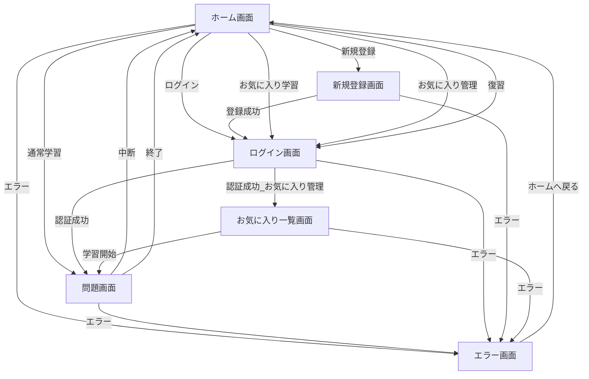
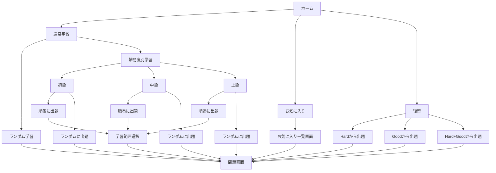

## 画面遷移図

```mermaid
flowchart TD

G01["ホーム画面"]
G02["問題画面"]
G03["ログイン画面"]
G04["新規登録画面"]
G05["お気に入り一覧画面"]
G06["エラー画面"]

G01 -->|ログイン| G03
G01 -->|新規登録| G04

G04 -->|登録成功| G03

G01 -->|通常学習| G02

G01 -->|お気に入り学習| G03
G01 -->|お気に入り管理| G03
G01 -->|復習| G03

G03 -->|認証成功| G02
G03 -->|認証成功_お気に入り管理| G05

G05 -->|学習開始| G02

G02 -->|中断| G01
G02 -->|終了| G01

G01 -->|エラー| G06
G02 -->|エラー| G06
G03 -->|エラー| G06
G04 -->|エラー| G06
G05 -->|エラー| G06

G06 -->|ホームへ戻る| G01
```

---

## 画面フロー図

```mermaid
flowchart TD

A[ホーム]

A --> B[通常学習]
A --> C[お気に入り]
A --> D[復習]

%% 通常学習

B --> E[ランダム学習]
B --> F[難易度別学習]

E --> J[問題画面]

%% 難易度別学習

F --> G[初級]
F --> H[中級]
F --> I[上級]

%% 初級

G --> G1[順番に出題]
G --> G2[ランダムに出題]

G1 --> S[学習範囲選択]
G2 --> J

%% 中級

H --> H1[順番に出題]
H --> H2[ランダムに出題]

H1 --> S
H2 --> J

%% 上級

I --> I1[順番に出題]
I --> I2[ランダムに出題]

I1 --> S
I2 --> J

%% 学習範囲選択

S --> J

%% お気に入り

C --> K[お気に入り一覧画面]
K --> J

%% 復習

D --> L[Hardから出題]
D --> M[Goodから出題]
D --> N[Hard+Goodから出題]

L --> J
M --> J
N --> J
```
