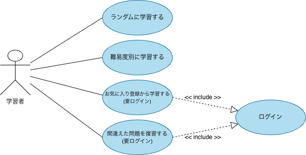

# ユースケース図

## 概要

本システムでは学習者が以下の方法で学習できる。

- 順番に学習する
- ランダムに学習する
- 難易度別に学習する
- お気に入りから学習する
- 間違えた問題を復習する

## 補足

- 「学習する」は抽象的な概念のためユースケースには含めない
- ログインは認証機能であり利用者の目的ではないためユースケースには含めない
- お気に入り・復習機能はログインユーザーのみ利用可能