# English Output Trainer

## 1. アプリケーション概要

English Output Trainer は、英作文のアウトプット学習に特化した Web アプリケーションです。

英語学習では「読む・聞く」だけでなく、「自分で英文を組み立てて発話・記述する」アウトプット学習が重要ですが、市販教材では学習履歴や苦手問題を効率的に管理することが難しいという課題があります。

本アプリケーションでは、問題の出題・復習・お気に入り管理・学習履歴の記録などを一元管理することで、効率的な英作文学習を実現しています。

また、管理者向け画面では問題の登録・編集・削除やユーザー管理も行えるよう設計しており、学習者と管理者の双方が利用できる構成となっています。

---

# 2. 開発背景・目的

本アプリケーションは、Spring Boot を用いた Web アプリケーション開発の学習と、英作文学習を効率化するツールの開発を目的として制作しました。

英語学習では、知識をインプットするだけではなく、実際に英文を組み立てて繰り返しアウトプットすることが重要です。

しかし、市販教材では

- 学習済み・未学習の管理
- 苦手問題だけの復習
- お気に入り問題の管理
- 問題検索

などを自由に行えるものは少なく、自分が欲しい機能を備えた学習ツールを作りたいと考えたことが開発のきっかけです。

また、本アプリケーションでは単に機能を実装するだけでなく、

- 保守性を意識した設計
- リファクタリング
- ログ設計
- セキュリティ
- 例外処理

などにも重点を置き、実際の Web アプリケーション開発を意識しながら開発を進めました。

---

# 3. 主な機能

## 学習機能

### 通常学習

難易度と出題範囲を選択すると、最大100件の問題をトレーニングすることができます。

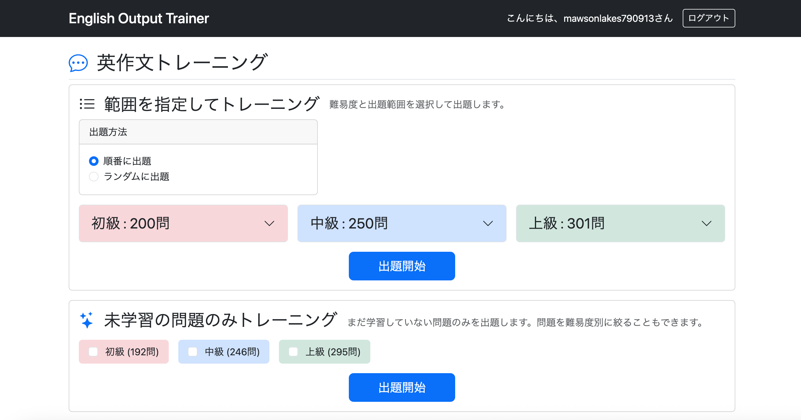

「条件」には、その問題で使用されている文法や表現が表示されます。必要に応じてヒントとして利用できます。

「解答を見る」ボタンをクリックすると解答が表示されます。

「別解」は、もう一つの正解例です。

解答と自分が口にした英語や、口に出すまでにかかった時間などを考慮して理解度を保存しましょう。

|評価|目安|
|---|---|
|Hard|答えられなかった、難しかった、10秒以上考えた|
|Good|答えは近かったが、考えながら答えた|
|Easy|ほぼ同じ英文を考えずに自然に話せた|

理解度を保存せずに次の問題へ進むこともできます。

ただし、その場合は未学習として扱われるため、復習機能の対象には含まれません。

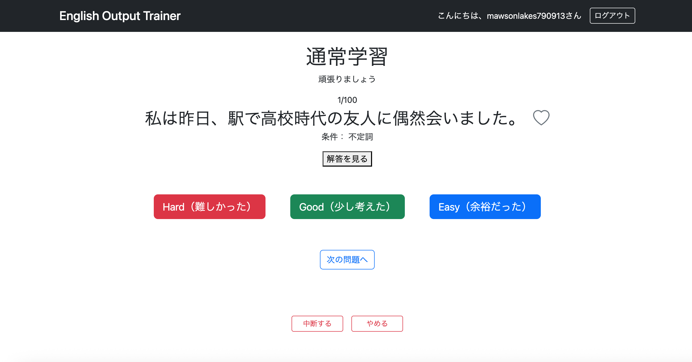

---

### ランダム出題

出題順をランダムに変更してトレーニングすることもできます。

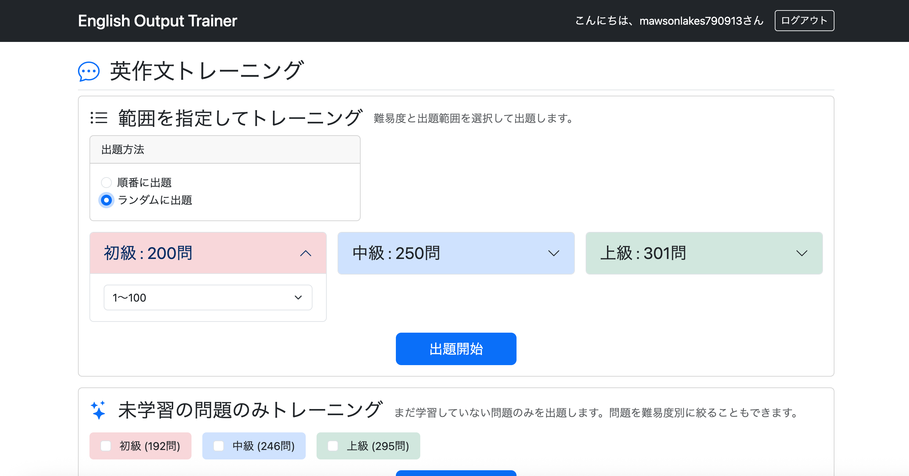

---

### 未学習の問題のみ出題（要ログイン）

まだ学習していない（理解度を保存していない）問題だけに絞って出題することもできます。

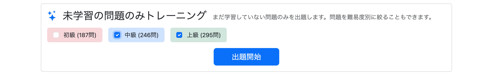

---

### 学習の中断・再開

トレーニングは途中で中断することができ、次回は同じ問題から再開できます。

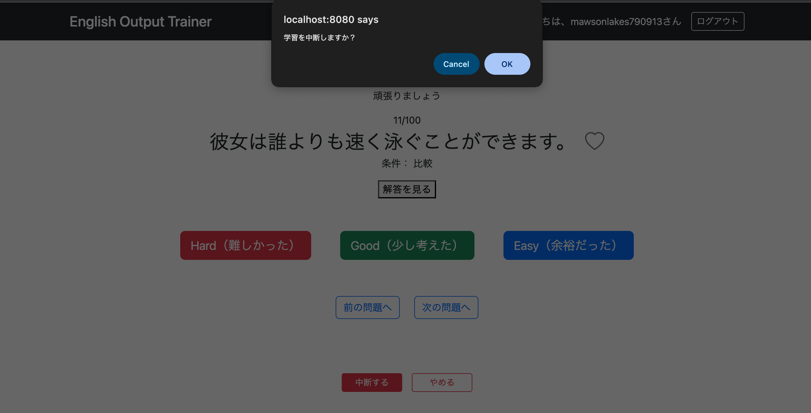

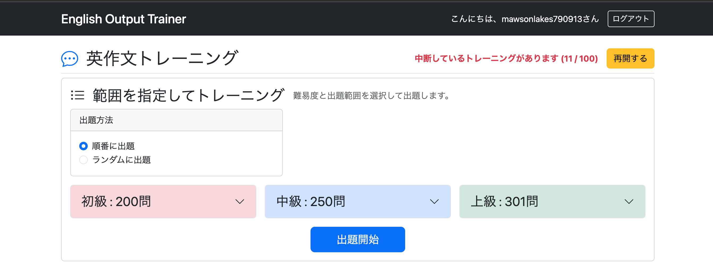

---

### 学習結果の記録

トレーニング中は、各問題に対して理解度の保存やお気に入り登録を行えます。

保存した内容はユーザーメニューの「問題一覧」から確認できます。

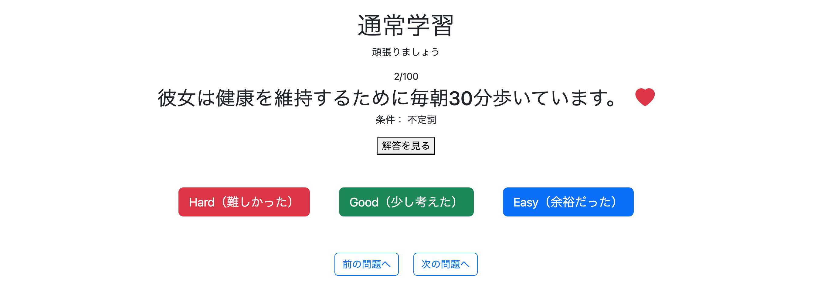

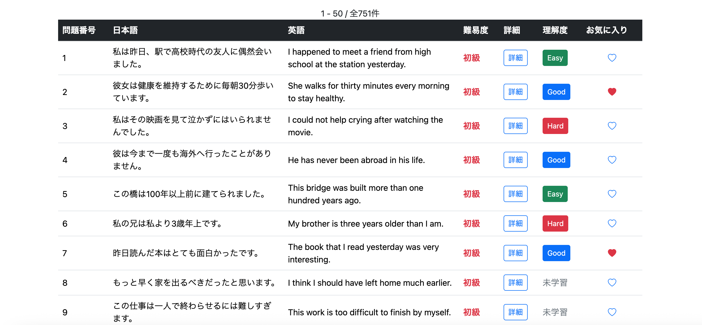

---

## 復習機能

通常学習で保存した理解度をもとに復習できます。

以下の条件を自由に組み合わせて出題できます。

- Hard / Good / Easy
- ランダム出題
- 順番出題
- 難易度
- お気に入りのみ

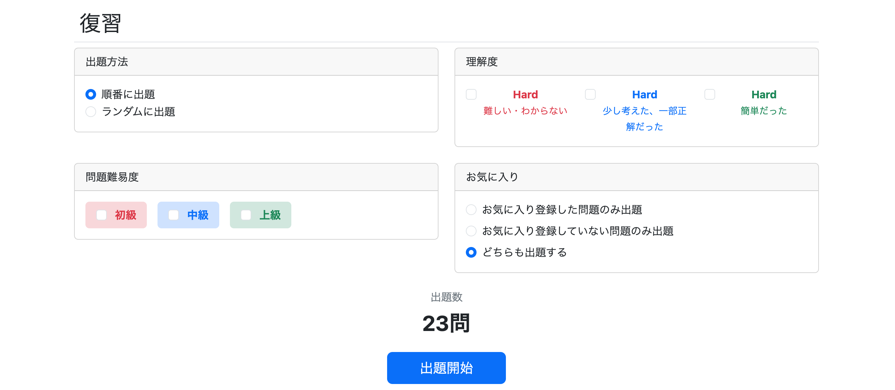

---

## 問題検索機能

以下の条件を組み合わせて問題を検索できます。

- 難易度
- 学習状況
- お気に入り状態
- 条件タグ
- キーワード検索

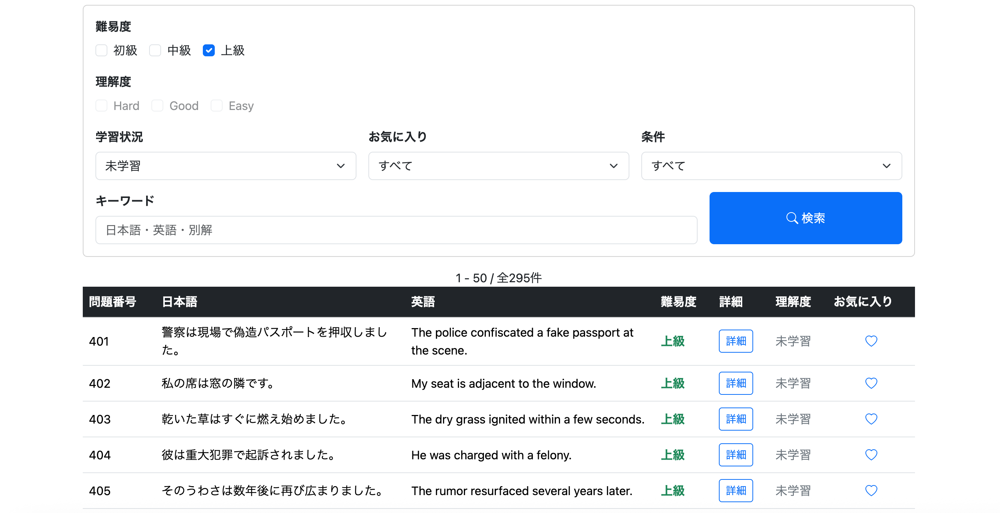

また、検索条件を保持したままページネーションできるよう実装しています。

---

## お気に入り機能

理解度とは別に問題を個別に保存する機能です。

気に入った問題や、何度繰り返しても難しい問題などをお気に入り登録し、重点的な復習に活用できます。

---

## 管理者機能

### 問題の登録

問題を登録できます。

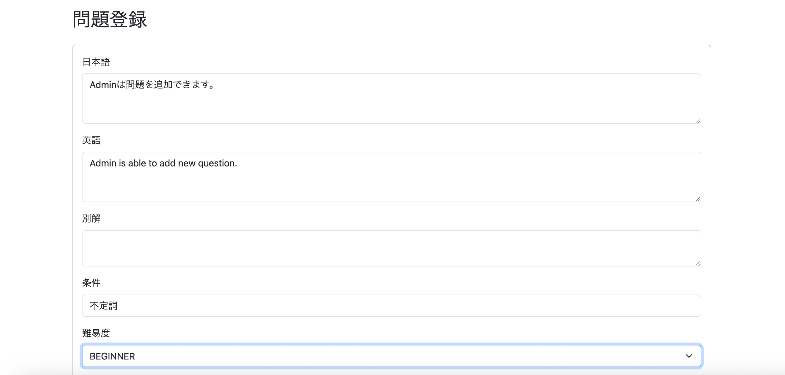

---

### 問題の編集

登録済みの問題を編集できます。

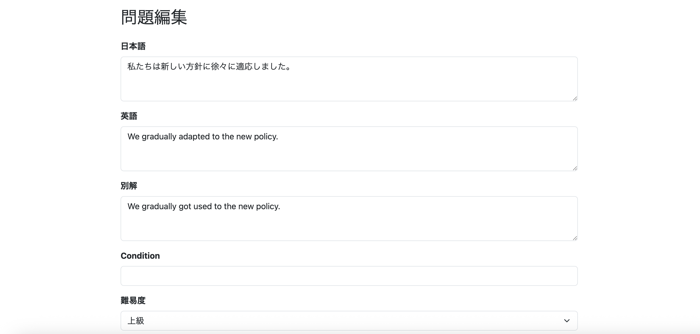

---

### 問題の削除

不要になった問題を削除できます。

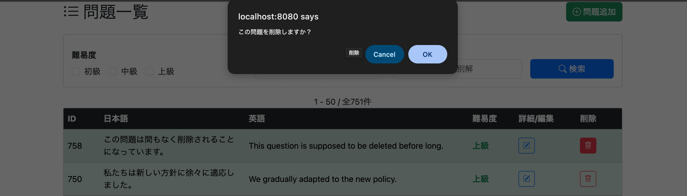

---

### 問題検索

問題を検索できます。

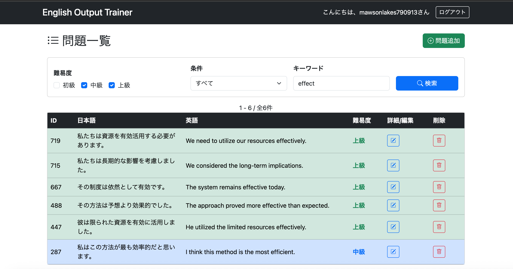

---

### ユーザー管理

ユーザー一覧を表示できます。

また、不要になったユーザーを削除することもできます（管理者自身は削除できません）。

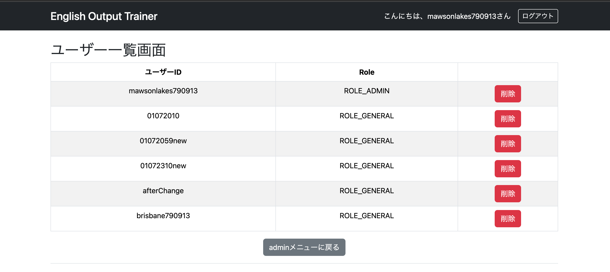

---

## セキュリティ

本アプリケーションでは、Spring Security を利用し、安全に利用できるよう以下の対策を実施しています。

### ログイン認証

ユーザー認証機能を実装しています。

ログイン後は学習履歴やお気に入りなど、ユーザーごとのデータを保存できます。

また、パスワードは BCrypt によりハッシュ化して保存しています。

---

### 権限管理

一般ユーザーと管理者でアクセス可能な画面を制御しています。

管理画面は管理者のみアクセス可能となっており、一般ユーザーが URL を直接入力してもアクセスできません。

---

### CSRF対策

Spring Security の CSRF 対策を有効にしています。

フォーム送信時には CSRF トークンによる検証を行い、不正なリクエストを防止しています。

---

### URLアクセス制御

URL ごとにアクセス権限を設定しています。

認証が必要なページへ未ログインユーザーがアクセスした場合はログイン画面へリダイレクトされ、権限のないユーザーによるアクセスは拒否されます。

---

## その他

### ページネーション

一覧画面ではページネーションを実装しています。

大量のデータでも見やすく表示できるほか、検索条件を保持したままページ移動できるよう設計しています。

---

### バリデーション

入力値はサーバー側で検証し、不正なデータの登録を防止しています。

入力エラーが発生した場合は、エラーメッセージを表示して再入力を促します。

---

### ログ出力

Logback を利用してログを出力しています。

また、AOP を利用して Controller・Service の開始・終了ログを共通化し、必要なログのみを出力するよう整理しました。

---

### 例外処理

GlobalControllerAdvice を利用し、アプリケーション全体の例外処理を共通化しています。

ユーザーには適切なエラーページやメッセージを表示し、システム内部の例外はログへ記録する構成としています。

---

# 4. 使用技術

|分類|技術|
|---|---|
|Language|Java 21|
|Framework|Spring Boot 3|
|Template Engine|Thymeleaf|
|Security|Spring Security|
|ORM|Spring Data JPA (Hibernate)|
|Database|MySQL|
|Build Tool|Maven|
|Logging|Logback|
|Version Control|Git / GitHub|
|IDE|Eclipse|

---

# 5. システム構成

本アプリケーションは、Spring Boot を用いた Web アプリケーションです。

ブラウザからのリクエストを Spring Boot が受け取り、Spring Data JPA を介して MySQL とデータのやり取りを行います。

```text
┌──────────┐
│ Browser  │
└────┬─────┘
     │ HTTP
     ▼
┌──────────────────────────────┐
│ Spring Boot                  │
│                              │
│ ・Spring MVC                 │
│ ・Spring Security            │
│ ・Spring Data JPA            │
│ ・Thymeleaf                  │
└──────────────┬───────────────┘
               │
               │ JDBC
               ▼
        ┌─────────────┐
        │   MySQL     │
        └─────────────┘
```

### 使用コンポーネント

|コンポーネント|役割|
|---|---|
|Browser|画面表示・ユーザー操作|
|Spring MVC|リクエスト処理|
|Spring Security|認証・認可|
|Thymeleaf|画面テンプレート|
|Spring Data JPA|データアクセス|
|PostgreSQL|データ保存|

---

# 6. データベース設計

本アプリケーションでは、ユーザー情報・問題・学習履歴・お気に入りを管理するため、以下のテーブルを使用しています。

## ER図

```text
                               +----------------------+
                               |        users         |
                               +----------------------+
                               | PK id               |
                               |    user_id          |
                               |    password         |
                               |    role             |
                               +----------------------+
                                  1             1
                                  |             |
                                  |             |
                                  |             |
                                 N|             |N
                                  ▼             ▼
                    +----------------------+   +----------------------+
                    |    study_history     |   |      favorites       |
                    +----------------------+   +----------------------+
                    | PK/FK user_id        |   | PK/FK user_id        |
                    | PK/FK question_id    |   | PK/FK question_id    |
                    |    evaluation        |   |    created_at        |
                    |    evaluation_date   |   +----------------------+
                    +----------------------+             ▲
                              ▲                          │
                              │ N                        │ N
                              │                          │
                              │ 1                        │ 1
                              │                          │
                    +--------------------------------------------+
                    |                 question                   |
                    +--------------------------------------------+
                    | PK question_id                             |
                    |    japanese_text                           |
                    |    english_text                            |
                    |    alternative_answer                      |
                    |    condition                               |
                    |    difficulty                              |
                    +--------------------------------------------+
```

---

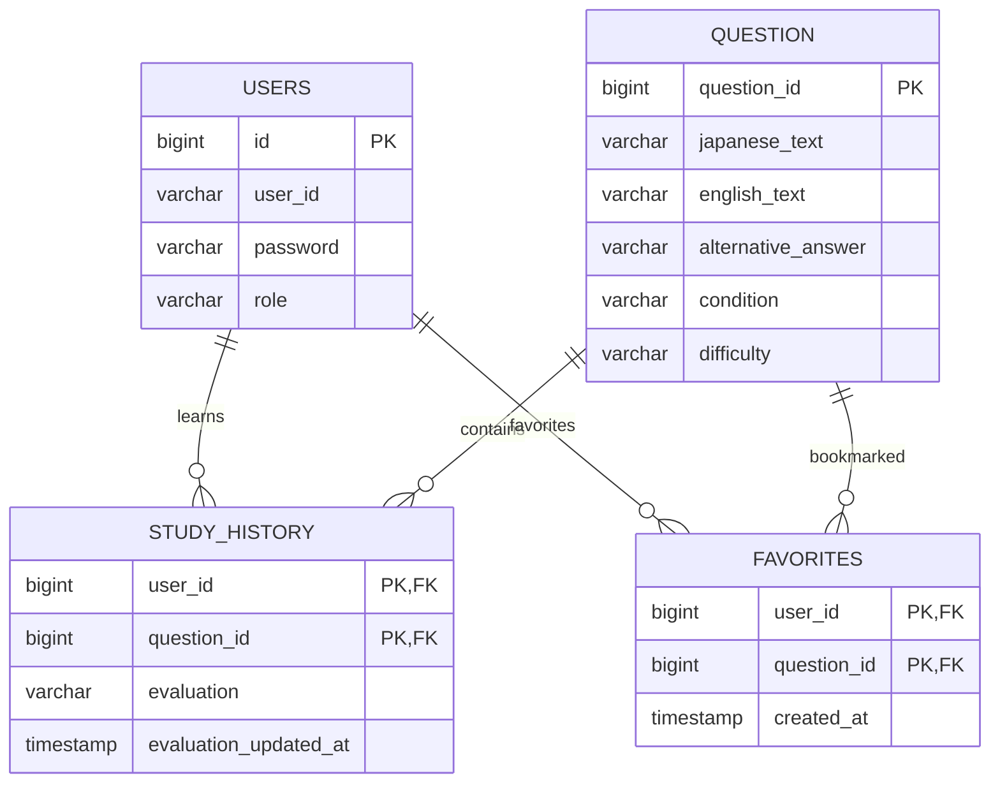

---

## テーブル概要

|テーブル名|概要|
|---|---|
|users|ユーザー情報を管理|
|question|英作文の問題を管理|
|study_history|各ユーザーの学習履歴・理解度を管理|
|favorites|お気に入り登録した問題を管理|

---

### リレーション

- **users** と **question** は、それぞれ独立したマスタテーブルです。
- **study_history** は「どのユーザーが、どの問題を、どの程度理解できたか」を管理する中間テーブルです。
- **favorites** は「どのユーザーがお気に入り登録した問題か」を管理する中間テーブルです。
- 1人のユーザーは複数の問題を学習・お気に入り登録でき、1つの問題も複数のユーザーから学習・お気に入り登録されることを想定した設計となっています。

---

## テーブル構成

### users

ユーザー情報を管理します。

主な項目

- ユーザーID
- パスワード
- 権限


---

### question

英作文の問題を管理します。

主な項目

- 日本語
- 英語
- 別解
- 難易度
- 条件（文法・フレーズなど）

---

### study_history

各ユーザーの学習履歴を管理します。

主な項目

- ユーザーID
- 問題ID
- 理解度（Hard / Good / Easy）
- 学習日時

---

### favorites

お気に入り登録した問題を管理します。

主な項目

- ユーザーID
- 問題ID

---

# 7. 工夫した点

本アプリケーションでは、単に機能を実装するだけではなく、保守性・可読性・拡張性を意識して設計・実装を行いました。

主な工夫点は以下のとおりです。

### 検索機能の充実

- 難易度
- 学習状況
- お気に入り状態
- 学習条件
- キーワード

など複数条件による検索を実装し、検索条件を維持したままページネーションできるよう設計しました。

### 共通処理の整理

Controller や Service に散在していた共通処理を見直し、

- PaginationService
- SearchConditionConverter

などへ責務を分離し、重複コードの削減を行いました。

### ログ設計

Logback を利用してログ出力を統一し、

- 開始ログ
- 終了ログ
- SQLログ

などを整理しました。

また、Controller・Service 全体のログ出力を見直し、不要なログを削除するとともに、必要な情報のみを記録する構成としました。

### リファクタリング

Controller・Service・Repository・DTO・Form など各レイヤーについて責務を見直し、

- メソッド名
- クラス構成
- 共通処理

を整理することで保守性を向上させました。

### セキュリティ

Spring Security を利用し、

- ログイン認証
- 認可
- CSRF 対策
- URL 権限管理

などを実装しています。

---

# 8. セットアップ

## 動作環境

- Java 21
- Maven
- PostgreSQL

## 手順

### 1. リポジトリを取得

```bash
git clone <repository-url>
```

### 2. プロジェクトへ移動

```bash
cd english-output-trainer
```

### 3. PostgreSQLにデータベースを作成

任意の名前でデータベースを作成してください。

### 4. テーブルを作成

`database/schema.sql` を実行します。

### 5. サンプルデータを登録

`database/data.sql` を実行します。

このSQLには、約750問の英作文データをはじめ、テスト用ユーザー・学習履歴・お気に入りデータが含まれています。

### 6. データベース接続情報を設定

`application-local.yml` に PostgreSQL の接続情報を設定してください。

### 7. アプリケーションを起動

```bash
mvn spring-boot:run
```

または IDE から Spring Boot アプリケーションとして実行してください。

## テストアカウント

|権限|ユーザーID|
|---|---|
|管理者|mawsonlakes790913|
|一般ユーザー|adelaide790913|

※ パスワードはユーザーIDとおなじです。

---

# 9. ディレクトリ構成

```text
english-output-trainer
├── src
│   ├── main
│   │   ├── java
│   │   │   └── com.example.demo
│   │   │       ├── config
│   │   │       ├── controller
│   │   │       ├── dto
│   │   │       ├── entity
│   │   │       ├── exception
│   │   │       ├── form
│   │   │       ├── repository
│   │   │       ├── service
│   │   │       └── util
│   │   └── resources
│   │       ├── static
│   │       ├── templates
│   │       ├── application.yml
│   │       └── logback-spring.xml
│   └── test
├── pom.xml
└── README.md
```

---

# 10. ドキュメント

本リポジトリとは別に、開発時の設計や学習内容をまとめたドキュメントを管理しています。

主な内容は以下のとおりです。

- Learning Logs
- Project Retrospective
- リファクタリング記録
- ログ設計
- セキュリティ設計
- AOP
- 例外処理
- その他設計資料

実装だけでなく、「なぜその設計にしたのか」という判断過程も記録しています。

---

# 11. 今後の改善予定

今後は以下のような改善を予定しています。

- AWS へのデプロイ
- Docker 対応
- CI/CD の導入
- テストコードの拡充
- 監視・ログ分析環境の構築
- パフォーマンス改善
- UI / UX の改善

今後も継続的に機能追加・改善を行い、より実践的な Web アプリケーションへ発展させていく予定です。